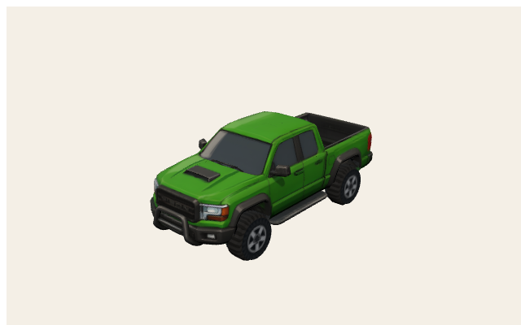
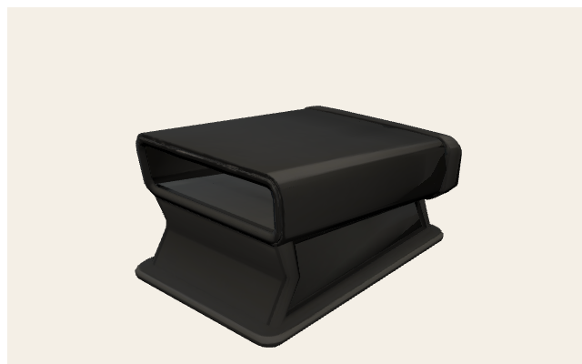
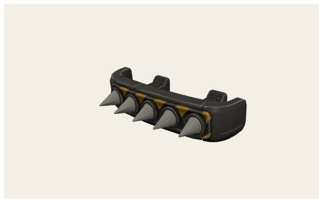
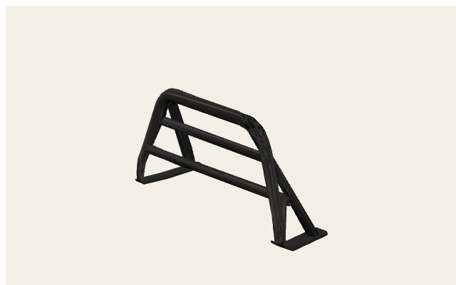
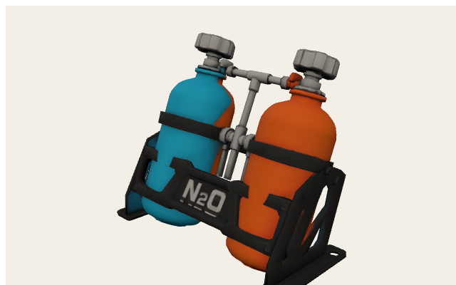
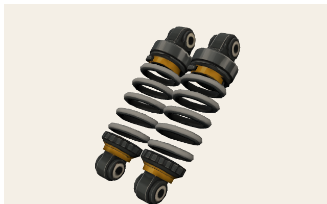
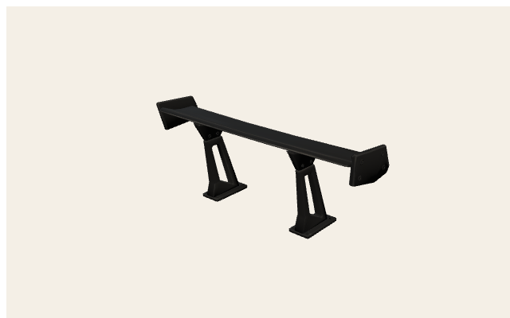
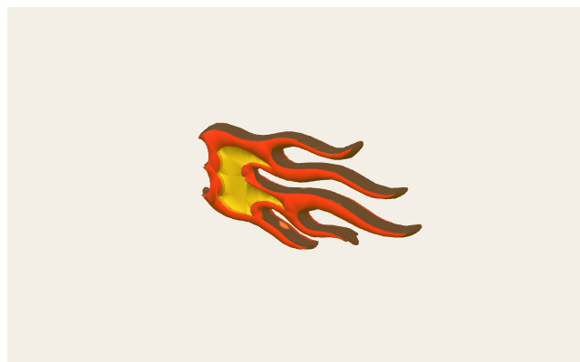

# Bison — mesh cheat sheet

Use these **exact names** in commands (node / mesh / part id). Coordinates are **mesh space, meters**.

## Identity

| Field | Value |
| --- | --- |
| Car id | `bison` |
| German name | Bison |
| Class | Pick-up |
| GLB | `public/models/cars/bison.glb` |
| Runtime yaw | 0 rad — bake nose +Z (runtime yaw 0) |
| Collision radius | 1.25 m (silhouette, not mesh) |
| Default paint | `#2f9e44` |
| Root AABB | (-0.851, 0, -1.9) → (0.851, 1.45, 1.9) |

## Model

## Command names (runtime)

- Body / paint: `BodyPaint` (recolor target)
- Wheels in GLB: `StockWheel_FL` `StockWheel_FR` `StockWheel_RL` `StockWheel_RR`
- Wheel wrappers (added at load): `WheelSteer_{FL,FR,RL,RR}` + `WheelSpin_{FL,FR,RL,RR}`
- Stock extras if present: `StockSpoiler` (Blitz Heckspoiler), `StockCage` (Käferkraft, hidden when `reinforced_frame` on), `StockEngine` (Donnerbüchse, hidden when `big_engine` on)
- Equipped Teile group: `carParts` / objects `carPart-{partId}` (copy `carPart-{partId}-1`…)
- Große Räder: **scale** root `StockWheel_*` (do not scale `…_1` children); hub drop by radius×(scale−1)
- Cosmetics: stickers `none|flames|bolt|star` (flames GLB `public/models/stickers/flames.glb`)

## Coordinate grids (meters)

Orange boxes = mesh AABBs. Green dots = Teil **mount anchors** (`CAR_PART_LAYOUTS`). Red = X/u origin, blue = Z/v origin.

<svg xmlns="http://www.w3.org/2000/svg" width="760" height="520" viewBox="0 0 760 520">
<rect x="0" y="0" width="760" height="520" fill="#f4efe6"/>
<rect x="56" y="36" width="686" height="444" fill="#efe8dc" stroke="#1a1a1a" stroke-width="2"/>
<line x1="56.0" y1="36" x2="56.0" y2="480" stroke="#c4b8a4" stroke-width="1"/>
<line x1="98.9" y1="36" x2="98.9" y2="480" stroke="#ddd4c6" stroke-width="0.6"/>
<line x1="141.8" y1="36" x2="141.8" y2="480" stroke="#ddd4c6" stroke-width="0.6"/>
<line x1="184.6" y1="36" x2="184.6" y2="480" stroke="#ddd4c6" stroke-width="0.6"/>
<line x1="227.5" y1="36" x2="227.5" y2="480" stroke="#c4b8a4" stroke-width="1"/>
<line x1="270.4" y1="36" x2="270.4" y2="480" stroke="#ddd4c6" stroke-width="0.6"/>
<line x1="313.3" y1="36" x2="313.3" y2="480" stroke="#ddd4c6" stroke-width="0.6"/>
<line x1="356.1" y1="36" x2="356.1" y2="480" stroke="#ddd4c6" stroke-width="0.6"/>
<line x1="399.0" y1="36" x2="399.0" y2="480" stroke="#e03131" stroke-width="2"/>
<line x1="441.9" y1="36" x2="441.9" y2="480" stroke="#ddd4c6" stroke-width="0.6"/>
<line x1="484.8" y1="36" x2="484.8" y2="480" stroke="#ddd4c6" stroke-width="0.6"/>
<line x1="527.6" y1="36" x2="527.6" y2="480" stroke="#ddd4c6" stroke-width="0.6"/>
<line x1="570.5" y1="36" x2="570.5" y2="480" stroke="#c4b8a4" stroke-width="1"/>
<line x1="613.4" y1="36" x2="613.4" y2="480" stroke="#ddd4c6" stroke-width="0.6"/>
<line x1="656.3" y1="36" x2="656.3" y2="480" stroke="#ddd4c6" stroke-width="0.6"/>
<line x1="699.1" y1="36" x2="699.1" y2="480" stroke="#ddd4c6" stroke-width="0.6"/>
<line x1="742.0" y1="36" x2="742.0" y2="480" stroke="#c4b8a4" stroke-width="1"/>
<line x1="56" y1="480.0" x2="742" y2="480.0" stroke="#c4b8a4" stroke-width="1"/>
<line x1="56" y1="461.5" x2="742" y2="461.5" stroke="#ddd4c6" stroke-width="0.6"/>
<line x1="56" y1="443.0" x2="742" y2="443.0" stroke="#ddd4c6" stroke-width="0.6"/>
<line x1="56" y1="424.5" x2="742" y2="424.5" stroke="#ddd4c6" stroke-width="0.6"/>
<line x1="56" y1="406.0" x2="742" y2="406.0" stroke="#c4b8a4" stroke-width="1"/>
<line x1="56" y1="387.5" x2="742" y2="387.5" stroke="#ddd4c6" stroke-width="0.6"/>
<line x1="56" y1="369.0" x2="742" y2="369.0" stroke="#ddd4c6" stroke-width="0.6"/>
<line x1="56" y1="350.5" x2="742" y2="350.5" stroke="#ddd4c6" stroke-width="0.6"/>
<line x1="56" y1="332.0" x2="742" y2="332.0" stroke="#c4b8a4" stroke-width="1"/>
<line x1="56" y1="313.5" x2="742" y2="313.5" stroke="#ddd4c6" stroke-width="0.6"/>
<line x1="56" y1="295.0" x2="742" y2="295.0" stroke="#ddd4c6" stroke-width="0.6"/>
<line x1="56" y1="276.5" x2="742" y2="276.5" stroke="#ddd4c6" stroke-width="0.6"/>
<line x1="56" y1="258.0" x2="742" y2="258.0" stroke="#339af0" stroke-width="2"/>
<line x1="56" y1="239.5" x2="742" y2="239.5" stroke="#ddd4c6" stroke-width="0.6"/>
<line x1="56" y1="221.0" x2="742" y2="221.0" stroke="#ddd4c6" stroke-width="0.6"/>
<line x1="56" y1="202.5" x2="742" y2="202.5" stroke="#ddd4c6" stroke-width="0.6"/>
<line x1="56" y1="184.0" x2="742" y2="184.0" stroke="#c4b8a4" stroke-width="1"/>
<line x1="56" y1="165.5" x2="742" y2="165.5" stroke="#ddd4c6" stroke-width="0.6"/>
<line x1="56" y1="147.0" x2="742" y2="147.0" stroke="#ddd4c6" stroke-width="0.6"/>
<line x1="56" y1="128.5" x2="742" y2="128.5" stroke="#ddd4c6" stroke-width="0.6"/>
<line x1="56" y1="110.0" x2="742" y2="110.0" stroke="#c4b8a4" stroke-width="1"/>
<line x1="56" y1="91.5" x2="742" y2="91.5" stroke="#ddd4c6" stroke-width="0.6"/>
<line x1="56" y1="73.0" x2="742" y2="73.0" stroke="#ddd4c6" stroke-width="0.6"/>
<line x1="56" y1="54.5" x2="742" y2="54.5" stroke="#ddd4c6" stroke-width="0.6"/>
<line x1="56" y1="36.0" x2="742" y2="36.0" stroke="#c4b8a4" stroke-width="1"/>
<text x="56.0" y="496" text-anchor="middle" font-size="11" font-family="ui-monospace,monospace" fill="#1a1a1a">-2</text>
<text x="227.5" y="496" text-anchor="middle" font-size="11" font-family="ui-monospace,monospace" fill="#1a1a1a">-1</text>
<text x="399.0" y="496" text-anchor="middle" font-size="11" font-family="ui-monospace,monospace" fill="#1a1a1a">0</text>
<text x="570.5" y="496" text-anchor="middle" font-size="11" font-family="ui-monospace,monospace" fill="#1a1a1a">1</text>
<text x="742.0" y="496" text-anchor="middle" font-size="11" font-family="ui-monospace,monospace" fill="#1a1a1a">2</text>
<text x="48" y="484.0" text-anchor="end" font-size="11" font-family="ui-monospace,monospace" fill="#1a1a1a">-3</text>
<text x="48" y="410.0" text-anchor="end" font-size="11" font-family="ui-monospace,monospace" fill="#1a1a1a">-2</text>
<text x="48" y="336.0" text-anchor="end" font-size="11" font-family="ui-monospace,monospace" fill="#1a1a1a">-1</text>
<text x="48" y="262.0" text-anchor="end" font-size="11" font-family="ui-monospace,monospace" fill="#1a1a1a">0</text>
<text x="48" y="188.0" text-anchor="end" font-size="11" font-family="ui-monospace,monospace" fill="#1a1a1a">1</text>
<text x="48" y="114.0" text-anchor="end" font-size="11" font-family="ui-monospace,monospace" fill="#1a1a1a">2</text>
<text x="48" y="40.0" text-anchor="end" font-size="11" font-family="ui-monospace,monospace" fill="#1a1a1a">3</text>
<rect x="253.0" y="117.4" width="292.1" height="281.2" fill="#f08c0033" stroke="#f08c00" stroke-width="1.6"/>
<text x="399.0" y="258.0" text-anchor="middle" font-size="10" font-family="ui-sans-serif,sans-serif" font-weight="700" fill="#1a1a1a">tripo_node_646bb8dc-35b3-4bf9-bf6e-b0d8c1aa74d9</text>
<rect x="259.3" y="150.4" width="49.8" height="47.9" fill="#f08c0033" stroke="#f08c00" stroke-width="1.6"/>
<text x="284.2" y="174.4" text-anchor="middle" font-size="10" font-family="ui-sans-serif,sans-serif" font-weight="700" fill="#1a1a1a">StockWheel_FL</text>
<rect x="259.3" y="312.2" width="49.8" height="47.3" fill="#f08c0033" stroke="#f08c00" stroke-width="1.6"/>
<text x="284.2" y="335.9" text-anchor="middle" font-size="10" font-family="ui-sans-serif,sans-serif" font-weight="700" fill="#1a1a1a">StockWheel_RL</text>
<rect x="488.9" y="312.2" width="49.8" height="47.3" fill="#f08c0033" stroke="#f08c00" stroke-width="1.6"/>
<text x="513.8" y="335.9" text-anchor="middle" font-size="10" font-family="ui-sans-serif,sans-serif" font-weight="700" fill="#1a1a1a">StockWheel_RR</text>
<rect x="488.9" y="150.4" width="49.8" height="47.9" fill="#f08c0033" stroke="#f08c00" stroke-width="1.6"/>
<text x="513.8" y="174.4" text-anchor="middle" font-size="10" font-family="ui-sans-serif,sans-serif" font-weight="700" fill="#1a1a1a">StockWheel_FR</text>
<circle cx="399.0" cy="171.4" r="4.5" fill="#12b886" stroke="#1a1a1a" stroke-width="1.2"/>
<text x="406.0" y="165.4" font-size="10" font-family="ui-sans-serif,sans-serif" font-weight="700" fill="#1a1a1a">big_engine</text>
<circle cx="399.0" cy="130.7" r="4.5" fill="#12b886" stroke="#1a1a1a" stroke-width="1.2"/>
<text x="406.0" y="124.7" font-size="10" font-family="ui-sans-serif,sans-serif" font-weight="700" fill="#1a1a1a">spike_bumper</text>
<circle cx="399.0" cy="318.7" r="4.5" fill="#12b886" stroke="#1a1a1a" stroke-width="1.2"/>
<text x="406.0" y="312.7" font-size="10" font-family="ui-sans-serif,sans-serif" font-weight="700" fill="#1a1a1a">reinforced_frame</text>
<circle cx="399.0" cy="184.0" r="4.5" fill="#12b886" stroke="#1a1a1a" stroke-width="1.2"/>
<text x="406.0" y="178.0" font-size="10" font-family="ui-sans-serif,sans-serif" font-weight="700" fill="#1a1a1a">lightweight_body</text>
<circle cx="399.0" cy="320.9" r="4.5" fill="#12b886" stroke="#1a1a1a" stroke-width="1.2"/>
<text x="406.0" y="314.9" font-size="10" font-family="ui-sans-serif,sans-serif" font-weight="700" fill="#1a1a1a">nitro_kit</text>
<circle cx="399.0" cy="382.3" r="4.5" fill="#12b886" stroke="#1a1a1a" stroke-width="1.2"/>
<text x="406.0" y="376.3" font-size="10" font-family="ui-sans-serif,sans-serif" font-weight="700" fill="#1a1a1a">rear_spoiler</text>
<circle cx="322.0" cy="174.4" r="4.5" fill="#12b886" stroke="#1a1a1a" stroke-width="1.2"/>
<text x="329.0" y="168.4" font-size="10" font-family="ui-sans-serif,sans-serif" font-weight="700" fill="#1a1a1a">offroad_suspension[0]</text>
<circle cx="476.0" cy="174.4" r="4.5" fill="#12b886" stroke="#1a1a1a" stroke-width="1.2"/>
<text x="483.0" y="168.4" font-size="10" font-family="ui-sans-serif,sans-serif" font-weight="700" fill="#1a1a1a">offroad_suspension[1]</text>
<circle cx="322.0" cy="335.8" r="4.5" fill="#12b886" stroke="#1a1a1a" stroke-width="1.2"/>
<text x="329.0" y="329.8" font-size="10" font-family="ui-sans-serif,sans-serif" font-weight="700" fill="#1a1a1a">offroad_suspension[2]</text>
<circle cx="476.0" cy="335.8" r="4.5" fill="#12b886" stroke="#1a1a1a" stroke-width="1.2"/>
<text x="483.0" y="329.8" font-size="10" font-family="ui-sans-serif,sans-serif" font-weight="700" fill="#1a1a1a">offroad_suspension[3]</text>
<text x="380" y="22" text-anchor="middle" font-size="14" font-family="ui-sans-serif,sans-serif" font-weight="800" fill="#1a1a1a">Bison — top (mesh XZ)</text>
<text x="380" y="512" text-anchor="middle" font-size="11" font-family="ui-sans-serif,sans-serif" fill="#5c564c">+X → right · +Z → up · origin = red (+X) / blue (+Z) · meters</text>
</svg>

<svg xmlns="http://www.w3.org/2000/svg" width="760" height="520" viewBox="0 0 760 520">
<rect x="0" y="0" width="760" height="520" fill="#f4efe6"/>
<rect x="56" y="36" width="686" height="444" fill="#efe8dc" stroke="#1a1a1a" stroke-width="2"/>
<line x1="56.0" y1="36" x2="56.0" y2="480" stroke="#c4b8a4" stroke-width="1"/>
<line x1="84.6" y1="36" x2="84.6" y2="480" stroke="#ddd4c6" stroke-width="0.6"/>
<line x1="113.2" y1="36" x2="113.2" y2="480" stroke="#ddd4c6" stroke-width="0.6"/>
<line x1="141.8" y1="36" x2="141.8" y2="480" stroke="#ddd4c6" stroke-width="0.6"/>
<line x1="170.3" y1="36" x2="170.3" y2="480" stroke="#c4b8a4" stroke-width="1"/>
<line x1="198.9" y1="36" x2="198.9" y2="480" stroke="#ddd4c6" stroke-width="0.6"/>
<line x1="227.5" y1="36" x2="227.5" y2="480" stroke="#ddd4c6" stroke-width="0.6"/>
<line x1="256.1" y1="36" x2="256.1" y2="480" stroke="#ddd4c6" stroke-width="0.6"/>
<line x1="284.7" y1="36" x2="284.7" y2="480" stroke="#c4b8a4" stroke-width="1"/>
<line x1="313.3" y1="36" x2="313.3" y2="480" stroke="#ddd4c6" stroke-width="0.6"/>
<line x1="341.8" y1="36" x2="341.8" y2="480" stroke="#ddd4c6" stroke-width="0.6"/>
<line x1="370.4" y1="36" x2="370.4" y2="480" stroke="#ddd4c6" stroke-width="0.6"/>
<line x1="399.0" y1="36" x2="399.0" y2="480" stroke="#e03131" stroke-width="2"/>
<line x1="427.6" y1="36" x2="427.6" y2="480" stroke="#ddd4c6" stroke-width="0.6"/>
<line x1="456.2" y1="36" x2="456.2" y2="480" stroke="#ddd4c6" stroke-width="0.6"/>
<line x1="484.8" y1="36" x2="484.8" y2="480" stroke="#ddd4c6" stroke-width="0.6"/>
<line x1="513.3" y1="36" x2="513.3" y2="480" stroke="#c4b8a4" stroke-width="1"/>
<line x1="541.9" y1="36" x2="541.9" y2="480" stroke="#ddd4c6" stroke-width="0.6"/>
<line x1="570.5" y1="36" x2="570.5" y2="480" stroke="#ddd4c6" stroke-width="0.6"/>
<line x1="599.1" y1="36" x2="599.1" y2="480" stroke="#ddd4c6" stroke-width="0.6"/>
<line x1="627.7" y1="36" x2="627.7" y2="480" stroke="#c4b8a4" stroke-width="1"/>
<line x1="656.3" y1="36" x2="656.3" y2="480" stroke="#ddd4c6" stroke-width="0.6"/>
<line x1="684.8" y1="36" x2="684.8" y2="480" stroke="#ddd4c6" stroke-width="0.6"/>
<line x1="713.4" y1="36" x2="713.4" y2="480" stroke="#ddd4c6" stroke-width="0.6"/>
<line x1="742.0" y1="36" x2="742.0" y2="480" stroke="#c4b8a4" stroke-width="1"/>
<line x1="56" y1="480.0" x2="742" y2="480.0" stroke="#c4b8a4" stroke-width="1"/>
<line x1="56" y1="452.3" x2="742" y2="452.3" stroke="#ddd4c6" stroke-width="0.6"/>
<line x1="56" y1="424.5" x2="742" y2="424.5" stroke="#ddd4c6" stroke-width="0.6"/>
<line x1="56" y1="396.8" x2="742" y2="396.8" stroke="#ddd4c6" stroke-width="0.6"/>
<line x1="56" y1="369.0" x2="742" y2="369.0" stroke="#339af0" stroke-width="2"/>
<line x1="56" y1="341.3" x2="742" y2="341.3" stroke="#ddd4c6" stroke-width="0.6"/>
<line x1="56" y1="313.5" x2="742" y2="313.5" stroke="#ddd4c6" stroke-width="0.6"/>
<line x1="56" y1="285.8" x2="742" y2="285.8" stroke="#ddd4c6" stroke-width="0.6"/>
<line x1="56" y1="258.0" x2="742" y2="258.0" stroke="#c4b8a4" stroke-width="1"/>
<line x1="56" y1="230.3" x2="742" y2="230.3" stroke="#ddd4c6" stroke-width="0.6"/>
<line x1="56" y1="202.5" x2="742" y2="202.5" stroke="#ddd4c6" stroke-width="0.6"/>
<line x1="56" y1="174.8" x2="742" y2="174.8" stroke="#ddd4c6" stroke-width="0.6"/>
<line x1="56" y1="147.0" x2="742" y2="147.0" stroke="#c4b8a4" stroke-width="1"/>
<line x1="56" y1="119.3" x2="742" y2="119.3" stroke="#ddd4c6" stroke-width="0.6"/>
<line x1="56" y1="91.5" x2="742" y2="91.5" stroke="#ddd4c6" stroke-width="0.6"/>
<line x1="56" y1="63.8" x2="742" y2="63.8" stroke="#ddd4c6" stroke-width="0.6"/>
<line x1="56" y1="36.0" x2="742" y2="36.0" stroke="#c4b8a4" stroke-width="1"/>
<text x="56.0" y="496" text-anchor="middle" font-size="11" font-family="ui-monospace,monospace" fill="#1a1a1a">-3</text>
<text x="170.3" y="496" text-anchor="middle" font-size="11" font-family="ui-monospace,monospace" fill="#1a1a1a">-2</text>
<text x="284.7" y="496" text-anchor="middle" font-size="11" font-family="ui-monospace,monospace" fill="#1a1a1a">-1</text>
<text x="399.0" y="496" text-anchor="middle" font-size="11" font-family="ui-monospace,monospace" fill="#1a1a1a">0</text>
<text x="513.3" y="496" text-anchor="middle" font-size="11" font-family="ui-monospace,monospace" fill="#1a1a1a">1</text>
<text x="627.7" y="496" text-anchor="middle" font-size="11" font-family="ui-monospace,monospace" fill="#1a1a1a">2</text>
<text x="742.0" y="496" text-anchor="middle" font-size="11" font-family="ui-monospace,monospace" fill="#1a1a1a">3</text>
<text x="48" y="484.0" text-anchor="end" font-size="11" font-family="ui-monospace,monospace" fill="#1a1a1a">-1</text>
<text x="48" y="373.0" text-anchor="end" font-size="11" font-family="ui-monospace,monospace" fill="#1a1a1a">0</text>
<text x="48" y="262.0" text-anchor="end" font-size="11" font-family="ui-monospace,monospace" fill="#1a1a1a">1</text>
<text x="48" y="151.0" text-anchor="end" font-size="11" font-family="ui-monospace,monospace" fill="#1a1a1a">2</text>
<text x="48" y="40.0" text-anchor="end" font-size="11" font-family="ui-monospace,monospace" fill="#1a1a1a">3</text>
<rect x="181.8" y="208.0" width="434.5" height="130.4" fill="#f08c0033" stroke="#f08c00" stroke-width="1.6"/>
<text x="399.0" y="273.2" text-anchor="middle" font-size="10" font-family="ui-sans-serif,sans-serif" font-weight="700" fill="#1a1a1a">tripo_node_646bb8dc-35b3-4bf9-bf6e-b0d8c1aa74d9</text>
<rect x="491.2" y="298.0" width="74.0" height="71.0" fill="#f08c0033" stroke="#f08c00" stroke-width="1.6"/>
<text x="528.2" y="333.5" text-anchor="middle" font-size="10" font-family="ui-sans-serif,sans-serif" font-weight="700" fill="#1a1a1a">StockWheel_FL</text>
<rect x="242.1" y="298.0" width="73.1" height="71.0" fill="#f08c0033" stroke="#f08c00" stroke-width="1.6"/>
<text x="278.7" y="333.5" text-anchor="middle" font-size="10" font-family="ui-sans-serif,sans-serif" font-weight="700" fill="#1a1a1a">StockWheel_RL</text>
<rect x="242.1" y="298.0" width="73.1" height="71.0" fill="#f08c0033" stroke="#f08c00" stroke-width="1.6"/>
<text x="278.7" y="333.5" text-anchor="middle" font-size="10" font-family="ui-sans-serif,sans-serif" font-weight="700" fill="#1a1a1a">StockWheel_RR</text>
<rect x="491.2" y="298.0" width="74.0" height="71.0" fill="#f08c0033" stroke="#f08c00" stroke-width="1.6"/>
<text x="528.2" y="333.5" text-anchor="middle" font-size="10" font-family="ui-sans-serif,sans-serif" font-weight="700" fill="#1a1a1a">StockWheel_FR</text>
<circle cx="532.8" cy="269.1" r="4.5" fill="#12b886" stroke="#1a1a1a" stroke-width="1.2"/>
<text x="539.8" y="263.1" font-size="10" font-family="ui-sans-serif,sans-serif" font-weight="700" fill="#1a1a1a">big_engine</text>
<circle cx="595.7" cy="337.9" r="4.5" fill="#12b886" stroke="#1a1a1a" stroke-width="1.2"/>
<text x="602.7" y="331.9" font-size="10" font-family="ui-sans-serif,sans-serif" font-weight="700" fill="#1a1a1a">spike_bumper</text>
<circle cx="305.2" cy="298.0" r="4.5" fill="#12b886" stroke="#1a1a1a" stroke-width="1.2"/>
<text x="312.2" y="292.0" font-size="10" font-family="ui-sans-serif,sans-serif" font-weight="700" fill="#1a1a1a">reinforced_frame</text>
<circle cx="513.3" cy="254.7" r="4.5" fill="#12b886" stroke="#1a1a1a" stroke-width="1.2"/>
<text x="520.3" y="248.7" font-size="10" font-family="ui-sans-serif,sans-serif" font-weight="700" fill="#1a1a1a">lightweight_body</text>
<circle cx="301.8" cy="300.2" r="4.5" fill="#12b886" stroke="#1a1a1a" stroke-width="1.2"/>
<text x="308.8" y="294.2" font-size="10" font-family="ui-sans-serif,sans-serif" font-weight="700" fill="#1a1a1a">nitro_kit</text>
<circle cx="206.9" cy="266.9" r="4.5" fill="#12b886" stroke="#1a1a1a" stroke-width="1.2"/>
<text x="213.9" y="260.9" font-size="10" font-family="ui-sans-serif,sans-serif" font-weight="700" fill="#1a1a1a">rear_spoiler</text>
<circle cx="528.2" cy="333.5" r="4.5" fill="#12b886" stroke="#1a1a1a" stroke-width="1.2"/>
<text x="535.2" y="327.5" font-size="10" font-family="ui-sans-serif,sans-serif" font-weight="700" fill="#1a1a1a">offroad_suspension[0]</text>
<circle cx="528.2" cy="333.5" r="4.5" fill="#12b886" stroke="#1a1a1a" stroke-width="1.2"/>
<text x="535.2" y="327.5" font-size="10" font-family="ui-sans-serif,sans-serif" font-weight="700" fill="#1a1a1a">offroad_suspension[1]</text>
<circle cx="278.7" cy="333.5" r="4.5" fill="#12b886" stroke="#1a1a1a" stroke-width="1.2"/>
<text x="285.7" y="327.5" font-size="10" font-family="ui-sans-serif,sans-serif" font-weight="700" fill="#1a1a1a">offroad_suspension[2]</text>
<circle cx="278.7" cy="333.5" r="4.5" fill="#12b886" stroke="#1a1a1a" stroke-width="1.2"/>
<text x="285.7" y="327.5" font-size="10" font-family="ui-sans-serif,sans-serif" font-weight="700" fill="#1a1a1a">offroad_suspension[3]</text>
<text x="380" y="22" text-anchor="middle" font-size="14" font-family="ui-sans-serif,sans-serif" font-weight="800" fill="#1a1a1a">Bison — side</text>
<text x="380" y="512" text-anchor="middle" font-size="11" font-family="ui-sans-serif,sans-serif" fill="#5c564c">+Z length (nose +Z) → right · +Y up → up · origin = red (+Z length (nose +Z)) / blue (+Y up) · meters</text>
</svg>

## Nodes / meshes

| Node | Mesh | Prims | Verts | Center xyz | AABB min → max | Materials |
| --- | --- | --- | --- | --- | --- | --- |
| `tripo_node_646bb8dc-35b3-4bf9-bf6e-b0d8c1aa74d9` | `BodyPaint` | 1 | 2353 | (0, 0.863, 0) | (-0.851, 0.275, -1.9) → (0.851, 1.45, 1.9) | BodyPaint |
| `StockWheel_FL` | `StockWheel_FL` | 3 | 226 | (-0.669, 0.32, 1.13) | (-0.815, 0, 0.807) → (-0.524, 0.64, 1.454) | Tire |
| `StockWheel_RL` | `StockWheel_RL` | 3 | 213 | (-0.669, 0.32, -1.052) | (-0.815, 0, -1.372) → (-0.524, 0.64, -0.732) | Tire |
| `StockWheel_RR` | `StockWheel_RR` | 3 | 221 | (0.669, 0.32, -1.052) | (0.524, 0, -1.372) → (0.815, 0.64, -0.732) | Tire |
| `StockWheel_FR` | `StockWheel_FR` | 3 | 213 | (0.669, 0.32, 1.13) | (0.524, 0, 0.807) → (0.815, 0.64, 1.454) | Tire |

## Materials

- `BodyPaint`
- `Tire`

## Shop Teile + mounts

| Part id | German | Shop | GLB | Mount xyz (yaw, scale) |
| --- | --- | --- | --- | --- |
| `big_engine` | Großer Motor | yes | `public/models/parts/bison-big_engine.glb` | (0, 0.9, 1.17) yaw 180° ×0.9 |
| `big_wheels` | Große Räder | yes | StockWheel scale | — |
| `spike_bumper` | Spike-Stoßstange | yes | `public/models/parts/bison-spike_bumper.glb` | (0, 0.28, 1.72) yaw 0° ×0.82 |
| `reinforced_frame` | Verstärkter Rahmen | yes | `public/models/parts/bison-reinforced_frame.glb` | (0, 0.64, -0.82) yaw 0° ×0.88 |
| `lightweight_body` | Leichtbau-Karosserie | yes (stats) | stats-only / no mesh | (0, 1.03, 1) yaw 0° ×1.05 — preferGlb false — stats only |
| `nitro_kit` | Nitro-Kit | yes | `public/models/parts/bison-nitro_kit.glb` | (0, 0.62, -0.85) yaw 0° ×1 |
| `offroad_suspension` | Gelände-Federung | yes | `public/models/parts/blitz-offroad_suspension.glb` | (-0.449, 0.32, 1.13) yaw 0° ×0.8 — Blitz shock GLB (0.449, 0.32, 1.13) yaw 180° ×0.8 (-0.449, 0.32, -1.052) yaw 0° ×0.8 (0.449, 0.32, -1.052) yaw 180° ×0.8 |
| `rear_spoiler` | Heckspoiler | yes | `public/models/parts/bison-rear_spoiler.glb` | (0, 0.92, -1.68) yaw 180° ×1.05 |

## Part / extra `public/models/parts/bison-big_engine.glb`

Root AABB (-0.295, 0, -0.408) → (0.295, 0.42, 0.408)

<svg xmlns="http://www.w3.org/2000/svg" width="760" height="520" viewBox="0 0 760 520">
<rect x="0" y="0" width="760" height="520" fill="#f4efe6"/>
<rect x="56" y="36" width="686" height="444" fill="#efe8dc" stroke="#1a1a1a" stroke-width="2"/>
<line x1="56.0" y1="36" x2="56.0" y2="480" stroke="#c4b8a4" stroke-width="1"/>
<line x1="141.8" y1="36" x2="141.8" y2="480" stroke="#ddd4c6" stroke-width="0.6"/>
<line x1="227.5" y1="36" x2="227.5" y2="480" stroke="#ddd4c6" stroke-width="0.6"/>
<line x1="313.3" y1="36" x2="313.3" y2="480" stroke="#ddd4c6" stroke-width="0.6"/>
<line x1="399.0" y1="36" x2="399.0" y2="480" stroke="#e03131" stroke-width="2"/>
<line x1="484.8" y1="36" x2="484.8" y2="480" stroke="#ddd4c6" stroke-width="0.6"/>
<line x1="570.5" y1="36" x2="570.5" y2="480" stroke="#ddd4c6" stroke-width="0.6"/>
<line x1="656.3" y1="36" x2="656.3" y2="480" stroke="#ddd4c6" stroke-width="0.6"/>
<line x1="742.0" y1="36" x2="742.0" y2="480" stroke="#c4b8a4" stroke-width="1"/>
<line x1="56" y1="480.0" x2="742" y2="480.0" stroke="#c4b8a4" stroke-width="1"/>
<line x1="56" y1="452.3" x2="742" y2="452.3" stroke="#ddd4c6" stroke-width="0.6"/>
<line x1="56" y1="424.5" x2="742" y2="424.5" stroke="#ddd4c6" stroke-width="0.6"/>
<line x1="56" y1="396.8" x2="742" y2="396.8" stroke="#ddd4c6" stroke-width="0.6"/>
<line x1="56" y1="369.0" x2="742" y2="369.0" stroke="#c4b8a4" stroke-width="1"/>
<line x1="56" y1="341.3" x2="742" y2="341.3" stroke="#ddd4c6" stroke-width="0.6"/>
<line x1="56" y1="313.5" x2="742" y2="313.5" stroke="#ddd4c6" stroke-width="0.6"/>
<line x1="56" y1="285.8" x2="742" y2="285.8" stroke="#ddd4c6" stroke-width="0.6"/>
<line x1="56" y1="258.0" x2="742" y2="258.0" stroke="#339af0" stroke-width="2"/>
<line x1="56" y1="230.3" x2="742" y2="230.3" stroke="#ddd4c6" stroke-width="0.6"/>
<line x1="56" y1="202.5" x2="742" y2="202.5" stroke="#ddd4c6" stroke-width="0.6"/>
<line x1="56" y1="174.8" x2="742" y2="174.8" stroke="#ddd4c6" stroke-width="0.6"/>
<line x1="56" y1="147.0" x2="742" y2="147.0" stroke="#c4b8a4" stroke-width="1"/>
<line x1="56" y1="119.3" x2="742" y2="119.3" stroke="#ddd4c6" stroke-width="0.6"/>
<line x1="56" y1="91.5" x2="742" y2="91.5" stroke="#ddd4c6" stroke-width="0.6"/>
<line x1="56" y1="63.8" x2="742" y2="63.8" stroke="#ddd4c6" stroke-width="0.6"/>
<line x1="56" y1="36.0" x2="742" y2="36.0" stroke="#c4b8a4" stroke-width="1"/>
<text x="56.0" y="496" text-anchor="middle" font-size="11" font-family="ui-monospace,monospace" fill="#1a1a1a">-1</text>
<text x="399.0" y="496" text-anchor="middle" font-size="11" font-family="ui-monospace,monospace" fill="#1a1a1a">0</text>
<text x="742.0" y="496" text-anchor="middle" font-size="11" font-family="ui-monospace,monospace" fill="#1a1a1a">1</text>
<text x="48" y="484.0" text-anchor="end" font-size="11" font-family="ui-monospace,monospace" fill="#1a1a1a">-2</text>
<text x="48" y="373.0" text-anchor="end" font-size="11" font-family="ui-monospace,monospace" fill="#1a1a1a">-1</text>
<text x="48" y="262.0" text-anchor="end" font-size="11" font-family="ui-monospace,monospace" fill="#1a1a1a">0</text>
<text x="48" y="151.0" text-anchor="end" font-size="11" font-family="ui-monospace,monospace" fill="#1a1a1a">1</text>
<text x="48" y="40.0" text-anchor="end" font-size="11" font-family="ui-monospace,monospace" fill="#1a1a1a">2</text>
<rect x="297.9" y="212.7" width="202.1" height="90.6" fill="#f08c0033" stroke="#f08c00" stroke-width="1.6"/>
<text x="399.0" y="258.0" text-anchor="middle" font-size="10" font-family="ui-sans-serif,sans-serif" font-weight="700" fill="#1a1a1a">tripo_node_eccce103-b970-46fd-ae41-44c35c3ac9de</text>
<text x="380" y="22" text-anchor="middle" font-size="14" font-family="ui-sans-serif,sans-serif" font-weight="800" fill="#1a1a1a">public/models/parts/bison-big_engine.glb — top XZ</text>
<text x="380" y="512" text-anchor="middle" font-size="11" font-family="ui-sans-serif,sans-serif" fill="#5c564c">+X → right · +Z → up · origin = red (+X) / blue (+Z) · meters</text>
</svg>

| Node | Mesh | Prims | Verts | Center xyz | AABB min → max | Materials |
| --- | --- | --- | --- | --- | --- | --- |
| `tripo_node_eccce103-b970-46fd-ae41-44c35c3ac9de` | `tripo_mesh_eccce103-b970-46fd-ae41-44c35c3ac9de` | 1 | 7684 | (0, 0.21, 0) | (-0.295, 0, -0.408) → (0.295, 0.42, 0.408) | Carbon |

## Part / extra `public/models/parts/bison-spike_bumper.glb`

Root AABB (-0.775, 0, -0.441) → (0.775, 0.379, 0.441)

<svg xmlns="http://www.w3.org/2000/svg" width="760" height="520" viewBox="0 0 760 520">
<rect x="0" y="0" width="760" height="520" fill="#f4efe6"/>
<rect x="56" y="36" width="686" height="444" fill="#efe8dc" stroke="#1a1a1a" stroke-width="2"/>
<line x1="56.0" y1="36" x2="56.0" y2="480" stroke="#c4b8a4" stroke-width="1"/>
<line x1="98.9" y1="36" x2="98.9" y2="480" stroke="#ddd4c6" stroke-width="0.6"/>
<line x1="141.8" y1="36" x2="141.8" y2="480" stroke="#ddd4c6" stroke-width="0.6"/>
<line x1="184.6" y1="36" x2="184.6" y2="480" stroke="#ddd4c6" stroke-width="0.6"/>
<line x1="227.5" y1="36" x2="227.5" y2="480" stroke="#c4b8a4" stroke-width="1"/>
<line x1="270.4" y1="36" x2="270.4" y2="480" stroke="#ddd4c6" stroke-width="0.6"/>
<line x1="313.3" y1="36" x2="313.3" y2="480" stroke="#ddd4c6" stroke-width="0.6"/>
<line x1="356.1" y1="36" x2="356.1" y2="480" stroke="#ddd4c6" stroke-width="0.6"/>
<line x1="399.0" y1="36" x2="399.0" y2="480" stroke="#e03131" stroke-width="2"/>
<line x1="441.9" y1="36" x2="441.9" y2="480" stroke="#ddd4c6" stroke-width="0.6"/>
<line x1="484.8" y1="36" x2="484.8" y2="480" stroke="#ddd4c6" stroke-width="0.6"/>
<line x1="527.6" y1="36" x2="527.6" y2="480" stroke="#ddd4c6" stroke-width="0.6"/>
<line x1="570.5" y1="36" x2="570.5" y2="480" stroke="#c4b8a4" stroke-width="1"/>
<line x1="613.4" y1="36" x2="613.4" y2="480" stroke="#ddd4c6" stroke-width="0.6"/>
<line x1="656.3" y1="36" x2="656.3" y2="480" stroke="#ddd4c6" stroke-width="0.6"/>
<line x1="699.1" y1="36" x2="699.1" y2="480" stroke="#ddd4c6" stroke-width="0.6"/>
<line x1="742.0" y1="36" x2="742.0" y2="480" stroke="#c4b8a4" stroke-width="1"/>
<line x1="56" y1="480.0" x2="742" y2="480.0" stroke="#c4b8a4" stroke-width="1"/>
<line x1="56" y1="452.3" x2="742" y2="452.3" stroke="#ddd4c6" stroke-width="0.6"/>
<line x1="56" y1="424.5" x2="742" y2="424.5" stroke="#ddd4c6" stroke-width="0.6"/>
<line x1="56" y1="396.8" x2="742" y2="396.8" stroke="#ddd4c6" stroke-width="0.6"/>
<line x1="56" y1="369.0" x2="742" y2="369.0" stroke="#c4b8a4" stroke-width="1"/>
<line x1="56" y1="341.3" x2="742" y2="341.3" stroke="#ddd4c6" stroke-width="0.6"/>
<line x1="56" y1="313.5" x2="742" y2="313.5" stroke="#ddd4c6" stroke-width="0.6"/>
<line x1="56" y1="285.8" x2="742" y2="285.8" stroke="#ddd4c6" stroke-width="0.6"/>
<line x1="56" y1="258.0" x2="742" y2="258.0" stroke="#339af0" stroke-width="2"/>
<line x1="56" y1="230.3" x2="742" y2="230.3" stroke="#ddd4c6" stroke-width="0.6"/>
<line x1="56" y1="202.5" x2="742" y2="202.5" stroke="#ddd4c6" stroke-width="0.6"/>
<line x1="56" y1="174.8" x2="742" y2="174.8" stroke="#ddd4c6" stroke-width="0.6"/>
<line x1="56" y1="147.0" x2="742" y2="147.0" stroke="#c4b8a4" stroke-width="1"/>
<line x1="56" y1="119.3" x2="742" y2="119.3" stroke="#ddd4c6" stroke-width="0.6"/>
<line x1="56" y1="91.5" x2="742" y2="91.5" stroke="#ddd4c6" stroke-width="0.6"/>
<line x1="56" y1="63.8" x2="742" y2="63.8" stroke="#ddd4c6" stroke-width="0.6"/>
<line x1="56" y1="36.0" x2="742" y2="36.0" stroke="#c4b8a4" stroke-width="1"/>
<text x="56.0" y="496" text-anchor="middle" font-size="11" font-family="ui-monospace,monospace" fill="#1a1a1a">-2</text>
<text x="227.5" y="496" text-anchor="middle" font-size="11" font-family="ui-monospace,monospace" fill="#1a1a1a">-1</text>
<text x="399.0" y="496" text-anchor="middle" font-size="11" font-family="ui-monospace,monospace" fill="#1a1a1a">0</text>
<text x="570.5" y="496" text-anchor="middle" font-size="11" font-family="ui-monospace,monospace" fill="#1a1a1a">1</text>
<text x="742.0" y="496" text-anchor="middle" font-size="11" font-family="ui-monospace,monospace" fill="#1a1a1a">2</text>
<text x="48" y="484.0" text-anchor="end" font-size="11" font-family="ui-monospace,monospace" fill="#1a1a1a">-2</text>
<text x="48" y="373.0" text-anchor="end" font-size="11" font-family="ui-monospace,monospace" fill="#1a1a1a">-1</text>
<text x="48" y="262.0" text-anchor="end" font-size="11" font-family="ui-monospace,monospace" fill="#1a1a1a">0</text>
<text x="48" y="151.0" text-anchor="end" font-size="11" font-family="ui-monospace,monospace" fill="#1a1a1a">1</text>
<text x="48" y="40.0" text-anchor="end" font-size="11" font-family="ui-monospace,monospace" fill="#1a1a1a">2</text>
<rect x="266.1" y="209.0" width="265.8" height="98.0" fill="#f08c0033" stroke="#f08c00" stroke-width="1.6"/>
<text x="399.0" y="258.0" text-anchor="middle" font-size="10" font-family="ui-sans-serif,sans-serif" font-weight="700" fill="#1a1a1a">tripo_node_f8d292a8-376b-429d-8a7e-7feddc722311</text>
<text x="380" y="22" text-anchor="middle" font-size="14" font-family="ui-sans-serif,sans-serif" font-weight="800" fill="#1a1a1a">public/models/parts/bison-spike_bumper.glb — top XZ</text>
<text x="380" y="512" text-anchor="middle" font-size="11" font-family="ui-sans-serif,sans-serif" fill="#5c564c">+X → right · +Z → up · origin = red (+X) / blue (+Z) · meters</text>
</svg>

| Node | Mesh | Prims | Verts | Center xyz | AABB min → max | Materials |
| --- | --- | --- | --- | --- | --- | --- |
| `tripo_node_f8d292a8-376b-429d-8a7e-7feddc722311` | `tripo_mesh_f8d292a8-376b-429d-8a7e-7feddc722311` | 1 | 6163 | (0, 0.19, 0) | (-0.775, 0, -0.441) → (0.775, 0.379, 0.441) | Spike |

## Part / extra `public/models/parts/bison-reinforced_frame.glb`

Root AABB (-0.675, 0, -0.241) → (0.675, 0.695, 0.241)

<svg xmlns="http://www.w3.org/2000/svg" width="760" height="520" viewBox="0 0 760 520">
<rect x="0" y="0" width="760" height="520" fill="#f4efe6"/>
<rect x="56" y="36" width="686" height="444" fill="#efe8dc" stroke="#1a1a1a" stroke-width="2"/>
<line x1="56.0" y1="36" x2="56.0" y2="480" stroke="#c4b8a4" stroke-width="1"/>
<line x1="98.9" y1="36" x2="98.9" y2="480" stroke="#ddd4c6" stroke-width="0.6"/>
<line x1="141.8" y1="36" x2="141.8" y2="480" stroke="#ddd4c6" stroke-width="0.6"/>
<line x1="184.6" y1="36" x2="184.6" y2="480" stroke="#ddd4c6" stroke-width="0.6"/>
<line x1="227.5" y1="36" x2="227.5" y2="480" stroke="#c4b8a4" stroke-width="1"/>
<line x1="270.4" y1="36" x2="270.4" y2="480" stroke="#ddd4c6" stroke-width="0.6"/>
<line x1="313.3" y1="36" x2="313.3" y2="480" stroke="#ddd4c6" stroke-width="0.6"/>
<line x1="356.1" y1="36" x2="356.1" y2="480" stroke="#ddd4c6" stroke-width="0.6"/>
<line x1="399.0" y1="36" x2="399.0" y2="480" stroke="#e03131" stroke-width="2"/>
<line x1="441.9" y1="36" x2="441.9" y2="480" stroke="#ddd4c6" stroke-width="0.6"/>
<line x1="484.8" y1="36" x2="484.8" y2="480" stroke="#ddd4c6" stroke-width="0.6"/>
<line x1="527.6" y1="36" x2="527.6" y2="480" stroke="#ddd4c6" stroke-width="0.6"/>
<line x1="570.5" y1="36" x2="570.5" y2="480" stroke="#c4b8a4" stroke-width="1"/>
<line x1="613.4" y1="36" x2="613.4" y2="480" stroke="#ddd4c6" stroke-width="0.6"/>
<line x1="656.3" y1="36" x2="656.3" y2="480" stroke="#ddd4c6" stroke-width="0.6"/>
<line x1="699.1" y1="36" x2="699.1" y2="480" stroke="#ddd4c6" stroke-width="0.6"/>
<line x1="742.0" y1="36" x2="742.0" y2="480" stroke="#c4b8a4" stroke-width="1"/>
<line x1="56" y1="480.0" x2="742" y2="480.0" stroke="#c4b8a4" stroke-width="1"/>
<line x1="56" y1="424.5" x2="742" y2="424.5" stroke="#ddd4c6" stroke-width="0.6"/>
<line x1="56" y1="369.0" x2="742" y2="369.0" stroke="#ddd4c6" stroke-width="0.6"/>
<line x1="56" y1="313.5" x2="742" y2="313.5" stroke="#ddd4c6" stroke-width="0.6"/>
<line x1="56" y1="258.0" x2="742" y2="258.0" stroke="#339af0" stroke-width="2"/>
<line x1="56" y1="202.5" x2="742" y2="202.5" stroke="#ddd4c6" stroke-width="0.6"/>
<line x1="56" y1="147.0" x2="742" y2="147.0" stroke="#ddd4c6" stroke-width="0.6"/>
<line x1="56" y1="91.5" x2="742" y2="91.5" stroke="#ddd4c6" stroke-width="0.6"/>
<line x1="56" y1="36.0" x2="742" y2="36.0" stroke="#c4b8a4" stroke-width="1"/>
<text x="56.0" y="496" text-anchor="middle" font-size="11" font-family="ui-monospace,monospace" fill="#1a1a1a">-2</text>
<text x="227.5" y="496" text-anchor="middle" font-size="11" font-family="ui-monospace,monospace" fill="#1a1a1a">-1</text>
<text x="399.0" y="496" text-anchor="middle" font-size="11" font-family="ui-monospace,monospace" fill="#1a1a1a">0</text>
<text x="570.5" y="496" text-anchor="middle" font-size="11" font-family="ui-monospace,monospace" fill="#1a1a1a">1</text>
<text x="742.0" y="496" text-anchor="middle" font-size="11" font-family="ui-monospace,monospace" fill="#1a1a1a">2</text>
<text x="48" y="484.0" text-anchor="end" font-size="11" font-family="ui-monospace,monospace" fill="#1a1a1a">-1</text>
<text x="48" y="262.0" text-anchor="end" font-size="11" font-family="ui-monospace,monospace" fill="#1a1a1a">0</text>
<text x="48" y="40.0" text-anchor="end" font-size="11" font-family="ui-monospace,monospace" fill="#1a1a1a">1</text>
<rect x="283.2" y="204.4" width="231.5" height="107.1" fill="#f08c0033" stroke="#f08c00" stroke-width="1.6"/>
<text x="399.0" y="258.0" text-anchor="middle" font-size="10" font-family="ui-sans-serif,sans-serif" font-weight="700" fill="#1a1a1a">tripo_node_ddcbb6d4-83b6-4c4a-b017-3d68019b6004</text>
<text x="380" y="22" text-anchor="middle" font-size="14" font-family="ui-sans-serif,sans-serif" font-weight="800" fill="#1a1a1a">public/models/parts/bison-reinforced_frame.glb — top XZ</text>
<text x="380" y="512" text-anchor="middle" font-size="11" font-family="ui-sans-serif,sans-serif" fill="#5c564c">+X → right · +Z → up · origin = red (+X) / blue (+Z) · meters</text>
</svg>

| Node | Mesh | Prims | Verts | Center xyz | AABB min → max | Materials |
| --- | --- | --- | --- | --- | --- | --- |
| `tripo_node_ddcbb6d4-83b6-4c4a-b017-3d68019b6004` | `tripo_mesh_ddcbb6d4-83b6-4c4a-b017-3d68019b6004` | 1 | 4885 | (0, 0.347, 0) | (-0.675, 0, -0.241) → (0.675, 0.695, 0.241) | Grey |

## Part / extra `public/models/parts/bison-nitro_kit.glb`

Root AABB (-0.385, 0, -0.245) → (0.385, 0.7, 0.245)

<svg xmlns="http://www.w3.org/2000/svg" width="760" height="520" viewBox="0 0 760 520">
<rect x="0" y="0" width="760" height="520" fill="#f4efe6"/>
<rect x="56" y="36" width="686" height="444" fill="#efe8dc" stroke="#1a1a1a" stroke-width="2"/>
<line x1="56.0" y1="36" x2="56.0" y2="480" stroke="#c4b8a4" stroke-width="1"/>
<line x1="141.8" y1="36" x2="141.8" y2="480" stroke="#ddd4c6" stroke-width="0.6"/>
<line x1="227.5" y1="36" x2="227.5" y2="480" stroke="#ddd4c6" stroke-width="0.6"/>
<line x1="313.3" y1="36" x2="313.3" y2="480" stroke="#ddd4c6" stroke-width="0.6"/>
<line x1="399.0" y1="36" x2="399.0" y2="480" stroke="#e03131" stroke-width="2"/>
<line x1="484.8" y1="36" x2="484.8" y2="480" stroke="#ddd4c6" stroke-width="0.6"/>
<line x1="570.5" y1="36" x2="570.5" y2="480" stroke="#ddd4c6" stroke-width="0.6"/>
<line x1="656.3" y1="36" x2="656.3" y2="480" stroke="#ddd4c6" stroke-width="0.6"/>
<line x1="742.0" y1="36" x2="742.0" y2="480" stroke="#c4b8a4" stroke-width="1"/>
<line x1="56" y1="480.0" x2="742" y2="480.0" stroke="#c4b8a4" stroke-width="1"/>
<line x1="56" y1="424.5" x2="742" y2="424.5" stroke="#ddd4c6" stroke-width="0.6"/>
<line x1="56" y1="369.0" x2="742" y2="369.0" stroke="#ddd4c6" stroke-width="0.6"/>
<line x1="56" y1="313.5" x2="742" y2="313.5" stroke="#ddd4c6" stroke-width="0.6"/>
<line x1="56" y1="258.0" x2="742" y2="258.0" stroke="#339af0" stroke-width="2"/>
<line x1="56" y1="202.5" x2="742" y2="202.5" stroke="#ddd4c6" stroke-width="0.6"/>
<line x1="56" y1="147.0" x2="742" y2="147.0" stroke="#ddd4c6" stroke-width="0.6"/>
<line x1="56" y1="91.5" x2="742" y2="91.5" stroke="#ddd4c6" stroke-width="0.6"/>
<line x1="56" y1="36.0" x2="742" y2="36.0" stroke="#c4b8a4" stroke-width="1"/>
<text x="56.0" y="496" text-anchor="middle" font-size="11" font-family="ui-monospace,monospace" fill="#1a1a1a">-1</text>
<text x="399.0" y="496" text-anchor="middle" font-size="11" font-family="ui-monospace,monospace" fill="#1a1a1a">0</text>
<text x="742.0" y="496" text-anchor="middle" font-size="11" font-family="ui-monospace,monospace" fill="#1a1a1a">1</text>
<text x="48" y="484.0" text-anchor="end" font-size="11" font-family="ui-monospace,monospace" fill="#1a1a1a">-1</text>
<text x="48" y="262.0" text-anchor="end" font-size="11" font-family="ui-monospace,monospace" fill="#1a1a1a">0</text>
<text x="48" y="40.0" text-anchor="end" font-size="11" font-family="ui-monospace,monospace" fill="#1a1a1a">1</text>
<rect x="267.1" y="203.7" width="263.9" height="108.6" fill="#f08c0033" stroke="#f08c00" stroke-width="1.6"/>
<text x="399.0" y="258.0" text-anchor="middle" font-size="10" font-family="ui-sans-serif,sans-serif" font-weight="700" fill="#1a1a1a">tripo_node_2d54675b-cfa5-48b2-b23a-8e218f42db63</text>
<text x="380" y="22" text-anchor="middle" font-size="14" font-family="ui-sans-serif,sans-serif" font-weight="800" fill="#1a1a1a">public/models/parts/bison-nitro_kit.glb — top XZ</text>
<text x="380" y="512" text-anchor="middle" font-size="11" font-family="ui-sans-serif,sans-serif" fill="#5c564c">+X → right · +Z → up · origin = red (+X) / blue (+Z) · meters</text>
</svg>

| Node | Mesh | Prims | Verts | Center xyz | AABB min → max | Materials |
| --- | --- | --- | --- | --- | --- | --- |
| `tripo_node_2d54675b-cfa5-48b2-b23a-8e218f42db63` | `tripo_mesh_2d54675b-cfa5-48b2-b23a-8e218f42db63` | 1 | 3759 | (0, 0.35, 0) | (-0.385, 0, -0.245) → (0.385, 0.7, 0.245) | NitroKit |

## Part / extra `public/models/parts/blitz-offroad_suspension.glb`

Root AABB (-0.129, 0, -0.17) → (0.129, 0.34, 0.17)

<svg xmlns="http://www.w3.org/2000/svg" width="760" height="520" viewBox="0 0 760 520">
<rect x="0" y="0" width="760" height="520" fill="#f4efe6"/>
<rect x="56" y="36" width="686" height="444" fill="#efe8dc" stroke="#1a1a1a" stroke-width="2"/>
<line x1="56.0" y1="36" x2="56.0" y2="480" stroke="#c4b8a4" stroke-width="1"/>
<line x1="141.8" y1="36" x2="141.8" y2="480" stroke="#ddd4c6" stroke-width="0.6"/>
<line x1="227.5" y1="36" x2="227.5" y2="480" stroke="#ddd4c6" stroke-width="0.6"/>
<line x1="313.3" y1="36" x2="313.3" y2="480" stroke="#ddd4c6" stroke-width="0.6"/>
<line x1="399.0" y1="36" x2="399.0" y2="480" stroke="#e03131" stroke-width="2"/>
<line x1="484.8" y1="36" x2="484.8" y2="480" stroke="#ddd4c6" stroke-width="0.6"/>
<line x1="570.5" y1="36" x2="570.5" y2="480" stroke="#ddd4c6" stroke-width="0.6"/>
<line x1="656.3" y1="36" x2="656.3" y2="480" stroke="#ddd4c6" stroke-width="0.6"/>
<line x1="742.0" y1="36" x2="742.0" y2="480" stroke="#c4b8a4" stroke-width="1"/>
<line x1="56" y1="480.0" x2="742" y2="480.0" stroke="#c4b8a4" stroke-width="1"/>
<line x1="56" y1="424.5" x2="742" y2="424.5" stroke="#ddd4c6" stroke-width="0.6"/>
<line x1="56" y1="369.0" x2="742" y2="369.0" stroke="#ddd4c6" stroke-width="0.6"/>
<line x1="56" y1="313.5" x2="742" y2="313.5" stroke="#ddd4c6" stroke-width="0.6"/>
<line x1="56" y1="258.0" x2="742" y2="258.0" stroke="#339af0" stroke-width="2"/>
<line x1="56" y1="202.5" x2="742" y2="202.5" stroke="#ddd4c6" stroke-width="0.6"/>
<line x1="56" y1="147.0" x2="742" y2="147.0" stroke="#ddd4c6" stroke-width="0.6"/>
<line x1="56" y1="91.5" x2="742" y2="91.5" stroke="#ddd4c6" stroke-width="0.6"/>
<line x1="56" y1="36.0" x2="742" y2="36.0" stroke="#c4b8a4" stroke-width="1"/>
<text x="56.0" y="496" text-anchor="middle" font-size="11" font-family="ui-monospace,monospace" fill="#1a1a1a">-1</text>
<text x="399.0" y="496" text-anchor="middle" font-size="11" font-family="ui-monospace,monospace" fill="#1a1a1a">0</text>
<text x="742.0" y="496" text-anchor="middle" font-size="11" font-family="ui-monospace,monospace" fill="#1a1a1a">1</text>
<text x="48" y="484.0" text-anchor="end" font-size="11" font-family="ui-monospace,monospace" fill="#1a1a1a">-1</text>
<text x="48" y="262.0" text-anchor="end" font-size="11" font-family="ui-monospace,monospace" fill="#1a1a1a">0</text>
<text x="48" y="40.0" text-anchor="end" font-size="11" font-family="ui-monospace,monospace" fill="#1a1a1a">1</text>
<rect x="354.6" y="220.3" width="88.8" height="75.5" fill="#f08c0033" stroke="#f08c00" stroke-width="1.6"/>
<text x="399.0" y="258.0" text-anchor="middle" font-size="10" font-family="ui-sans-serif,sans-serif" font-weight="700" fill="#1a1a1a">tripo_node_ddc995a6-8a2e-4916-b64a-b8ea906b8dce</text>
<text x="380" y="22" text-anchor="middle" font-size="14" font-family="ui-sans-serif,sans-serif" font-weight="800" fill="#1a1a1a">public/models/parts/blitz-offroad_suspension.glb — top XZ</text>
<text x="380" y="512" text-anchor="middle" font-size="11" font-family="ui-sans-serif,sans-serif" fill="#5c564c">+X → right · +Z → up · origin = red (+X) / blue (+Z) · meters</text>
</svg>

| Node | Mesh | Prims | Verts | Center xyz | AABB min → max | Materials |
| --- | --- | --- | --- | --- | --- | --- |
| `tripo_node_ddc995a6-8a2e-4916-b64a-b8ea906b8dce` | `tripo_mesh_ddc995a6-8a2e-4916-b64a-b8ea906b8dce` | 1 | 3088 | (0, 0.17, 0) | (-0.129, 0, -0.17) → (0.129, 0.34, 0.17) | Spring |

## Part / extra `public/models/parts/bison-rear_spoiler.glb`

Root AABB (-0.6, 0, -0.156) → (0.6, 0.486, 0.156)

<svg xmlns="http://www.w3.org/2000/svg" width="760" height="520" viewBox="0 0 760 520">
<rect x="0" y="0" width="760" height="520" fill="#f4efe6"/>
<rect x="56" y="36" width="686" height="444" fill="#efe8dc" stroke="#1a1a1a" stroke-width="2"/>
<line x1="56.0" y1="36" x2="56.0" y2="480" stroke="#c4b8a4" stroke-width="1"/>
<line x1="98.9" y1="36" x2="98.9" y2="480" stroke="#ddd4c6" stroke-width="0.6"/>
<line x1="141.8" y1="36" x2="141.8" y2="480" stroke="#ddd4c6" stroke-width="0.6"/>
<line x1="184.6" y1="36" x2="184.6" y2="480" stroke="#ddd4c6" stroke-width="0.6"/>
<line x1="227.5" y1="36" x2="227.5" y2="480" stroke="#c4b8a4" stroke-width="1"/>
<line x1="270.4" y1="36" x2="270.4" y2="480" stroke="#ddd4c6" stroke-width="0.6"/>
<line x1="313.3" y1="36" x2="313.3" y2="480" stroke="#ddd4c6" stroke-width="0.6"/>
<line x1="356.1" y1="36" x2="356.1" y2="480" stroke="#ddd4c6" stroke-width="0.6"/>
<line x1="399.0" y1="36" x2="399.0" y2="480" stroke="#e03131" stroke-width="2"/>
<line x1="441.9" y1="36" x2="441.9" y2="480" stroke="#ddd4c6" stroke-width="0.6"/>
<line x1="484.8" y1="36" x2="484.8" y2="480" stroke="#ddd4c6" stroke-width="0.6"/>
<line x1="527.6" y1="36" x2="527.6" y2="480" stroke="#ddd4c6" stroke-width="0.6"/>
<line x1="570.5" y1="36" x2="570.5" y2="480" stroke="#c4b8a4" stroke-width="1"/>
<line x1="613.4" y1="36" x2="613.4" y2="480" stroke="#ddd4c6" stroke-width="0.6"/>
<line x1="656.3" y1="36" x2="656.3" y2="480" stroke="#ddd4c6" stroke-width="0.6"/>
<line x1="699.1" y1="36" x2="699.1" y2="480" stroke="#ddd4c6" stroke-width="0.6"/>
<line x1="742.0" y1="36" x2="742.0" y2="480" stroke="#c4b8a4" stroke-width="1"/>
<line x1="56" y1="480.0" x2="742" y2="480.0" stroke="#c4b8a4" stroke-width="1"/>
<line x1="56" y1="424.5" x2="742" y2="424.5" stroke="#ddd4c6" stroke-width="0.6"/>
<line x1="56" y1="369.0" x2="742" y2="369.0" stroke="#ddd4c6" stroke-width="0.6"/>
<line x1="56" y1="313.5" x2="742" y2="313.5" stroke="#ddd4c6" stroke-width="0.6"/>
<line x1="56" y1="258.0" x2="742" y2="258.0" stroke="#339af0" stroke-width="2"/>
<line x1="56" y1="202.5" x2="742" y2="202.5" stroke="#ddd4c6" stroke-width="0.6"/>
<line x1="56" y1="147.0" x2="742" y2="147.0" stroke="#ddd4c6" stroke-width="0.6"/>
<line x1="56" y1="91.5" x2="742" y2="91.5" stroke="#ddd4c6" stroke-width="0.6"/>
<line x1="56" y1="36.0" x2="742" y2="36.0" stroke="#c4b8a4" stroke-width="1"/>
<text x="56.0" y="496" text-anchor="middle" font-size="11" font-family="ui-monospace,monospace" fill="#1a1a1a">-2</text>
<text x="227.5" y="496" text-anchor="middle" font-size="11" font-family="ui-monospace,monospace" fill="#1a1a1a">-1</text>
<text x="399.0" y="496" text-anchor="middle" font-size="11" font-family="ui-monospace,monospace" fill="#1a1a1a">0</text>
<text x="570.5" y="496" text-anchor="middle" font-size="11" font-family="ui-monospace,monospace" fill="#1a1a1a">1</text>
<text x="742.0" y="496" text-anchor="middle" font-size="11" font-family="ui-monospace,monospace" fill="#1a1a1a">2</text>
<text x="48" y="484.0" text-anchor="end" font-size="11" font-family="ui-monospace,monospace" fill="#1a1a1a">-1</text>
<text x="48" y="262.0" text-anchor="end" font-size="11" font-family="ui-monospace,monospace" fill="#1a1a1a">0</text>
<text x="48" y="40.0" text-anchor="end" font-size="11" font-family="ui-monospace,monospace" fill="#1a1a1a">1</text>
<rect x="296.1" y="223.3" width="205.8" height="69.3" fill="#f08c0033" stroke="#f08c00" stroke-width="1.6"/>
<text x="399.0" y="258.0" text-anchor="middle" font-size="10" font-family="ui-sans-serif,sans-serif" font-weight="700" fill="#1a1a1a">tripo_node_14972004-1724-4e0e-9bd9-443b8348aaee</text>
<text x="380" y="22" text-anchor="middle" font-size="14" font-family="ui-sans-serif,sans-serif" font-weight="800" fill="#1a1a1a">public/models/parts/bison-rear_spoiler.glb — top XZ</text>
<text x="380" y="512" text-anchor="middle" font-size="11" font-family="ui-sans-serif,sans-serif" fill="#5c564c">+X → right · +Z → up · origin = red (+X) / blue (+Z) · meters</text>
</svg>

| Node | Mesh | Prims | Verts | Center xyz | AABB min → max | Materials |
| --- | --- | --- | --- | --- | --- | --- |
| `tripo_node_14972004-1724-4e0e-9bd9-443b8348aaee` | `tripo_mesh_14972004-1724-4e0e-9bd9-443b8348aaee` | 1 | 4275 | (0, 0.243, 0) | (-0.6, 0, -0.156) → (0.6, 0.486, 0.156) | Spoiler |

## Part / extra `public/models/stickers/flames.glb`

Root AABB (-0.517, -0.24, -0.04) → (0.517, 0.24, 0.04)

<svg xmlns="http://www.w3.org/2000/svg" width="760" height="520" viewBox="0 0 760 520">
<rect x="0" y="0" width="760" height="520" fill="#f4efe6"/>
<rect x="56" y="36" width="686" height="444" fill="#efe8dc" stroke="#1a1a1a" stroke-width="2"/>
<line x1="56.0" y1="36" x2="56.0" y2="480" stroke="#c4b8a4" stroke-width="1"/>
<line x1="98.9" y1="36" x2="98.9" y2="480" stroke="#ddd4c6" stroke-width="0.6"/>
<line x1="141.8" y1="36" x2="141.8" y2="480" stroke="#ddd4c6" stroke-width="0.6"/>
<line x1="184.6" y1="36" x2="184.6" y2="480" stroke="#ddd4c6" stroke-width="0.6"/>
<line x1="227.5" y1="36" x2="227.5" y2="480" stroke="#c4b8a4" stroke-width="1"/>
<line x1="270.4" y1="36" x2="270.4" y2="480" stroke="#ddd4c6" stroke-width="0.6"/>
<line x1="313.3" y1="36" x2="313.3" y2="480" stroke="#ddd4c6" stroke-width="0.6"/>
<line x1="356.1" y1="36" x2="356.1" y2="480" stroke="#ddd4c6" stroke-width="0.6"/>
<line x1="399.0" y1="36" x2="399.0" y2="480" stroke="#e03131" stroke-width="2"/>
<line x1="441.9" y1="36" x2="441.9" y2="480" stroke="#ddd4c6" stroke-width="0.6"/>
<line x1="484.8" y1="36" x2="484.8" y2="480" stroke="#ddd4c6" stroke-width="0.6"/>
<line x1="527.6" y1="36" x2="527.6" y2="480" stroke="#ddd4c6" stroke-width="0.6"/>
<line x1="570.5" y1="36" x2="570.5" y2="480" stroke="#c4b8a4" stroke-width="1"/>
<line x1="613.4" y1="36" x2="613.4" y2="480" stroke="#ddd4c6" stroke-width="0.6"/>
<line x1="656.3" y1="36" x2="656.3" y2="480" stroke="#ddd4c6" stroke-width="0.6"/>
<line x1="699.1" y1="36" x2="699.1" y2="480" stroke="#ddd4c6" stroke-width="0.6"/>
<line x1="742.0" y1="36" x2="742.0" y2="480" stroke="#c4b8a4" stroke-width="1"/>
<line x1="56" y1="480.0" x2="742" y2="480.0" stroke="#c4b8a4" stroke-width="1"/>
<line x1="56" y1="424.5" x2="742" y2="424.5" stroke="#ddd4c6" stroke-width="0.6"/>
<line x1="56" y1="369.0" x2="742" y2="369.0" stroke="#ddd4c6" stroke-width="0.6"/>
<line x1="56" y1="313.5" x2="742" y2="313.5" stroke="#ddd4c6" stroke-width="0.6"/>
<line x1="56" y1="258.0" x2="742" y2="258.0" stroke="#339af0" stroke-width="2"/>
<line x1="56" y1="202.5" x2="742" y2="202.5" stroke="#ddd4c6" stroke-width="0.6"/>
<line x1="56" y1="147.0" x2="742" y2="147.0" stroke="#ddd4c6" stroke-width="0.6"/>
<line x1="56" y1="91.5" x2="742" y2="91.5" stroke="#ddd4c6" stroke-width="0.6"/>
<line x1="56" y1="36.0" x2="742" y2="36.0" stroke="#c4b8a4" stroke-width="1"/>
<text x="56.0" y="496" text-anchor="middle" font-size="11" font-family="ui-monospace,monospace" fill="#1a1a1a">-2</text>
<text x="227.5" y="496" text-anchor="middle" font-size="11" font-family="ui-monospace,monospace" fill="#1a1a1a">-1</text>
<text x="399.0" y="496" text-anchor="middle" font-size="11" font-family="ui-monospace,monospace" fill="#1a1a1a">0</text>
<text x="570.5" y="496" text-anchor="middle" font-size="11" font-family="ui-monospace,monospace" fill="#1a1a1a">1</text>
<text x="742.0" y="496" text-anchor="middle" font-size="11" font-family="ui-monospace,monospace" fill="#1a1a1a">2</text>
<text x="48" y="484.0" text-anchor="end" font-size="11" font-family="ui-monospace,monospace" fill="#1a1a1a">-1</text>
<text x="48" y="262.0" text-anchor="end" font-size="11" font-family="ui-monospace,monospace" fill="#1a1a1a">0</text>
<text x="48" y="40.0" text-anchor="end" font-size="11" font-family="ui-monospace,monospace" fill="#1a1a1a">1</text>
<rect x="310.3" y="249.1" width="177.5" height="17.8" fill="#f08c0033" stroke="#f08c00" stroke-width="1.6"/>
<text x="399.0" y="258.0" text-anchor="middle" font-size="10" font-family="ui-sans-serif,sans-serif" font-weight="700" fill="#1a1a1a">tripo_node_e6362efe-0fcd-4e4a-be49-3e7fe8ba5037</text>
<text x="380" y="22" text-anchor="middle" font-size="14" font-family="ui-sans-serif,sans-serif" font-weight="800" fill="#1a1a1a">public/models/stickers/flames.glb — top XZ</text>
<text x="380" y="512" text-anchor="middle" font-size="11" font-family="ui-sans-serif,sans-serif" fill="#5c564c">+X → right · +Z → up · origin = red (+X) / blue (+Z) · meters</text>
</svg>

| Node | Mesh | Prims | Verts | Center xyz | AABB min → max | Materials |
| --- | --- | --- | --- | --- | --- | --- |
| `tripo_node_e6362efe-0fcd-4e4a-be49-3e7fe8ba5037` | `tripo_mesh_e6362efe-0fcd-4e4a-be49-3e7fe8ba5037` | 1 | 3861 | (0, 0, 0) | (-0.517, -0.24, -0.04) → (0.517, 0.24, 0.04) | FlameSticker |
