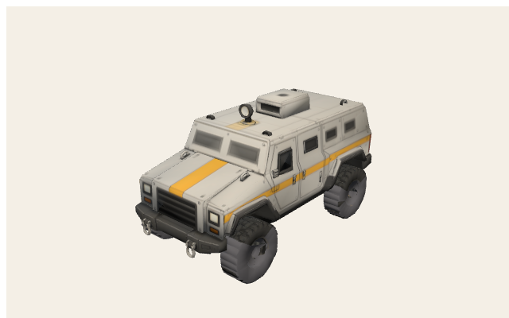
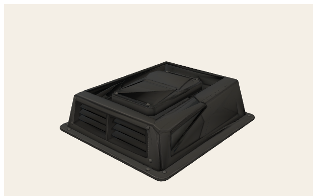
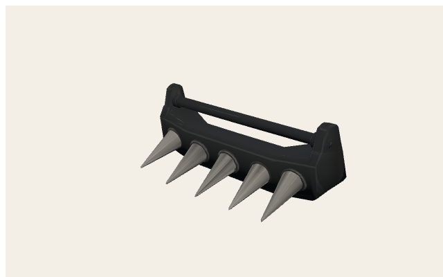
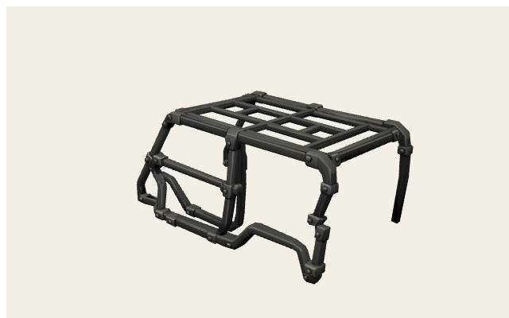
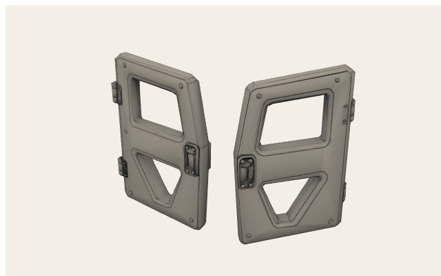
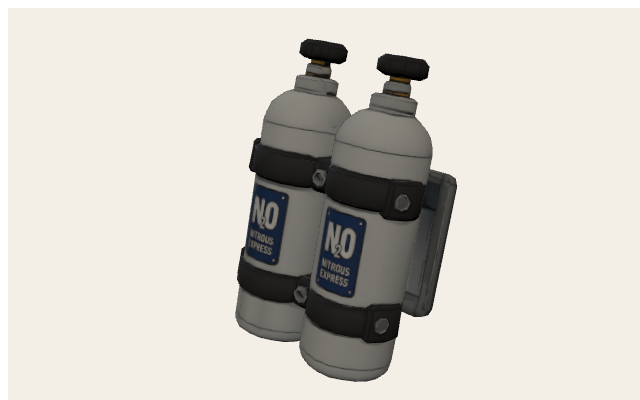
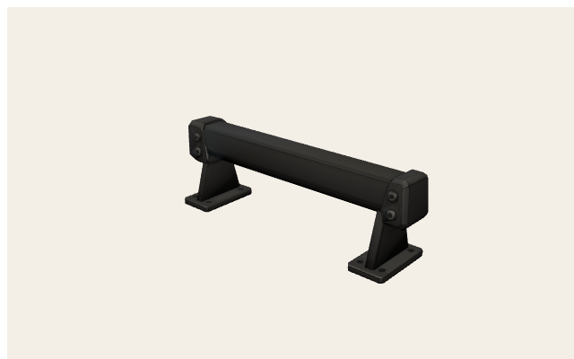

# Bunker — mesh cheat sheet

Use these **exact names** in commands (node / mesh / part id). Coordinates are **mesh space, meters**.

## Identity

| Field | Value |
| --- | --- |
| Car id | `bunker` |
| German name | Bunker |
| Class | Panzerwagen |
| GLB | `public/models/cars/bunker.glb` |
| Runtime yaw | 0 rad — bake nose +Z (runtime yaw 0) |
| Collision radius | 1.25 m (silhouette, not mesh) |
| Default paint | `#868e96` |
| Root AABB | (-0.983, 0, -1.925) → (0.983, 2.117, 1.925) |

## Model

## Command names (runtime)

- Body / paint: `BodyPaint` (recolor target)
- Wheels in GLB: `StockWheel_FL` `StockWheel_FR` `StockWheel_RL` `StockWheel_RR`
- Wheel wrappers (added at load): `WheelSteer_{FL,FR,RL,RR}` + `WheelSpin_{FL,FR,RL,RR}`
- Stock extras if present: `StockSpoiler` (Blitz Heckspoiler), `StockCage` (Käferkraft, hidden when `reinforced_frame` on), `StockEngine`
- Equipped Teile group: `carParts` / objects `carPart-{partId}` (copy `carPart-{partId}-1`…)
- Große Räder: hide stock wheels + procedural overlays (not Blitz/Bison/Käferkraft/Donnerbüchse)
- Cosmetics: stickers `none|flames|bolt|star` (flames GLB `public/models/stickers/flames.glb`)

## Coordinate grids (meters)

Orange boxes = mesh AABBs. Green dots = Teil **mount anchors** (`CAR_PART_LAYOUTS`). Red = X/u origin, blue = Z/v origin.

<svg xmlns="http://www.w3.org/2000/svg" width="760" height="520" viewBox="0 0 760 520">
<rect x="0" y="0" width="760" height="520" fill="#f4efe6"/>
<rect x="56" y="36" width="686" height="444" fill="#efe8dc" stroke="#1a1a1a" stroke-width="2"/>
<line x1="56.0" y1="36" x2="56.0" y2="480" stroke="#c4b8a4" stroke-width="1"/>
<line x1="98.9" y1="36" x2="98.9" y2="480" stroke="#ddd4c6" stroke-width="0.6"/>
<line x1="141.8" y1="36" x2="141.8" y2="480" stroke="#ddd4c6" stroke-width="0.6"/>
<line x1="184.6" y1="36" x2="184.6" y2="480" stroke="#ddd4c6" stroke-width="0.6"/>
<line x1="227.5" y1="36" x2="227.5" y2="480" stroke="#c4b8a4" stroke-width="1"/>
<line x1="270.4" y1="36" x2="270.4" y2="480" stroke="#ddd4c6" stroke-width="0.6"/>
<line x1="313.3" y1="36" x2="313.3" y2="480" stroke="#ddd4c6" stroke-width="0.6"/>
<line x1="356.1" y1="36" x2="356.1" y2="480" stroke="#ddd4c6" stroke-width="0.6"/>
<line x1="399.0" y1="36" x2="399.0" y2="480" stroke="#e03131" stroke-width="2"/>
<line x1="441.9" y1="36" x2="441.9" y2="480" stroke="#ddd4c6" stroke-width="0.6"/>
<line x1="484.8" y1="36" x2="484.8" y2="480" stroke="#ddd4c6" stroke-width="0.6"/>
<line x1="527.6" y1="36" x2="527.6" y2="480" stroke="#ddd4c6" stroke-width="0.6"/>
<line x1="570.5" y1="36" x2="570.5" y2="480" stroke="#c4b8a4" stroke-width="1"/>
<line x1="613.4" y1="36" x2="613.4" y2="480" stroke="#ddd4c6" stroke-width="0.6"/>
<line x1="656.3" y1="36" x2="656.3" y2="480" stroke="#ddd4c6" stroke-width="0.6"/>
<line x1="699.1" y1="36" x2="699.1" y2="480" stroke="#ddd4c6" stroke-width="0.6"/>
<line x1="742.0" y1="36" x2="742.0" y2="480" stroke="#c4b8a4" stroke-width="1"/>
<line x1="56" y1="480.0" x2="742" y2="480.0" stroke="#c4b8a4" stroke-width="1"/>
<line x1="56" y1="461.5" x2="742" y2="461.5" stroke="#ddd4c6" stroke-width="0.6"/>
<line x1="56" y1="443.0" x2="742" y2="443.0" stroke="#ddd4c6" stroke-width="0.6"/>
<line x1="56" y1="424.5" x2="742" y2="424.5" stroke="#ddd4c6" stroke-width="0.6"/>
<line x1="56" y1="406.0" x2="742" y2="406.0" stroke="#c4b8a4" stroke-width="1"/>
<line x1="56" y1="387.5" x2="742" y2="387.5" stroke="#ddd4c6" stroke-width="0.6"/>
<line x1="56" y1="369.0" x2="742" y2="369.0" stroke="#ddd4c6" stroke-width="0.6"/>
<line x1="56" y1="350.5" x2="742" y2="350.5" stroke="#ddd4c6" stroke-width="0.6"/>
<line x1="56" y1="332.0" x2="742" y2="332.0" stroke="#c4b8a4" stroke-width="1"/>
<line x1="56" y1="313.5" x2="742" y2="313.5" stroke="#ddd4c6" stroke-width="0.6"/>
<line x1="56" y1="295.0" x2="742" y2="295.0" stroke="#ddd4c6" stroke-width="0.6"/>
<line x1="56" y1="276.5" x2="742" y2="276.5" stroke="#ddd4c6" stroke-width="0.6"/>
<line x1="56" y1="258.0" x2="742" y2="258.0" stroke="#339af0" stroke-width="2"/>
<line x1="56" y1="239.5" x2="742" y2="239.5" stroke="#ddd4c6" stroke-width="0.6"/>
<line x1="56" y1="221.0" x2="742" y2="221.0" stroke="#ddd4c6" stroke-width="0.6"/>
<line x1="56" y1="202.5" x2="742" y2="202.5" stroke="#ddd4c6" stroke-width="0.6"/>
<line x1="56" y1="184.0" x2="742" y2="184.0" stroke="#c4b8a4" stroke-width="1"/>
<line x1="56" y1="165.5" x2="742" y2="165.5" stroke="#ddd4c6" stroke-width="0.6"/>
<line x1="56" y1="147.0" x2="742" y2="147.0" stroke="#ddd4c6" stroke-width="0.6"/>
<line x1="56" y1="128.5" x2="742" y2="128.5" stroke="#ddd4c6" stroke-width="0.6"/>
<line x1="56" y1="110.0" x2="742" y2="110.0" stroke="#c4b8a4" stroke-width="1"/>
<line x1="56" y1="91.5" x2="742" y2="91.5" stroke="#ddd4c6" stroke-width="0.6"/>
<line x1="56" y1="73.0" x2="742" y2="73.0" stroke="#ddd4c6" stroke-width="0.6"/>
<line x1="56" y1="54.5" x2="742" y2="54.5" stroke="#ddd4c6" stroke-width="0.6"/>
<line x1="56" y1="36.0" x2="742" y2="36.0" stroke="#c4b8a4" stroke-width="1"/>
<text x="56.0" y="496" text-anchor="middle" font-size="11" font-family="ui-monospace,monospace" fill="#1a1a1a">-2</text>
<text x="227.5" y="496" text-anchor="middle" font-size="11" font-family="ui-monospace,monospace" fill="#1a1a1a">-1</text>
<text x="399.0" y="496" text-anchor="middle" font-size="11" font-family="ui-monospace,monospace" fill="#1a1a1a">0</text>
<text x="570.5" y="496" text-anchor="middle" font-size="11" font-family="ui-monospace,monospace" fill="#1a1a1a">1</text>
<text x="742.0" y="496" text-anchor="middle" font-size="11" font-family="ui-monospace,monospace" fill="#1a1a1a">2</text>
<text x="48" y="484.0" text-anchor="end" font-size="11" font-family="ui-monospace,monospace" fill="#1a1a1a">-3</text>
<text x="48" y="410.0" text-anchor="end" font-size="11" font-family="ui-monospace,monospace" fill="#1a1a1a">-2</text>
<text x="48" y="336.0" text-anchor="end" font-size="11" font-family="ui-monospace,monospace" fill="#1a1a1a">-1</text>
<text x="48" y="262.0" text-anchor="end" font-size="11" font-family="ui-monospace,monospace" fill="#1a1a1a">0</text>
<text x="48" y="188.0" text-anchor="end" font-size="11" font-family="ui-monospace,monospace" fill="#1a1a1a">1</text>
<text x="48" y="114.0" text-anchor="end" font-size="11" font-family="ui-monospace,monospace" fill="#1a1a1a">2</text>
<text x="48" y="40.0" text-anchor="end" font-size="11" font-family="ui-monospace,monospace" fill="#1a1a1a">3</text>
<rect x="230.4" y="115.6" width="337.2" height="284.9" fill="#f08c0033" stroke="#f08c00" stroke-width="1.6"/>
<text x="399.0" y="258.0" text-anchor="middle" font-size="10" font-family="ui-sans-serif,sans-serif" font-weight="700" fill="#1a1a1a">tripo_node_3d7e6051-486f-4e09-a1e6-30c1d9e8c730</text>
<circle cx="399.0" cy="172.9" r="4.5" fill="#12b886" stroke="#1a1a1a" stroke-width="1.2"/>
<text x="406.0" y="166.9" font-size="10" font-family="ui-sans-serif,sans-serif" font-weight="700" fill="#1a1a1a">big_engine</text>
<circle cx="399.0" cy="115.9" r="4.5" fill="#12b886" stroke="#1a1a1a" stroke-width="1.2"/>
<text x="406.0" y="109.9" font-size="10" font-family="ui-sans-serif,sans-serif" font-weight="700" fill="#1a1a1a">spike_bumper</text>
<circle cx="399.0" cy="258.0" r="4.5" fill="#12b886" stroke="#1a1a1a" stroke-width="1.2"/>
<text x="406.0" y="252.0" font-size="10" font-family="ui-sans-serif,sans-serif" font-weight="700" fill="#1a1a1a">reinforced_frame</text>
<circle cx="224.1" cy="250.6" r="4.5" fill="#12b886" stroke="#1a1a1a" stroke-width="1.2"/>
<text x="231.1" y="244.6" font-size="10" font-family="ui-sans-serif,sans-serif" font-weight="700" fill="#1a1a1a">lightweight_body[0]</text>
<circle cx="573.9" cy="250.6" r="4.5" fill="#12b886" stroke="#1a1a1a" stroke-width="1.2"/>
<text x="580.9" y="244.6" font-size="10" font-family="ui-sans-serif,sans-serif" font-weight="700" fill="#1a1a1a">lightweight_body[1]</text>
<circle cx="230.9" cy="343.1" r="4.5" fill="#12b886" stroke="#1a1a1a" stroke-width="1.2"/>
<text x="237.9" y="337.1" font-size="10" font-family="ui-sans-serif,sans-serif" font-weight="700" fill="#1a1a1a">nitro_kit</text>
<circle cx="399.0" cy="369.0" r="4.5" fill="#12b886" stroke="#1a1a1a" stroke-width="1.2"/>
<text x="406.0" y="363.0" font-size="10" font-family="ui-sans-serif,sans-serif" font-weight="700" fill="#1a1a1a">rear_spoiler</text>
<text x="380" y="22" text-anchor="middle" font-size="14" font-family="ui-sans-serif,sans-serif" font-weight="800" fill="#1a1a1a">Bunker — top (mesh XZ)</text>
<text x="380" y="512" text-anchor="middle" font-size="11" font-family="ui-sans-serif,sans-serif" fill="#5c564c">+X → right · +Z → up · origin = red (+X) / blue (+Z) · meters</text>
</svg>

<svg xmlns="http://www.w3.org/2000/svg" width="760" height="520" viewBox="0 0 760 520">
<rect x="0" y="0" width="760" height="520" fill="#f4efe6"/>
<rect x="56" y="36" width="686" height="444" fill="#efe8dc" stroke="#1a1a1a" stroke-width="2"/>
<line x1="56.0" y1="36" x2="56.0" y2="480" stroke="#c4b8a4" stroke-width="1"/>
<line x1="84.6" y1="36" x2="84.6" y2="480" stroke="#ddd4c6" stroke-width="0.6"/>
<line x1="113.2" y1="36" x2="113.2" y2="480" stroke="#ddd4c6" stroke-width="0.6"/>
<line x1="141.8" y1="36" x2="141.8" y2="480" stroke="#ddd4c6" stroke-width="0.6"/>
<line x1="170.3" y1="36" x2="170.3" y2="480" stroke="#c4b8a4" stroke-width="1"/>
<line x1="198.9" y1="36" x2="198.9" y2="480" stroke="#ddd4c6" stroke-width="0.6"/>
<line x1="227.5" y1="36" x2="227.5" y2="480" stroke="#ddd4c6" stroke-width="0.6"/>
<line x1="256.1" y1="36" x2="256.1" y2="480" stroke="#ddd4c6" stroke-width="0.6"/>
<line x1="284.7" y1="36" x2="284.7" y2="480" stroke="#c4b8a4" stroke-width="1"/>
<line x1="313.3" y1="36" x2="313.3" y2="480" stroke="#ddd4c6" stroke-width="0.6"/>
<line x1="341.8" y1="36" x2="341.8" y2="480" stroke="#ddd4c6" stroke-width="0.6"/>
<line x1="370.4" y1="36" x2="370.4" y2="480" stroke="#ddd4c6" stroke-width="0.6"/>
<line x1="399.0" y1="36" x2="399.0" y2="480" stroke="#e03131" stroke-width="2"/>
<line x1="427.6" y1="36" x2="427.6" y2="480" stroke="#ddd4c6" stroke-width="0.6"/>
<line x1="456.2" y1="36" x2="456.2" y2="480" stroke="#ddd4c6" stroke-width="0.6"/>
<line x1="484.8" y1="36" x2="484.8" y2="480" stroke="#ddd4c6" stroke-width="0.6"/>
<line x1="513.3" y1="36" x2="513.3" y2="480" stroke="#c4b8a4" stroke-width="1"/>
<line x1="541.9" y1="36" x2="541.9" y2="480" stroke="#ddd4c6" stroke-width="0.6"/>
<line x1="570.5" y1="36" x2="570.5" y2="480" stroke="#ddd4c6" stroke-width="0.6"/>
<line x1="599.1" y1="36" x2="599.1" y2="480" stroke="#ddd4c6" stroke-width="0.6"/>
<line x1="627.7" y1="36" x2="627.7" y2="480" stroke="#c4b8a4" stroke-width="1"/>
<line x1="656.3" y1="36" x2="656.3" y2="480" stroke="#ddd4c6" stroke-width="0.6"/>
<line x1="684.8" y1="36" x2="684.8" y2="480" stroke="#ddd4c6" stroke-width="0.6"/>
<line x1="713.4" y1="36" x2="713.4" y2="480" stroke="#ddd4c6" stroke-width="0.6"/>
<line x1="742.0" y1="36" x2="742.0" y2="480" stroke="#c4b8a4" stroke-width="1"/>
<line x1="56" y1="480.0" x2="742" y2="480.0" stroke="#c4b8a4" stroke-width="1"/>
<line x1="56" y1="452.3" x2="742" y2="452.3" stroke="#ddd4c6" stroke-width="0.6"/>
<line x1="56" y1="424.5" x2="742" y2="424.5" stroke="#ddd4c6" stroke-width="0.6"/>
<line x1="56" y1="396.8" x2="742" y2="396.8" stroke="#ddd4c6" stroke-width="0.6"/>
<line x1="56" y1="369.0" x2="742" y2="369.0" stroke="#339af0" stroke-width="2"/>
<line x1="56" y1="341.3" x2="742" y2="341.3" stroke="#ddd4c6" stroke-width="0.6"/>
<line x1="56" y1="313.5" x2="742" y2="313.5" stroke="#ddd4c6" stroke-width="0.6"/>
<line x1="56" y1="285.8" x2="742" y2="285.8" stroke="#ddd4c6" stroke-width="0.6"/>
<line x1="56" y1="258.0" x2="742" y2="258.0" stroke="#c4b8a4" stroke-width="1"/>
<line x1="56" y1="230.3" x2="742" y2="230.3" stroke="#ddd4c6" stroke-width="0.6"/>
<line x1="56" y1="202.5" x2="742" y2="202.5" stroke="#ddd4c6" stroke-width="0.6"/>
<line x1="56" y1="174.8" x2="742" y2="174.8" stroke="#ddd4c6" stroke-width="0.6"/>
<line x1="56" y1="147.0" x2="742" y2="147.0" stroke="#c4b8a4" stroke-width="1"/>
<line x1="56" y1="119.3" x2="742" y2="119.3" stroke="#ddd4c6" stroke-width="0.6"/>
<line x1="56" y1="91.5" x2="742" y2="91.5" stroke="#ddd4c6" stroke-width="0.6"/>
<line x1="56" y1="63.8" x2="742" y2="63.8" stroke="#ddd4c6" stroke-width="0.6"/>
<line x1="56" y1="36.0" x2="742" y2="36.0" stroke="#c4b8a4" stroke-width="1"/>
<text x="56.0" y="496" text-anchor="middle" font-size="11" font-family="ui-monospace,monospace" fill="#1a1a1a">-3</text>
<text x="170.3" y="496" text-anchor="middle" font-size="11" font-family="ui-monospace,monospace" fill="#1a1a1a">-2</text>
<text x="284.7" y="496" text-anchor="middle" font-size="11" font-family="ui-monospace,monospace" fill="#1a1a1a">-1</text>
<text x="399.0" y="496" text-anchor="middle" font-size="11" font-family="ui-monospace,monospace" fill="#1a1a1a">0</text>
<text x="513.3" y="496" text-anchor="middle" font-size="11" font-family="ui-monospace,monospace" fill="#1a1a1a">1</text>
<text x="627.7" y="496" text-anchor="middle" font-size="11" font-family="ui-monospace,monospace" fill="#1a1a1a">2</text>
<text x="742.0" y="496" text-anchor="middle" font-size="11" font-family="ui-monospace,monospace" fill="#1a1a1a">3</text>
<text x="48" y="484.0" text-anchor="end" font-size="11" font-family="ui-monospace,monospace" fill="#1a1a1a">-1</text>
<text x="48" y="373.0" text-anchor="end" font-size="11" font-family="ui-monospace,monospace" fill="#1a1a1a">0</text>
<text x="48" y="262.0" text-anchor="end" font-size="11" font-family="ui-monospace,monospace" fill="#1a1a1a">1</text>
<text x="48" y="151.0" text-anchor="end" font-size="11" font-family="ui-monospace,monospace" fill="#1a1a1a">2</text>
<text x="48" y="40.0" text-anchor="end" font-size="11" font-family="ui-monospace,monospace" fill="#1a1a1a">3</text>
<rect x="178.9" y="134.0" width="440.2" height="235.0" fill="#f08c0033" stroke="#f08c00" stroke-width="1.6"/>
<text x="399.0" y="251.5" text-anchor="middle" font-size="10" font-family="ui-sans-serif,sans-serif" font-weight="700" fill="#1a1a1a">tripo_node_3d7e6051-486f-4e09-a1e6-30c1d9e8c730</text>
<circle cx="530.5" cy="246.9" r="4.5" fill="#12b886" stroke="#1a1a1a" stroke-width="1.2"/>
<text x="537.5" y="240.9" font-size="10" font-family="ui-sans-serif,sans-serif" font-weight="700" fill="#1a1a1a">big_engine</text>
<circle cx="618.5" cy="326.8" r="4.5" fill="#12b886" stroke="#1a1a1a" stroke-width="1.2"/>
<text x="625.5" y="320.8" font-size="10" font-family="ui-sans-serif,sans-serif" font-weight="700" fill="#1a1a1a">spike_bumper</text>
<circle cx="399.0" cy="337.9" r="4.5" fill="#12b886" stroke="#1a1a1a" stroke-width="1.2"/>
<text x="406.0" y="331.9" font-size="10" font-family="ui-sans-serif,sans-serif" font-weight="700" fill="#1a1a1a">reinforced_frame</text>
<circle cx="410.4" cy="308.0" r="4.5" fill="#12b886" stroke="#1a1a1a" stroke-width="1.2"/>
<text x="417.4" y="302.0" font-size="10" font-family="ui-sans-serif,sans-serif" font-weight="700" fill="#1a1a1a">lightweight_body[0]</text>
<circle cx="410.4" cy="308.0" r="4.5" fill="#12b886" stroke="#1a1a1a" stroke-width="1.2"/>
<text x="417.4" y="302.0" font-size="10" font-family="ui-sans-serif,sans-serif" font-weight="700" fill="#1a1a1a">lightweight_body[1]</text>
<circle cx="267.5" cy="252.4" r="4.5" fill="#12b886" stroke="#1a1a1a" stroke-width="1.2"/>
<text x="274.5" y="246.4" font-size="10" font-family="ui-sans-serif,sans-serif" font-weight="700" fill="#1a1a1a">nitro_kit</text>
<circle cx="227.5" cy="178.1" r="4.5" fill="#12b886" stroke="#1a1a1a" stroke-width="1.2"/>
<text x="234.5" y="172.1" font-size="10" font-family="ui-sans-serif,sans-serif" font-weight="700" fill="#1a1a1a">rear_spoiler</text>
<text x="380" y="22" text-anchor="middle" font-size="14" font-family="ui-sans-serif,sans-serif" font-weight="800" fill="#1a1a1a">Bunker — side</text>
<text x="380" y="512" text-anchor="middle" font-size="11" font-family="ui-sans-serif,sans-serif" fill="#5c564c">+Z length (nose +Z) → right · +Y up → up · origin = red (+Z length (nose +Z)) / blue (+Y up) · meters</text>
</svg>

## Nodes / meshes

| Node | Mesh | Prims | Verts | Center xyz | AABB min → max | Materials |
| --- | --- | --- | --- | --- | --- | --- |
| `tripo_node_3d7e6051-486f-4e09-a1e6-30c1d9e8c730` | `tripo_mesh_3d7e6051-486f-4e09-a1e6-30c1d9e8c730` | 5 | 7065 | (0, 1.059, 0) | (-0.983, 0, -1.925) → (0.983, 2.117, 1.925) | BodyPaint, Tire |

## Materials

- `BodyPaint`
- `Tire`

## Shop Teile + mounts

| Part id | German | Shop | GLB | Mount xyz (yaw, scale) |
| --- | --- | --- | --- | --- |
| `big_engine` | Großer Motor | yes | `public/models/parts/bunker-big_engine.glb` | (0, 1.1, 1.15) yaw 0° ×1.05 |
| `big_wheels` | Große Räder | yes | procedural / missing | — |
| `spike_bumper` | Spike-Stoßstange | yes | `public/models/parts/bunker-spike_bumper.glb` | (0, 0.38, 1.92) yaw 0° ×1.25 |
| `reinforced_frame` | Verstärkter Rahmen | yes | `public/models/parts/bunker-reinforced_frame.glb` | (0, 0.28, 0) yaw 90° ×1.02 |
| `lightweight_body` | Leichtbau-Karosserie | yes | `public/models/parts/bunker-lightweight_body.glb` | (-1.02, 0.55, 0.1) yaw 90° ×1.08 (1.02, 0.55, 0.1) yaw -90° ×1.08 |
| `nitro_kit` | Nitro-Kit | yes | `public/models/parts/bunker-nitro_kit.glb` | (-0.98, 1.05, -1.15) yaw -90° ×1.15 |
| `rear_spoiler` | Heckspoiler | yes | `public/models/parts/bunker-rear_spoiler.glb` | (0, 1.72, -1.5) yaw 0° ×1.12 |

## Part / extra `public/models/parts/bunker-big_engine.glb`

Root AABB (-0.278, 0, -0.31) → (0.278, 0.195, 0.31)

<svg xmlns="http://www.w3.org/2000/svg" width="760" height="520" viewBox="0 0 760 520">
<rect x="0" y="0" width="760" height="520" fill="#f4efe6"/>
<rect x="56" y="36" width="686" height="444" fill="#efe8dc" stroke="#1a1a1a" stroke-width="2"/>
<line x1="56.0" y1="36" x2="56.0" y2="480" stroke="#c4b8a4" stroke-width="1"/>
<line x1="141.8" y1="36" x2="141.8" y2="480" stroke="#ddd4c6" stroke-width="0.6"/>
<line x1="227.5" y1="36" x2="227.5" y2="480" stroke="#ddd4c6" stroke-width="0.6"/>
<line x1="313.3" y1="36" x2="313.3" y2="480" stroke="#ddd4c6" stroke-width="0.6"/>
<line x1="399.0" y1="36" x2="399.0" y2="480" stroke="#e03131" stroke-width="2"/>
<line x1="484.8" y1="36" x2="484.8" y2="480" stroke="#ddd4c6" stroke-width="0.6"/>
<line x1="570.5" y1="36" x2="570.5" y2="480" stroke="#ddd4c6" stroke-width="0.6"/>
<line x1="656.3" y1="36" x2="656.3" y2="480" stroke="#ddd4c6" stroke-width="0.6"/>
<line x1="742.0" y1="36" x2="742.0" y2="480" stroke="#c4b8a4" stroke-width="1"/>
<line x1="56" y1="480.0" x2="742" y2="480.0" stroke="#c4b8a4" stroke-width="1"/>
<line x1="56" y1="424.5" x2="742" y2="424.5" stroke="#ddd4c6" stroke-width="0.6"/>
<line x1="56" y1="369.0" x2="742" y2="369.0" stroke="#ddd4c6" stroke-width="0.6"/>
<line x1="56" y1="313.5" x2="742" y2="313.5" stroke="#ddd4c6" stroke-width="0.6"/>
<line x1="56" y1="258.0" x2="742" y2="258.0" stroke="#339af0" stroke-width="2"/>
<line x1="56" y1="202.5" x2="742" y2="202.5" stroke="#ddd4c6" stroke-width="0.6"/>
<line x1="56" y1="147.0" x2="742" y2="147.0" stroke="#ddd4c6" stroke-width="0.6"/>
<line x1="56" y1="91.5" x2="742" y2="91.5" stroke="#ddd4c6" stroke-width="0.6"/>
<line x1="56" y1="36.0" x2="742" y2="36.0" stroke="#c4b8a4" stroke-width="1"/>
<text x="56.0" y="496" text-anchor="middle" font-size="11" font-family="ui-monospace,monospace" fill="#1a1a1a">-1</text>
<text x="399.0" y="496" text-anchor="middle" font-size="11" font-family="ui-monospace,monospace" fill="#1a1a1a">0</text>
<text x="742.0" y="496" text-anchor="middle" font-size="11" font-family="ui-monospace,monospace" fill="#1a1a1a">1</text>
<text x="48" y="484.0" text-anchor="end" font-size="11" font-family="ui-monospace,monospace" fill="#1a1a1a">-1</text>
<text x="48" y="262.0" text-anchor="end" font-size="11" font-family="ui-monospace,monospace" fill="#1a1a1a">0</text>
<text x="48" y="40.0" text-anchor="end" font-size="11" font-family="ui-monospace,monospace" fill="#1a1a1a">1</text>
<rect x="303.5" y="189.2" width="191.0" height="137.6" fill="#f08c0033" stroke="#f08c00" stroke-width="1.6"/>
<text x="399.0" y="258.0" text-anchor="middle" font-size="10" font-family="ui-sans-serif,sans-serif" font-weight="700" fill="#1a1a1a">tripo_node_affc9437-cc99-48d5-96d9-21d2ad6523fc</text>
<text x="380" y="22" text-anchor="middle" font-size="14" font-family="ui-sans-serif,sans-serif" font-weight="800" fill="#1a1a1a">public/models/parts/bunker-big_engine.glb — top XZ</text>
<text x="380" y="512" text-anchor="middle" font-size="11" font-family="ui-sans-serif,sans-serif" fill="#5c564c">+X → right · +Z → up · origin = red (+X) / blue (+Z) · meters</text>
</svg>

| Node | Mesh | Prims | Verts | Center xyz | AABB min → max | Materials |
| --- | --- | --- | --- | --- | --- | --- |
| `tripo_node_affc9437-cc99-48d5-96d9-21d2ad6523fc` | `tripo_mesh_affc9437-cc99-48d5-96d9-21d2ad6523fc` | 1 | 6864 | (0, 0.098, 0) | (-0.278, 0, -0.31) → (0.278, 0.195, 0.31) | Carbon |

## Part / extra `public/models/parts/bunker-spike_bumper.glb`

Root AABB (-0.621, 0, -0.283) → (0.621, 0.45, 0.283)

<svg xmlns="http://www.w3.org/2000/svg" width="760" height="520" viewBox="0 0 760 520">
<rect x="0" y="0" width="760" height="520" fill="#f4efe6"/>
<rect x="56" y="36" width="686" height="444" fill="#efe8dc" stroke="#1a1a1a" stroke-width="2"/>
<line x1="56.0" y1="36" x2="56.0" y2="480" stroke="#c4b8a4" stroke-width="1"/>
<line x1="98.9" y1="36" x2="98.9" y2="480" stroke="#ddd4c6" stroke-width="0.6"/>
<line x1="141.8" y1="36" x2="141.8" y2="480" stroke="#ddd4c6" stroke-width="0.6"/>
<line x1="184.6" y1="36" x2="184.6" y2="480" stroke="#ddd4c6" stroke-width="0.6"/>
<line x1="227.5" y1="36" x2="227.5" y2="480" stroke="#c4b8a4" stroke-width="1"/>
<line x1="270.4" y1="36" x2="270.4" y2="480" stroke="#ddd4c6" stroke-width="0.6"/>
<line x1="313.3" y1="36" x2="313.3" y2="480" stroke="#ddd4c6" stroke-width="0.6"/>
<line x1="356.1" y1="36" x2="356.1" y2="480" stroke="#ddd4c6" stroke-width="0.6"/>
<line x1="399.0" y1="36" x2="399.0" y2="480" stroke="#e03131" stroke-width="2"/>
<line x1="441.9" y1="36" x2="441.9" y2="480" stroke="#ddd4c6" stroke-width="0.6"/>
<line x1="484.8" y1="36" x2="484.8" y2="480" stroke="#ddd4c6" stroke-width="0.6"/>
<line x1="527.6" y1="36" x2="527.6" y2="480" stroke="#ddd4c6" stroke-width="0.6"/>
<line x1="570.5" y1="36" x2="570.5" y2="480" stroke="#c4b8a4" stroke-width="1"/>
<line x1="613.4" y1="36" x2="613.4" y2="480" stroke="#ddd4c6" stroke-width="0.6"/>
<line x1="656.3" y1="36" x2="656.3" y2="480" stroke="#ddd4c6" stroke-width="0.6"/>
<line x1="699.1" y1="36" x2="699.1" y2="480" stroke="#ddd4c6" stroke-width="0.6"/>
<line x1="742.0" y1="36" x2="742.0" y2="480" stroke="#c4b8a4" stroke-width="1"/>
<line x1="56" y1="480.0" x2="742" y2="480.0" stroke="#c4b8a4" stroke-width="1"/>
<line x1="56" y1="424.5" x2="742" y2="424.5" stroke="#ddd4c6" stroke-width="0.6"/>
<line x1="56" y1="369.0" x2="742" y2="369.0" stroke="#ddd4c6" stroke-width="0.6"/>
<line x1="56" y1="313.5" x2="742" y2="313.5" stroke="#ddd4c6" stroke-width="0.6"/>
<line x1="56" y1="258.0" x2="742" y2="258.0" stroke="#339af0" stroke-width="2"/>
<line x1="56" y1="202.5" x2="742" y2="202.5" stroke="#ddd4c6" stroke-width="0.6"/>
<line x1="56" y1="147.0" x2="742" y2="147.0" stroke="#ddd4c6" stroke-width="0.6"/>
<line x1="56" y1="91.5" x2="742" y2="91.5" stroke="#ddd4c6" stroke-width="0.6"/>
<line x1="56" y1="36.0" x2="742" y2="36.0" stroke="#c4b8a4" stroke-width="1"/>
<text x="56.0" y="496" text-anchor="middle" font-size="11" font-family="ui-monospace,monospace" fill="#1a1a1a">-2</text>
<text x="227.5" y="496" text-anchor="middle" font-size="11" font-family="ui-monospace,monospace" fill="#1a1a1a">-1</text>
<text x="399.0" y="496" text-anchor="middle" font-size="11" font-family="ui-monospace,monospace" fill="#1a1a1a">0</text>
<text x="570.5" y="496" text-anchor="middle" font-size="11" font-family="ui-monospace,monospace" fill="#1a1a1a">1</text>
<text x="742.0" y="496" text-anchor="middle" font-size="11" font-family="ui-monospace,monospace" fill="#1a1a1a">2</text>
<text x="48" y="484.0" text-anchor="end" font-size="11" font-family="ui-monospace,monospace" fill="#1a1a1a">-1</text>
<text x="48" y="262.0" text-anchor="end" font-size="11" font-family="ui-monospace,monospace" fill="#1a1a1a">0</text>
<text x="48" y="40.0" text-anchor="end" font-size="11" font-family="ui-monospace,monospace" fill="#1a1a1a">1</text>
<rect x="292.4" y="195.1" width="213.2" height="125.8" fill="#f08c0033" stroke="#f08c00" stroke-width="1.6"/>
<text x="399.0" y="258.0" text-anchor="middle" font-size="10" font-family="ui-sans-serif,sans-serif" font-weight="700" fill="#1a1a1a">tripo_node_42d65729-f715-4113-a612-fa87ba7df4d6</text>
<text x="380" y="22" text-anchor="middle" font-size="14" font-family="ui-sans-serif,sans-serif" font-weight="800" fill="#1a1a1a">public/models/parts/bunker-spike_bumper.glb — top XZ</text>
<text x="380" y="512" text-anchor="middle" font-size="11" font-family="ui-sans-serif,sans-serif" fill="#5c564c">+X → right · +Z → up · origin = red (+X) / blue (+Z) · meters</text>
</svg>

| Node | Mesh | Prims | Verts | Center xyz | AABB min → max | Materials |
| --- | --- | --- | --- | --- | --- | --- |
| `tripo_node_42d65729-f715-4113-a612-fa87ba7df4d6` | `tripo_mesh_42d65729-f715-4113-a612-fa87ba7df4d6` | 1 | 6797 | (0, 0.225, 0) | (-0.621, 0, -0.283) → (0.621, 0.45, 0.283) | Spike |

## Part / extra `public/models/parts/bunker-reinforced_frame.glb`

Root AABB (-1.7, 0, -1.081) → (1.7, 1.537, 1.081)

<svg xmlns="http://www.w3.org/2000/svg" width="760" height="520" viewBox="0 0 760 520">
<rect x="0" y="0" width="760" height="520" fill="#f4efe6"/>
<rect x="56" y="36" width="686" height="444" fill="#efe8dc" stroke="#1a1a1a" stroke-width="2"/>
<line x1="56.0" y1="36" x2="56.0" y2="480" stroke="#c4b8a4" stroke-width="1"/>
<line x1="84.6" y1="36" x2="84.6" y2="480" stroke="#ddd4c6" stroke-width="0.6"/>
<line x1="113.2" y1="36" x2="113.2" y2="480" stroke="#ddd4c6" stroke-width="0.6"/>
<line x1="141.8" y1="36" x2="141.8" y2="480" stroke="#ddd4c6" stroke-width="0.6"/>
<line x1="170.3" y1="36" x2="170.3" y2="480" stroke="#c4b8a4" stroke-width="1"/>
<line x1="198.9" y1="36" x2="198.9" y2="480" stroke="#ddd4c6" stroke-width="0.6"/>
<line x1="227.5" y1="36" x2="227.5" y2="480" stroke="#ddd4c6" stroke-width="0.6"/>
<line x1="256.1" y1="36" x2="256.1" y2="480" stroke="#ddd4c6" stroke-width="0.6"/>
<line x1="284.7" y1="36" x2="284.7" y2="480" stroke="#c4b8a4" stroke-width="1"/>
<line x1="313.3" y1="36" x2="313.3" y2="480" stroke="#ddd4c6" stroke-width="0.6"/>
<line x1="341.8" y1="36" x2="341.8" y2="480" stroke="#ddd4c6" stroke-width="0.6"/>
<line x1="370.4" y1="36" x2="370.4" y2="480" stroke="#ddd4c6" stroke-width="0.6"/>
<line x1="399.0" y1="36" x2="399.0" y2="480" stroke="#e03131" stroke-width="2"/>
<line x1="427.6" y1="36" x2="427.6" y2="480" stroke="#ddd4c6" stroke-width="0.6"/>
<line x1="456.2" y1="36" x2="456.2" y2="480" stroke="#ddd4c6" stroke-width="0.6"/>
<line x1="484.8" y1="36" x2="484.8" y2="480" stroke="#ddd4c6" stroke-width="0.6"/>
<line x1="513.3" y1="36" x2="513.3" y2="480" stroke="#c4b8a4" stroke-width="1"/>
<line x1="541.9" y1="36" x2="541.9" y2="480" stroke="#ddd4c6" stroke-width="0.6"/>
<line x1="570.5" y1="36" x2="570.5" y2="480" stroke="#ddd4c6" stroke-width="0.6"/>
<line x1="599.1" y1="36" x2="599.1" y2="480" stroke="#ddd4c6" stroke-width="0.6"/>
<line x1="627.7" y1="36" x2="627.7" y2="480" stroke="#c4b8a4" stroke-width="1"/>
<line x1="656.3" y1="36" x2="656.3" y2="480" stroke="#ddd4c6" stroke-width="0.6"/>
<line x1="684.8" y1="36" x2="684.8" y2="480" stroke="#ddd4c6" stroke-width="0.6"/>
<line x1="713.4" y1="36" x2="713.4" y2="480" stroke="#ddd4c6" stroke-width="0.6"/>
<line x1="742.0" y1="36" x2="742.0" y2="480" stroke="#c4b8a4" stroke-width="1"/>
<line x1="56" y1="480.0" x2="742" y2="480.0" stroke="#c4b8a4" stroke-width="1"/>
<line x1="56" y1="452.3" x2="742" y2="452.3" stroke="#ddd4c6" stroke-width="0.6"/>
<line x1="56" y1="424.5" x2="742" y2="424.5" stroke="#ddd4c6" stroke-width="0.6"/>
<line x1="56" y1="396.8" x2="742" y2="396.8" stroke="#ddd4c6" stroke-width="0.6"/>
<line x1="56" y1="369.0" x2="742" y2="369.0" stroke="#c4b8a4" stroke-width="1"/>
<line x1="56" y1="341.3" x2="742" y2="341.3" stroke="#ddd4c6" stroke-width="0.6"/>
<line x1="56" y1="313.5" x2="742" y2="313.5" stroke="#ddd4c6" stroke-width="0.6"/>
<line x1="56" y1="285.8" x2="742" y2="285.8" stroke="#ddd4c6" stroke-width="0.6"/>
<line x1="56" y1="258.0" x2="742" y2="258.0" stroke="#339af0" stroke-width="2"/>
<line x1="56" y1="230.3" x2="742" y2="230.3" stroke="#ddd4c6" stroke-width="0.6"/>
<line x1="56" y1="202.5" x2="742" y2="202.5" stroke="#ddd4c6" stroke-width="0.6"/>
<line x1="56" y1="174.8" x2="742" y2="174.8" stroke="#ddd4c6" stroke-width="0.6"/>
<line x1="56" y1="147.0" x2="742" y2="147.0" stroke="#c4b8a4" stroke-width="1"/>
<line x1="56" y1="119.3" x2="742" y2="119.3" stroke="#ddd4c6" stroke-width="0.6"/>
<line x1="56" y1="91.5" x2="742" y2="91.5" stroke="#ddd4c6" stroke-width="0.6"/>
<line x1="56" y1="63.8" x2="742" y2="63.8" stroke="#ddd4c6" stroke-width="0.6"/>
<line x1="56" y1="36.0" x2="742" y2="36.0" stroke="#c4b8a4" stroke-width="1"/>
<text x="56.0" y="496" text-anchor="middle" font-size="11" font-family="ui-monospace,monospace" fill="#1a1a1a">-3</text>
<text x="170.3" y="496" text-anchor="middle" font-size="11" font-family="ui-monospace,monospace" fill="#1a1a1a">-2</text>
<text x="284.7" y="496" text-anchor="middle" font-size="11" font-family="ui-monospace,monospace" fill="#1a1a1a">-1</text>
<text x="399.0" y="496" text-anchor="middle" font-size="11" font-family="ui-monospace,monospace" fill="#1a1a1a">0</text>
<text x="513.3" y="496" text-anchor="middle" font-size="11" font-family="ui-monospace,monospace" fill="#1a1a1a">1</text>
<text x="627.7" y="496" text-anchor="middle" font-size="11" font-family="ui-monospace,monospace" fill="#1a1a1a">2</text>
<text x="742.0" y="496" text-anchor="middle" font-size="11" font-family="ui-monospace,monospace" fill="#1a1a1a">3</text>
<text x="48" y="484.0" text-anchor="end" font-size="11" font-family="ui-monospace,monospace" fill="#1a1a1a">-2</text>
<text x="48" y="373.0" text-anchor="end" font-size="11" font-family="ui-monospace,monospace" fill="#1a1a1a">-1</text>
<text x="48" y="262.0" text-anchor="end" font-size="11" font-family="ui-monospace,monospace" fill="#1a1a1a">0</text>
<text x="48" y="151.0" text-anchor="end" font-size="11" font-family="ui-monospace,monospace" fill="#1a1a1a">1</text>
<text x="48" y="40.0" text-anchor="end" font-size="11" font-family="ui-monospace,monospace" fill="#1a1a1a">2</text>
<rect x="204.6" y="138.0" width="388.7" height="240.0" fill="#f08c0033" stroke="#f08c00" stroke-width="1.6"/>
<text x="399.0" y="258.0" text-anchor="middle" font-size="10" font-family="ui-sans-serif,sans-serif" font-weight="700" fill="#1a1a1a">tripo_node_e70eb6df-8524-4681-88cf-7fabb1c90342</text>
<text x="380" y="22" text-anchor="middle" font-size="14" font-family="ui-sans-serif,sans-serif" font-weight="800" fill="#1a1a1a">public/models/parts/bunker-reinforced_frame.glb — top XZ</text>
<text x="380" y="512" text-anchor="middle" font-size="11" font-family="ui-sans-serif,sans-serif" fill="#5c564c">+X → right · +Z → up · origin = red (+X) / blue (+Z) · meters</text>
</svg>

| Node | Mesh | Prims | Verts | Center xyz | AABB min → max | Materials |
| --- | --- | --- | --- | --- | --- | --- |
| `tripo_node_e70eb6df-8524-4681-88cf-7fabb1c90342` | `tripo_mesh_e70eb6df-8524-4681-88cf-7fabb1c90342` | 1 | 7468 | (0, 0.768, 0) | (-1.7, 0, -1.081) → (1.7, 1.537, 1.081) | Grey |

## Part / extra `public/models/parts/bunker-lightweight_body.glb`

Root AABB (-0.525, 0, -0.274) → (0.525, 0.84, 0.274)

<svg xmlns="http://www.w3.org/2000/svg" width="760" height="520" viewBox="0 0 760 520">
<rect x="0" y="0" width="760" height="520" fill="#f4efe6"/>
<rect x="56" y="36" width="686" height="444" fill="#efe8dc" stroke="#1a1a1a" stroke-width="2"/>
<line x1="56.0" y1="36" x2="56.0" y2="480" stroke="#c4b8a4" stroke-width="1"/>
<line x1="98.9" y1="36" x2="98.9" y2="480" stroke="#ddd4c6" stroke-width="0.6"/>
<line x1="141.8" y1="36" x2="141.8" y2="480" stroke="#ddd4c6" stroke-width="0.6"/>
<line x1="184.6" y1="36" x2="184.6" y2="480" stroke="#ddd4c6" stroke-width="0.6"/>
<line x1="227.5" y1="36" x2="227.5" y2="480" stroke="#c4b8a4" stroke-width="1"/>
<line x1="270.4" y1="36" x2="270.4" y2="480" stroke="#ddd4c6" stroke-width="0.6"/>
<line x1="313.3" y1="36" x2="313.3" y2="480" stroke="#ddd4c6" stroke-width="0.6"/>
<line x1="356.1" y1="36" x2="356.1" y2="480" stroke="#ddd4c6" stroke-width="0.6"/>
<line x1="399.0" y1="36" x2="399.0" y2="480" stroke="#e03131" stroke-width="2"/>
<line x1="441.9" y1="36" x2="441.9" y2="480" stroke="#ddd4c6" stroke-width="0.6"/>
<line x1="484.8" y1="36" x2="484.8" y2="480" stroke="#ddd4c6" stroke-width="0.6"/>
<line x1="527.6" y1="36" x2="527.6" y2="480" stroke="#ddd4c6" stroke-width="0.6"/>
<line x1="570.5" y1="36" x2="570.5" y2="480" stroke="#c4b8a4" stroke-width="1"/>
<line x1="613.4" y1="36" x2="613.4" y2="480" stroke="#ddd4c6" stroke-width="0.6"/>
<line x1="656.3" y1="36" x2="656.3" y2="480" stroke="#ddd4c6" stroke-width="0.6"/>
<line x1="699.1" y1="36" x2="699.1" y2="480" stroke="#ddd4c6" stroke-width="0.6"/>
<line x1="742.0" y1="36" x2="742.0" y2="480" stroke="#c4b8a4" stroke-width="1"/>
<line x1="56" y1="480.0" x2="742" y2="480.0" stroke="#c4b8a4" stroke-width="1"/>
<line x1="56" y1="424.5" x2="742" y2="424.5" stroke="#ddd4c6" stroke-width="0.6"/>
<line x1="56" y1="369.0" x2="742" y2="369.0" stroke="#ddd4c6" stroke-width="0.6"/>
<line x1="56" y1="313.5" x2="742" y2="313.5" stroke="#ddd4c6" stroke-width="0.6"/>
<line x1="56" y1="258.0" x2="742" y2="258.0" stroke="#339af0" stroke-width="2"/>
<line x1="56" y1="202.5" x2="742" y2="202.5" stroke="#ddd4c6" stroke-width="0.6"/>
<line x1="56" y1="147.0" x2="742" y2="147.0" stroke="#ddd4c6" stroke-width="0.6"/>
<line x1="56" y1="91.5" x2="742" y2="91.5" stroke="#ddd4c6" stroke-width="0.6"/>
<line x1="56" y1="36.0" x2="742" y2="36.0" stroke="#c4b8a4" stroke-width="1"/>
<text x="56.0" y="496" text-anchor="middle" font-size="11" font-family="ui-monospace,monospace" fill="#1a1a1a">-2</text>
<text x="227.5" y="496" text-anchor="middle" font-size="11" font-family="ui-monospace,monospace" fill="#1a1a1a">-1</text>
<text x="399.0" y="496" text-anchor="middle" font-size="11" font-family="ui-monospace,monospace" fill="#1a1a1a">0</text>
<text x="570.5" y="496" text-anchor="middle" font-size="11" font-family="ui-monospace,monospace" fill="#1a1a1a">1</text>
<text x="742.0" y="496" text-anchor="middle" font-size="11" font-family="ui-monospace,monospace" fill="#1a1a1a">2</text>
<text x="48" y="484.0" text-anchor="end" font-size="11" font-family="ui-monospace,monospace" fill="#1a1a1a">-1</text>
<text x="48" y="262.0" text-anchor="end" font-size="11" font-family="ui-monospace,monospace" fill="#1a1a1a">0</text>
<text x="48" y="40.0" text-anchor="end" font-size="11" font-family="ui-monospace,monospace" fill="#1a1a1a">1</text>
<rect x="309.0" y="197.1" width="180.1" height="121.8" fill="#f08c0033" stroke="#f08c00" stroke-width="1.6"/>
<text x="399.0" y="258.0" text-anchor="middle" font-size="10" font-family="ui-sans-serif,sans-serif" font-weight="700" fill="#1a1a1a">tripo_node_e4e4725e-48d6-4e81-995a-7141f1ace315</text>
<text x="380" y="22" text-anchor="middle" font-size="14" font-family="ui-sans-serif,sans-serif" font-weight="800" fill="#1a1a1a">public/models/parts/bunker-lightweight_body.glb — top XZ</text>
<text x="380" y="512" text-anchor="middle" font-size="11" font-family="ui-sans-serif,sans-serif" fill="#5c564c">+X → right · +Z → up · origin = red (+X) / blue (+Z) · meters</text>
</svg>

| Node | Mesh | Prims | Verts | Center xyz | AABB min → max | Materials |
| --- | --- | --- | --- | --- | --- | --- |
| `tripo_node_e4e4725e-48d6-4e81-995a-7141f1ace315` | `tripo_mesh_e4e4725e-48d6-4e81-995a-7141f1ace315` | 1 | 8289 | (0, 0.42, 0) | (-0.525, 0, -0.274) → (0.525, 0.84, 0.274) | Carbon |

## Part / extra `public/models/parts/bunker-nitro_kit.glb`

Root AABB (-0.234, 0, -0.165) → (0.234, 0.7, 0.165)

<svg xmlns="http://www.w3.org/2000/svg" width="760" height="520" viewBox="0 0 760 520">
<rect x="0" y="0" width="760" height="520" fill="#f4efe6"/>
<rect x="56" y="36" width="686" height="444" fill="#efe8dc" stroke="#1a1a1a" stroke-width="2"/>
<line x1="56.0" y1="36" x2="56.0" y2="480" stroke="#c4b8a4" stroke-width="1"/>
<line x1="141.8" y1="36" x2="141.8" y2="480" stroke="#ddd4c6" stroke-width="0.6"/>
<line x1="227.5" y1="36" x2="227.5" y2="480" stroke="#ddd4c6" stroke-width="0.6"/>
<line x1="313.3" y1="36" x2="313.3" y2="480" stroke="#ddd4c6" stroke-width="0.6"/>
<line x1="399.0" y1="36" x2="399.0" y2="480" stroke="#e03131" stroke-width="2"/>
<line x1="484.8" y1="36" x2="484.8" y2="480" stroke="#ddd4c6" stroke-width="0.6"/>
<line x1="570.5" y1="36" x2="570.5" y2="480" stroke="#ddd4c6" stroke-width="0.6"/>
<line x1="656.3" y1="36" x2="656.3" y2="480" stroke="#ddd4c6" stroke-width="0.6"/>
<line x1="742.0" y1="36" x2="742.0" y2="480" stroke="#c4b8a4" stroke-width="1"/>
<line x1="56" y1="480.0" x2="742" y2="480.0" stroke="#c4b8a4" stroke-width="1"/>
<line x1="56" y1="424.5" x2="742" y2="424.5" stroke="#ddd4c6" stroke-width="0.6"/>
<line x1="56" y1="369.0" x2="742" y2="369.0" stroke="#ddd4c6" stroke-width="0.6"/>
<line x1="56" y1="313.5" x2="742" y2="313.5" stroke="#ddd4c6" stroke-width="0.6"/>
<line x1="56" y1="258.0" x2="742" y2="258.0" stroke="#339af0" stroke-width="2"/>
<line x1="56" y1="202.5" x2="742" y2="202.5" stroke="#ddd4c6" stroke-width="0.6"/>
<line x1="56" y1="147.0" x2="742" y2="147.0" stroke="#ddd4c6" stroke-width="0.6"/>
<line x1="56" y1="91.5" x2="742" y2="91.5" stroke="#ddd4c6" stroke-width="0.6"/>
<line x1="56" y1="36.0" x2="742" y2="36.0" stroke="#c4b8a4" stroke-width="1"/>
<text x="56.0" y="496" text-anchor="middle" font-size="11" font-family="ui-monospace,monospace" fill="#1a1a1a">-1</text>
<text x="399.0" y="496" text-anchor="middle" font-size="11" font-family="ui-monospace,monospace" fill="#1a1a1a">0</text>
<text x="742.0" y="496" text-anchor="middle" font-size="11" font-family="ui-monospace,monospace" fill="#1a1a1a">1</text>
<text x="48" y="484.0" text-anchor="end" font-size="11" font-family="ui-monospace,monospace" fill="#1a1a1a">-1</text>
<text x="48" y="262.0" text-anchor="end" font-size="11" font-family="ui-monospace,monospace" fill="#1a1a1a">0</text>
<text x="48" y="40.0" text-anchor="end" font-size="11" font-family="ui-monospace,monospace" fill="#1a1a1a">1</text>
<rect x="318.9" y="221.4" width="160.2" height="73.3" fill="#f08c0033" stroke="#f08c00" stroke-width="1.6"/>
<text x="399.0" y="258.0" text-anchor="middle" font-size="10" font-family="ui-sans-serif,sans-serif" font-weight="700" fill="#1a1a1a">tripo_node_fbcbda2e-1c59-4542-8085-c30e498106c3</text>
<text x="380" y="22" text-anchor="middle" font-size="14" font-family="ui-sans-serif,sans-serif" font-weight="800" fill="#1a1a1a">public/models/parts/bunker-nitro_kit.glb — top XZ</text>
<text x="380" y="512" text-anchor="middle" font-size="11" font-family="ui-sans-serif,sans-serif" fill="#5c564c">+X → right · +Z → up · origin = red (+X) / blue (+Z) · meters</text>
</svg>

| Node | Mesh | Prims | Verts | Center xyz | AABB min → max | Materials |
| --- | --- | --- | --- | --- | --- | --- |
| `tripo_node_fbcbda2e-1c59-4542-8085-c30e498106c3` | `tripo_mesh_fbcbda2e-1c59-4542-8085-c30e498106c3` | 1 | 6068 | (0, 0.35, 0) | (-0.234, 0, -0.165) → (0.234, 0.7, 0.165) | NitroKit |

## Part / extra `public/models/parts/bunker-rear_spoiler.glb`

Root AABB (-0.725, 0, -0.183) → (0.725, 0.468, 0.183)

<svg xmlns="http://www.w3.org/2000/svg" width="760" height="520" viewBox="0 0 760 520">
<rect x="0" y="0" width="760" height="520" fill="#f4efe6"/>
<rect x="56" y="36" width="686" height="444" fill="#efe8dc" stroke="#1a1a1a" stroke-width="2"/>
<line x1="56.0" y1="36" x2="56.0" y2="480" stroke="#c4b8a4" stroke-width="1"/>
<line x1="98.9" y1="36" x2="98.9" y2="480" stroke="#ddd4c6" stroke-width="0.6"/>
<line x1="141.8" y1="36" x2="141.8" y2="480" stroke="#ddd4c6" stroke-width="0.6"/>
<line x1="184.6" y1="36" x2="184.6" y2="480" stroke="#ddd4c6" stroke-width="0.6"/>
<line x1="227.5" y1="36" x2="227.5" y2="480" stroke="#c4b8a4" stroke-width="1"/>
<line x1="270.4" y1="36" x2="270.4" y2="480" stroke="#ddd4c6" stroke-width="0.6"/>
<line x1="313.3" y1="36" x2="313.3" y2="480" stroke="#ddd4c6" stroke-width="0.6"/>
<line x1="356.1" y1="36" x2="356.1" y2="480" stroke="#ddd4c6" stroke-width="0.6"/>
<line x1="399.0" y1="36" x2="399.0" y2="480" stroke="#e03131" stroke-width="2"/>
<line x1="441.9" y1="36" x2="441.9" y2="480" stroke="#ddd4c6" stroke-width="0.6"/>
<line x1="484.8" y1="36" x2="484.8" y2="480" stroke="#ddd4c6" stroke-width="0.6"/>
<line x1="527.6" y1="36" x2="527.6" y2="480" stroke="#ddd4c6" stroke-width="0.6"/>
<line x1="570.5" y1="36" x2="570.5" y2="480" stroke="#c4b8a4" stroke-width="1"/>
<line x1="613.4" y1="36" x2="613.4" y2="480" stroke="#ddd4c6" stroke-width="0.6"/>
<line x1="656.3" y1="36" x2="656.3" y2="480" stroke="#ddd4c6" stroke-width="0.6"/>
<line x1="699.1" y1="36" x2="699.1" y2="480" stroke="#ddd4c6" stroke-width="0.6"/>
<line x1="742.0" y1="36" x2="742.0" y2="480" stroke="#c4b8a4" stroke-width="1"/>
<line x1="56" y1="480.0" x2="742" y2="480.0" stroke="#c4b8a4" stroke-width="1"/>
<line x1="56" y1="424.5" x2="742" y2="424.5" stroke="#ddd4c6" stroke-width="0.6"/>
<line x1="56" y1="369.0" x2="742" y2="369.0" stroke="#ddd4c6" stroke-width="0.6"/>
<line x1="56" y1="313.5" x2="742" y2="313.5" stroke="#ddd4c6" stroke-width="0.6"/>
<line x1="56" y1="258.0" x2="742" y2="258.0" stroke="#339af0" stroke-width="2"/>
<line x1="56" y1="202.5" x2="742" y2="202.5" stroke="#ddd4c6" stroke-width="0.6"/>
<line x1="56" y1="147.0" x2="742" y2="147.0" stroke="#ddd4c6" stroke-width="0.6"/>
<line x1="56" y1="91.5" x2="742" y2="91.5" stroke="#ddd4c6" stroke-width="0.6"/>
<line x1="56" y1="36.0" x2="742" y2="36.0" stroke="#c4b8a4" stroke-width="1"/>
<text x="56.0" y="496" text-anchor="middle" font-size="11" font-family="ui-monospace,monospace" fill="#1a1a1a">-2</text>
<text x="227.5" y="496" text-anchor="middle" font-size="11" font-family="ui-monospace,monospace" fill="#1a1a1a">-1</text>
<text x="399.0" y="496" text-anchor="middle" font-size="11" font-family="ui-monospace,monospace" fill="#1a1a1a">0</text>
<text x="570.5" y="496" text-anchor="middle" font-size="11" font-family="ui-monospace,monospace" fill="#1a1a1a">1</text>
<text x="742.0" y="496" text-anchor="middle" font-size="11" font-family="ui-monospace,monospace" fill="#1a1a1a">2</text>
<text x="48" y="484.0" text-anchor="end" font-size="11" font-family="ui-monospace,monospace" fill="#1a1a1a">-1</text>
<text x="48" y="262.0" text-anchor="end" font-size="11" font-family="ui-monospace,monospace" fill="#1a1a1a">0</text>
<text x="48" y="40.0" text-anchor="end" font-size="11" font-family="ui-monospace,monospace" fill="#1a1a1a">1</text>
<rect x="274.7" y="217.4" width="248.7" height="81.3" fill="#f08c0033" stroke="#f08c00" stroke-width="1.6"/>
<text x="399.0" y="258.0" text-anchor="middle" font-size="10" font-family="ui-sans-serif,sans-serif" font-weight="700" fill="#1a1a1a">tripo_node_3ef7bcea-e8e1-4976-85bf-7bc51319aaa6</text>
<text x="380" y="22" text-anchor="middle" font-size="14" font-family="ui-sans-serif,sans-serif" font-weight="800" fill="#1a1a1a">public/models/parts/bunker-rear_spoiler.glb — top XZ</text>
<text x="380" y="512" text-anchor="middle" font-size="11" font-family="ui-sans-serif,sans-serif" fill="#5c564c">+X → right · +Z → up · origin = red (+X) / blue (+Z) · meters</text>
</svg>

| Node | Mesh | Prims | Verts | Center xyz | AABB min → max | Materials |
| --- | --- | --- | --- | --- | --- | --- |
| `tripo_node_3ef7bcea-e8e1-4976-85bf-7bc51319aaa6` | `tripo_mesh_3ef7bcea-e8e1-4976-85bf-7bc51319aaa6` | 1 | 7529 | (0, 0.234, 0) | (-0.725, 0, -0.183) → (0.725, 0.468, 0.183) | Spoiler |

## Part / extra `public/models/stickers/flames.glb`

Root AABB (-0.517, -0.24, -0.04) → (0.517, 0.24, 0.04)

<svg xmlns="http://www.w3.org/2000/svg" width="760" height="520" viewBox="0 0 760 520">
<rect x="0" y="0" width="760" height="520" fill="#f4efe6"/>
<rect x="56" y="36" width="686" height="444" fill="#efe8dc" stroke="#1a1a1a" stroke-width="2"/>
<line x1="56.0" y1="36" x2="56.0" y2="480" stroke="#c4b8a4" stroke-width="1"/>
<line x1="98.9" y1="36" x2="98.9" y2="480" stroke="#ddd4c6" stroke-width="0.6"/>
<line x1="141.8" y1="36" x2="141.8" y2="480" stroke="#ddd4c6" stroke-width="0.6"/>
<line x1="184.6" y1="36" x2="184.6" y2="480" stroke="#ddd4c6" stroke-width="0.6"/>
<line x1="227.5" y1="36" x2="227.5" y2="480" stroke="#c4b8a4" stroke-width="1"/>
<line x1="270.4" y1="36" x2="270.4" y2="480" stroke="#ddd4c6" stroke-width="0.6"/>
<line x1="313.3" y1="36" x2="313.3" y2="480" stroke="#ddd4c6" stroke-width="0.6"/>
<line x1="356.1" y1="36" x2="356.1" y2="480" stroke="#ddd4c6" stroke-width="0.6"/>
<line x1="399.0" y1="36" x2="399.0" y2="480" stroke="#e03131" stroke-width="2"/>
<line x1="441.9" y1="36" x2="441.9" y2="480" stroke="#ddd4c6" stroke-width="0.6"/>
<line x1="484.8" y1="36" x2="484.8" y2="480" stroke="#ddd4c6" stroke-width="0.6"/>
<line x1="527.6" y1="36" x2="527.6" y2="480" stroke="#ddd4c6" stroke-width="0.6"/>
<line x1="570.5" y1="36" x2="570.5" y2="480" stroke="#c4b8a4" stroke-width="1"/>
<line x1="613.4" y1="36" x2="613.4" y2="480" stroke="#ddd4c6" stroke-width="0.6"/>
<line x1="656.3" y1="36" x2="656.3" y2="480" stroke="#ddd4c6" stroke-width="0.6"/>
<line x1="699.1" y1="36" x2="699.1" y2="480" stroke="#ddd4c6" stroke-width="0.6"/>
<line x1="742.0" y1="36" x2="742.0" y2="480" stroke="#c4b8a4" stroke-width="1"/>
<line x1="56" y1="480.0" x2="742" y2="480.0" stroke="#c4b8a4" stroke-width="1"/>
<line x1="56" y1="424.5" x2="742" y2="424.5" stroke="#ddd4c6" stroke-width="0.6"/>
<line x1="56" y1="369.0" x2="742" y2="369.0" stroke="#ddd4c6" stroke-width="0.6"/>
<line x1="56" y1="313.5" x2="742" y2="313.5" stroke="#ddd4c6" stroke-width="0.6"/>
<line x1="56" y1="258.0" x2="742" y2="258.0" stroke="#339af0" stroke-width="2"/>
<line x1="56" y1="202.5" x2="742" y2="202.5" stroke="#ddd4c6" stroke-width="0.6"/>
<line x1="56" y1="147.0" x2="742" y2="147.0" stroke="#ddd4c6" stroke-width="0.6"/>
<line x1="56" y1="91.5" x2="742" y2="91.5" stroke="#ddd4c6" stroke-width="0.6"/>
<line x1="56" y1="36.0" x2="742" y2="36.0" stroke="#c4b8a4" stroke-width="1"/>
<text x="56.0" y="496" text-anchor="middle" font-size="11" font-family="ui-monospace,monospace" fill="#1a1a1a">-2</text>
<text x="227.5" y="496" text-anchor="middle" font-size="11" font-family="ui-monospace,monospace" fill="#1a1a1a">-1</text>
<text x="399.0" y="496" text-anchor="middle" font-size="11" font-family="ui-monospace,monospace" fill="#1a1a1a">0</text>
<text x="570.5" y="496" text-anchor="middle" font-size="11" font-family="ui-monospace,monospace" fill="#1a1a1a">1</text>
<text x="742.0" y="496" text-anchor="middle" font-size="11" font-family="ui-monospace,monospace" fill="#1a1a1a">2</text>
<text x="48" y="484.0" text-anchor="end" font-size="11" font-family="ui-monospace,monospace" fill="#1a1a1a">-1</text>
<text x="48" y="262.0" text-anchor="end" font-size="11" font-family="ui-monospace,monospace" fill="#1a1a1a">0</text>
<text x="48" y="40.0" text-anchor="end" font-size="11" font-family="ui-monospace,monospace" fill="#1a1a1a">1</text>
<rect x="310.3" y="249.1" width="177.5" height="17.8" fill="#f08c0033" stroke="#f08c00" stroke-width="1.6"/>
<text x="399.0" y="258.0" text-anchor="middle" font-size="10" font-family="ui-sans-serif,sans-serif" font-weight="700" fill="#1a1a1a">tripo_node_e6362efe-0fcd-4e4a-be49-3e7fe8ba5037</text>
<text x="380" y="22" text-anchor="middle" font-size="14" font-family="ui-sans-serif,sans-serif" font-weight="800" fill="#1a1a1a">public/models/stickers/flames.glb — top XZ</text>
<text x="380" y="512" text-anchor="middle" font-size="11" font-family="ui-sans-serif,sans-serif" fill="#5c564c">+X → right · +Z → up · origin = red (+X) / blue (+Z) · meters</text>
</svg>

| Node | Mesh | Prims | Verts | Center xyz | AABB min → max | Materials |
| --- | --- | --- | --- | --- | --- | --- |
| `tripo_node_e6362efe-0fcd-4e4a-be49-3e7fe8ba5037` | `tripo_mesh_e6362efe-0fcd-4e4a-be49-3e7fe8ba5037` | 1 | 3861 | (0, 0, 0) | (-0.517, -0.24, -0.04) → (0.517, 0.24, 0.04) | FlameSticker |
