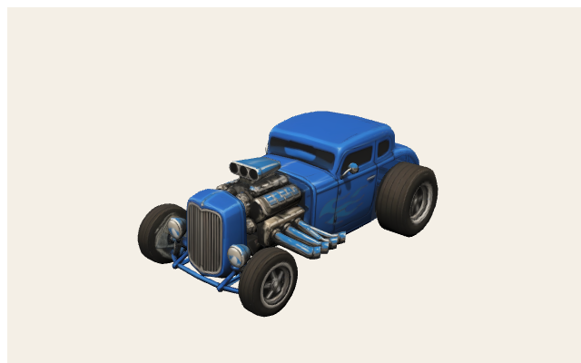
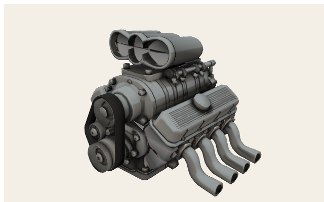
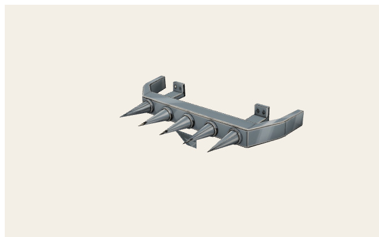
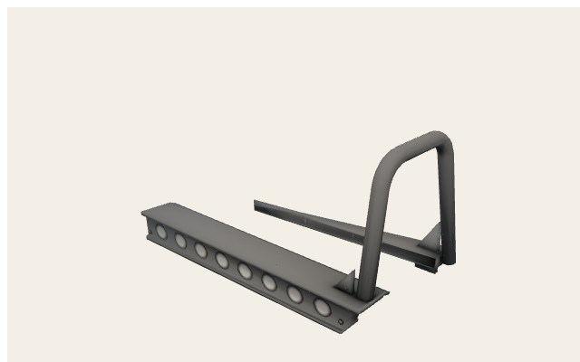
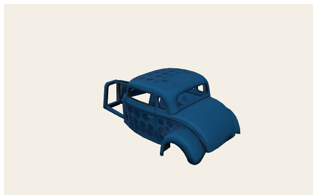
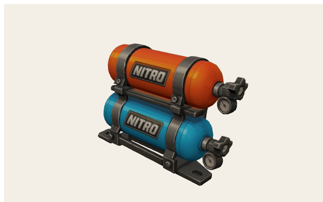
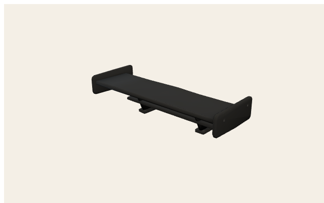

# Donnerbüchse — mesh cheat sheet

Use these **exact names** in commands (node / mesh / part id). Coordinates are **mesh space, meters**.

## Identity

| Field | Value |
| --- | --- |
| Car id | `donnerbuechse` |
| German name | Donnerbüchse |
| Class | Hot Rod |
| GLB | `public/models/cars/donnerbuechse.glb` |
| Runtime yaw | 0 rad — bake nose +Z (runtime yaw 0) |
| Collision radius | 1.15 m (silhouette, not mesh) |
| Default paint | `#339af0` |
| Root AABB | (-1.194, 0, -1.9) → (1.194, 1.554, 1.9) |

## Model

## Command names (runtime)

- Body / paint: `BodyPaint` (recolor target)
- Wheels in GLB: `StockWheel_FL` `StockWheel_FR` `StockWheel_RL` `StockWheel_RR`
- Wheel wrappers (added at load): `WheelSteer_{FL,FR,RL,RR}` + `WheelSpin_{FL,FR,RL,RR}`
- Stock extras if present: `StockSpoiler` (Blitz Heckspoiler), `StockCage` (Käferkraft, hidden when `reinforced_frame` on), `StockEngine`
- Equipped Teile group: `carParts` / objects `carPart-{partId}` (copy `carPart-{partId}-1`…)
- Große Räder: hide stock wheels + procedural overlays (not Blitz/Bison/Käferkraft)
- Cosmetics: stickers `none|flames|bolt|star` (flames GLB `public/models/stickers/flames.glb`)

## Coordinate grids (meters)

Orange boxes = mesh AABBs. Green dots = Teil **mount anchors** (`CAR_PART_LAYOUTS`). Red = X/u origin, blue = Z/v origin.

<svg xmlns="http://www.w3.org/2000/svg" width="760" height="520" viewBox="0 0 760 520">
<rect x="0" y="0" width="760" height="520" fill="#f4efe6"/>
<rect x="56" y="36" width="686" height="444" fill="#efe8dc" stroke="#1a1a1a" stroke-width="2"/>
<line x1="56.0" y1="36" x2="56.0" y2="480" stroke="#c4b8a4" stroke-width="1"/>
<line x1="98.9" y1="36" x2="98.9" y2="480" stroke="#ddd4c6" stroke-width="0.6"/>
<line x1="141.8" y1="36" x2="141.8" y2="480" stroke="#ddd4c6" stroke-width="0.6"/>
<line x1="184.6" y1="36" x2="184.6" y2="480" stroke="#ddd4c6" stroke-width="0.6"/>
<line x1="227.5" y1="36" x2="227.5" y2="480" stroke="#c4b8a4" stroke-width="1"/>
<line x1="270.4" y1="36" x2="270.4" y2="480" stroke="#ddd4c6" stroke-width="0.6"/>
<line x1="313.3" y1="36" x2="313.3" y2="480" stroke="#ddd4c6" stroke-width="0.6"/>
<line x1="356.1" y1="36" x2="356.1" y2="480" stroke="#ddd4c6" stroke-width="0.6"/>
<line x1="399.0" y1="36" x2="399.0" y2="480" stroke="#e03131" stroke-width="2"/>
<line x1="441.9" y1="36" x2="441.9" y2="480" stroke="#ddd4c6" stroke-width="0.6"/>
<line x1="484.8" y1="36" x2="484.8" y2="480" stroke="#ddd4c6" stroke-width="0.6"/>
<line x1="527.6" y1="36" x2="527.6" y2="480" stroke="#ddd4c6" stroke-width="0.6"/>
<line x1="570.5" y1="36" x2="570.5" y2="480" stroke="#c4b8a4" stroke-width="1"/>
<line x1="613.4" y1="36" x2="613.4" y2="480" stroke="#ddd4c6" stroke-width="0.6"/>
<line x1="656.3" y1="36" x2="656.3" y2="480" stroke="#ddd4c6" stroke-width="0.6"/>
<line x1="699.1" y1="36" x2="699.1" y2="480" stroke="#ddd4c6" stroke-width="0.6"/>
<line x1="742.0" y1="36" x2="742.0" y2="480" stroke="#c4b8a4" stroke-width="1"/>
<line x1="56" y1="480.0" x2="742" y2="480.0" stroke="#c4b8a4" stroke-width="1"/>
<line x1="56" y1="461.5" x2="742" y2="461.5" stroke="#ddd4c6" stroke-width="0.6"/>
<line x1="56" y1="443.0" x2="742" y2="443.0" stroke="#ddd4c6" stroke-width="0.6"/>
<line x1="56" y1="424.5" x2="742" y2="424.5" stroke="#ddd4c6" stroke-width="0.6"/>
<line x1="56" y1="406.0" x2="742" y2="406.0" stroke="#c4b8a4" stroke-width="1"/>
<line x1="56" y1="387.5" x2="742" y2="387.5" stroke="#ddd4c6" stroke-width="0.6"/>
<line x1="56" y1="369.0" x2="742" y2="369.0" stroke="#ddd4c6" stroke-width="0.6"/>
<line x1="56" y1="350.5" x2="742" y2="350.5" stroke="#ddd4c6" stroke-width="0.6"/>
<line x1="56" y1="332.0" x2="742" y2="332.0" stroke="#c4b8a4" stroke-width="1"/>
<line x1="56" y1="313.5" x2="742" y2="313.5" stroke="#ddd4c6" stroke-width="0.6"/>
<line x1="56" y1="295.0" x2="742" y2="295.0" stroke="#ddd4c6" stroke-width="0.6"/>
<line x1="56" y1="276.5" x2="742" y2="276.5" stroke="#ddd4c6" stroke-width="0.6"/>
<line x1="56" y1="258.0" x2="742" y2="258.0" stroke="#339af0" stroke-width="2"/>
<line x1="56" y1="239.5" x2="742" y2="239.5" stroke="#ddd4c6" stroke-width="0.6"/>
<line x1="56" y1="221.0" x2="742" y2="221.0" stroke="#ddd4c6" stroke-width="0.6"/>
<line x1="56" y1="202.5" x2="742" y2="202.5" stroke="#ddd4c6" stroke-width="0.6"/>
<line x1="56" y1="184.0" x2="742" y2="184.0" stroke="#c4b8a4" stroke-width="1"/>
<line x1="56" y1="165.5" x2="742" y2="165.5" stroke="#ddd4c6" stroke-width="0.6"/>
<line x1="56" y1="147.0" x2="742" y2="147.0" stroke="#ddd4c6" stroke-width="0.6"/>
<line x1="56" y1="128.5" x2="742" y2="128.5" stroke="#ddd4c6" stroke-width="0.6"/>
<line x1="56" y1="110.0" x2="742" y2="110.0" stroke="#c4b8a4" stroke-width="1"/>
<line x1="56" y1="91.5" x2="742" y2="91.5" stroke="#ddd4c6" stroke-width="0.6"/>
<line x1="56" y1="73.0" x2="742" y2="73.0" stroke="#ddd4c6" stroke-width="0.6"/>
<line x1="56" y1="54.5" x2="742" y2="54.5" stroke="#ddd4c6" stroke-width="0.6"/>
<line x1="56" y1="36.0" x2="742" y2="36.0" stroke="#c4b8a4" stroke-width="1"/>
<text x="56.0" y="496" text-anchor="middle" font-size="11" font-family="ui-monospace,monospace" fill="#1a1a1a">-2</text>
<text x="227.5" y="496" text-anchor="middle" font-size="11" font-family="ui-monospace,monospace" fill="#1a1a1a">-1</text>
<text x="399.0" y="496" text-anchor="middle" font-size="11" font-family="ui-monospace,monospace" fill="#1a1a1a">0</text>
<text x="570.5" y="496" text-anchor="middle" font-size="11" font-family="ui-monospace,monospace" fill="#1a1a1a">1</text>
<text x="742.0" y="496" text-anchor="middle" font-size="11" font-family="ui-monospace,monospace" fill="#1a1a1a">2</text>
<text x="48" y="484.0" text-anchor="end" font-size="11" font-family="ui-monospace,monospace" fill="#1a1a1a">-3</text>
<text x="48" y="410.0" text-anchor="end" font-size="11" font-family="ui-monospace,monospace" fill="#1a1a1a">-2</text>
<text x="48" y="336.0" text-anchor="end" font-size="11" font-family="ui-monospace,monospace" fill="#1a1a1a">-1</text>
<text x="48" y="262.0" text-anchor="end" font-size="11" font-family="ui-monospace,monospace" fill="#1a1a1a">0</text>
<text x="48" y="188.0" text-anchor="end" font-size="11" font-family="ui-monospace,monospace" fill="#1a1a1a">1</text>
<text x="48" y="114.0" text-anchor="end" font-size="11" font-family="ui-monospace,monospace" fill="#1a1a1a">2</text>
<text x="48" y="40.0" text-anchor="end" font-size="11" font-family="ui-monospace,monospace" fill="#1a1a1a">3</text>
<rect x="222.4" y="122.4" width="353.3" height="276.2" fill="#f08c0033" stroke="#f08c00" stroke-width="1.6"/>
<text x="399.0" y="260.5" text-anchor="middle" font-size="10" font-family="ui-sans-serif,sans-serif" font-weight="700" fill="#1a1a1a">BodyPaint</text>
<rect x="524.6" y="117.4" width="51.0" height="56.7" fill="#f08c0033" stroke="#f08c00" stroke-width="1.6"/>
<text x="550.1" y="145.7" text-anchor="middle" font-size="10" font-family="ui-sans-serif,sans-serif" font-weight="700" fill="#1a1a1a">StockWheel_FR</text>
<rect x="222.4" y="117.4" width="51.0" height="56.7" fill="#f08c0033" stroke="#f08c00" stroke-width="1.6"/>
<text x="247.9" y="145.7" text-anchor="middle" font-size="10" font-family="ui-sans-serif,sans-serif" font-weight="700" fill="#1a1a1a">StockWheel_FL</text>
<rect x="194.3" y="311.7" width="82.9" height="73.7" fill="#f08c0033" stroke="#f08c00" stroke-width="1.6"/>
<text x="235.8" y="348.5" text-anchor="middle" font-size="10" font-family="ui-sans-serif,sans-serif" font-weight="700" fill="#1a1a1a">StockWheel_RL</text>
<rect x="520.8" y="311.7" width="82.9" height="73.7" fill="#f08c0033" stroke="#f08c00" stroke-width="1.6"/>
<text x="562.2" y="348.5" text-anchor="middle" font-size="10" font-family="ui-sans-serif,sans-serif" font-weight="700" fill="#1a1a1a">StockWheel_RR</text>
<circle cx="399.0" cy="152.9" r="4.5" fill="#12b886" stroke="#1a1a1a" stroke-width="1.2"/>
<text x="406.0" y="146.9" font-size="10" font-family="ui-sans-serif,sans-serif" font-weight="700" fill="#1a1a1a">big_engine</text>
<circle cx="399.0" cy="123.3" r="4.5" fill="#12b886" stroke="#1a1a1a" stroke-width="1.2"/>
<text x="406.0" y="117.3" font-size="10" font-family="ui-sans-serif,sans-serif" font-weight="700" fill="#1a1a1a">spike_bumper</text>
<circle cx="399.0" cy="354.2" r="4.5" fill="#12b886" stroke="#1a1a1a" stroke-width="1.2"/>
<text x="406.0" y="348.2" font-size="10" font-family="ui-sans-serif,sans-serif" font-weight="700" fill="#1a1a1a">reinforced_frame</text>
<circle cx="399.0" cy="272.8" r="4.5" fill="#12b886" stroke="#1a1a1a" stroke-width="1.2"/>
<text x="406.0" y="266.8" font-size="10" font-family="ui-sans-serif,sans-serif" font-weight="700" fill="#1a1a1a">lightweight_body</text>
<circle cx="227.5" cy="308.3" r="4.5" fill="#12b886" stroke="#1a1a1a" stroke-width="1.2"/>
<text x="234.5" y="302.3" font-size="10" font-family="ui-sans-serif,sans-serif" font-weight="700" fill="#1a1a1a">nitro_kit</text>
<circle cx="399.0" cy="363.1" r="4.5" fill="#12b886" stroke="#1a1a1a" stroke-width="1.2"/>
<text x="406.0" y="357.1" font-size="10" font-family="ui-sans-serif,sans-serif" font-weight="700" fill="#1a1a1a">rear_spoiler</text>
<circle cx="553.3" cy="165.5" r="4.5" fill="#12b886" stroke="#1a1a1a" stroke-width="1.2"/>
<text x="560.3" y="159.5" font-size="10" font-family="ui-sans-serif,sans-serif" font-weight="700" fill="#1a1a1a">better_brakes[0]</text>
<circle cx="244.7" cy="165.5" r="4.5" fill="#12b886" stroke="#1a1a1a" stroke-width="1.2"/>
<text x="251.7" y="159.5" font-size="10" font-family="ui-sans-serif,sans-serif" font-weight="700" fill="#1a1a1a">better_brakes[1]</text>
<circle cx="570.5" cy="339.4" r="4.5" fill="#12b886" stroke="#1a1a1a" stroke-width="1.2"/>
<text x="577.5" y="333.4" font-size="10" font-family="ui-sans-serif,sans-serif" font-weight="700" fill="#1a1a1a">better_brakes[2]</text>
<circle cx="227.5" cy="339.4" r="4.5" fill="#12b886" stroke="#1a1a1a" stroke-width="1.2"/>
<text x="234.5" y="333.4" font-size="10" font-family="ui-sans-serif,sans-serif" font-weight="700" fill="#1a1a1a">better_brakes[3]</text>
<text x="380" y="22" text-anchor="middle" font-size="14" font-family="ui-sans-serif,sans-serif" font-weight="800" fill="#1a1a1a">Donnerbüchse — top (mesh XZ)</text>
<text x="380" y="512" text-anchor="middle" font-size="11" font-family="ui-sans-serif,sans-serif" fill="#5c564c">+X → right · +Z → up · origin = red (+X) / blue (+Z) · meters</text>
</svg>

<svg xmlns="http://www.w3.org/2000/svg" width="760" height="520" viewBox="0 0 760 520">
<rect x="0" y="0" width="760" height="520" fill="#f4efe6"/>
<rect x="56" y="36" width="686" height="444" fill="#efe8dc" stroke="#1a1a1a" stroke-width="2"/>
<line x1="56.0" y1="36" x2="56.0" y2="480" stroke="#c4b8a4" stroke-width="1"/>
<line x1="84.6" y1="36" x2="84.6" y2="480" stroke="#ddd4c6" stroke-width="0.6"/>
<line x1="113.2" y1="36" x2="113.2" y2="480" stroke="#ddd4c6" stroke-width="0.6"/>
<line x1="141.8" y1="36" x2="141.8" y2="480" stroke="#ddd4c6" stroke-width="0.6"/>
<line x1="170.3" y1="36" x2="170.3" y2="480" stroke="#c4b8a4" stroke-width="1"/>
<line x1="198.9" y1="36" x2="198.9" y2="480" stroke="#ddd4c6" stroke-width="0.6"/>
<line x1="227.5" y1="36" x2="227.5" y2="480" stroke="#ddd4c6" stroke-width="0.6"/>
<line x1="256.1" y1="36" x2="256.1" y2="480" stroke="#ddd4c6" stroke-width="0.6"/>
<line x1="284.7" y1="36" x2="284.7" y2="480" stroke="#c4b8a4" stroke-width="1"/>
<line x1="313.3" y1="36" x2="313.3" y2="480" stroke="#ddd4c6" stroke-width="0.6"/>
<line x1="341.8" y1="36" x2="341.8" y2="480" stroke="#ddd4c6" stroke-width="0.6"/>
<line x1="370.4" y1="36" x2="370.4" y2="480" stroke="#ddd4c6" stroke-width="0.6"/>
<line x1="399.0" y1="36" x2="399.0" y2="480" stroke="#e03131" stroke-width="2"/>
<line x1="427.6" y1="36" x2="427.6" y2="480" stroke="#ddd4c6" stroke-width="0.6"/>
<line x1="456.2" y1="36" x2="456.2" y2="480" stroke="#ddd4c6" stroke-width="0.6"/>
<line x1="484.8" y1="36" x2="484.8" y2="480" stroke="#ddd4c6" stroke-width="0.6"/>
<line x1="513.3" y1="36" x2="513.3" y2="480" stroke="#c4b8a4" stroke-width="1"/>
<line x1="541.9" y1="36" x2="541.9" y2="480" stroke="#ddd4c6" stroke-width="0.6"/>
<line x1="570.5" y1="36" x2="570.5" y2="480" stroke="#ddd4c6" stroke-width="0.6"/>
<line x1="599.1" y1="36" x2="599.1" y2="480" stroke="#ddd4c6" stroke-width="0.6"/>
<line x1="627.7" y1="36" x2="627.7" y2="480" stroke="#c4b8a4" stroke-width="1"/>
<line x1="656.3" y1="36" x2="656.3" y2="480" stroke="#ddd4c6" stroke-width="0.6"/>
<line x1="684.8" y1="36" x2="684.8" y2="480" stroke="#ddd4c6" stroke-width="0.6"/>
<line x1="713.4" y1="36" x2="713.4" y2="480" stroke="#ddd4c6" stroke-width="0.6"/>
<line x1="742.0" y1="36" x2="742.0" y2="480" stroke="#c4b8a4" stroke-width="1"/>
<line x1="56" y1="480.0" x2="742" y2="480.0" stroke="#c4b8a4" stroke-width="1"/>
<line x1="56" y1="452.3" x2="742" y2="452.3" stroke="#ddd4c6" stroke-width="0.6"/>
<line x1="56" y1="424.5" x2="742" y2="424.5" stroke="#ddd4c6" stroke-width="0.6"/>
<line x1="56" y1="396.8" x2="742" y2="396.8" stroke="#ddd4c6" stroke-width="0.6"/>
<line x1="56" y1="369.0" x2="742" y2="369.0" stroke="#339af0" stroke-width="2"/>
<line x1="56" y1="341.3" x2="742" y2="341.3" stroke="#ddd4c6" stroke-width="0.6"/>
<line x1="56" y1="313.5" x2="742" y2="313.5" stroke="#ddd4c6" stroke-width="0.6"/>
<line x1="56" y1="285.8" x2="742" y2="285.8" stroke="#ddd4c6" stroke-width="0.6"/>
<line x1="56" y1="258.0" x2="742" y2="258.0" stroke="#c4b8a4" stroke-width="1"/>
<line x1="56" y1="230.3" x2="742" y2="230.3" stroke="#ddd4c6" stroke-width="0.6"/>
<line x1="56" y1="202.5" x2="742" y2="202.5" stroke="#ddd4c6" stroke-width="0.6"/>
<line x1="56" y1="174.8" x2="742" y2="174.8" stroke="#ddd4c6" stroke-width="0.6"/>
<line x1="56" y1="147.0" x2="742" y2="147.0" stroke="#c4b8a4" stroke-width="1"/>
<line x1="56" y1="119.3" x2="742" y2="119.3" stroke="#ddd4c6" stroke-width="0.6"/>
<line x1="56" y1="91.5" x2="742" y2="91.5" stroke="#ddd4c6" stroke-width="0.6"/>
<line x1="56" y1="63.8" x2="742" y2="63.8" stroke="#ddd4c6" stroke-width="0.6"/>
<line x1="56" y1="36.0" x2="742" y2="36.0" stroke="#c4b8a4" stroke-width="1"/>
<text x="56.0" y="496" text-anchor="middle" font-size="11" font-family="ui-monospace,monospace" fill="#1a1a1a">-3</text>
<text x="170.3" y="496" text-anchor="middle" font-size="11" font-family="ui-monospace,monospace" fill="#1a1a1a">-2</text>
<text x="284.7" y="496" text-anchor="middle" font-size="11" font-family="ui-monospace,monospace" fill="#1a1a1a">-1</text>
<text x="399.0" y="496" text-anchor="middle" font-size="11" font-family="ui-monospace,monospace" fill="#1a1a1a">0</text>
<text x="513.3" y="496" text-anchor="middle" font-size="11" font-family="ui-monospace,monospace" fill="#1a1a1a">1</text>
<text x="627.7" y="496" text-anchor="middle" font-size="11" font-family="ui-monospace,monospace" fill="#1a1a1a">2</text>
<text x="742.0" y="496" text-anchor="middle" font-size="11" font-family="ui-monospace,monospace" fill="#1a1a1a">3</text>
<text x="48" y="484.0" text-anchor="end" font-size="11" font-family="ui-monospace,monospace" fill="#1a1a1a">-1</text>
<text x="48" y="373.0" text-anchor="end" font-size="11" font-family="ui-monospace,monospace" fill="#1a1a1a">0</text>
<text x="48" y="262.0" text-anchor="end" font-size="11" font-family="ui-monospace,monospace" fill="#1a1a1a">1</text>
<text x="48" y="151.0" text-anchor="end" font-size="11" font-family="ui-monospace,monospace" fill="#1a1a1a">2</text>
<text x="48" y="40.0" text-anchor="end" font-size="11" font-family="ui-monospace,monospace" fill="#1a1a1a">3</text>
<rect x="181.8" y="196.5" width="426.8" height="158.5" fill="#f08c0033" stroke="#f08c00" stroke-width="1.6"/>
<text x="395.2" y="275.7" text-anchor="middle" font-size="10" font-family="ui-sans-serif,sans-serif" font-weight="700" fill="#1a1a1a">BodyPaint</text>
<rect x="528.7" y="284.0" width="87.6" height="85.0" fill="#f08c0033" stroke="#f08c00" stroke-width="1.6"/>
<text x="572.4" y="326.5" text-anchor="middle" font-size="10" font-family="ui-sans-serif,sans-serif" font-weight="700" fill="#1a1a1a">StockWheel_FR</text>
<rect x="528.7" y="284.0" width="87.6" height="85.0" fill="#f08c0033" stroke="#f08c00" stroke-width="1.6"/>
<text x="572.4" y="326.5" text-anchor="middle" font-size="10" font-family="ui-sans-serif,sans-serif" font-weight="700" fill="#1a1a1a">StockWheel_FL</text>
<rect x="202.2" y="257.6" width="113.9" height="111.4" fill="#f08c0033" stroke="#f08c00" stroke-width="1.6"/>
<text x="259.1" y="313.3" text-anchor="middle" font-size="10" font-family="ui-sans-serif,sans-serif" font-weight="700" fill="#1a1a1a">StockWheel_RL</text>
<rect x="202.2" y="257.6" width="113.9" height="111.4" fill="#f08c0033" stroke="#f08c00" stroke-width="1.6"/>
<text x="259.1" y="313.3" text-anchor="middle" font-size="10" font-family="ui-sans-serif,sans-serif" font-weight="700" fill="#1a1a1a">StockWheel_RR</text>
<circle cx="561.4" cy="351.2" r="4.5" fill="#12b886" stroke="#1a1a1a" stroke-width="1.2"/>
<text x="568.4" y="345.2" font-size="10" font-family="ui-sans-serif,sans-serif" font-weight="700" fill="#1a1a1a">big_engine</text>
<circle cx="607.1" cy="362.3" r="4.5" fill="#12b886" stroke="#1a1a1a" stroke-width="1.2"/>
<text x="614.1" y="356.3" font-size="10" font-family="ui-sans-serif,sans-serif" font-weight="700" fill="#1a1a1a">spike_bumper</text>
<circle cx="250.4" cy="352.4" r="4.5" fill="#12b886" stroke="#1a1a1a" stroke-width="1.2"/>
<text x="257.4" y="346.4" font-size="10" font-family="ui-sans-serif,sans-serif" font-weight="700" fill="#1a1a1a">reinforced_frame</text>
<circle cx="376.1" cy="369.0" r="4.5" fill="#12b886" stroke="#1a1a1a" stroke-width="1.2"/>
<text x="383.1" y="363.0" font-size="10" font-family="ui-sans-serif,sans-serif" font-weight="700" fill="#1a1a1a">lightweight_body</text>
<circle cx="321.3" cy="271.3" r="4.5" fill="#12b886" stroke="#1a1a1a" stroke-width="1.2"/>
<text x="328.3" y="265.3" font-size="10" font-family="ui-sans-serif,sans-serif" font-weight="700" fill="#1a1a1a">nitro_kit</text>
<circle cx="236.6" cy="258.0" r="4.5" fill="#12b886" stroke="#1a1a1a" stroke-width="1.2"/>
<text x="243.6" y="252.0" font-size="10" font-family="ui-sans-serif,sans-serif" font-weight="700" fill="#1a1a1a">rear_spoiler</text>
<circle cx="541.9" cy="326.8" r="4.5" fill="#12b886" stroke="#1a1a1a" stroke-width="1.2"/>
<text x="548.9" y="320.8" font-size="10" font-family="ui-sans-serif,sans-serif" font-weight="700" fill="#1a1a1a">better_brakes[0]</text>
<circle cx="541.9" cy="326.8" r="4.5" fill="#12b886" stroke="#1a1a1a" stroke-width="1.2"/>
<text x="548.9" y="320.8" font-size="10" font-family="ui-sans-serif,sans-serif" font-weight="700" fill="#1a1a1a">better_brakes[1]</text>
<circle cx="273.2" cy="315.7" r="4.5" fill="#12b886" stroke="#1a1a1a" stroke-width="1.2"/>
<text x="280.2" y="309.7" font-size="10" font-family="ui-sans-serif,sans-serif" font-weight="700" fill="#1a1a1a">better_brakes[2]</text>
<circle cx="273.2" cy="315.7" r="4.5" fill="#12b886" stroke="#1a1a1a" stroke-width="1.2"/>
<text x="280.2" y="309.7" font-size="10" font-family="ui-sans-serif,sans-serif" font-weight="700" fill="#1a1a1a">better_brakes[3]</text>
<text x="380" y="22" text-anchor="middle" font-size="14" font-family="ui-sans-serif,sans-serif" font-weight="800" fill="#1a1a1a">Donnerbüchse — side</text>
<text x="380" y="512" text-anchor="middle" font-size="11" font-family="ui-sans-serif,sans-serif" fill="#5c564c">+Z length (nose +Z) → right · +Y up → up · origin = red (+Z length (nose +Z)) / blue (+Y up) · meters</text>
</svg>

## Nodes / meshes

| Node | Mesh | Prims | Verts | Center xyz | AABB min → max | Materials |
| --- | --- | --- | --- | --- | --- | --- |
| `BodyPaint` | `BodyPaint` | 2 | 4586 | (0, 0.84, -0.033) | (-1.03, 0.126, -1.9) → (1.03, 1.554, 1.833) | BodyPaint |
| `StockWheel_FR` | `StockWheel_FR` | 1 | 397 | (0.881, 0.383, 1.517) | (0.732, 0, 1.134) → (1.03, 0.766, 1.9) | Tire |
| `StockWheel_FL` | `StockWheel_FL` | 1 | 392 | (-0.881, 0.383, 1.517) | (-1.03, 0, 1.134) → (-0.732, 0.766, 1.9) | Tire |
| `StockWheel_RL` | `StockWheel_RL` | 1 | 304 | (-0.952, 0.502, -1.223) | (-1.194, 0, -1.722) → (-0.71, 1.004, -0.725) | Tire |
| `StockWheel_RR` | `StockWheel_RR` | 1 | 294 | (0.952, 0.502, -1.223) | (0.71, 0, -1.722) → (1.194, 1.004, -0.725) | Tire |

## Materials

- `BodyPaint`
- `Tire`

## Shop Teile + mounts

| Part id | German | Shop | GLB | Mount xyz (yaw, scale) |
| --- | --- | --- | --- | --- |
| `big_engine` | Großer Motor | yes | `public/models/parts/donnerbuechse-big_engine.glb` | (0, 0.16, 1.42) yaw 0° ×3.15 |
| `big_wheels` | Große Räder | yes | procedural / missing | — |
| `spike_bumper` | Spike-Stoßstange | yes | `public/models/parts/donnerbuechse-spike_bumper.glb` | (0, 0.06, 1.82) yaw 0° ×0.98 |
| `better_brakes` | Bessere Bremsen | yes | procedural / missing | (0.9, 0.38, 1.25) yaw 0° ×0.95 (-0.9, 0.38, 1.25) yaw 180° ×0.95 (1, 0.48, -1.1) yaw 0° ×1.1 (-1, 0.48, -1.1) yaw 180° ×1.1 |
| `reinforced_frame` | Verstärkter Rahmen | yes | `public/models/parts/donnerbuechse-reinforced_frame.glb` | (0, 0.15, -1.3) yaw -90° ×1.1 |
| `lightweight_body` | Leichtbau-Karosserie | yes | `public/models/parts/donnerbuechse-lightweight_body.glb` | (0, 0, -0.2) yaw 90° ×1.5 |
| `nitro_kit` | Nitro-Kit | yes | `public/models/parts/donnerbuechse-nitro_kit.glb` | (-1, 0.88, -0.68) yaw -90° ×0.95 |
| `offroad_suspension` | Gelände-Federung | yes | procedural / missing | — |
| `rear_spoiler` | Heckspoiler | yes | `public/models/parts/donnerbuechse-rear_spoiler.glb` | (0, 1, -1.42) yaw 180° ×1.15 |

## Part / extra `public/models/parts/donnerbuechse-big_engine.glb`

Root AABB (-0.302, 0, -0.295) → (0.302, 0.55, 0.295)

<svg xmlns="http://www.w3.org/2000/svg" width="760" height="520" viewBox="0 0 760 520">
<rect x="0" y="0" width="760" height="520" fill="#f4efe6"/>
<rect x="56" y="36" width="686" height="444" fill="#efe8dc" stroke="#1a1a1a" stroke-width="2"/>
<line x1="56.0" y1="36" x2="56.0" y2="480" stroke="#c4b8a4" stroke-width="1"/>
<line x1="141.8" y1="36" x2="141.8" y2="480" stroke="#ddd4c6" stroke-width="0.6"/>
<line x1="227.5" y1="36" x2="227.5" y2="480" stroke="#ddd4c6" stroke-width="0.6"/>
<line x1="313.3" y1="36" x2="313.3" y2="480" stroke="#ddd4c6" stroke-width="0.6"/>
<line x1="399.0" y1="36" x2="399.0" y2="480" stroke="#e03131" stroke-width="2"/>
<line x1="484.8" y1="36" x2="484.8" y2="480" stroke="#ddd4c6" stroke-width="0.6"/>
<line x1="570.5" y1="36" x2="570.5" y2="480" stroke="#ddd4c6" stroke-width="0.6"/>
<line x1="656.3" y1="36" x2="656.3" y2="480" stroke="#ddd4c6" stroke-width="0.6"/>
<line x1="742.0" y1="36" x2="742.0" y2="480" stroke="#c4b8a4" stroke-width="1"/>
<line x1="56" y1="480.0" x2="742" y2="480.0" stroke="#c4b8a4" stroke-width="1"/>
<line x1="56" y1="424.5" x2="742" y2="424.5" stroke="#ddd4c6" stroke-width="0.6"/>
<line x1="56" y1="369.0" x2="742" y2="369.0" stroke="#ddd4c6" stroke-width="0.6"/>
<line x1="56" y1="313.5" x2="742" y2="313.5" stroke="#ddd4c6" stroke-width="0.6"/>
<line x1="56" y1="258.0" x2="742" y2="258.0" stroke="#339af0" stroke-width="2"/>
<line x1="56" y1="202.5" x2="742" y2="202.5" stroke="#ddd4c6" stroke-width="0.6"/>
<line x1="56" y1="147.0" x2="742" y2="147.0" stroke="#ddd4c6" stroke-width="0.6"/>
<line x1="56" y1="91.5" x2="742" y2="91.5" stroke="#ddd4c6" stroke-width="0.6"/>
<line x1="56" y1="36.0" x2="742" y2="36.0" stroke="#c4b8a4" stroke-width="1"/>
<text x="56.0" y="496" text-anchor="middle" font-size="11" font-family="ui-monospace,monospace" fill="#1a1a1a">-1</text>
<text x="399.0" y="496" text-anchor="middle" font-size="11" font-family="ui-monospace,monospace" fill="#1a1a1a">0</text>
<text x="742.0" y="496" text-anchor="middle" font-size="11" font-family="ui-monospace,monospace" fill="#1a1a1a">1</text>
<text x="48" y="484.0" text-anchor="end" font-size="11" font-family="ui-monospace,monospace" fill="#1a1a1a">-1</text>
<text x="48" y="262.0" text-anchor="end" font-size="11" font-family="ui-monospace,monospace" fill="#1a1a1a">0</text>
<text x="48" y="40.0" text-anchor="end" font-size="11" font-family="ui-monospace,monospace" fill="#1a1a1a">1</text>
<rect x="295.3" y="192.5" width="207.3" height="131.0" fill="#f08c0033" stroke="#f08c00" stroke-width="1.6"/>
<text x="399.0" y="258.0" text-anchor="middle" font-size="10" font-family="ui-sans-serif,sans-serif" font-weight="700" fill="#1a1a1a">tripo_node_dbb7af69-4d88-4a22-b73a-385d226bbfa6</text>
<text x="380" y="22" text-anchor="middle" font-size="14" font-family="ui-sans-serif,sans-serif" font-weight="800" fill="#1a1a1a">public/models/parts/donnerbuechse-big_engine.glb — top XZ</text>
<text x="380" y="512" text-anchor="middle" font-size="11" font-family="ui-sans-serif,sans-serif" fill="#5c564c">+X → right · +Z → up · origin = red (+X) / blue (+Z) · meters</text>
</svg>

| Node | Mesh | Prims | Verts | Center xyz | AABB min → max | Materials |
| --- | --- | --- | --- | --- | --- | --- |
| `tripo_node_dbb7af69-4d88-4a22-b73a-385d226bbfa6` | `tripo_mesh_dbb7af69-4d88-4a22-b73a-385d226bbfa6` | 1 | 6243 | (0, 0.275, 0) | (-0.302, 0, -0.295) → (0.302, 0.55, 0.295) | Chrome |

## Part / extra `public/models/parts/donnerbuechse-spike_bumper.glb`

Root AABB (-0.775, 0, -0.405) → (0.775, 0.391, 0.405)

<svg xmlns="http://www.w3.org/2000/svg" width="760" height="520" viewBox="0 0 760 520">
<rect x="0" y="0" width="760" height="520" fill="#f4efe6"/>
<rect x="56" y="36" width="686" height="444" fill="#efe8dc" stroke="#1a1a1a" stroke-width="2"/>
<line x1="56.0" y1="36" x2="56.0" y2="480" stroke="#c4b8a4" stroke-width="1"/>
<line x1="98.9" y1="36" x2="98.9" y2="480" stroke="#ddd4c6" stroke-width="0.6"/>
<line x1="141.8" y1="36" x2="141.8" y2="480" stroke="#ddd4c6" stroke-width="0.6"/>
<line x1="184.6" y1="36" x2="184.6" y2="480" stroke="#ddd4c6" stroke-width="0.6"/>
<line x1="227.5" y1="36" x2="227.5" y2="480" stroke="#c4b8a4" stroke-width="1"/>
<line x1="270.4" y1="36" x2="270.4" y2="480" stroke="#ddd4c6" stroke-width="0.6"/>
<line x1="313.3" y1="36" x2="313.3" y2="480" stroke="#ddd4c6" stroke-width="0.6"/>
<line x1="356.1" y1="36" x2="356.1" y2="480" stroke="#ddd4c6" stroke-width="0.6"/>
<line x1="399.0" y1="36" x2="399.0" y2="480" stroke="#e03131" stroke-width="2"/>
<line x1="441.9" y1="36" x2="441.9" y2="480" stroke="#ddd4c6" stroke-width="0.6"/>
<line x1="484.8" y1="36" x2="484.8" y2="480" stroke="#ddd4c6" stroke-width="0.6"/>
<line x1="527.6" y1="36" x2="527.6" y2="480" stroke="#ddd4c6" stroke-width="0.6"/>
<line x1="570.5" y1="36" x2="570.5" y2="480" stroke="#c4b8a4" stroke-width="1"/>
<line x1="613.4" y1="36" x2="613.4" y2="480" stroke="#ddd4c6" stroke-width="0.6"/>
<line x1="656.3" y1="36" x2="656.3" y2="480" stroke="#ddd4c6" stroke-width="0.6"/>
<line x1="699.1" y1="36" x2="699.1" y2="480" stroke="#ddd4c6" stroke-width="0.6"/>
<line x1="742.0" y1="36" x2="742.0" y2="480" stroke="#c4b8a4" stroke-width="1"/>
<line x1="56" y1="480.0" x2="742" y2="480.0" stroke="#c4b8a4" stroke-width="1"/>
<line x1="56" y1="452.3" x2="742" y2="452.3" stroke="#ddd4c6" stroke-width="0.6"/>
<line x1="56" y1="424.5" x2="742" y2="424.5" stroke="#ddd4c6" stroke-width="0.6"/>
<line x1="56" y1="396.8" x2="742" y2="396.8" stroke="#ddd4c6" stroke-width="0.6"/>
<line x1="56" y1="369.0" x2="742" y2="369.0" stroke="#c4b8a4" stroke-width="1"/>
<line x1="56" y1="341.3" x2="742" y2="341.3" stroke="#ddd4c6" stroke-width="0.6"/>
<line x1="56" y1="313.5" x2="742" y2="313.5" stroke="#ddd4c6" stroke-width="0.6"/>
<line x1="56" y1="285.8" x2="742" y2="285.8" stroke="#ddd4c6" stroke-width="0.6"/>
<line x1="56" y1="258.0" x2="742" y2="258.0" stroke="#339af0" stroke-width="2"/>
<line x1="56" y1="230.3" x2="742" y2="230.3" stroke="#ddd4c6" stroke-width="0.6"/>
<line x1="56" y1="202.5" x2="742" y2="202.5" stroke="#ddd4c6" stroke-width="0.6"/>
<line x1="56" y1="174.8" x2="742" y2="174.8" stroke="#ddd4c6" stroke-width="0.6"/>
<line x1="56" y1="147.0" x2="742" y2="147.0" stroke="#c4b8a4" stroke-width="1"/>
<line x1="56" y1="119.3" x2="742" y2="119.3" stroke="#ddd4c6" stroke-width="0.6"/>
<line x1="56" y1="91.5" x2="742" y2="91.5" stroke="#ddd4c6" stroke-width="0.6"/>
<line x1="56" y1="63.8" x2="742" y2="63.8" stroke="#ddd4c6" stroke-width="0.6"/>
<line x1="56" y1="36.0" x2="742" y2="36.0" stroke="#c4b8a4" stroke-width="1"/>
<text x="56.0" y="496" text-anchor="middle" font-size="11" font-family="ui-monospace,monospace" fill="#1a1a1a">-2</text>
<text x="227.5" y="496" text-anchor="middle" font-size="11" font-family="ui-monospace,monospace" fill="#1a1a1a">-1</text>
<text x="399.0" y="496" text-anchor="middle" font-size="11" font-family="ui-monospace,monospace" fill="#1a1a1a">0</text>
<text x="570.5" y="496" text-anchor="middle" font-size="11" font-family="ui-monospace,monospace" fill="#1a1a1a">1</text>
<text x="742.0" y="496" text-anchor="middle" font-size="11" font-family="ui-monospace,monospace" fill="#1a1a1a">2</text>
<text x="48" y="484.0" text-anchor="end" font-size="11" font-family="ui-monospace,monospace" fill="#1a1a1a">-2</text>
<text x="48" y="373.0" text-anchor="end" font-size="11" font-family="ui-monospace,monospace" fill="#1a1a1a">-1</text>
<text x="48" y="262.0" text-anchor="end" font-size="11" font-family="ui-monospace,monospace" fill="#1a1a1a">0</text>
<text x="48" y="151.0" text-anchor="end" font-size="11" font-family="ui-monospace,monospace" fill="#1a1a1a">1</text>
<text x="48" y="40.0" text-anchor="end" font-size="11" font-family="ui-monospace,monospace" fill="#1a1a1a">2</text>
<rect x="266.1" y="213.1" width="265.8" height="89.9" fill="#f08c0033" stroke="#f08c00" stroke-width="1.6"/>
<text x="399.0" y="258.0" text-anchor="middle" font-size="10" font-family="ui-sans-serif,sans-serif" font-weight="700" fill="#1a1a1a">tripo_node_c3f713e0-88b3-44e8-a2df-efca9563edde</text>
<text x="380" y="22" text-anchor="middle" font-size="14" font-family="ui-sans-serif,sans-serif" font-weight="800" fill="#1a1a1a">public/models/parts/donnerbuechse-spike_bumper.glb — top XZ</text>
<text x="380" y="512" text-anchor="middle" font-size="11" font-family="ui-sans-serif,sans-serif" fill="#5c564c">+X → right · +Z → up · origin = red (+X) / blue (+Z) · meters</text>
</svg>

| Node | Mesh | Prims | Verts | Center xyz | AABB min → max | Materials |
| --- | --- | --- | --- | --- | --- | --- |
| `tripo_node_c3f713e0-88b3-44e8-a2df-efca9563edde` | `tripo_mesh_c3f713e0-88b3-44e8-a2df-efca9563edde` | 1 | 5775 | (0, 0.196, 0) | (-0.775, 0, -0.405) → (0.775, 0.391, 0.405) | Spike |

## Part / extra `public/models/parts/donnerbuechse-reinforced_frame.glb`

Root AABB (-0.916, 0, -0.575) → (0.916, 1.05, 0.575)

<svg xmlns="http://www.w3.org/2000/svg" width="760" height="520" viewBox="0 0 760 520">
<rect x="0" y="0" width="760" height="520" fill="#f4efe6"/>
<rect x="56" y="36" width="686" height="444" fill="#efe8dc" stroke="#1a1a1a" stroke-width="2"/>
<line x1="56.0" y1="36" x2="56.0" y2="480" stroke="#c4b8a4" stroke-width="1"/>
<line x1="98.9" y1="36" x2="98.9" y2="480" stroke="#ddd4c6" stroke-width="0.6"/>
<line x1="141.8" y1="36" x2="141.8" y2="480" stroke="#ddd4c6" stroke-width="0.6"/>
<line x1="184.6" y1="36" x2="184.6" y2="480" stroke="#ddd4c6" stroke-width="0.6"/>
<line x1="227.5" y1="36" x2="227.5" y2="480" stroke="#c4b8a4" stroke-width="1"/>
<line x1="270.4" y1="36" x2="270.4" y2="480" stroke="#ddd4c6" stroke-width="0.6"/>
<line x1="313.3" y1="36" x2="313.3" y2="480" stroke="#ddd4c6" stroke-width="0.6"/>
<line x1="356.1" y1="36" x2="356.1" y2="480" stroke="#ddd4c6" stroke-width="0.6"/>
<line x1="399.0" y1="36" x2="399.0" y2="480" stroke="#e03131" stroke-width="2"/>
<line x1="441.9" y1="36" x2="441.9" y2="480" stroke="#ddd4c6" stroke-width="0.6"/>
<line x1="484.8" y1="36" x2="484.8" y2="480" stroke="#ddd4c6" stroke-width="0.6"/>
<line x1="527.6" y1="36" x2="527.6" y2="480" stroke="#ddd4c6" stroke-width="0.6"/>
<line x1="570.5" y1="36" x2="570.5" y2="480" stroke="#c4b8a4" stroke-width="1"/>
<line x1="613.4" y1="36" x2="613.4" y2="480" stroke="#ddd4c6" stroke-width="0.6"/>
<line x1="656.3" y1="36" x2="656.3" y2="480" stroke="#ddd4c6" stroke-width="0.6"/>
<line x1="699.1" y1="36" x2="699.1" y2="480" stroke="#ddd4c6" stroke-width="0.6"/>
<line x1="742.0" y1="36" x2="742.0" y2="480" stroke="#c4b8a4" stroke-width="1"/>
<line x1="56" y1="480.0" x2="742" y2="480.0" stroke="#c4b8a4" stroke-width="1"/>
<line x1="56" y1="452.3" x2="742" y2="452.3" stroke="#ddd4c6" stroke-width="0.6"/>
<line x1="56" y1="424.5" x2="742" y2="424.5" stroke="#ddd4c6" stroke-width="0.6"/>
<line x1="56" y1="396.8" x2="742" y2="396.8" stroke="#ddd4c6" stroke-width="0.6"/>
<line x1="56" y1="369.0" x2="742" y2="369.0" stroke="#c4b8a4" stroke-width="1"/>
<line x1="56" y1="341.3" x2="742" y2="341.3" stroke="#ddd4c6" stroke-width="0.6"/>
<line x1="56" y1="313.5" x2="742" y2="313.5" stroke="#ddd4c6" stroke-width="0.6"/>
<line x1="56" y1="285.8" x2="742" y2="285.8" stroke="#ddd4c6" stroke-width="0.6"/>
<line x1="56" y1="258.0" x2="742" y2="258.0" stroke="#339af0" stroke-width="2"/>
<line x1="56" y1="230.3" x2="742" y2="230.3" stroke="#ddd4c6" stroke-width="0.6"/>
<line x1="56" y1="202.5" x2="742" y2="202.5" stroke="#ddd4c6" stroke-width="0.6"/>
<line x1="56" y1="174.8" x2="742" y2="174.8" stroke="#ddd4c6" stroke-width="0.6"/>
<line x1="56" y1="147.0" x2="742" y2="147.0" stroke="#c4b8a4" stroke-width="1"/>
<line x1="56" y1="119.3" x2="742" y2="119.3" stroke="#ddd4c6" stroke-width="0.6"/>
<line x1="56" y1="91.5" x2="742" y2="91.5" stroke="#ddd4c6" stroke-width="0.6"/>
<line x1="56" y1="63.8" x2="742" y2="63.8" stroke="#ddd4c6" stroke-width="0.6"/>
<line x1="56" y1="36.0" x2="742" y2="36.0" stroke="#c4b8a4" stroke-width="1"/>
<text x="56.0" y="496" text-anchor="middle" font-size="11" font-family="ui-monospace,monospace" fill="#1a1a1a">-2</text>
<text x="227.5" y="496" text-anchor="middle" font-size="11" font-family="ui-monospace,monospace" fill="#1a1a1a">-1</text>
<text x="399.0" y="496" text-anchor="middle" font-size="11" font-family="ui-monospace,monospace" fill="#1a1a1a">0</text>
<text x="570.5" y="496" text-anchor="middle" font-size="11" font-family="ui-monospace,monospace" fill="#1a1a1a">1</text>
<text x="742.0" y="496" text-anchor="middle" font-size="11" font-family="ui-monospace,monospace" fill="#1a1a1a">2</text>
<text x="48" y="484.0" text-anchor="end" font-size="11" font-family="ui-monospace,monospace" fill="#1a1a1a">-2</text>
<text x="48" y="373.0" text-anchor="end" font-size="11" font-family="ui-monospace,monospace" fill="#1a1a1a">-1</text>
<text x="48" y="262.0" text-anchor="end" font-size="11" font-family="ui-monospace,monospace" fill="#1a1a1a">0</text>
<text x="48" y="151.0" text-anchor="end" font-size="11" font-family="ui-monospace,monospace" fill="#1a1a1a">1</text>
<text x="48" y="40.0" text-anchor="end" font-size="11" font-family="ui-monospace,monospace" fill="#1a1a1a">2</text>
<rect x="242.0" y="194.2" width="314.1" height="127.7" fill="#f08c0033" stroke="#f08c00" stroke-width="1.6"/>
<text x="399.0" y="258.0" text-anchor="middle" font-size="10" font-family="ui-sans-serif,sans-serif" font-weight="700" fill="#1a1a1a">tripo_node_cc21b54b-5f2e-4efb-adac-b1c757190195</text>
<text x="380" y="22" text-anchor="middle" font-size="14" font-family="ui-sans-serif,sans-serif" font-weight="800" fill="#1a1a1a">public/models/parts/donnerbuechse-reinforced_frame.glb — top XZ</text>
<text x="380" y="512" text-anchor="middle" font-size="11" font-family="ui-sans-serif,sans-serif" fill="#5c564c">+X → right · +Z → up · origin = red (+X) / blue (+Z) · meters</text>
</svg>

| Node | Mesh | Prims | Verts | Center xyz | AABB min → max | Materials |
| --- | --- | --- | --- | --- | --- | --- |
| `tripo_node_cc21b54b-5f2e-4efb-adac-b1c757190195` | `tripo_mesh_cc21b54b-5f2e-4efb-adac-b1c757190195` | 1 | 5111 | (0, 0.525, 0) | (-0.916, 0, -0.575) → (0.916, 1.05, 0.575) | Grey |

## Part / extra `public/models/parts/donnerbuechse-lightweight_body.glb`

Root AABB (-1.1, 0, -0.588) → (1.1, 0.891, 0.588)

<svg xmlns="http://www.w3.org/2000/svg" width="760" height="520" viewBox="0 0 760 520">
<rect x="0" y="0" width="760" height="520" fill="#f4efe6"/>
<rect x="56" y="36" width="686" height="444" fill="#efe8dc" stroke="#1a1a1a" stroke-width="2"/>
<line x1="56.0" y1="36" x2="56.0" y2="480" stroke="#c4b8a4" stroke-width="1"/>
<line x1="98.9" y1="36" x2="98.9" y2="480" stroke="#ddd4c6" stroke-width="0.6"/>
<line x1="141.8" y1="36" x2="141.8" y2="480" stroke="#ddd4c6" stroke-width="0.6"/>
<line x1="184.6" y1="36" x2="184.6" y2="480" stroke="#ddd4c6" stroke-width="0.6"/>
<line x1="227.5" y1="36" x2="227.5" y2="480" stroke="#c4b8a4" stroke-width="1"/>
<line x1="270.4" y1="36" x2="270.4" y2="480" stroke="#ddd4c6" stroke-width="0.6"/>
<line x1="313.3" y1="36" x2="313.3" y2="480" stroke="#ddd4c6" stroke-width="0.6"/>
<line x1="356.1" y1="36" x2="356.1" y2="480" stroke="#ddd4c6" stroke-width="0.6"/>
<line x1="399.0" y1="36" x2="399.0" y2="480" stroke="#e03131" stroke-width="2"/>
<line x1="441.9" y1="36" x2="441.9" y2="480" stroke="#ddd4c6" stroke-width="0.6"/>
<line x1="484.8" y1="36" x2="484.8" y2="480" stroke="#ddd4c6" stroke-width="0.6"/>
<line x1="527.6" y1="36" x2="527.6" y2="480" stroke="#ddd4c6" stroke-width="0.6"/>
<line x1="570.5" y1="36" x2="570.5" y2="480" stroke="#c4b8a4" stroke-width="1"/>
<line x1="613.4" y1="36" x2="613.4" y2="480" stroke="#ddd4c6" stroke-width="0.6"/>
<line x1="656.3" y1="36" x2="656.3" y2="480" stroke="#ddd4c6" stroke-width="0.6"/>
<line x1="699.1" y1="36" x2="699.1" y2="480" stroke="#ddd4c6" stroke-width="0.6"/>
<line x1="742.0" y1="36" x2="742.0" y2="480" stroke="#c4b8a4" stroke-width="1"/>
<line x1="56" y1="480.0" x2="742" y2="480.0" stroke="#c4b8a4" stroke-width="1"/>
<line x1="56" y1="452.3" x2="742" y2="452.3" stroke="#ddd4c6" stroke-width="0.6"/>
<line x1="56" y1="424.5" x2="742" y2="424.5" stroke="#ddd4c6" stroke-width="0.6"/>
<line x1="56" y1="396.8" x2="742" y2="396.8" stroke="#ddd4c6" stroke-width="0.6"/>
<line x1="56" y1="369.0" x2="742" y2="369.0" stroke="#c4b8a4" stroke-width="1"/>
<line x1="56" y1="341.3" x2="742" y2="341.3" stroke="#ddd4c6" stroke-width="0.6"/>
<line x1="56" y1="313.5" x2="742" y2="313.5" stroke="#ddd4c6" stroke-width="0.6"/>
<line x1="56" y1="285.8" x2="742" y2="285.8" stroke="#ddd4c6" stroke-width="0.6"/>
<line x1="56" y1="258.0" x2="742" y2="258.0" stroke="#339af0" stroke-width="2"/>
<line x1="56" y1="230.3" x2="742" y2="230.3" stroke="#ddd4c6" stroke-width="0.6"/>
<line x1="56" y1="202.5" x2="742" y2="202.5" stroke="#ddd4c6" stroke-width="0.6"/>
<line x1="56" y1="174.8" x2="742" y2="174.8" stroke="#ddd4c6" stroke-width="0.6"/>
<line x1="56" y1="147.0" x2="742" y2="147.0" stroke="#c4b8a4" stroke-width="1"/>
<line x1="56" y1="119.3" x2="742" y2="119.3" stroke="#ddd4c6" stroke-width="0.6"/>
<line x1="56" y1="91.5" x2="742" y2="91.5" stroke="#ddd4c6" stroke-width="0.6"/>
<line x1="56" y1="63.8" x2="742" y2="63.8" stroke="#ddd4c6" stroke-width="0.6"/>
<line x1="56" y1="36.0" x2="742" y2="36.0" stroke="#c4b8a4" stroke-width="1"/>
<text x="56.0" y="496" text-anchor="middle" font-size="11" font-family="ui-monospace,monospace" fill="#1a1a1a">-2</text>
<text x="227.5" y="496" text-anchor="middle" font-size="11" font-family="ui-monospace,monospace" fill="#1a1a1a">-1</text>
<text x="399.0" y="496" text-anchor="middle" font-size="11" font-family="ui-monospace,monospace" fill="#1a1a1a">0</text>
<text x="570.5" y="496" text-anchor="middle" font-size="11" font-family="ui-monospace,monospace" fill="#1a1a1a">1</text>
<text x="742.0" y="496" text-anchor="middle" font-size="11" font-family="ui-monospace,monospace" fill="#1a1a1a">2</text>
<text x="48" y="484.0" text-anchor="end" font-size="11" font-family="ui-monospace,monospace" fill="#1a1a1a">-2</text>
<text x="48" y="373.0" text-anchor="end" font-size="11" font-family="ui-monospace,monospace" fill="#1a1a1a">-1</text>
<text x="48" y="262.0" text-anchor="end" font-size="11" font-family="ui-monospace,monospace" fill="#1a1a1a">0</text>
<text x="48" y="151.0" text-anchor="end" font-size="11" font-family="ui-monospace,monospace" fill="#1a1a1a">1</text>
<text x="48" y="40.0" text-anchor="end" font-size="11" font-family="ui-monospace,monospace" fill="#1a1a1a">2</text>
<rect x="210.3" y="192.8" width="377.3" height="130.5" fill="#f08c0033" stroke="#f08c00" stroke-width="1.6"/>
<text x="399.0" y="258.0" text-anchor="middle" font-size="10" font-family="ui-sans-serif,sans-serif" font-weight="700" fill="#1a1a1a">tripo_node_d9623acd-851e-4f41-ac7f-c70f96a81c01</text>
<text x="380" y="22" text-anchor="middle" font-size="14" font-family="ui-sans-serif,sans-serif" font-weight="800" fill="#1a1a1a">public/models/parts/donnerbuechse-lightweight_body.glb — top XZ</text>
<text x="380" y="512" text-anchor="middle" font-size="11" font-family="ui-sans-serif,sans-serif" fill="#5c564c">+X → right · +Z → up · origin = red (+X) / blue (+Z) · meters</text>
</svg>

| Node | Mesh | Prims | Verts | Center xyz | AABB min → max | Materials |
| --- | --- | --- | --- | --- | --- | --- |
| `tripo_node_d9623acd-851e-4f41-ac7f-c70f96a81c01` | `tripo_mesh_d9623acd-851e-4f41-ac7f-c70f96a81c01` | 1 | 5245 | (0, 0.446, 0) | (-1.1, 0, -0.588) → (1.1, 0.891, 0.588) | Carbon |

## Part / extra `public/models/parts/donnerbuechse-nitro_kit.glb`

Root AABB (-0.375, 0, -0.156) → (0.375, 0.498, 0.156)

<svg xmlns="http://www.w3.org/2000/svg" width="760" height="520" viewBox="0 0 760 520">
<rect x="0" y="0" width="760" height="520" fill="#f4efe6"/>
<rect x="56" y="36" width="686" height="444" fill="#efe8dc" stroke="#1a1a1a" stroke-width="2"/>
<line x1="56.0" y1="36" x2="56.0" y2="480" stroke="#c4b8a4" stroke-width="1"/>
<line x1="141.8" y1="36" x2="141.8" y2="480" stroke="#ddd4c6" stroke-width="0.6"/>
<line x1="227.5" y1="36" x2="227.5" y2="480" stroke="#ddd4c6" stroke-width="0.6"/>
<line x1="313.3" y1="36" x2="313.3" y2="480" stroke="#ddd4c6" stroke-width="0.6"/>
<line x1="399.0" y1="36" x2="399.0" y2="480" stroke="#e03131" stroke-width="2"/>
<line x1="484.8" y1="36" x2="484.8" y2="480" stroke="#ddd4c6" stroke-width="0.6"/>
<line x1="570.5" y1="36" x2="570.5" y2="480" stroke="#ddd4c6" stroke-width="0.6"/>
<line x1="656.3" y1="36" x2="656.3" y2="480" stroke="#ddd4c6" stroke-width="0.6"/>
<line x1="742.0" y1="36" x2="742.0" y2="480" stroke="#c4b8a4" stroke-width="1"/>
<line x1="56" y1="480.0" x2="742" y2="480.0" stroke="#c4b8a4" stroke-width="1"/>
<line x1="56" y1="424.5" x2="742" y2="424.5" stroke="#ddd4c6" stroke-width="0.6"/>
<line x1="56" y1="369.0" x2="742" y2="369.0" stroke="#ddd4c6" stroke-width="0.6"/>
<line x1="56" y1="313.5" x2="742" y2="313.5" stroke="#ddd4c6" stroke-width="0.6"/>
<line x1="56" y1="258.0" x2="742" y2="258.0" stroke="#339af0" stroke-width="2"/>
<line x1="56" y1="202.5" x2="742" y2="202.5" stroke="#ddd4c6" stroke-width="0.6"/>
<line x1="56" y1="147.0" x2="742" y2="147.0" stroke="#ddd4c6" stroke-width="0.6"/>
<line x1="56" y1="91.5" x2="742" y2="91.5" stroke="#ddd4c6" stroke-width="0.6"/>
<line x1="56" y1="36.0" x2="742" y2="36.0" stroke="#c4b8a4" stroke-width="1"/>
<text x="56.0" y="496" text-anchor="middle" font-size="11" font-family="ui-monospace,monospace" fill="#1a1a1a">-1</text>
<text x="399.0" y="496" text-anchor="middle" font-size="11" font-family="ui-monospace,monospace" fill="#1a1a1a">0</text>
<text x="742.0" y="496" text-anchor="middle" font-size="11" font-family="ui-monospace,monospace" fill="#1a1a1a">1</text>
<text x="48" y="484.0" text-anchor="end" font-size="11" font-family="ui-monospace,monospace" fill="#1a1a1a">-1</text>
<text x="48" y="262.0" text-anchor="end" font-size="11" font-family="ui-monospace,monospace" fill="#1a1a1a">0</text>
<text x="48" y="40.0" text-anchor="end" font-size="11" font-family="ui-monospace,monospace" fill="#1a1a1a">1</text>
<rect x="270.4" y="223.3" width="257.3" height="69.4" fill="#f08c0033" stroke="#f08c00" stroke-width="1.6"/>
<text x="399.0" y="258.0" text-anchor="middle" font-size="10" font-family="ui-sans-serif,sans-serif" font-weight="700" fill="#1a1a1a">tripo_node_e19efa64-9d3e-4a9e-8d50-559796c925ad</text>
<text x="380" y="22" text-anchor="middle" font-size="14" font-family="ui-sans-serif,sans-serif" font-weight="800" fill="#1a1a1a">public/models/parts/donnerbuechse-nitro_kit.glb — top XZ</text>
<text x="380" y="512" text-anchor="middle" font-size="11" font-family="ui-sans-serif,sans-serif" fill="#5c564c">+X → right · +Z → up · origin = red (+X) / blue (+Z) · meters</text>
</svg>

| Node | Mesh | Prims | Verts | Center xyz | AABB min → max | Materials |
| --- | --- | --- | --- | --- | --- | --- |
| `tripo_node_e19efa64-9d3e-4a9e-8d50-559796c925ad` | `tripo_mesh_e19efa64-9d3e-4a9e-8d50-559796c925ad` | 1 | 3396 | (0, 0.249, 0) | (-0.375, 0, -0.156) → (0.375, 0.498, 0.156) | NitroKit |

## Part / extra `public/models/parts/donnerbuechse-rear_spoiler.glb`

Root AABB (-0.575, 0, -0.217) → (0.575, 0.317, 0.217)

<svg xmlns="http://www.w3.org/2000/svg" width="760" height="520" viewBox="0 0 760 520">
<rect x="0" y="0" width="760" height="520" fill="#f4efe6"/>
<rect x="56" y="36" width="686" height="444" fill="#efe8dc" stroke="#1a1a1a" stroke-width="2"/>
<line x1="56.0" y1="36" x2="56.0" y2="480" stroke="#c4b8a4" stroke-width="1"/>
<line x1="98.9" y1="36" x2="98.9" y2="480" stroke="#ddd4c6" stroke-width="0.6"/>
<line x1="141.8" y1="36" x2="141.8" y2="480" stroke="#ddd4c6" stroke-width="0.6"/>
<line x1="184.6" y1="36" x2="184.6" y2="480" stroke="#ddd4c6" stroke-width="0.6"/>
<line x1="227.5" y1="36" x2="227.5" y2="480" stroke="#c4b8a4" stroke-width="1"/>
<line x1="270.4" y1="36" x2="270.4" y2="480" stroke="#ddd4c6" stroke-width="0.6"/>
<line x1="313.3" y1="36" x2="313.3" y2="480" stroke="#ddd4c6" stroke-width="0.6"/>
<line x1="356.1" y1="36" x2="356.1" y2="480" stroke="#ddd4c6" stroke-width="0.6"/>
<line x1="399.0" y1="36" x2="399.0" y2="480" stroke="#e03131" stroke-width="2"/>
<line x1="441.9" y1="36" x2="441.9" y2="480" stroke="#ddd4c6" stroke-width="0.6"/>
<line x1="484.8" y1="36" x2="484.8" y2="480" stroke="#ddd4c6" stroke-width="0.6"/>
<line x1="527.6" y1="36" x2="527.6" y2="480" stroke="#ddd4c6" stroke-width="0.6"/>
<line x1="570.5" y1="36" x2="570.5" y2="480" stroke="#c4b8a4" stroke-width="1"/>
<line x1="613.4" y1="36" x2="613.4" y2="480" stroke="#ddd4c6" stroke-width="0.6"/>
<line x1="656.3" y1="36" x2="656.3" y2="480" stroke="#ddd4c6" stroke-width="0.6"/>
<line x1="699.1" y1="36" x2="699.1" y2="480" stroke="#ddd4c6" stroke-width="0.6"/>
<line x1="742.0" y1="36" x2="742.0" y2="480" stroke="#c4b8a4" stroke-width="1"/>
<line x1="56" y1="480.0" x2="742" y2="480.0" stroke="#c4b8a4" stroke-width="1"/>
<line x1="56" y1="424.5" x2="742" y2="424.5" stroke="#ddd4c6" stroke-width="0.6"/>
<line x1="56" y1="369.0" x2="742" y2="369.0" stroke="#ddd4c6" stroke-width="0.6"/>
<line x1="56" y1="313.5" x2="742" y2="313.5" stroke="#ddd4c6" stroke-width="0.6"/>
<line x1="56" y1="258.0" x2="742" y2="258.0" stroke="#339af0" stroke-width="2"/>
<line x1="56" y1="202.5" x2="742" y2="202.5" stroke="#ddd4c6" stroke-width="0.6"/>
<line x1="56" y1="147.0" x2="742" y2="147.0" stroke="#ddd4c6" stroke-width="0.6"/>
<line x1="56" y1="91.5" x2="742" y2="91.5" stroke="#ddd4c6" stroke-width="0.6"/>
<line x1="56" y1="36.0" x2="742" y2="36.0" stroke="#c4b8a4" stroke-width="1"/>
<text x="56.0" y="496" text-anchor="middle" font-size="11" font-family="ui-monospace,monospace" fill="#1a1a1a">-2</text>
<text x="227.5" y="496" text-anchor="middle" font-size="11" font-family="ui-monospace,monospace" fill="#1a1a1a">-1</text>
<text x="399.0" y="496" text-anchor="middle" font-size="11" font-family="ui-monospace,monospace" fill="#1a1a1a">0</text>
<text x="570.5" y="496" text-anchor="middle" font-size="11" font-family="ui-monospace,monospace" fill="#1a1a1a">1</text>
<text x="742.0" y="496" text-anchor="middle" font-size="11" font-family="ui-monospace,monospace" fill="#1a1a1a">2</text>
<text x="48" y="484.0" text-anchor="end" font-size="11" font-family="ui-monospace,monospace" fill="#1a1a1a">-1</text>
<text x="48" y="262.0" text-anchor="end" font-size="11" font-family="ui-monospace,monospace" fill="#1a1a1a">0</text>
<text x="48" y="40.0" text-anchor="end" font-size="11" font-family="ui-monospace,monospace" fill="#1a1a1a">1</text>
<rect x="300.4" y="209.8" width="197.2" height="96.4" fill="#f08c0033" stroke="#f08c00" stroke-width="1.6"/>
<text x="399.0" y="258.0" text-anchor="middle" font-size="10" font-family="ui-sans-serif,sans-serif" font-weight="700" fill="#1a1a1a">tripo_node_1a920ca8-f85e-438d-bfc8-f470cfbbec44</text>
<text x="380" y="22" text-anchor="middle" font-size="14" font-family="ui-sans-serif,sans-serif" font-weight="800" fill="#1a1a1a">public/models/parts/donnerbuechse-rear_spoiler.glb — top XZ</text>
<text x="380" y="512" text-anchor="middle" font-size="11" font-family="ui-sans-serif,sans-serif" fill="#5c564c">+X → right · +Z → up · origin = red (+X) / blue (+Z) · meters</text>
</svg>

| Node | Mesh | Prims | Verts | Center xyz | AABB min → max | Materials |
| --- | --- | --- | --- | --- | --- | --- |
| `tripo_node_1a920ca8-f85e-438d-bfc8-f470cfbbec44` | `tripo_mesh_1a920ca8-f85e-438d-bfc8-f470cfbbec44` | 1 | 6055 | (0, 0.159, 0) | (-0.575, 0, -0.217) → (0.575, 0.317, 0.217) | Spoiler |

## Part / extra `public/models/stickers/flames.glb`

Root AABB (-0.517, -0.24, -0.04) → (0.517, 0.24, 0.04)

<svg xmlns="http://www.w3.org/2000/svg" width="760" height="520" viewBox="0 0 760 520">
<rect x="0" y="0" width="760" height="520" fill="#f4efe6"/>
<rect x="56" y="36" width="686" height="444" fill="#efe8dc" stroke="#1a1a1a" stroke-width="2"/>
<line x1="56.0" y1="36" x2="56.0" y2="480" stroke="#c4b8a4" stroke-width="1"/>
<line x1="98.9" y1="36" x2="98.9" y2="480" stroke="#ddd4c6" stroke-width="0.6"/>
<line x1="141.8" y1="36" x2="141.8" y2="480" stroke="#ddd4c6" stroke-width="0.6"/>
<line x1="184.6" y1="36" x2="184.6" y2="480" stroke="#ddd4c6" stroke-width="0.6"/>
<line x1="227.5" y1="36" x2="227.5" y2="480" stroke="#c4b8a4" stroke-width="1"/>
<line x1="270.4" y1="36" x2="270.4" y2="480" stroke="#ddd4c6" stroke-width="0.6"/>
<line x1="313.3" y1="36" x2="313.3" y2="480" stroke="#ddd4c6" stroke-width="0.6"/>
<line x1="356.1" y1="36" x2="356.1" y2="480" stroke="#ddd4c6" stroke-width="0.6"/>
<line x1="399.0" y1="36" x2="399.0" y2="480" stroke="#e03131" stroke-width="2"/>
<line x1="441.9" y1="36" x2="441.9" y2="480" stroke="#ddd4c6" stroke-width="0.6"/>
<line x1="484.8" y1="36" x2="484.8" y2="480" stroke="#ddd4c6" stroke-width="0.6"/>
<line x1="527.6" y1="36" x2="527.6" y2="480" stroke="#ddd4c6" stroke-width="0.6"/>
<line x1="570.5" y1="36" x2="570.5" y2="480" stroke="#c4b8a4" stroke-width="1"/>
<line x1="613.4" y1="36" x2="613.4" y2="480" stroke="#ddd4c6" stroke-width="0.6"/>
<line x1="656.3" y1="36" x2="656.3" y2="480" stroke="#ddd4c6" stroke-width="0.6"/>
<line x1="699.1" y1="36" x2="699.1" y2="480" stroke="#ddd4c6" stroke-width="0.6"/>
<line x1="742.0" y1="36" x2="742.0" y2="480" stroke="#c4b8a4" stroke-width="1"/>
<line x1="56" y1="480.0" x2="742" y2="480.0" stroke="#c4b8a4" stroke-width="1"/>
<line x1="56" y1="424.5" x2="742" y2="424.5" stroke="#ddd4c6" stroke-width="0.6"/>
<line x1="56" y1="369.0" x2="742" y2="369.0" stroke="#ddd4c6" stroke-width="0.6"/>
<line x1="56" y1="313.5" x2="742" y2="313.5" stroke="#ddd4c6" stroke-width="0.6"/>
<line x1="56" y1="258.0" x2="742" y2="258.0" stroke="#339af0" stroke-width="2"/>
<line x1="56" y1="202.5" x2="742" y2="202.5" stroke="#ddd4c6" stroke-width="0.6"/>
<line x1="56" y1="147.0" x2="742" y2="147.0" stroke="#ddd4c6" stroke-width="0.6"/>
<line x1="56" y1="91.5" x2="742" y2="91.5" stroke="#ddd4c6" stroke-width="0.6"/>
<line x1="56" y1="36.0" x2="742" y2="36.0" stroke="#c4b8a4" stroke-width="1"/>
<text x="56.0" y="496" text-anchor="middle" font-size="11" font-family="ui-monospace,monospace" fill="#1a1a1a">-2</text>
<text x="227.5" y="496" text-anchor="middle" font-size="11" font-family="ui-monospace,monospace" fill="#1a1a1a">-1</text>
<text x="399.0" y="496" text-anchor="middle" font-size="11" font-family="ui-monospace,monospace" fill="#1a1a1a">0</text>
<text x="570.5" y="496" text-anchor="middle" font-size="11" font-family="ui-monospace,monospace" fill="#1a1a1a">1</text>
<text x="742.0" y="496" text-anchor="middle" font-size="11" font-family="ui-monospace,monospace" fill="#1a1a1a">2</text>
<text x="48" y="484.0" text-anchor="end" font-size="11" font-family="ui-monospace,monospace" fill="#1a1a1a">-1</text>
<text x="48" y="262.0" text-anchor="end" font-size="11" font-family="ui-monospace,monospace" fill="#1a1a1a">0</text>
<text x="48" y="40.0" text-anchor="end" font-size="11" font-family="ui-monospace,monospace" fill="#1a1a1a">1</text>
<rect x="310.3" y="249.1" width="177.5" height="17.8" fill="#f08c0033" stroke="#f08c00" stroke-width="1.6"/>
<text x="399.0" y="258.0" text-anchor="middle" font-size="10" font-family="ui-sans-serif,sans-serif" font-weight="700" fill="#1a1a1a">tripo_node_e6362efe-0fcd-4e4a-be49-3e7fe8ba5037</text>
<text x="380" y="22" text-anchor="middle" font-size="14" font-family="ui-sans-serif,sans-serif" font-weight="800" fill="#1a1a1a">public/models/stickers/flames.glb — top XZ</text>
<text x="380" y="512" text-anchor="middle" font-size="11" font-family="ui-sans-serif,sans-serif" fill="#5c564c">+X → right · +Z → up · origin = red (+X) / blue (+Z) · meters</text>
</svg>

| Node | Mesh | Prims | Verts | Center xyz | AABB min → max | Materials |
| --- | --- | --- | --- | --- | --- | --- |
| `tripo_node_e6362efe-0fcd-4e4a-be49-3e7fe8ba5037` | `tripo_mesh_e6362efe-0fcd-4e4a-be49-3e7fe8ba5037` | 1 | 3861 | (0, 0, 0) | (-0.517, -0.24, -0.04) → (0.517, 0.24, 0.04) | FlameSticker |
