# Käferkraft — mesh cheat sheet

Use these **exact names** in commands (node / mesh / part id). Coordinates are **mesh space, meters**.

## Identity

| Field | Value |
| --- | --- |
| Car id | `kaeferkraft` |
| German name | Käferkraft |
| Class | Buggy |
| GLB | `public/models/cars/kaeferkraft.glb` |
| Runtime yaw | 1.5708 rad — bake nose −X; runtime yaw π/2 maps nose to +Z |
| Collision radius | 1.1 m (silhouette, not mesh) |
| Default paint | `#12b886` |
| Root AABB | (-1.675, 0, -0.954) → (1.675, 1.724, 0.954) |

## Model

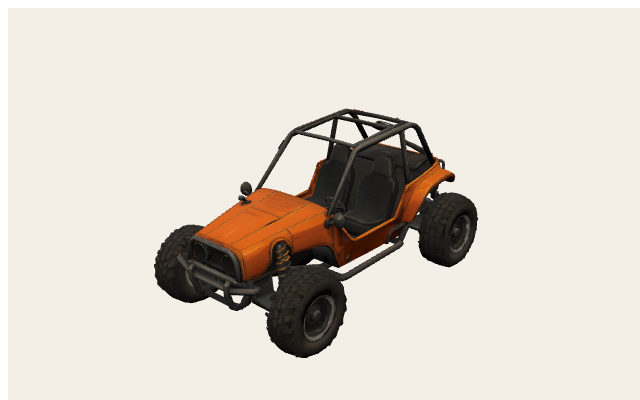

## Command names (runtime)

- Body / paint: `BodyPaint` (recolor target)
- Wheels in GLB: `StockWheel_FL` `StockWheel_FR` `StockWheel_RL` `StockWheel_RR`
- Wheel wrappers (added at load): `WheelSteer_{FL,FR,RL,RR}` + `WheelSpin_{FL,FR,RL,RR}`
- Stock extras if present: `StockSpoiler` (Blitz Heckspoiler), `StockCage` (Käferkraft, hidden when `reinforced_frame` on), `StockEngine`
- Equipped Teile group: `carParts` / objects `carPart-{partId}` (copy `carPart-{partId}-1`…)
- Große Räder: **scale** root `StockWheel_*` (do not scale `…_1` children); hub drop by radius×(scale−1)
- Cosmetics: sticker ids `none|flames|bolt|star` → noses `none|skull|bird|dog` (`buggy-skull.glb` / `buggy-bird.glb` / `buggy-dog.glb`)

## Coordinate grids (meters)

Orange boxes = mesh AABBs. Green dots = Teil **mount anchors** (`CAR_PART_LAYOUTS`). Red = X/u origin, blue = Z/v origin.

<svg xmlns="http://www.w3.org/2000/svg" width="760" height="520" viewBox="0 0 760 520">
<rect x="0" y="0" width="760" height="520" fill="#f4efe6"/>
<rect x="56" y="36" width="686" height="444" fill="#efe8dc" stroke="#1a1a1a" stroke-width="2"/>
<line x1="56.0" y1="36" x2="56.0" y2="480" stroke="#c4b8a4" stroke-width="1"/>
<line x1="84.6" y1="36" x2="84.6" y2="480" stroke="#ddd4c6" stroke-width="0.6"/>
<line x1="113.2" y1="36" x2="113.2" y2="480" stroke="#ddd4c6" stroke-width="0.6"/>
<line x1="141.8" y1="36" x2="141.8" y2="480" stroke="#ddd4c6" stroke-width="0.6"/>
<line x1="170.3" y1="36" x2="170.3" y2="480" stroke="#c4b8a4" stroke-width="1"/>
<line x1="198.9" y1="36" x2="198.9" y2="480" stroke="#ddd4c6" stroke-width="0.6"/>
<line x1="227.5" y1="36" x2="227.5" y2="480" stroke="#ddd4c6" stroke-width="0.6"/>
<line x1="256.1" y1="36" x2="256.1" y2="480" stroke="#ddd4c6" stroke-width="0.6"/>
<line x1="284.7" y1="36" x2="284.7" y2="480" stroke="#c4b8a4" stroke-width="1"/>
<line x1="313.3" y1="36" x2="313.3" y2="480" stroke="#ddd4c6" stroke-width="0.6"/>
<line x1="341.8" y1="36" x2="341.8" y2="480" stroke="#ddd4c6" stroke-width="0.6"/>
<line x1="370.4" y1="36" x2="370.4" y2="480" stroke="#ddd4c6" stroke-width="0.6"/>
<line x1="399.0" y1="36" x2="399.0" y2="480" stroke="#e03131" stroke-width="2"/>
<line x1="427.6" y1="36" x2="427.6" y2="480" stroke="#ddd4c6" stroke-width="0.6"/>
<line x1="456.2" y1="36" x2="456.2" y2="480" stroke="#ddd4c6" stroke-width="0.6"/>
<line x1="484.8" y1="36" x2="484.8" y2="480" stroke="#ddd4c6" stroke-width="0.6"/>
<line x1="513.3" y1="36" x2="513.3" y2="480" stroke="#c4b8a4" stroke-width="1"/>
<line x1="541.9" y1="36" x2="541.9" y2="480" stroke="#ddd4c6" stroke-width="0.6"/>
<line x1="570.5" y1="36" x2="570.5" y2="480" stroke="#ddd4c6" stroke-width="0.6"/>
<line x1="599.1" y1="36" x2="599.1" y2="480" stroke="#ddd4c6" stroke-width="0.6"/>
<line x1="627.7" y1="36" x2="627.7" y2="480" stroke="#c4b8a4" stroke-width="1"/>
<line x1="656.3" y1="36" x2="656.3" y2="480" stroke="#ddd4c6" stroke-width="0.6"/>
<line x1="684.8" y1="36" x2="684.8" y2="480" stroke="#ddd4c6" stroke-width="0.6"/>
<line x1="713.4" y1="36" x2="713.4" y2="480" stroke="#ddd4c6" stroke-width="0.6"/>
<line x1="742.0" y1="36" x2="742.0" y2="480" stroke="#c4b8a4" stroke-width="1"/>
<line x1="56" y1="480.0" x2="742" y2="480.0" stroke="#c4b8a4" stroke-width="1"/>
<line x1="56" y1="452.3" x2="742" y2="452.3" stroke="#ddd4c6" stroke-width="0.6"/>
<line x1="56" y1="424.5" x2="742" y2="424.5" stroke="#ddd4c6" stroke-width="0.6"/>
<line x1="56" y1="396.8" x2="742" y2="396.8" stroke="#ddd4c6" stroke-width="0.6"/>
<line x1="56" y1="369.0" x2="742" y2="369.0" stroke="#c4b8a4" stroke-width="1"/>
<line x1="56" y1="341.3" x2="742" y2="341.3" stroke="#ddd4c6" stroke-width="0.6"/>
<line x1="56" y1="313.5" x2="742" y2="313.5" stroke="#ddd4c6" stroke-width="0.6"/>
<line x1="56" y1="285.8" x2="742" y2="285.8" stroke="#ddd4c6" stroke-width="0.6"/>
<line x1="56" y1="258.0" x2="742" y2="258.0" stroke="#339af0" stroke-width="2"/>
<line x1="56" y1="230.3" x2="742" y2="230.3" stroke="#ddd4c6" stroke-width="0.6"/>
<line x1="56" y1="202.5" x2="742" y2="202.5" stroke="#ddd4c6" stroke-width="0.6"/>
<line x1="56" y1="174.8" x2="742" y2="174.8" stroke="#ddd4c6" stroke-width="0.6"/>
<line x1="56" y1="147.0" x2="742" y2="147.0" stroke="#c4b8a4" stroke-width="1"/>
<line x1="56" y1="119.3" x2="742" y2="119.3" stroke="#ddd4c6" stroke-width="0.6"/>
<line x1="56" y1="91.5" x2="742" y2="91.5" stroke="#ddd4c6" stroke-width="0.6"/>
<line x1="56" y1="63.8" x2="742" y2="63.8" stroke="#ddd4c6" stroke-width="0.6"/>
<line x1="56" y1="36.0" x2="742" y2="36.0" stroke="#c4b8a4" stroke-width="1"/>
<text x="56.0" y="496" text-anchor="middle" font-size="11" font-family="ui-monospace,monospace" fill="#1a1a1a">-3</text>
<text x="170.3" y="496" text-anchor="middle" font-size="11" font-family="ui-monospace,monospace" fill="#1a1a1a">-2</text>
<text x="284.7" y="496" text-anchor="middle" font-size="11" font-family="ui-monospace,monospace" fill="#1a1a1a">-1</text>
<text x="399.0" y="496" text-anchor="middle" font-size="11" font-family="ui-monospace,monospace" fill="#1a1a1a">0</text>
<text x="513.3" y="496" text-anchor="middle" font-size="11" font-family="ui-monospace,monospace" fill="#1a1a1a">1</text>
<text x="627.7" y="496" text-anchor="middle" font-size="11" font-family="ui-monospace,monospace" fill="#1a1a1a">2</text>
<text x="742.0" y="496" text-anchor="middle" font-size="11" font-family="ui-monospace,monospace" fill="#1a1a1a">3</text>
<text x="48" y="484.0" text-anchor="end" font-size="11" font-family="ui-monospace,monospace" fill="#1a1a1a">-2</text>
<text x="48" y="373.0" text-anchor="end" font-size="11" font-family="ui-monospace,monospace" fill="#1a1a1a">-1</text>
<text x="48" y="262.0" text-anchor="end" font-size="11" font-family="ui-monospace,monospace" fill="#1a1a1a">0</text>
<text x="48" y="151.0" text-anchor="end" font-size="11" font-family="ui-monospace,monospace" fill="#1a1a1a">1</text>
<text x="48" y="40.0" text-anchor="end" font-size="11" font-family="ui-monospace,monospace" fill="#1a1a1a">2</text>
<rect x="207.5" y="175.4" width="383.0" height="168.1" fill="#f08c0033" stroke="#f08c00" stroke-width="1.6"/>
<text x="399.0" y="259.5" text-anchor="middle" font-size="10" font-family="ui-sans-serif,sans-serif" font-weight="700" fill="#1a1a1a">BodyPaint</text>
<rect x="488.6" y="152.1" width="95.2" height="38.6" fill="#f08c0033" stroke="#f08c00" stroke-width="1.6"/>
<text x="536.2" y="171.4" text-anchor="middle" font-size="10" font-family="ui-sans-serif,sans-serif" font-weight="700" fill="#1a1a1a">StockWheel_RR</text>
<rect x="212.7" y="312.2" width="92.2" height="51.7" fill="#f08c0033" stroke="#f08c00" stroke-width="1.6"/>
<text x="258.8" y="338.0" text-anchor="middle" font-size="10" font-family="ui-sans-serif,sans-serif" font-weight="700" fill="#1a1a1a">StockWheel_FL</text>
<rect x="490.1" y="307.1" width="94.4" height="56.0" fill="#f08c0033" stroke="#f08c00" stroke-width="1.6"/>
<text x="537.3" y="335.1" text-anchor="middle" font-size="10" font-family="ui-sans-serif,sans-serif" font-weight="700" fill="#1a1a1a">StockWheel_RL</text>
<rect x="218.0" y="154.3" width="92.9" height="36.4" fill="#f08c0033" stroke="#f08c00" stroke-width="1.6"/>
<text x="264.5" y="172.5" text-anchor="middle" font-size="10" font-family="ui-sans-serif,sans-serif" font-weight="700" fill="#1a1a1a">StockWheel_FR</text>
<circle cx="298.4" cy="258.0" r="4.5" fill="#12b886" stroke="#1a1a1a" stroke-width="1.2"/>
<text x="305.4" y="252.0" font-size="10" font-family="ui-sans-serif,sans-serif" font-weight="700" fill="#1a1a1a">big_engine</text>
<circle cx="221.8" cy="258.0" r="4.5" fill="#12b886" stroke="#1a1a1a" stroke-width="1.2"/>
<text x="228.8" y="252.0" font-size="10" font-family="ui-sans-serif,sans-serif" font-weight="700" fill="#1a1a1a">spike_bumper</text>
<circle cx="399.0" cy="258.0" r="4.5" fill="#12b886" stroke="#1a1a1a" stroke-width="1.2"/>
<text x="406.0" y="252.0" font-size="10" font-family="ui-sans-serif,sans-serif" font-weight="700" fill="#1a1a1a">reinforced_frame</text>
<circle cx="421.9" cy="258.0" r="4.5" fill="#12b886" stroke="#1a1a1a" stroke-width="1.2"/>
<text x="428.9" y="252.0" font-size="10" font-family="ui-sans-serif,sans-serif" font-weight="700" fill="#1a1a1a">lightweight_body</text>
<circle cx="507.6" cy="258.0" r="4.5" fill="#12b886" stroke="#1a1a1a" stroke-width="1.2"/>
<text x="514.6" y="252.0" font-size="10" font-family="ui-sans-serif,sans-serif" font-weight="700" fill="#1a1a1a">nitro_kit</text>
<circle cx="576.2" cy="258.0" r="4.5" fill="#12b886" stroke="#1a1a1a" stroke-width="1.2"/>
<text x="583.2" y="252.0" font-size="10" font-family="ui-sans-serif,sans-serif" font-weight="700" fill="#1a1a1a">rear_spoiler</text>
<text x="380" y="22" text-anchor="middle" font-size="14" font-family="ui-sans-serif,sans-serif" font-weight="800" fill="#1a1a1a">Käferkraft — top (mesh XZ)</text>
<text x="380" y="512" text-anchor="middle" font-size="11" font-family="ui-sans-serif,sans-serif" fill="#5c564c">+X → right · +Z → up · origin = red (+X) / blue (+Z) · meters</text>
</svg>

<svg xmlns="http://www.w3.org/2000/svg" width="760" height="520" viewBox="0 0 760 520">
<rect x="0" y="0" width="760" height="520" fill="#f4efe6"/>
<rect x="56" y="36" width="686" height="444" fill="#efe8dc" stroke="#1a1a1a" stroke-width="2"/>
<line x1="56.0" y1="36" x2="56.0" y2="480" stroke="#c4b8a4" stroke-width="1"/>
<line x1="84.6" y1="36" x2="84.6" y2="480" stroke="#ddd4c6" stroke-width="0.6"/>
<line x1="113.2" y1="36" x2="113.2" y2="480" stroke="#ddd4c6" stroke-width="0.6"/>
<line x1="141.8" y1="36" x2="141.8" y2="480" stroke="#ddd4c6" stroke-width="0.6"/>
<line x1="170.3" y1="36" x2="170.3" y2="480" stroke="#c4b8a4" stroke-width="1"/>
<line x1="198.9" y1="36" x2="198.9" y2="480" stroke="#ddd4c6" stroke-width="0.6"/>
<line x1="227.5" y1="36" x2="227.5" y2="480" stroke="#ddd4c6" stroke-width="0.6"/>
<line x1="256.1" y1="36" x2="256.1" y2="480" stroke="#ddd4c6" stroke-width="0.6"/>
<line x1="284.7" y1="36" x2="284.7" y2="480" stroke="#c4b8a4" stroke-width="1"/>
<line x1="313.3" y1="36" x2="313.3" y2="480" stroke="#ddd4c6" stroke-width="0.6"/>
<line x1="341.8" y1="36" x2="341.8" y2="480" stroke="#ddd4c6" stroke-width="0.6"/>
<line x1="370.4" y1="36" x2="370.4" y2="480" stroke="#ddd4c6" stroke-width="0.6"/>
<line x1="399.0" y1="36" x2="399.0" y2="480" stroke="#e03131" stroke-width="2"/>
<line x1="427.6" y1="36" x2="427.6" y2="480" stroke="#ddd4c6" stroke-width="0.6"/>
<line x1="456.2" y1="36" x2="456.2" y2="480" stroke="#ddd4c6" stroke-width="0.6"/>
<line x1="484.8" y1="36" x2="484.8" y2="480" stroke="#ddd4c6" stroke-width="0.6"/>
<line x1="513.3" y1="36" x2="513.3" y2="480" stroke="#c4b8a4" stroke-width="1"/>
<line x1="541.9" y1="36" x2="541.9" y2="480" stroke="#ddd4c6" stroke-width="0.6"/>
<line x1="570.5" y1="36" x2="570.5" y2="480" stroke="#ddd4c6" stroke-width="0.6"/>
<line x1="599.1" y1="36" x2="599.1" y2="480" stroke="#ddd4c6" stroke-width="0.6"/>
<line x1="627.7" y1="36" x2="627.7" y2="480" stroke="#c4b8a4" stroke-width="1"/>
<line x1="656.3" y1="36" x2="656.3" y2="480" stroke="#ddd4c6" stroke-width="0.6"/>
<line x1="684.8" y1="36" x2="684.8" y2="480" stroke="#ddd4c6" stroke-width="0.6"/>
<line x1="713.4" y1="36" x2="713.4" y2="480" stroke="#ddd4c6" stroke-width="0.6"/>
<line x1="742.0" y1="36" x2="742.0" y2="480" stroke="#c4b8a4" stroke-width="1"/>
<line x1="56" y1="480.0" x2="742" y2="480.0" stroke="#c4b8a4" stroke-width="1"/>
<line x1="56" y1="452.3" x2="742" y2="452.3" stroke="#ddd4c6" stroke-width="0.6"/>
<line x1="56" y1="424.5" x2="742" y2="424.5" stroke="#ddd4c6" stroke-width="0.6"/>
<line x1="56" y1="396.8" x2="742" y2="396.8" stroke="#ddd4c6" stroke-width="0.6"/>
<line x1="56" y1="369.0" x2="742" y2="369.0" stroke="#339af0" stroke-width="2"/>
<line x1="56" y1="341.3" x2="742" y2="341.3" stroke="#ddd4c6" stroke-width="0.6"/>
<line x1="56" y1="313.5" x2="742" y2="313.5" stroke="#ddd4c6" stroke-width="0.6"/>
<line x1="56" y1="285.8" x2="742" y2="285.8" stroke="#ddd4c6" stroke-width="0.6"/>
<line x1="56" y1="258.0" x2="742" y2="258.0" stroke="#c4b8a4" stroke-width="1"/>
<line x1="56" y1="230.3" x2="742" y2="230.3" stroke="#ddd4c6" stroke-width="0.6"/>
<line x1="56" y1="202.5" x2="742" y2="202.5" stroke="#ddd4c6" stroke-width="0.6"/>
<line x1="56" y1="174.8" x2="742" y2="174.8" stroke="#ddd4c6" stroke-width="0.6"/>
<line x1="56" y1="147.0" x2="742" y2="147.0" stroke="#c4b8a4" stroke-width="1"/>
<line x1="56" y1="119.3" x2="742" y2="119.3" stroke="#ddd4c6" stroke-width="0.6"/>
<line x1="56" y1="91.5" x2="742" y2="91.5" stroke="#ddd4c6" stroke-width="0.6"/>
<line x1="56" y1="63.8" x2="742" y2="63.8" stroke="#ddd4c6" stroke-width="0.6"/>
<line x1="56" y1="36.0" x2="742" y2="36.0" stroke="#c4b8a4" stroke-width="1"/>
<text x="56.0" y="496" text-anchor="middle" font-size="11" font-family="ui-monospace,monospace" fill="#1a1a1a">-3</text>
<text x="170.3" y="496" text-anchor="middle" font-size="11" font-family="ui-monospace,monospace" fill="#1a1a1a">-2</text>
<text x="284.7" y="496" text-anchor="middle" font-size="11" font-family="ui-monospace,monospace" fill="#1a1a1a">-1</text>
<text x="399.0" y="496" text-anchor="middle" font-size="11" font-family="ui-monospace,monospace" fill="#1a1a1a">0</text>
<text x="513.3" y="496" text-anchor="middle" font-size="11" font-family="ui-monospace,monospace" fill="#1a1a1a">1</text>
<text x="627.7" y="496" text-anchor="middle" font-size="11" font-family="ui-monospace,monospace" fill="#1a1a1a">2</text>
<text x="742.0" y="496" text-anchor="middle" font-size="11" font-family="ui-monospace,monospace" fill="#1a1a1a">3</text>
<text x="48" y="484.0" text-anchor="end" font-size="11" font-family="ui-monospace,monospace" fill="#1a1a1a">-1</text>
<text x="48" y="373.0" text-anchor="end" font-size="11" font-family="ui-monospace,monospace" fill="#1a1a1a">0</text>
<text x="48" y="262.0" text-anchor="end" font-size="11" font-family="ui-monospace,monospace" fill="#1a1a1a">1</text>
<text x="48" y="151.0" text-anchor="end" font-size="11" font-family="ui-monospace,monospace" fill="#1a1a1a">2</text>
<text x="48" y="40.0" text-anchor="end" font-size="11" font-family="ui-monospace,monospace" fill="#1a1a1a">3</text>
<rect x="207.5" y="177.6" width="383.0" height="156.5" fill="#f08c0033" stroke="#f08c00" stroke-width="1.6"/>
<text x="399.0" y="255.8" text-anchor="middle" font-size="10" font-family="ui-sans-serif,sans-serif" font-weight="700" fill="#1a1a1a">BodyPaint</text>
<rect x="488.6" y="273.7" width="95.2" height="93.9" fill="#f08c0033" stroke="#f08c00" stroke-width="1.6"/>
<text x="536.2" y="320.6" text-anchor="middle" font-size="10" font-family="ui-sans-serif,sans-serif" font-weight="700" fill="#1a1a1a">StockWheel_RR</text>
<rect x="212.7" y="279.5" width="92.2" height="89.5" fill="#f08c0033" stroke="#f08c00" stroke-width="1.6"/>
<text x="258.8" y="324.2" text-anchor="middle" font-size="10" font-family="ui-sans-serif,sans-serif" font-weight="700" fill="#1a1a1a">StockWheel_FL</text>
<rect x="490.1" y="275.1" width="94.4" height="92.4" fill="#f08c0033" stroke="#f08c00" stroke-width="1.6"/>
<text x="537.3" y="321.3" text-anchor="middle" font-size="10" font-family="ui-sans-serif,sans-serif" font-weight="700" fill="#1a1a1a">StockWheel_RL</text>
<rect x="218.0" y="276.6" width="92.9" height="91.7" fill="#f08c0033" stroke="#f08c00" stroke-width="1.6"/>
<text x="264.5" y="322.4" text-anchor="middle" font-size="10" font-family="ui-sans-serif,sans-serif" font-weight="700" fill="#1a1a1a">StockWheel_FR</text>
<circle cx="298.4" cy="313.5" r="4.5" fill="#12b886" stroke="#1a1a1a" stroke-width="1.2"/>
<text x="305.4" y="307.5" font-size="10" font-family="ui-sans-serif,sans-serif" font-weight="700" fill="#1a1a1a">big_engine</text>
<circle cx="221.8" cy="319.0" r="4.5" fill="#12b886" stroke="#1a1a1a" stroke-width="1.2"/>
<text x="228.8" y="313.0" font-size="10" font-family="ui-sans-serif,sans-serif" font-weight="700" fill="#1a1a1a">spike_bumper</text>
<circle cx="399.0" cy="369.0" r="4.5" fill="#12b886" stroke="#1a1a1a" stroke-width="1.2"/>
<text x="406.0" y="363.0" font-size="10" font-family="ui-sans-serif,sans-serif" font-weight="700" fill="#1a1a1a">reinforced_frame</text>
<circle cx="421.9" cy="313.5" r="4.5" fill="#12b886" stroke="#1a1a1a" stroke-width="1.2"/>
<text x="428.9" y="307.5" font-size="10" font-family="ui-sans-serif,sans-serif" font-weight="700" fill="#1a1a1a">lightweight_body</text>
<circle cx="507.6" cy="282.4" r="4.5" fill="#12b886" stroke="#1a1a1a" stroke-width="1.2"/>
<text x="514.6" y="276.4" font-size="10" font-family="ui-sans-serif,sans-serif" font-weight="700" fill="#1a1a1a">nitro_kit</text>
<circle cx="576.2" cy="258.0" r="4.5" fill="#12b886" stroke="#1a1a1a" stroke-width="1.2"/>
<text x="583.2" y="252.0" font-size="10" font-family="ui-sans-serif,sans-serif" font-weight="700" fill="#1a1a1a">rear_spoiler</text>
<text x="380" y="22" text-anchor="middle" font-size="14" font-family="ui-sans-serif,sans-serif" font-weight="800" fill="#1a1a1a">Käferkraft — side</text>
<text x="380" y="512" text-anchor="middle" font-size="11" font-family="ui-sans-serif,sans-serif" fill="#5c564c">+X (bake length; nose −X) → right · +Y up → up · origin = red (+X (bake length; nose −X)) / blue (+Y up) · meters</text>
</svg>

## Nodes / meshes

| Node | Mesh | Prims | Verts | Center xyz | AABB min → max | Materials |
| --- | --- | --- | --- | --- | --- | --- |
| `BodyPaint` | `BodyPaint` | 1 | 12980 | (0, 1.019, -0.013) | (-1.675, 0.315, -0.77) → (1.675, 1.724, 0.744) | BodyPaint |
| `StockWheel_RR` | `StockWheel_RR` | 3 | 1930 | (1.2, 0.436, 0.78) | (0.783, 0.013, 0.606) → (1.616, 0.859, 0.954) | Tire |
| `StockWheel_FL` | `StockWheel_FL` | 5 | 2044 | (-1.226, 0.403, -0.721) | (-1.629, 0, -0.954) → (-0.823, 0.806, -0.488) | Tire |
| `StockWheel_RL` | `StockWheel_RL` | 4 | 2048 | (1.21, 0.429, -0.695) | (0.797, 0.013, -0.947) → (1.623, 0.846, -0.443) | Tire |
| `StockWheel_FR` | `StockWheel_FR` | 3 | 1636 | (-1.177, 0.42, 0.77) | (-1.583, 0.007, 0.606) → (-0.77, 0.833, 0.934) | Tire |

## Materials

- `BodyPaint`
- `Tire`

## Shop Teile + mounts

| Part id | German | Shop | GLB | Mount xyz (yaw, scale) |
| --- | --- | --- | --- | --- |
| `big_engine` | Großer Motor | yes | `public/models/parts/blitz-big_engine.glb` | (-0.88, 0.5, 0) yaw -90° ×0.72 — reuses blitz-big_engine.glb |
| `big_wheels` | Große Räder | yes | StockWheel scale | — |
| `spike_bumper` | Spike-Stoßstange | yes | `public/models/parts/kaeferkraft-spike_bumper.glb` | (-1.55, 0.45, 0) yaw -90° ×0.85 |
| `reinforced_frame` | Verstärkter Rahmen | yes | `public/models/parts/kaeferkraft-reinforced_frame.glb` | (0, 0, 0) yaw 0° ×1 — authored in mesh space; poles Waist / WaistToFrontTop |
| `lightweight_body` | Leichtbau-Karosserie | yes | `public/models/parts/kaeferkraft-lightweight_body.glb` | (0.2, 0.5, 0) yaw 90° ×1.12 |
| `nitro_kit` | Nitro-Kit | yes | `public/models/parts/kaeferkraft-nitro_kit.glb` | (0.95, 0.78, 0) yaw 180° ×1 |
| `offroad_suspension` | Gelände-Federung | yes (stats) | stats-only / no mesh | — |
| `rear_spoiler` | Heckspoiler | yes | `public/models/parts/kaeferkraft-rear_spoiler.glb` | (1.55, 1, 0) yaw -90° ×1.08 |

## Waist anchor picker

Picker is a candidate grid. Live `Waist` poles follow BodyPaint picks (left −0.551→0.574, right −0.534→0.553 then +1.5× rail width toward viewer-right); caps bury 8 cm into the hull.

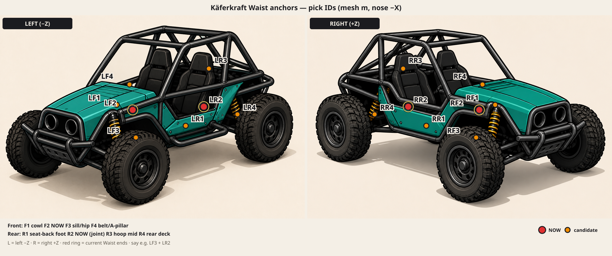

Full legend: [kaeferkraft-waist-anchors.md](../../assets/tripo-concepts/kaeferkraft-waist-anchors.md).

| ID | x | y | z | Meaning |
| --- | --- | --- | --- | --- |
| `LF1` / `RF1` | -0.55 | 0.96 | ±0.55 | deeper into teal cowl |
| `LF2` / `RF2` | -0.32 | 0.96 | ±0.55 | previous front |
| `LF3` / `RF3` | -0.32 | 0.72 | ±0.55 | lower sill / hip |
| `LF4` / `RF4` | -0.32 | 1.15 | ±0.55 | higher belt / A-pillar |
| `LR1` / `RR1` | 0.40 | 0.85 | ±0.55 | seat-back foot |
| `LR2` / `RR2` | 0.58 | 0.96 | ±0.55 | previous rear joint |
| `LR3` / `RR3` | 0.58 | 1.20 | ±0.55 | rear hoop mid |
| `LR4` / `RR4` | 0.90 | 0.90 | ±0.55 | rear deck behind seats |

## Part / extra `public/models/parts/blitz-big_engine.glb`

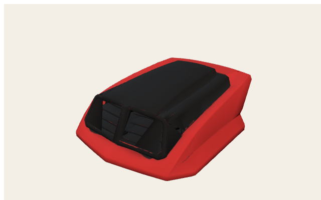

Root AABB (-0.397, 0, -0.425) → (0.397, 0.338, 0.425)

<svg xmlns="http://www.w3.org/2000/svg" width="760" height="520" viewBox="0 0 760 520">
<rect x="0" y="0" width="760" height="520" fill="#f4efe6"/>
<rect x="56" y="36" width="686" height="444" fill="#efe8dc" stroke="#1a1a1a" stroke-width="2"/>
<line x1="56.0" y1="36" x2="56.0" y2="480" stroke="#c4b8a4" stroke-width="1"/>
<line x1="141.8" y1="36" x2="141.8" y2="480" stroke="#ddd4c6" stroke-width="0.6"/>
<line x1="227.5" y1="36" x2="227.5" y2="480" stroke="#ddd4c6" stroke-width="0.6"/>
<line x1="313.3" y1="36" x2="313.3" y2="480" stroke="#ddd4c6" stroke-width="0.6"/>
<line x1="399.0" y1="36" x2="399.0" y2="480" stroke="#e03131" stroke-width="2"/>
<line x1="484.8" y1="36" x2="484.8" y2="480" stroke="#ddd4c6" stroke-width="0.6"/>
<line x1="570.5" y1="36" x2="570.5" y2="480" stroke="#ddd4c6" stroke-width="0.6"/>
<line x1="656.3" y1="36" x2="656.3" y2="480" stroke="#ddd4c6" stroke-width="0.6"/>
<line x1="742.0" y1="36" x2="742.0" y2="480" stroke="#c4b8a4" stroke-width="1"/>
<line x1="56" y1="480.0" x2="742" y2="480.0" stroke="#c4b8a4" stroke-width="1"/>
<line x1="56" y1="452.3" x2="742" y2="452.3" stroke="#ddd4c6" stroke-width="0.6"/>
<line x1="56" y1="424.5" x2="742" y2="424.5" stroke="#ddd4c6" stroke-width="0.6"/>
<line x1="56" y1="396.8" x2="742" y2="396.8" stroke="#ddd4c6" stroke-width="0.6"/>
<line x1="56" y1="369.0" x2="742" y2="369.0" stroke="#c4b8a4" stroke-width="1"/>
<line x1="56" y1="341.3" x2="742" y2="341.3" stroke="#ddd4c6" stroke-width="0.6"/>
<line x1="56" y1="313.5" x2="742" y2="313.5" stroke="#ddd4c6" stroke-width="0.6"/>
<line x1="56" y1="285.8" x2="742" y2="285.8" stroke="#ddd4c6" stroke-width="0.6"/>
<line x1="56" y1="258.0" x2="742" y2="258.0" stroke="#339af0" stroke-width="2"/>
<line x1="56" y1="230.3" x2="742" y2="230.3" stroke="#ddd4c6" stroke-width="0.6"/>
<line x1="56" y1="202.5" x2="742" y2="202.5" stroke="#ddd4c6" stroke-width="0.6"/>
<line x1="56" y1="174.8" x2="742" y2="174.8" stroke="#ddd4c6" stroke-width="0.6"/>
<line x1="56" y1="147.0" x2="742" y2="147.0" stroke="#c4b8a4" stroke-width="1"/>
<line x1="56" y1="119.3" x2="742" y2="119.3" stroke="#ddd4c6" stroke-width="0.6"/>
<line x1="56" y1="91.5" x2="742" y2="91.5" stroke="#ddd4c6" stroke-width="0.6"/>
<line x1="56" y1="63.8" x2="742" y2="63.8" stroke="#ddd4c6" stroke-width="0.6"/>
<line x1="56" y1="36.0" x2="742" y2="36.0" stroke="#c4b8a4" stroke-width="1"/>
<text x="56.0" y="496" text-anchor="middle" font-size="11" font-family="ui-monospace,monospace" fill="#1a1a1a">-1</text>
<text x="399.0" y="496" text-anchor="middle" font-size="11" font-family="ui-monospace,monospace" fill="#1a1a1a">0</text>
<text x="742.0" y="496" text-anchor="middle" font-size="11" font-family="ui-monospace,monospace" fill="#1a1a1a">1</text>
<text x="48" y="484.0" text-anchor="end" font-size="11" font-family="ui-monospace,monospace" fill="#1a1a1a">-2</text>
<text x="48" y="373.0" text-anchor="end" font-size="11" font-family="ui-monospace,monospace" fill="#1a1a1a">-1</text>
<text x="48" y="262.0" text-anchor="end" font-size="11" font-family="ui-monospace,monospace" fill="#1a1a1a">0</text>
<text x="48" y="151.0" text-anchor="end" font-size="11" font-family="ui-monospace,monospace" fill="#1a1a1a">1</text>
<text x="48" y="40.0" text-anchor="end" font-size="11" font-family="ui-monospace,monospace" fill="#1a1a1a">2</text>
<rect x="262.9" y="210.8" width="272.2" height="94.4" fill="#f08c0033" stroke="#f08c00" stroke-width="1.6"/>
<text x="399.0" y="258.0" text-anchor="middle" font-size="10" font-family="ui-sans-serif,sans-serif" font-weight="700" fill="#1a1a1a">tripo_node_9c0a2f29-e9bb-4e44-b1d7-5967c9fc5ec4</text>
<text x="380" y="22" text-anchor="middle" font-size="14" font-family="ui-sans-serif,sans-serif" font-weight="800" fill="#1a1a1a">public/models/parts/blitz-big_engine.glb — top XZ</text>
<text x="380" y="512" text-anchor="middle" font-size="11" font-family="ui-sans-serif,sans-serif" fill="#5c564c">+X → right · +Z → up · origin = red (+X) / blue (+Z) · meters</text>
</svg>

| Node | Mesh | Prims | Verts | Center xyz | AABB min → max | Materials |
| --- | --- | --- | --- | --- | --- | --- |
| `tripo_node_9c0a2f29-e9bb-4e44-b1d7-5967c9fc5ec4` | `tripo_mesh_9c0a2f29-e9bb-4e44-b1d7-5967c9fc5ec4` | 1 | 6908 | (0, 0.169, 0) | (-0.397, 0, -0.425) → (0.397, 0.338, 0.425) | Carbon |

## Part / extra `public/models/parts/kaeferkraft-spike_bumper.glb`

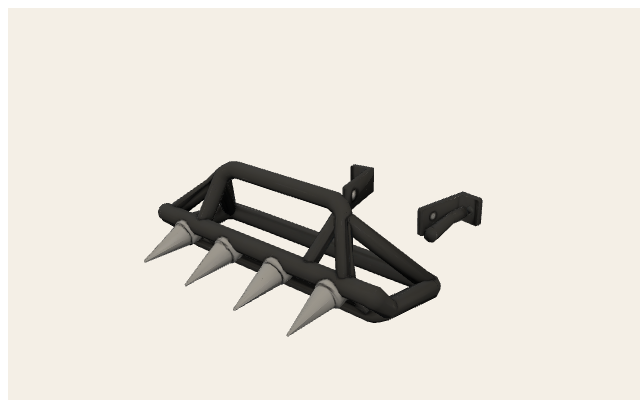

Root AABB (-0.555, 0, -0.605) → (0.555, 0.4, 0.605)

<svg xmlns="http://www.w3.org/2000/svg" width="760" height="520" viewBox="0 0 760 520">
<rect x="0" y="0" width="760" height="520" fill="#f4efe6"/>
<rect x="56" y="36" width="686" height="444" fill="#efe8dc" stroke="#1a1a1a" stroke-width="2"/>
<line x1="56.0" y1="36" x2="56.0" y2="480" stroke="#c4b8a4" stroke-width="1"/>
<line x1="98.9" y1="36" x2="98.9" y2="480" stroke="#ddd4c6" stroke-width="0.6"/>
<line x1="141.8" y1="36" x2="141.8" y2="480" stroke="#ddd4c6" stroke-width="0.6"/>
<line x1="184.6" y1="36" x2="184.6" y2="480" stroke="#ddd4c6" stroke-width="0.6"/>
<line x1="227.5" y1="36" x2="227.5" y2="480" stroke="#c4b8a4" stroke-width="1"/>
<line x1="270.4" y1="36" x2="270.4" y2="480" stroke="#ddd4c6" stroke-width="0.6"/>
<line x1="313.3" y1="36" x2="313.3" y2="480" stroke="#ddd4c6" stroke-width="0.6"/>
<line x1="356.1" y1="36" x2="356.1" y2="480" stroke="#ddd4c6" stroke-width="0.6"/>
<line x1="399.0" y1="36" x2="399.0" y2="480" stroke="#e03131" stroke-width="2"/>
<line x1="441.9" y1="36" x2="441.9" y2="480" stroke="#ddd4c6" stroke-width="0.6"/>
<line x1="484.8" y1="36" x2="484.8" y2="480" stroke="#ddd4c6" stroke-width="0.6"/>
<line x1="527.6" y1="36" x2="527.6" y2="480" stroke="#ddd4c6" stroke-width="0.6"/>
<line x1="570.5" y1="36" x2="570.5" y2="480" stroke="#c4b8a4" stroke-width="1"/>
<line x1="613.4" y1="36" x2="613.4" y2="480" stroke="#ddd4c6" stroke-width="0.6"/>
<line x1="656.3" y1="36" x2="656.3" y2="480" stroke="#ddd4c6" stroke-width="0.6"/>
<line x1="699.1" y1="36" x2="699.1" y2="480" stroke="#ddd4c6" stroke-width="0.6"/>
<line x1="742.0" y1="36" x2="742.0" y2="480" stroke="#c4b8a4" stroke-width="1"/>
<line x1="56" y1="480.0" x2="742" y2="480.0" stroke="#c4b8a4" stroke-width="1"/>
<line x1="56" y1="452.3" x2="742" y2="452.3" stroke="#ddd4c6" stroke-width="0.6"/>
<line x1="56" y1="424.5" x2="742" y2="424.5" stroke="#ddd4c6" stroke-width="0.6"/>
<line x1="56" y1="396.8" x2="742" y2="396.8" stroke="#ddd4c6" stroke-width="0.6"/>
<line x1="56" y1="369.0" x2="742" y2="369.0" stroke="#c4b8a4" stroke-width="1"/>
<line x1="56" y1="341.3" x2="742" y2="341.3" stroke="#ddd4c6" stroke-width="0.6"/>
<line x1="56" y1="313.5" x2="742" y2="313.5" stroke="#ddd4c6" stroke-width="0.6"/>
<line x1="56" y1="285.8" x2="742" y2="285.8" stroke="#ddd4c6" stroke-width="0.6"/>
<line x1="56" y1="258.0" x2="742" y2="258.0" stroke="#339af0" stroke-width="2"/>
<line x1="56" y1="230.3" x2="742" y2="230.3" stroke="#ddd4c6" stroke-width="0.6"/>
<line x1="56" y1="202.5" x2="742" y2="202.5" stroke="#ddd4c6" stroke-width="0.6"/>
<line x1="56" y1="174.8" x2="742" y2="174.8" stroke="#ddd4c6" stroke-width="0.6"/>
<line x1="56" y1="147.0" x2="742" y2="147.0" stroke="#c4b8a4" stroke-width="1"/>
<line x1="56" y1="119.3" x2="742" y2="119.3" stroke="#ddd4c6" stroke-width="0.6"/>
<line x1="56" y1="91.5" x2="742" y2="91.5" stroke="#ddd4c6" stroke-width="0.6"/>
<line x1="56" y1="63.8" x2="742" y2="63.8" stroke="#ddd4c6" stroke-width="0.6"/>
<line x1="56" y1="36.0" x2="742" y2="36.0" stroke="#c4b8a4" stroke-width="1"/>
<text x="56.0" y="496" text-anchor="middle" font-size="11" font-family="ui-monospace,monospace" fill="#1a1a1a">-2</text>
<text x="227.5" y="496" text-anchor="middle" font-size="11" font-family="ui-monospace,monospace" fill="#1a1a1a">-1</text>
<text x="399.0" y="496" text-anchor="middle" font-size="11" font-family="ui-monospace,monospace" fill="#1a1a1a">0</text>
<text x="570.5" y="496" text-anchor="middle" font-size="11" font-family="ui-monospace,monospace" fill="#1a1a1a">1</text>
<text x="742.0" y="496" text-anchor="middle" font-size="11" font-family="ui-monospace,monospace" fill="#1a1a1a">2</text>
<text x="48" y="484.0" text-anchor="end" font-size="11" font-family="ui-monospace,monospace" fill="#1a1a1a">-2</text>
<text x="48" y="373.0" text-anchor="end" font-size="11" font-family="ui-monospace,monospace" fill="#1a1a1a">-1</text>
<text x="48" y="262.0" text-anchor="end" font-size="11" font-family="ui-monospace,monospace" fill="#1a1a1a">0</text>
<text x="48" y="151.0" text-anchor="end" font-size="11" font-family="ui-monospace,monospace" fill="#1a1a1a">1</text>
<text x="48" y="40.0" text-anchor="end" font-size="11" font-family="ui-monospace,monospace" fill="#1a1a1a">2</text>
<rect x="303.8" y="190.9" width="190.4" height="134.3" fill="#f08c0033" stroke="#f08c00" stroke-width="1.6"/>
<text x="399.0" y="258.0" text-anchor="middle" font-size="10" font-family="ui-sans-serif,sans-serif" font-weight="700" fill="#1a1a1a">tripo_node_c02e5cab-488f-4521-8277-7de1b567fa54</text>
<text x="380" y="22" text-anchor="middle" font-size="14" font-family="ui-sans-serif,sans-serif" font-weight="800" fill="#1a1a1a">public/models/parts/kaeferkraft-spike_bumper.glb — top XZ</text>
<text x="380" y="512" text-anchor="middle" font-size="11" font-family="ui-sans-serif,sans-serif" fill="#5c564c">+X → right · +Z → up · origin = red (+X) / blue (+Z) · meters</text>
</svg>

| Node | Mesh | Prims | Verts | Center xyz | AABB min → max | Materials |
| --- | --- | --- | --- | --- | --- | --- |
| `tripo_node_c02e5cab-488f-4521-8277-7de1b567fa54` | `tripo_mesh_c02e5cab-488f-4521-8277-7de1b567fa54` | 1 | 6736 | (0, 0.2, 0) | (-0.555, 0, -0.605) → (0.555, 0.4, 0.605) | Spike |

## Part / extra `public/models/parts/kaeferkraft-reinforced_frame.glb`

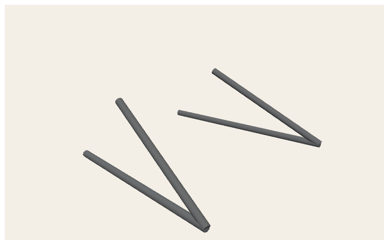

Root AABB (-0.633, 0.975, -0.636) → (0.664, 1.502, 0.672)

<svg xmlns="http://www.w3.org/2000/svg" width="760" height="520" viewBox="0 0 760 520">
<rect x="0" y="0" width="760" height="520" fill="#f4efe6"/>
<rect x="56" y="36" width="686" height="444" fill="#efe8dc" stroke="#1a1a1a" stroke-width="2"/>
<line x1="56.0" y1="36" x2="56.0" y2="480" stroke="#c4b8a4" stroke-width="1"/>
<line x1="98.9" y1="36" x2="98.9" y2="480" stroke="#ddd4c6" stroke-width="0.6"/>
<line x1="141.8" y1="36" x2="141.8" y2="480" stroke="#ddd4c6" stroke-width="0.6"/>
<line x1="184.6" y1="36" x2="184.6" y2="480" stroke="#ddd4c6" stroke-width="0.6"/>
<line x1="227.5" y1="36" x2="227.5" y2="480" stroke="#c4b8a4" stroke-width="1"/>
<line x1="270.4" y1="36" x2="270.4" y2="480" stroke="#ddd4c6" stroke-width="0.6"/>
<line x1="313.3" y1="36" x2="313.3" y2="480" stroke="#ddd4c6" stroke-width="0.6"/>
<line x1="356.1" y1="36" x2="356.1" y2="480" stroke="#ddd4c6" stroke-width="0.6"/>
<line x1="399.0" y1="36" x2="399.0" y2="480" stroke="#e03131" stroke-width="2"/>
<line x1="441.9" y1="36" x2="441.9" y2="480" stroke="#ddd4c6" stroke-width="0.6"/>
<line x1="484.8" y1="36" x2="484.8" y2="480" stroke="#ddd4c6" stroke-width="0.6"/>
<line x1="527.6" y1="36" x2="527.6" y2="480" stroke="#ddd4c6" stroke-width="0.6"/>
<line x1="570.5" y1="36" x2="570.5" y2="480" stroke="#c4b8a4" stroke-width="1"/>
<line x1="613.4" y1="36" x2="613.4" y2="480" stroke="#ddd4c6" stroke-width="0.6"/>
<line x1="656.3" y1="36" x2="656.3" y2="480" stroke="#ddd4c6" stroke-width="0.6"/>
<line x1="699.1" y1="36" x2="699.1" y2="480" stroke="#ddd4c6" stroke-width="0.6"/>
<line x1="742.0" y1="36" x2="742.0" y2="480" stroke="#c4b8a4" stroke-width="1"/>
<line x1="56" y1="480.0" x2="742" y2="480.0" stroke="#c4b8a4" stroke-width="1"/>
<line x1="56" y1="452.3" x2="742" y2="452.3" stroke="#ddd4c6" stroke-width="0.6"/>
<line x1="56" y1="424.5" x2="742" y2="424.5" stroke="#ddd4c6" stroke-width="0.6"/>
<line x1="56" y1="396.8" x2="742" y2="396.8" stroke="#ddd4c6" stroke-width="0.6"/>
<line x1="56" y1="369.0" x2="742" y2="369.0" stroke="#c4b8a4" stroke-width="1"/>
<line x1="56" y1="341.3" x2="742" y2="341.3" stroke="#ddd4c6" stroke-width="0.6"/>
<line x1="56" y1="313.5" x2="742" y2="313.5" stroke="#ddd4c6" stroke-width="0.6"/>
<line x1="56" y1="285.8" x2="742" y2="285.8" stroke="#ddd4c6" stroke-width="0.6"/>
<line x1="56" y1="258.0" x2="742" y2="258.0" stroke="#339af0" stroke-width="2"/>
<line x1="56" y1="230.3" x2="742" y2="230.3" stroke="#ddd4c6" stroke-width="0.6"/>
<line x1="56" y1="202.5" x2="742" y2="202.5" stroke="#ddd4c6" stroke-width="0.6"/>
<line x1="56" y1="174.8" x2="742" y2="174.8" stroke="#ddd4c6" stroke-width="0.6"/>
<line x1="56" y1="147.0" x2="742" y2="147.0" stroke="#c4b8a4" stroke-width="1"/>
<line x1="56" y1="119.3" x2="742" y2="119.3" stroke="#ddd4c6" stroke-width="0.6"/>
<line x1="56" y1="91.5" x2="742" y2="91.5" stroke="#ddd4c6" stroke-width="0.6"/>
<line x1="56" y1="63.8" x2="742" y2="63.8" stroke="#ddd4c6" stroke-width="0.6"/>
<line x1="56" y1="36.0" x2="742" y2="36.0" stroke="#c4b8a4" stroke-width="1"/>
<text x="56.0" y="496" text-anchor="middle" font-size="11" font-family="ui-monospace,monospace" fill="#1a1a1a">-2</text>
<text x="227.5" y="496" text-anchor="middle" font-size="11" font-family="ui-monospace,monospace" fill="#1a1a1a">-1</text>
<text x="399.0" y="496" text-anchor="middle" font-size="11" font-family="ui-monospace,monospace" fill="#1a1a1a">0</text>
<text x="570.5" y="496" text-anchor="middle" font-size="11" font-family="ui-monospace,monospace" fill="#1a1a1a">1</text>
<text x="742.0" y="496" text-anchor="middle" font-size="11" font-family="ui-monospace,monospace" fill="#1a1a1a">2</text>
<text x="48" y="484.0" text-anchor="end" font-size="11" font-family="ui-monospace,monospace" fill="#1a1a1a">-2</text>
<text x="48" y="373.0" text-anchor="end" font-size="11" font-family="ui-monospace,monospace" fill="#1a1a1a">-1</text>
<text x="48" y="262.0" text-anchor="end" font-size="11" font-family="ui-monospace,monospace" fill="#1a1a1a">0</text>
<text x="48" y="151.0" text-anchor="end" font-size="11" font-family="ui-monospace,monospace" fill="#1a1a1a">1</text>
<text x="48" y="40.0" text-anchor="end" font-size="11" font-family="ui-monospace,monospace" fill="#1a1a1a">2</text>
<rect x="290.4" y="308.8" width="221.1" height="19.8" fill="#f08c0033" stroke="#f08c00" stroke-width="1.6"/>
<text x="401.0" y="318.7" text-anchor="middle" font-size="10" font-family="ui-sans-serif,sans-serif" font-weight="700" fill="#1a1a1a">Waist</text>
<rect x="356.0" y="308.5" width="156.9" height="20.0" fill="#f08c0033" stroke="#f08c00" stroke-width="1.6"/>
<text x="434.5" y="318.6" text-anchor="middle" font-size="10" font-family="ui-sans-serif,sans-serif" font-weight="700" fill="#1a1a1a">WaistToFrontTop</text>
<rect x="293.3" y="183.4" width="214.6" height="19.5" fill="#f08c0033" stroke="#f08c00" stroke-width="1.6"/>
<text x="400.6" y="193.2" text-anchor="middle" font-size="10" font-family="ui-sans-serif,sans-serif" font-weight="700" fill="#1a1a1a">Waist</text>
<rect x="355.8" y="183.5" width="153.8" height="24.0" fill="#f08c0033" stroke="#f08c00" stroke-width="1.6"/>
<text x="432.7" y="195.4" text-anchor="middle" font-size="10" font-family="ui-sans-serif,sans-serif" font-weight="700" fill="#1a1a1a">WaistToFrontTop</text>
<text x="380" y="22" text-anchor="middle" font-size="14" font-family="ui-sans-serif,sans-serif" font-weight="800" fill="#1a1a1a">public/models/parts/kaeferkraft-reinforced_frame.glb — top XZ</text>
<text x="380" y="512" text-anchor="middle" font-size="11" font-family="ui-sans-serif,sans-serif" fill="#5c564c">+X → right · +Z → up · origin = red (+X) / blue (+Z) · meters</text>
</svg>

| Node | Mesh | Prims | Verts | Center xyz | AABB min → max | Materials |
| --- | --- | --- | --- | --- | --- | --- |
| `Waist` | `Waist` | 1 | 52 | (0.011, 1.045, -0.546) | (-0.633, 1.002, -0.636) → (0.656, 1.088, -0.457) | Grey |
| `WaistToFrontTop` | `WaistToFrontTop` | 1 | 52 | (0.207, 1.272, -0.545) | (-0.251, 1.041, -0.636) → (0.664, 1.502, -0.455) | Grey |
| `Waist` | `Waist` | 1 | 52 | (0.009, 1.008, 0.584) | (-0.616, 0.975, 0.496) → (0.635, 1.041, 0.672) | Grey |
| `WaistToFrontTop` | `WaistToFrontTop` | 1 | 52 | (0.196, 1.248, 0.564) | (-0.252, 0.994, 0.455) → (0.645, 1.502, 0.672) | Grey |

## Part / extra `public/models/parts/kaeferkraft-lightweight_body.glb`

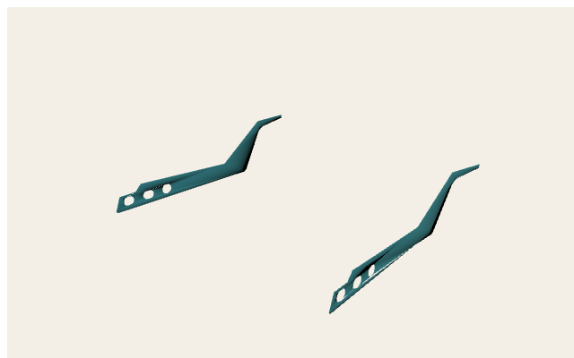

Root AABB (-0.8, 0, -0.69) → (0.8, 0.329, 0.69)

<svg xmlns="http://www.w3.org/2000/svg" width="760" height="520" viewBox="0 0 760 520">
<rect x="0" y="0" width="760" height="520" fill="#f4efe6"/>
<rect x="56" y="36" width="686" height="444" fill="#efe8dc" stroke="#1a1a1a" stroke-width="2"/>
<line x1="56.0" y1="36" x2="56.0" y2="480" stroke="#c4b8a4" stroke-width="1"/>
<line x1="98.9" y1="36" x2="98.9" y2="480" stroke="#ddd4c6" stroke-width="0.6"/>
<line x1="141.8" y1="36" x2="141.8" y2="480" stroke="#ddd4c6" stroke-width="0.6"/>
<line x1="184.6" y1="36" x2="184.6" y2="480" stroke="#ddd4c6" stroke-width="0.6"/>
<line x1="227.5" y1="36" x2="227.5" y2="480" stroke="#c4b8a4" stroke-width="1"/>
<line x1="270.4" y1="36" x2="270.4" y2="480" stroke="#ddd4c6" stroke-width="0.6"/>
<line x1="313.3" y1="36" x2="313.3" y2="480" stroke="#ddd4c6" stroke-width="0.6"/>
<line x1="356.1" y1="36" x2="356.1" y2="480" stroke="#ddd4c6" stroke-width="0.6"/>
<line x1="399.0" y1="36" x2="399.0" y2="480" stroke="#e03131" stroke-width="2"/>
<line x1="441.9" y1="36" x2="441.9" y2="480" stroke="#ddd4c6" stroke-width="0.6"/>
<line x1="484.8" y1="36" x2="484.8" y2="480" stroke="#ddd4c6" stroke-width="0.6"/>
<line x1="527.6" y1="36" x2="527.6" y2="480" stroke="#ddd4c6" stroke-width="0.6"/>
<line x1="570.5" y1="36" x2="570.5" y2="480" stroke="#c4b8a4" stroke-width="1"/>
<line x1="613.4" y1="36" x2="613.4" y2="480" stroke="#ddd4c6" stroke-width="0.6"/>
<line x1="656.3" y1="36" x2="656.3" y2="480" stroke="#ddd4c6" stroke-width="0.6"/>
<line x1="699.1" y1="36" x2="699.1" y2="480" stroke="#ddd4c6" stroke-width="0.6"/>
<line x1="742.0" y1="36" x2="742.0" y2="480" stroke="#c4b8a4" stroke-width="1"/>
<line x1="56" y1="480.0" x2="742" y2="480.0" stroke="#c4b8a4" stroke-width="1"/>
<line x1="56" y1="452.3" x2="742" y2="452.3" stroke="#ddd4c6" stroke-width="0.6"/>
<line x1="56" y1="424.5" x2="742" y2="424.5" stroke="#ddd4c6" stroke-width="0.6"/>
<line x1="56" y1="396.8" x2="742" y2="396.8" stroke="#ddd4c6" stroke-width="0.6"/>
<line x1="56" y1="369.0" x2="742" y2="369.0" stroke="#c4b8a4" stroke-width="1"/>
<line x1="56" y1="341.3" x2="742" y2="341.3" stroke="#ddd4c6" stroke-width="0.6"/>
<line x1="56" y1="313.5" x2="742" y2="313.5" stroke="#ddd4c6" stroke-width="0.6"/>
<line x1="56" y1="285.8" x2="742" y2="285.8" stroke="#ddd4c6" stroke-width="0.6"/>
<line x1="56" y1="258.0" x2="742" y2="258.0" stroke="#339af0" stroke-width="2"/>
<line x1="56" y1="230.3" x2="742" y2="230.3" stroke="#ddd4c6" stroke-width="0.6"/>
<line x1="56" y1="202.5" x2="742" y2="202.5" stroke="#ddd4c6" stroke-width="0.6"/>
<line x1="56" y1="174.8" x2="742" y2="174.8" stroke="#ddd4c6" stroke-width="0.6"/>
<line x1="56" y1="147.0" x2="742" y2="147.0" stroke="#c4b8a4" stroke-width="1"/>
<line x1="56" y1="119.3" x2="742" y2="119.3" stroke="#ddd4c6" stroke-width="0.6"/>
<line x1="56" y1="91.5" x2="742" y2="91.5" stroke="#ddd4c6" stroke-width="0.6"/>
<line x1="56" y1="63.8" x2="742" y2="63.8" stroke="#ddd4c6" stroke-width="0.6"/>
<line x1="56" y1="36.0" x2="742" y2="36.0" stroke="#c4b8a4" stroke-width="1"/>
<text x="56.0" y="496" text-anchor="middle" font-size="11" font-family="ui-monospace,monospace" fill="#1a1a1a">-2</text>
<text x="227.5" y="496" text-anchor="middle" font-size="11" font-family="ui-monospace,monospace" fill="#1a1a1a">-1</text>
<text x="399.0" y="496" text-anchor="middle" font-size="11" font-family="ui-monospace,monospace" fill="#1a1a1a">0</text>
<text x="570.5" y="496" text-anchor="middle" font-size="11" font-family="ui-monospace,monospace" fill="#1a1a1a">1</text>
<text x="742.0" y="496" text-anchor="middle" font-size="11" font-family="ui-monospace,monospace" fill="#1a1a1a">2</text>
<text x="48" y="484.0" text-anchor="end" font-size="11" font-family="ui-monospace,monospace" fill="#1a1a1a">-2</text>
<text x="48" y="373.0" text-anchor="end" font-size="11" font-family="ui-monospace,monospace" fill="#1a1a1a">-1</text>
<text x="48" y="262.0" text-anchor="end" font-size="11" font-family="ui-monospace,monospace" fill="#1a1a1a">0</text>
<text x="48" y="151.0" text-anchor="end" font-size="11" font-family="ui-monospace,monospace" fill="#1a1a1a">1</text>
<text x="48" y="40.0" text-anchor="end" font-size="11" font-family="ui-monospace,monospace" fill="#1a1a1a">2</text>
<rect x="261.8" y="181.4" width="274.4" height="153.3" fill="#f08c0033" stroke="#f08c00" stroke-width="1.6"/>
<text x="399.0" y="258.0" text-anchor="middle" font-size="10" font-family="ui-sans-serif,sans-serif" font-weight="700" fill="#1a1a1a">kaeferkraft-lightweight_body</text>
<text x="380" y="22" text-anchor="middle" font-size="14" font-family="ui-sans-serif,sans-serif" font-weight="800" fill="#1a1a1a">public/models/parts/kaeferkraft-lightweight_body.glb — top XZ</text>
<text x="380" y="512" text-anchor="middle" font-size="11" font-family="ui-sans-serif,sans-serif" fill="#5c564c">+X → right · +Z → up · origin = red (+X) / blue (+Z) · meters</text>
</svg>

| Node | Mesh | Prims | Verts | Center xyz | AABB min → max | Materials |
| --- | --- | --- | --- | --- | --- | --- |
| `kaeferkraft-lightweight_body` | `kaeferkraft-lightweight_body` | 1 | 206 | (0, 0.164, 0) | (-0.8, 0, -0.69) → (0.8, 0.329, 0.69) | Carbon |

## Part / extra `public/models/parts/kaeferkraft-nitro_kit.glb`

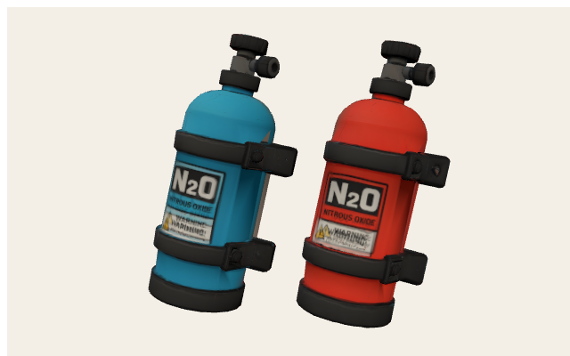

Root AABB (-0.291, 0, -0.288) → (0.291, 0.65, 0.288)

<svg xmlns="http://www.w3.org/2000/svg" width="760" height="520" viewBox="0 0 760 520">
<rect x="0" y="0" width="760" height="520" fill="#f4efe6"/>
<rect x="56" y="36" width="686" height="444" fill="#efe8dc" stroke="#1a1a1a" stroke-width="2"/>
<line x1="56.0" y1="36" x2="56.0" y2="480" stroke="#c4b8a4" stroke-width="1"/>
<line x1="141.8" y1="36" x2="141.8" y2="480" stroke="#ddd4c6" stroke-width="0.6"/>
<line x1="227.5" y1="36" x2="227.5" y2="480" stroke="#ddd4c6" stroke-width="0.6"/>
<line x1="313.3" y1="36" x2="313.3" y2="480" stroke="#ddd4c6" stroke-width="0.6"/>
<line x1="399.0" y1="36" x2="399.0" y2="480" stroke="#e03131" stroke-width="2"/>
<line x1="484.8" y1="36" x2="484.8" y2="480" stroke="#ddd4c6" stroke-width="0.6"/>
<line x1="570.5" y1="36" x2="570.5" y2="480" stroke="#ddd4c6" stroke-width="0.6"/>
<line x1="656.3" y1="36" x2="656.3" y2="480" stroke="#ddd4c6" stroke-width="0.6"/>
<line x1="742.0" y1="36" x2="742.0" y2="480" stroke="#c4b8a4" stroke-width="1"/>
<line x1="56" y1="480.0" x2="742" y2="480.0" stroke="#c4b8a4" stroke-width="1"/>
<line x1="56" y1="424.5" x2="742" y2="424.5" stroke="#ddd4c6" stroke-width="0.6"/>
<line x1="56" y1="369.0" x2="742" y2="369.0" stroke="#ddd4c6" stroke-width="0.6"/>
<line x1="56" y1="313.5" x2="742" y2="313.5" stroke="#ddd4c6" stroke-width="0.6"/>
<line x1="56" y1="258.0" x2="742" y2="258.0" stroke="#339af0" stroke-width="2"/>
<line x1="56" y1="202.5" x2="742" y2="202.5" stroke="#ddd4c6" stroke-width="0.6"/>
<line x1="56" y1="147.0" x2="742" y2="147.0" stroke="#ddd4c6" stroke-width="0.6"/>
<line x1="56" y1="91.5" x2="742" y2="91.5" stroke="#ddd4c6" stroke-width="0.6"/>
<line x1="56" y1="36.0" x2="742" y2="36.0" stroke="#c4b8a4" stroke-width="1"/>
<text x="56.0" y="496" text-anchor="middle" font-size="11" font-family="ui-monospace,monospace" fill="#1a1a1a">-1</text>
<text x="399.0" y="496" text-anchor="middle" font-size="11" font-family="ui-monospace,monospace" fill="#1a1a1a">0</text>
<text x="742.0" y="496" text-anchor="middle" font-size="11" font-family="ui-monospace,monospace" fill="#1a1a1a">1</text>
<text x="48" y="484.0" text-anchor="end" font-size="11" font-family="ui-monospace,monospace" fill="#1a1a1a">-1</text>
<text x="48" y="262.0" text-anchor="end" font-size="11" font-family="ui-monospace,monospace" fill="#1a1a1a">0</text>
<text x="48" y="40.0" text-anchor="end" font-size="11" font-family="ui-monospace,monospace" fill="#1a1a1a">1</text>
<rect x="299.3" y="194.0" width="199.4" height="127.9" fill="#f08c0033" stroke="#f08c00" stroke-width="1.6"/>
<text x="399.0" y="258.0" text-anchor="middle" font-size="10" font-family="ui-sans-serif,sans-serif" font-weight="700" fill="#1a1a1a">tripo_node_17b33f7c-e4c0-42b0-b617-71f068fe6d80</text>
<text x="380" y="22" text-anchor="middle" font-size="14" font-family="ui-sans-serif,sans-serif" font-weight="800" fill="#1a1a1a">public/models/parts/kaeferkraft-nitro_kit.glb — top XZ</text>
<text x="380" y="512" text-anchor="middle" font-size="11" font-family="ui-sans-serif,sans-serif" fill="#5c564c">+X → right · +Z → up · origin = red (+X) / blue (+Z) · meters</text>
</svg>

| Node | Mesh | Prims | Verts | Center xyz | AABB min → max | Materials |
| --- | --- | --- | --- | --- | --- | --- |
| `tripo_node_17b33f7c-e4c0-42b0-b617-71f068fe6d80` | `tripo_mesh_17b33f7c-e4c0-42b0-b617-71f068fe6d80` | 1 | 5807 | (0, 0.325, 0) | (-0.291, 0, -0.288) → (0.291, 0.65, 0.288) | NitroKit |

## Part / extra `public/models/parts/kaeferkraft-rear_spoiler.glb`

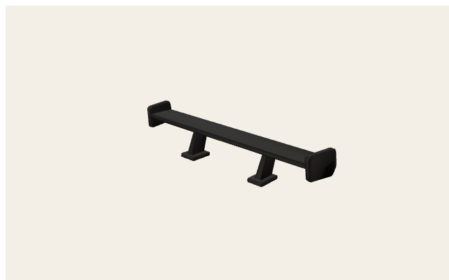

Root AABB (-0.525, 0, -0.089) → (0.525, 0.224, 0.089)

<svg xmlns="http://www.w3.org/2000/svg" width="760" height="520" viewBox="0 0 760 520">
<rect x="0" y="0" width="760" height="520" fill="#f4efe6"/>
<rect x="56" y="36" width="686" height="444" fill="#efe8dc" stroke="#1a1a1a" stroke-width="2"/>
<line x1="56.0" y1="36" x2="56.0" y2="480" stroke="#c4b8a4" stroke-width="1"/>
<line x1="98.9" y1="36" x2="98.9" y2="480" stroke="#ddd4c6" stroke-width="0.6"/>
<line x1="141.8" y1="36" x2="141.8" y2="480" stroke="#ddd4c6" stroke-width="0.6"/>
<line x1="184.6" y1="36" x2="184.6" y2="480" stroke="#ddd4c6" stroke-width="0.6"/>
<line x1="227.5" y1="36" x2="227.5" y2="480" stroke="#c4b8a4" stroke-width="1"/>
<line x1="270.4" y1="36" x2="270.4" y2="480" stroke="#ddd4c6" stroke-width="0.6"/>
<line x1="313.3" y1="36" x2="313.3" y2="480" stroke="#ddd4c6" stroke-width="0.6"/>
<line x1="356.1" y1="36" x2="356.1" y2="480" stroke="#ddd4c6" stroke-width="0.6"/>
<line x1="399.0" y1="36" x2="399.0" y2="480" stroke="#e03131" stroke-width="2"/>
<line x1="441.9" y1="36" x2="441.9" y2="480" stroke="#ddd4c6" stroke-width="0.6"/>
<line x1="484.8" y1="36" x2="484.8" y2="480" stroke="#ddd4c6" stroke-width="0.6"/>
<line x1="527.6" y1="36" x2="527.6" y2="480" stroke="#ddd4c6" stroke-width="0.6"/>
<line x1="570.5" y1="36" x2="570.5" y2="480" stroke="#c4b8a4" stroke-width="1"/>
<line x1="613.4" y1="36" x2="613.4" y2="480" stroke="#ddd4c6" stroke-width="0.6"/>
<line x1="656.3" y1="36" x2="656.3" y2="480" stroke="#ddd4c6" stroke-width="0.6"/>
<line x1="699.1" y1="36" x2="699.1" y2="480" stroke="#ddd4c6" stroke-width="0.6"/>
<line x1="742.0" y1="36" x2="742.0" y2="480" stroke="#c4b8a4" stroke-width="1"/>
<line x1="56" y1="480.0" x2="742" y2="480.0" stroke="#c4b8a4" stroke-width="1"/>
<line x1="56" y1="424.5" x2="742" y2="424.5" stroke="#ddd4c6" stroke-width="0.6"/>
<line x1="56" y1="369.0" x2="742" y2="369.0" stroke="#ddd4c6" stroke-width="0.6"/>
<line x1="56" y1="313.5" x2="742" y2="313.5" stroke="#ddd4c6" stroke-width="0.6"/>
<line x1="56" y1="258.0" x2="742" y2="258.0" stroke="#339af0" stroke-width="2"/>
<line x1="56" y1="202.5" x2="742" y2="202.5" stroke="#ddd4c6" stroke-width="0.6"/>
<line x1="56" y1="147.0" x2="742" y2="147.0" stroke="#ddd4c6" stroke-width="0.6"/>
<line x1="56" y1="91.5" x2="742" y2="91.5" stroke="#ddd4c6" stroke-width="0.6"/>
<line x1="56" y1="36.0" x2="742" y2="36.0" stroke="#c4b8a4" stroke-width="1"/>
<text x="56.0" y="496" text-anchor="middle" font-size="11" font-family="ui-monospace,monospace" fill="#1a1a1a">-2</text>
<text x="227.5" y="496" text-anchor="middle" font-size="11" font-family="ui-monospace,monospace" fill="#1a1a1a">-1</text>
<text x="399.0" y="496" text-anchor="middle" font-size="11" font-family="ui-monospace,monospace" fill="#1a1a1a">0</text>
<text x="570.5" y="496" text-anchor="middle" font-size="11" font-family="ui-monospace,monospace" fill="#1a1a1a">1</text>
<text x="742.0" y="496" text-anchor="middle" font-size="11" font-family="ui-monospace,monospace" fill="#1a1a1a">2</text>
<text x="48" y="484.0" text-anchor="end" font-size="11" font-family="ui-monospace,monospace" fill="#1a1a1a">-1</text>
<text x="48" y="262.0" text-anchor="end" font-size="11" font-family="ui-monospace,monospace" fill="#1a1a1a">0</text>
<text x="48" y="40.0" text-anchor="end" font-size="11" font-family="ui-monospace,monospace" fill="#1a1a1a">1</text>
<rect x="309.0" y="238.2" width="180.1" height="39.7" fill="#f08c0033" stroke="#f08c00" stroke-width="1.6"/>
<text x="399.0" y="258.0" text-anchor="middle" font-size="10" font-family="ui-sans-serif,sans-serif" font-weight="700" fill="#1a1a1a">tripo_node_855903af-1907-4062-aad1-a16a98bb50b4</text>
<text x="380" y="22" text-anchor="middle" font-size="14" font-family="ui-sans-serif,sans-serif" font-weight="800" fill="#1a1a1a">public/models/parts/kaeferkraft-rear_spoiler.glb — top XZ</text>
<text x="380" y="512" text-anchor="middle" font-size="11" font-family="ui-sans-serif,sans-serif" fill="#5c564c">+X → right · +Z → up · origin = red (+X) / blue (+Z) · meters</text>
</svg>

| Node | Mesh | Prims | Verts | Center xyz | AABB min → max | Materials |
| --- | --- | --- | --- | --- | --- | --- |
| `tripo_node_855903af-1907-4062-aad1-a16a98bb50b4` | `tripo_mesh_855903af-1907-4062-aad1-a16a98bb50b4` | 1 | 4748 | (0, 0.112, 0) | (-0.525, 0, -0.089) → (0.525, 0.224, 0.089) | Spoiler |

## Part / extra `public/models/props/buggy-skull.glb`

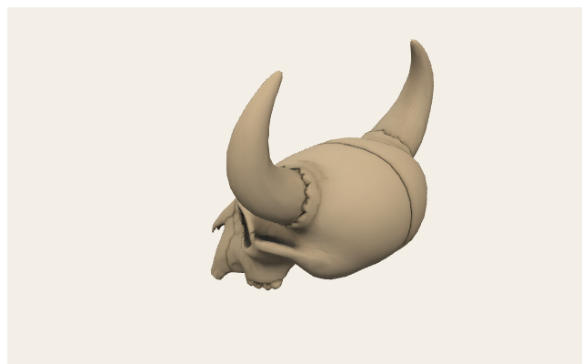

Root AABB (-0.194, 0, -0.202) → (0.194, 0.42, 0.202)

<svg xmlns="http://www.w3.org/2000/svg" width="760" height="520" viewBox="0 0 760 520">
<rect x="0" y="0" width="760" height="520" fill="#f4efe6"/>
<rect x="56" y="36" width="686" height="444" fill="#efe8dc" stroke="#1a1a1a" stroke-width="2"/>
<line x1="56.0" y1="36" x2="56.0" y2="480" stroke="#c4b8a4" stroke-width="1"/>
<line x1="141.8" y1="36" x2="141.8" y2="480" stroke="#ddd4c6" stroke-width="0.6"/>
<line x1="227.5" y1="36" x2="227.5" y2="480" stroke="#ddd4c6" stroke-width="0.6"/>
<line x1="313.3" y1="36" x2="313.3" y2="480" stroke="#ddd4c6" stroke-width="0.6"/>
<line x1="399.0" y1="36" x2="399.0" y2="480" stroke="#e03131" stroke-width="2"/>
<line x1="484.8" y1="36" x2="484.8" y2="480" stroke="#ddd4c6" stroke-width="0.6"/>
<line x1="570.5" y1="36" x2="570.5" y2="480" stroke="#ddd4c6" stroke-width="0.6"/>
<line x1="656.3" y1="36" x2="656.3" y2="480" stroke="#ddd4c6" stroke-width="0.6"/>
<line x1="742.0" y1="36" x2="742.0" y2="480" stroke="#c4b8a4" stroke-width="1"/>
<line x1="56" y1="480.0" x2="742" y2="480.0" stroke="#c4b8a4" stroke-width="1"/>
<line x1="56" y1="424.5" x2="742" y2="424.5" stroke="#ddd4c6" stroke-width="0.6"/>
<line x1="56" y1="369.0" x2="742" y2="369.0" stroke="#ddd4c6" stroke-width="0.6"/>
<line x1="56" y1="313.5" x2="742" y2="313.5" stroke="#ddd4c6" stroke-width="0.6"/>
<line x1="56" y1="258.0" x2="742" y2="258.0" stroke="#339af0" stroke-width="2"/>
<line x1="56" y1="202.5" x2="742" y2="202.5" stroke="#ddd4c6" stroke-width="0.6"/>
<line x1="56" y1="147.0" x2="742" y2="147.0" stroke="#ddd4c6" stroke-width="0.6"/>
<line x1="56" y1="91.5" x2="742" y2="91.5" stroke="#ddd4c6" stroke-width="0.6"/>
<line x1="56" y1="36.0" x2="742" y2="36.0" stroke="#c4b8a4" stroke-width="1"/>
<text x="56.0" y="496" text-anchor="middle" font-size="11" font-family="ui-monospace,monospace" fill="#1a1a1a">-1</text>
<text x="399.0" y="496" text-anchor="middle" font-size="11" font-family="ui-monospace,monospace" fill="#1a1a1a">0</text>
<text x="742.0" y="496" text-anchor="middle" font-size="11" font-family="ui-monospace,monospace" fill="#1a1a1a">1</text>
<text x="48" y="484.0" text-anchor="end" font-size="11" font-family="ui-monospace,monospace" fill="#1a1a1a">-1</text>
<text x="48" y="262.0" text-anchor="end" font-size="11" font-family="ui-monospace,monospace" fill="#1a1a1a">0</text>
<text x="48" y="40.0" text-anchor="end" font-size="11" font-family="ui-monospace,monospace" fill="#1a1a1a">1</text>
<rect x="332.6" y="213.2" width="132.8" height="89.6" fill="#f08c0033" stroke="#f08c00" stroke-width="1.6"/>
<text x="399.0" y="258.0" text-anchor="middle" font-size="10" font-family="ui-sans-serif,sans-serif" font-weight="700" fill="#1a1a1a">tripo_node_70e11871-4fb1-44b8-877b-f03345b09a4d</text>
<text x="380" y="22" text-anchor="middle" font-size="14" font-family="ui-sans-serif,sans-serif" font-weight="800" fill="#1a1a1a">public/models/props/buggy-skull.glb — top XZ</text>
<text x="380" y="512" text-anchor="middle" font-size="11" font-family="ui-sans-serif,sans-serif" fill="#5c564c">+X → right · +Z → up · origin = red (+X) / blue (+Z) · meters</text>
</svg>

| Node | Mesh | Prims | Verts | Center xyz | AABB min → max | Materials |
| --- | --- | --- | --- | --- | --- | --- |
| `tripo_node_70e11871-4fb1-44b8-877b-f03345b09a4d` | `tripo_mesh_70e11871-4fb1-44b8-877b-f03345b09a4d` | 1 | 3871 | (0, 0.21, 0) | (-0.194, 0, -0.202) → (0.194, 0.42, 0.202) | Skull |

## Part / extra `public/models/props/buggy-bird.glb`

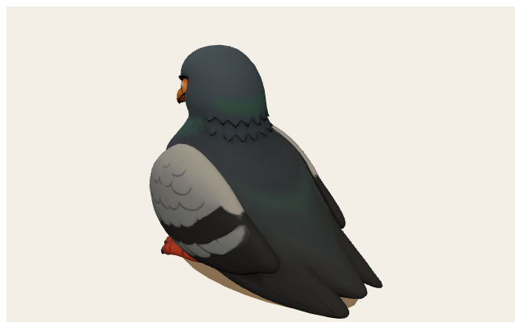

Root AABB (-0.2, 0, -0.133) → (0.2, 0.36, 0.133)

<svg xmlns="http://www.w3.org/2000/svg" width="760" height="520" viewBox="0 0 760 520">
<rect x="0" y="0" width="760" height="520" fill="#f4efe6"/>
<rect x="56" y="36" width="686" height="444" fill="#efe8dc" stroke="#1a1a1a" stroke-width="2"/>
<line x1="56.0" y1="36" x2="56.0" y2="480" stroke="#c4b8a4" stroke-width="1"/>
<line x1="141.8" y1="36" x2="141.8" y2="480" stroke="#ddd4c6" stroke-width="0.6"/>
<line x1="227.5" y1="36" x2="227.5" y2="480" stroke="#ddd4c6" stroke-width="0.6"/>
<line x1="313.3" y1="36" x2="313.3" y2="480" stroke="#ddd4c6" stroke-width="0.6"/>
<line x1="399.0" y1="36" x2="399.0" y2="480" stroke="#e03131" stroke-width="2"/>
<line x1="484.8" y1="36" x2="484.8" y2="480" stroke="#ddd4c6" stroke-width="0.6"/>
<line x1="570.5" y1="36" x2="570.5" y2="480" stroke="#ddd4c6" stroke-width="0.6"/>
<line x1="656.3" y1="36" x2="656.3" y2="480" stroke="#ddd4c6" stroke-width="0.6"/>
<line x1="742.0" y1="36" x2="742.0" y2="480" stroke="#c4b8a4" stroke-width="1"/>
<line x1="56" y1="480.0" x2="742" y2="480.0" stroke="#c4b8a4" stroke-width="1"/>
<line x1="56" y1="424.5" x2="742" y2="424.5" stroke="#ddd4c6" stroke-width="0.6"/>
<line x1="56" y1="369.0" x2="742" y2="369.0" stroke="#ddd4c6" stroke-width="0.6"/>
<line x1="56" y1="313.5" x2="742" y2="313.5" stroke="#ddd4c6" stroke-width="0.6"/>
<line x1="56" y1="258.0" x2="742" y2="258.0" stroke="#339af0" stroke-width="2"/>
<line x1="56" y1="202.5" x2="742" y2="202.5" stroke="#ddd4c6" stroke-width="0.6"/>
<line x1="56" y1="147.0" x2="742" y2="147.0" stroke="#ddd4c6" stroke-width="0.6"/>
<line x1="56" y1="91.5" x2="742" y2="91.5" stroke="#ddd4c6" stroke-width="0.6"/>
<line x1="56" y1="36.0" x2="742" y2="36.0" stroke="#c4b8a4" stroke-width="1"/>
<text x="56.0" y="496" text-anchor="middle" font-size="11" font-family="ui-monospace,monospace" fill="#1a1a1a">-1</text>
<text x="399.0" y="496" text-anchor="middle" font-size="11" font-family="ui-monospace,monospace" fill="#1a1a1a">0</text>
<text x="742.0" y="496" text-anchor="middle" font-size="11" font-family="ui-monospace,monospace" fill="#1a1a1a">1</text>
<text x="48" y="484.0" text-anchor="end" font-size="11" font-family="ui-monospace,monospace" fill="#1a1a1a">-1</text>
<text x="48" y="262.0" text-anchor="end" font-size="11" font-family="ui-monospace,monospace" fill="#1a1a1a">0</text>
<text x="48" y="40.0" text-anchor="end" font-size="11" font-family="ui-monospace,monospace" fill="#1a1a1a">1</text>
<rect x="330.6" y="228.4" width="136.9" height="59.1" fill="#f08c0033" stroke="#f08c00" stroke-width="1.6"/>
<text x="399.0" y="258.0" text-anchor="middle" font-size="10" font-family="ui-sans-serif,sans-serif" font-weight="700" fill="#1a1a1a">tripo_node_a750fc5f-d8c9-48a5-be59-5d614ab4cca3</text>
<text x="380" y="22" text-anchor="middle" font-size="14" font-family="ui-sans-serif,sans-serif" font-weight="800" fill="#1a1a1a">public/models/props/buggy-bird.glb — top XZ</text>
<text x="380" y="512" text-anchor="middle" font-size="11" font-family="ui-sans-serif,sans-serif" fill="#5c564c">+X → right · +Z → up · origin = red (+X) / blue (+Z) · meters</text>
</svg>

| Node | Mesh | Prims | Verts | Center xyz | AABB min → max | Materials |
| --- | --- | --- | --- | --- | --- | --- |
| `tripo_node_a750fc5f-d8c9-48a5-be59-5d614ab4cca3` | `tripo_mesh_a750fc5f-d8c9-48a5-be59-5d614ab4cca3` | 1 | 3847 | (0, 0.18, 0) | (-0.2, 0, -0.133) → (0.2, 0.36, 0.133) | Body |

## Part / extra `public/models/props/buggy-dog.glb`

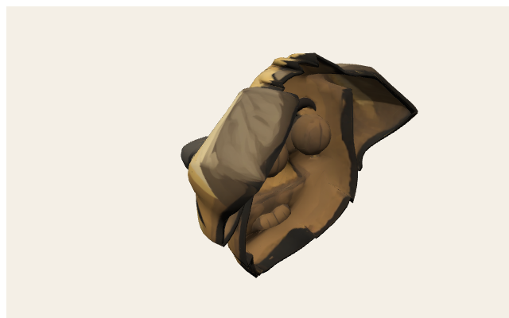

Root AABB (-0.174, 0, -0.207) → (0.174, 0.4, 0.207)

<svg xmlns="http://www.w3.org/2000/svg" width="760" height="520" viewBox="0 0 760 520">
<rect x="0" y="0" width="760" height="520" fill="#f4efe6"/>
<rect x="56" y="36" width="686" height="444" fill="#efe8dc" stroke="#1a1a1a" stroke-width="2"/>
<line x1="56.0" y1="36" x2="56.0" y2="480" stroke="#c4b8a4" stroke-width="1"/>
<line x1="141.8" y1="36" x2="141.8" y2="480" stroke="#ddd4c6" stroke-width="0.6"/>
<line x1="227.5" y1="36" x2="227.5" y2="480" stroke="#ddd4c6" stroke-width="0.6"/>
<line x1="313.3" y1="36" x2="313.3" y2="480" stroke="#ddd4c6" stroke-width="0.6"/>
<line x1="399.0" y1="36" x2="399.0" y2="480" stroke="#e03131" stroke-width="2"/>
<line x1="484.8" y1="36" x2="484.8" y2="480" stroke="#ddd4c6" stroke-width="0.6"/>
<line x1="570.5" y1="36" x2="570.5" y2="480" stroke="#ddd4c6" stroke-width="0.6"/>
<line x1="656.3" y1="36" x2="656.3" y2="480" stroke="#ddd4c6" stroke-width="0.6"/>
<line x1="742.0" y1="36" x2="742.0" y2="480" stroke="#c4b8a4" stroke-width="1"/>
<line x1="56" y1="480.0" x2="742" y2="480.0" stroke="#c4b8a4" stroke-width="1"/>
<line x1="56" y1="424.5" x2="742" y2="424.5" stroke="#ddd4c6" stroke-width="0.6"/>
<line x1="56" y1="369.0" x2="742" y2="369.0" stroke="#ddd4c6" stroke-width="0.6"/>
<line x1="56" y1="313.5" x2="742" y2="313.5" stroke="#ddd4c6" stroke-width="0.6"/>
<line x1="56" y1="258.0" x2="742" y2="258.0" stroke="#339af0" stroke-width="2"/>
<line x1="56" y1="202.5" x2="742" y2="202.5" stroke="#ddd4c6" stroke-width="0.6"/>
<line x1="56" y1="147.0" x2="742" y2="147.0" stroke="#ddd4c6" stroke-width="0.6"/>
<line x1="56" y1="91.5" x2="742" y2="91.5" stroke="#ddd4c6" stroke-width="0.6"/>
<line x1="56" y1="36.0" x2="742" y2="36.0" stroke="#c4b8a4" stroke-width="1"/>
<text x="56.0" y="496" text-anchor="middle" font-size="11" font-family="ui-monospace,monospace" fill="#1a1a1a">-1</text>
<text x="399.0" y="496" text-anchor="middle" font-size="11" font-family="ui-monospace,monospace" fill="#1a1a1a">0</text>
<text x="742.0" y="496" text-anchor="middle" font-size="11" font-family="ui-monospace,monospace" fill="#1a1a1a">1</text>
<text x="48" y="484.0" text-anchor="end" font-size="11" font-family="ui-monospace,monospace" fill="#1a1a1a">-1</text>
<text x="48" y="262.0" text-anchor="end" font-size="11" font-family="ui-monospace,monospace" fill="#1a1a1a">0</text>
<text x="48" y="40.0" text-anchor="end" font-size="11" font-family="ui-monospace,monospace" fill="#1a1a1a">1</text>
<rect x="339.3" y="212.0" width="119.4" height="92.0" fill="#f08c0033" stroke="#f08c00" stroke-width="1.6"/>
<text x="399.0" y="258.0" text-anchor="middle" font-size="10" font-family="ui-sans-serif,sans-serif" font-weight="700" fill="#1a1a1a">tripo_node_8d6dc335-3e1e-4e8a-9dee-bcb8db18fa99</text>
<text x="380" y="22" text-anchor="middle" font-size="14" font-family="ui-sans-serif,sans-serif" font-weight="800" fill="#1a1a1a">public/models/props/buggy-dog.glb — top XZ</text>
<text x="380" y="512" text-anchor="middle" font-size="11" font-family="ui-sans-serif,sans-serif" fill="#5c564c">+X → right · +Z → up · origin = red (+X) / blue (+Z) · meters</text>
</svg>

| Node | Mesh | Prims | Verts | Center xyz | AABB min → max | Materials |
| --- | --- | --- | --- | --- | --- | --- |
| `tripo_node_8d6dc335-3e1e-4e8a-9dee-bcb8db18fa99` | `tripo_mesh_8d6dc335-3e1e-4e8a-9dee-bcb8db18fa99` | 1 | 7120 | (0, 0.2, 0) | (-0.174, 0, -0.207) → (0.174, 0.4, 0.207) | Body |
