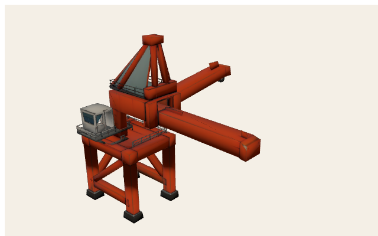
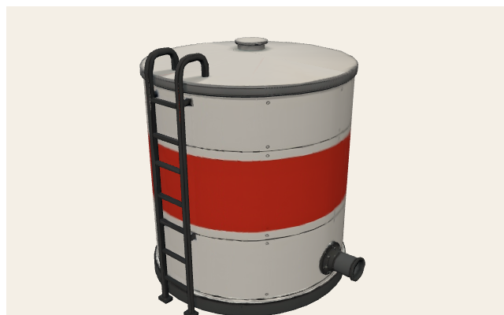
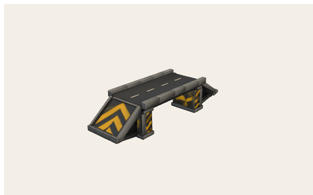

# Brückenkreuz — track cheat sheet

Level id: `blitz_cup_06_brueckenkreuz` · theme: `overpass` · free/training reuse this layout. Ad-hoc maps theme `overpass` onto the same kit.

## Identity

| Field | Value |
| --- | --- |
| Cup id | `blitz_cup_06_brueckenkreuz` |
| Display | Brückenkreuz |
| Theme | `overpass` |
| Asphalt width | 11 m |
| Grass width | 3 m |
| Walls | tires in corners, concrete on straights + fence on jersey |
| Centerline length (approx) | 701.1 m |
| Heading 0 | Gerono ∞, elevated deck at origin cross |
| 3D | Authored elevation — Brücke kit at crossing (CONCEPT §4.4.1) |

## World grid (XZ, meters)

Black polyline = centerline. Orange = ribbon hazards (on asphalt). Red = verge solids (grass). Origin = start/S-F.

<svg xmlns="http://www.w3.org/2000/svg" width="820" height="640" viewBox="0 0 820 640">
<rect x="0" y="0" width="820" height="640" fill="#f4efe6"/>
<rect x="56" y="36" width="746" height="564" fill="#efe8dc" stroke="#1a1a1a" stroke-width="2"/>
<line x1="56.0" y1="36" x2="56.0" y2="600" stroke="#c4b8a4" stroke-width="1"/>
<line x1="80.9" y1="36" x2="80.9" y2="600" stroke="#ddd4c6" stroke-width="0.6"/>
<line x1="105.7" y1="36" x2="105.7" y2="600" stroke="#ddd4c6" stroke-width="0.6"/>
<line x1="130.6" y1="36" x2="130.6" y2="600" stroke="#ddd4c6" stroke-width="0.6"/>
<line x1="155.5" y1="36" x2="155.5" y2="600" stroke="#ddd4c6" stroke-width="0.6"/>
<line x1="180.3" y1="36" x2="180.3" y2="600" stroke="#c4b8a4" stroke-width="1"/>
<line x1="205.2" y1="36" x2="205.2" y2="600" stroke="#ddd4c6" stroke-width="0.6"/>
<line x1="230.1" y1="36" x2="230.1" y2="600" stroke="#ddd4c6" stroke-width="0.6"/>
<line x1="254.9" y1="36" x2="254.9" y2="600" stroke="#ddd4c6" stroke-width="0.6"/>
<line x1="279.8" y1="36" x2="279.8" y2="600" stroke="#ddd4c6" stroke-width="0.6"/>
<line x1="304.7" y1="36" x2="304.7" y2="600" stroke="#c4b8a4" stroke-width="1"/>
<line x1="329.5" y1="36" x2="329.5" y2="600" stroke="#ddd4c6" stroke-width="0.6"/>
<line x1="354.4" y1="36" x2="354.4" y2="600" stroke="#ddd4c6" stroke-width="0.6"/>
<line x1="379.3" y1="36" x2="379.3" y2="600" stroke="#ddd4c6" stroke-width="0.6"/>
<line x1="404.1" y1="36" x2="404.1" y2="600" stroke="#ddd4c6" stroke-width="0.6"/>
<line x1="429.0" y1="36" x2="429.0" y2="600" stroke="#e03131" stroke-width="2"/>
<line x1="453.9" y1="36" x2="453.9" y2="600" stroke="#ddd4c6" stroke-width="0.6"/>
<line x1="478.7" y1="36" x2="478.7" y2="600" stroke="#ddd4c6" stroke-width="0.6"/>
<line x1="503.6" y1="36" x2="503.6" y2="600" stroke="#ddd4c6" stroke-width="0.6"/>
<line x1="528.5" y1="36" x2="528.5" y2="600" stroke="#ddd4c6" stroke-width="0.6"/>
<line x1="553.3" y1="36" x2="553.3" y2="600" stroke="#c4b8a4" stroke-width="1"/>
<line x1="578.2" y1="36" x2="578.2" y2="600" stroke="#ddd4c6" stroke-width="0.6"/>
<line x1="603.1" y1="36" x2="603.1" y2="600" stroke="#ddd4c6" stroke-width="0.6"/>
<line x1="627.9" y1="36" x2="627.9" y2="600" stroke="#ddd4c6" stroke-width="0.6"/>
<line x1="652.8" y1="36" x2="652.8" y2="600" stroke="#ddd4c6" stroke-width="0.6"/>
<line x1="677.7" y1="36" x2="677.7" y2="600" stroke="#c4b8a4" stroke-width="1"/>
<line x1="702.5" y1="36" x2="702.5" y2="600" stroke="#ddd4c6" stroke-width="0.6"/>
<line x1="727.4" y1="36" x2="727.4" y2="600" stroke="#ddd4c6" stroke-width="0.6"/>
<line x1="752.3" y1="36" x2="752.3" y2="600" stroke="#ddd4c6" stroke-width="0.6"/>
<line x1="777.1" y1="36" x2="777.1" y2="600" stroke="#ddd4c6" stroke-width="0.6"/>
<line x1="802.0" y1="36" x2="802.0" y2="600" stroke="#c4b8a4" stroke-width="1"/>
<line x1="56" y1="600.0" x2="802" y2="600.0" stroke="#c4b8a4" stroke-width="1"/>
<line x1="56" y1="571.8" x2="802" y2="571.8" stroke="#ddd4c6" stroke-width="0.6"/>
<line x1="56" y1="543.6" x2="802" y2="543.6" stroke="#ddd4c6" stroke-width="0.6"/>
<line x1="56" y1="515.4" x2="802" y2="515.4" stroke="#ddd4c6" stroke-width="0.6"/>
<line x1="56" y1="487.2" x2="802" y2="487.2" stroke="#ddd4c6" stroke-width="0.6"/>
<line x1="56" y1="459.0" x2="802" y2="459.0" stroke="#c4b8a4" stroke-width="1"/>
<line x1="56" y1="430.8" x2="802" y2="430.8" stroke="#ddd4c6" stroke-width="0.6"/>
<line x1="56" y1="402.6" x2="802" y2="402.6" stroke="#ddd4c6" stroke-width="0.6"/>
<line x1="56" y1="374.4" x2="802" y2="374.4" stroke="#ddd4c6" stroke-width="0.6"/>
<line x1="56" y1="346.2" x2="802" y2="346.2" stroke="#ddd4c6" stroke-width="0.6"/>
<line x1="56" y1="318.0" x2="802" y2="318.0" stroke="#339af0" stroke-width="2"/>
<line x1="56" y1="289.8" x2="802" y2="289.8" stroke="#ddd4c6" stroke-width="0.6"/>
<line x1="56" y1="261.6" x2="802" y2="261.6" stroke="#ddd4c6" stroke-width="0.6"/>
<line x1="56" y1="233.4" x2="802" y2="233.4" stroke="#ddd4c6" stroke-width="0.6"/>
<line x1="56" y1="205.2" x2="802" y2="205.2" stroke="#ddd4c6" stroke-width="0.6"/>
<line x1="56" y1="177.0" x2="802" y2="177.0" stroke="#c4b8a4" stroke-width="1"/>
<line x1="56" y1="148.8" x2="802" y2="148.8" stroke="#ddd4c6" stroke-width="0.6"/>
<line x1="56" y1="120.6" x2="802" y2="120.6" stroke="#ddd4c6" stroke-width="0.6"/>
<line x1="56" y1="92.4" x2="802" y2="92.4" stroke="#ddd4c6" stroke-width="0.6"/>
<line x1="56" y1="64.2" x2="802" y2="64.2" stroke="#ddd4c6" stroke-width="0.6"/>
<line x1="56" y1="36.0" x2="802" y2="36.0" stroke="#c4b8a4" stroke-width="1"/>
<text x="56.0" y="616" text-anchor="middle" font-size="11" font-family="ui-monospace,monospace" fill="#1a1a1a">-150</text>
<text x="180.3" y="616" text-anchor="middle" font-size="11" font-family="ui-monospace,monospace" fill="#1a1a1a">-100</text>
<text x="304.7" y="616" text-anchor="middle" font-size="11" font-family="ui-monospace,monospace" fill="#1a1a1a">-50</text>
<text x="429.0" y="616" text-anchor="middle" font-size="11" font-family="ui-monospace,monospace" fill="#1a1a1a">0</text>
<text x="553.3" y="616" text-anchor="middle" font-size="11" font-family="ui-monospace,monospace" fill="#1a1a1a">50</text>
<text x="677.7" y="616" text-anchor="middle" font-size="11" font-family="ui-monospace,monospace" fill="#1a1a1a">100</text>
<text x="802.0" y="616" text-anchor="middle" font-size="11" font-family="ui-monospace,monospace" fill="#1a1a1a">150</text>
<text x="48" y="604.0" text-anchor="end" font-size="11" font-family="ui-monospace,monospace" fill="#1a1a1a">-100</text>
<text x="48" y="463.0" text-anchor="end" font-size="11" font-family="ui-monospace,monospace" fill="#1a1a1a">-50</text>
<text x="48" y="322.0" text-anchor="end" font-size="11" font-family="ui-monospace,monospace" fill="#1a1a1a">0</text>
<text x="48" y="181.0" text-anchor="end" font-size="11" font-family="ui-monospace,monospace" fill="#1a1a1a">50</text>
<text x="48" y="40.0" text-anchor="end" font-size="11" font-family="ui-monospace,monospace" fill="#1a1a1a">100</text>
<path d="M715.0,318.0 L714.9,309.5 L714.6,301.1 L714.1,292.6 L713.4,284.3 L712.5,276.0 L711.4,267.9 L710.2,259.9 L708.7,252.0 L707.1,244.4 L705.2,236.9 L703.2,229.7 L701.0,222.7 L698.6,216.0 L696.0,209.5 L693.2,203.3 L690.2,197.5 L687.1,192.0 L683.8,186.8 L680.3,182.0 L676.7,177.6 L672.8,173.5 L668.8,169.9 L664.7,166.6 L660.4,163.8 L655.9,161.4 L651.2,159.4 L646.5,157.8 L641.5,156.7 L636.4,156.1 L631.2,155.9 L625.8,156.1 L620.3,156.7 L614.7,157.8 L609.0,159.4 L603.1,161.4 L597.1,163.8 L591.0,166.6 L584.7,169.9 L578.4,173.5 L572.0,177.6 L565.5,182.0 L558.8,186.8 L552.1,192.0 L545.3,197.5 L538.4,203.3 L531.5,209.5 L524.5,216.0 L517.4,222.7 L510.2,229.7 L503.0,236.9 L495.8,244.4 L488.5,252.0 L481.1,259.9 L473.7,267.9 L466.3,276.0 L458.9,284.3 L451.4,292.6 L444.0,301.1 L436.5,309.5 L429.0,318.0 L421.5,326.5 L414.0,334.9 L406.6,343.4 L399.1,351.7 L391.7,360.0 L384.3,368.1 L376.9,376.1 L369.5,384.0 L362.2,391.6 L355.0,399.1 L347.8,406.3 L340.6,413.3 L333.5,420.0 L326.5,426.5 L319.6,432.7 L312.7,438.5 L305.9,444.0 L299.2,449.2 L292.5,454.0 L286.0,458.4 L279.6,462.5 L273.3,466.1 L267.0,469.4 L260.9,472.2 L254.9,474.6 L249.0,476.6 L243.3,478.2 L237.7,479.3 L232.2,479.9 L226.8,480.1 L221.6,479.9 L216.5,479.3 L211.5,478.2 L206.8,476.6 L202.1,474.6 L197.6,472.2 L193.3,469.4 L189.2,466.1 L185.2,462.5 L181.3,458.4 L177.7,454.0 L174.2,449.2 L170.9,444.0 L167.8,438.5 L164.8,432.7 L162.0,426.5 L159.4,420.0 L157.0,413.3 L154.8,406.3 L152.8,399.1 L150.9,391.6 L149.3,384.0 L147.8,376.1 L146.6,368.1 L145.5,360.0 L144.6,351.7 L143.9,343.4 L143.4,334.9 L143.1,326.5 L143.0,318.0 L143.1,309.5 L143.4,301.1 L143.9,292.6 L144.6,284.3 L145.5,276.0 L146.6,267.9 L147.8,259.9 L149.3,252.0 L150.9,244.4 L152.8,236.9 L154.8,229.7 L157.0,222.7 L159.4,216.0 L162.0,209.5 L164.8,203.3 L167.8,197.5 L170.9,192.0 L174.2,186.8 L177.7,182.0 L181.3,177.6 L185.2,173.5 L189.2,169.9 L193.3,166.6 L197.6,163.8 L202.1,161.4 L206.8,159.4 L211.5,157.8 L216.5,156.7 L221.6,156.1 L226.8,155.8 L232.2,156.1 L237.7,156.7 L243.3,157.8 L249.0,159.4 L254.9,161.4 L260.9,163.8 L267.0,166.6 L273.3,169.9 L279.6,173.5 L286.0,177.6 L292.5,182.0 L299.2,186.8 L305.9,192.0 L312.7,197.5 L319.6,203.3 L326.5,209.5 L333.5,216.0 L340.6,222.7 L347.8,229.7 L355.0,236.9 L362.2,244.4 L369.5,252.0 L376.9,259.9 L384.3,267.9 L391.7,276.0 L399.1,284.3 L406.6,292.6 L414.0,301.1 L421.5,309.5 L429.0,318.0 L436.5,326.5 L444.0,334.9 L451.4,343.4 L458.9,351.7 L466.3,360.0 L473.7,368.1 L481.1,376.1 L488.5,384.0 L495.8,391.6 L503.0,399.1 L510.2,406.3 L517.4,413.3 L524.5,420.0 L531.5,426.5 L538.4,432.7 L545.3,438.5 L552.1,444.0 L558.8,449.2 L565.5,454.0 L572.0,458.4 L578.4,462.5 L584.7,466.1 L591.0,469.4 L597.1,472.2 L603.1,474.6 L609.0,476.6 L614.7,478.2 L620.3,479.3 L625.8,479.9 L631.2,480.1 L636.4,479.9 L641.5,479.3 L646.5,478.2 L651.2,476.6 L655.9,474.6 L660.4,472.2 L664.7,469.4 L668.8,466.1 L672.8,462.5 L676.7,458.4 L680.3,454.0 L683.8,449.2 L687.1,444.0 L690.2,438.5 L693.2,432.7 L696.0,426.5 L698.6,420.0 L701.0,413.3 L703.2,406.3 L705.2,399.1 L707.1,391.6 L708.7,384.0 L710.2,376.1 L711.4,368.1 L712.5,360.0 L713.4,351.7 L714.1,343.4 L714.6,334.9 L714.9,326.5 L715.0,318.0" fill="none" stroke="#1a1a1a" stroke-width="3" stroke-linejoin="round"/>
<text x="410" y="22" text-anchor="middle" font-size="14" font-family="ui-sans-serif,sans-serif" font-weight="800" fill="#1a1a1a">Brückenkreuz — world XZ</text>
<text x="410" y="632" text-anchor="middle" font-size="11" font-family="ui-sans-serif,sans-serif" fill="#5c564c">+X → right · +Z → up · origin = red (+X) / blue (+Z) · meters</text>
</svg>

## Segments

| # | Type | Length / radius | Angle | Width |
| --- | --- | --- | --- | --- |
| 0 | `straight` | 120 m | — | 11 |
| 1 | `curve_r` | r 80 m | 200° | 11 |
| 2 | `straight` | 48 m | — | 11 |
| 3 | `curve_r` | r 80 m | 200° | 11 |
| 4 | `straight` | 48 m | — | 11 |

## Obstacles (authored)

| Kind | Type | Along (m) | Side | Kit GLB |
| --- | --- | --- | --- | --- |
| — | none authored (median planner may still add stacks) | — | — | — |

## Kit meshes used here

Shared walls on every cup: `tire-wall`, `concrete-wall`, `fence`. Theme scenery + obstacles below (local mesh space).

### `tire-wall` — `public/models/track/tire-wall.glb`

Root AABB (-0.748, 0, -0.748) → (0.748, 1.15, 0.748)

<svg xmlns="http://www.w3.org/2000/svg" width="760" height="520" viewBox="0 0 760 520">
<rect x="0" y="0" width="760" height="520" fill="#f4efe6"/>
<rect x="56" y="36" width="686" height="444" fill="#efe8dc" stroke="#1a1a1a" stroke-width="2"/>
<line x1="56.0" y1="36" x2="56.0" y2="480" stroke="#c4b8a4" stroke-width="1"/>
<line x1="98.9" y1="36" x2="98.9" y2="480" stroke="#ddd4c6" stroke-width="0.6"/>
<line x1="141.8" y1="36" x2="141.8" y2="480" stroke="#ddd4c6" stroke-width="0.6"/>
<line x1="184.6" y1="36" x2="184.6" y2="480" stroke="#ddd4c6" stroke-width="0.6"/>
<line x1="227.5" y1="36" x2="227.5" y2="480" stroke="#c4b8a4" stroke-width="1"/>
<line x1="270.4" y1="36" x2="270.4" y2="480" stroke="#ddd4c6" stroke-width="0.6"/>
<line x1="313.3" y1="36" x2="313.3" y2="480" stroke="#ddd4c6" stroke-width="0.6"/>
<line x1="356.1" y1="36" x2="356.1" y2="480" stroke="#ddd4c6" stroke-width="0.6"/>
<line x1="399.0" y1="36" x2="399.0" y2="480" stroke="#e03131" stroke-width="2"/>
<line x1="441.9" y1="36" x2="441.9" y2="480" stroke="#ddd4c6" stroke-width="0.6"/>
<line x1="484.8" y1="36" x2="484.8" y2="480" stroke="#ddd4c6" stroke-width="0.6"/>
<line x1="527.6" y1="36" x2="527.6" y2="480" stroke="#ddd4c6" stroke-width="0.6"/>
<line x1="570.5" y1="36" x2="570.5" y2="480" stroke="#c4b8a4" stroke-width="1"/>
<line x1="613.4" y1="36" x2="613.4" y2="480" stroke="#ddd4c6" stroke-width="0.6"/>
<line x1="656.3" y1="36" x2="656.3" y2="480" stroke="#ddd4c6" stroke-width="0.6"/>
<line x1="699.1" y1="36" x2="699.1" y2="480" stroke="#ddd4c6" stroke-width="0.6"/>
<line x1="742.0" y1="36" x2="742.0" y2="480" stroke="#c4b8a4" stroke-width="1"/>
<line x1="56" y1="480.0" x2="742" y2="480.0" stroke="#c4b8a4" stroke-width="1"/>
<line x1="56" y1="452.3" x2="742" y2="452.3" stroke="#ddd4c6" stroke-width="0.6"/>
<line x1="56" y1="424.5" x2="742" y2="424.5" stroke="#ddd4c6" stroke-width="0.6"/>
<line x1="56" y1="396.8" x2="742" y2="396.8" stroke="#ddd4c6" stroke-width="0.6"/>
<line x1="56" y1="369.0" x2="742" y2="369.0" stroke="#c4b8a4" stroke-width="1"/>
<line x1="56" y1="341.3" x2="742" y2="341.3" stroke="#ddd4c6" stroke-width="0.6"/>
<line x1="56" y1="313.5" x2="742" y2="313.5" stroke="#ddd4c6" stroke-width="0.6"/>
<line x1="56" y1="285.8" x2="742" y2="285.8" stroke="#ddd4c6" stroke-width="0.6"/>
<line x1="56" y1="258.0" x2="742" y2="258.0" stroke="#339af0" stroke-width="2"/>
<line x1="56" y1="230.3" x2="742" y2="230.3" stroke="#ddd4c6" stroke-width="0.6"/>
<line x1="56" y1="202.5" x2="742" y2="202.5" stroke="#ddd4c6" stroke-width="0.6"/>
<line x1="56" y1="174.8" x2="742" y2="174.8" stroke="#ddd4c6" stroke-width="0.6"/>
<line x1="56" y1="147.0" x2="742" y2="147.0" stroke="#c4b8a4" stroke-width="1"/>
<line x1="56" y1="119.3" x2="742" y2="119.3" stroke="#ddd4c6" stroke-width="0.6"/>
<line x1="56" y1="91.5" x2="742" y2="91.5" stroke="#ddd4c6" stroke-width="0.6"/>
<line x1="56" y1="63.8" x2="742" y2="63.8" stroke="#ddd4c6" stroke-width="0.6"/>
<line x1="56" y1="36.0" x2="742" y2="36.0" stroke="#c4b8a4" stroke-width="1"/>
<text x="56.0" y="496" text-anchor="middle" font-size="11" font-family="ui-monospace,monospace" fill="#1a1a1a">-2</text>
<text x="227.5" y="496" text-anchor="middle" font-size="11" font-family="ui-monospace,monospace" fill="#1a1a1a">-1</text>
<text x="399.0" y="496" text-anchor="middle" font-size="11" font-family="ui-monospace,monospace" fill="#1a1a1a">0</text>
<text x="570.5" y="496" text-anchor="middle" font-size="11" font-family="ui-monospace,monospace" fill="#1a1a1a">1</text>
<text x="742.0" y="496" text-anchor="middle" font-size="11" font-family="ui-monospace,monospace" fill="#1a1a1a">2</text>
<text x="48" y="484.0" text-anchor="end" font-size="11" font-family="ui-monospace,monospace" fill="#1a1a1a">-2</text>
<text x="48" y="373.0" text-anchor="end" font-size="11" font-family="ui-monospace,monospace" fill="#1a1a1a">-1</text>
<text x="48" y="262.0" text-anchor="end" font-size="11" font-family="ui-monospace,monospace" fill="#1a1a1a">0</text>
<text x="48" y="151.0" text-anchor="end" font-size="11" font-family="ui-monospace,monospace" fill="#1a1a1a">1</text>
<text x="48" y="40.0" text-anchor="end" font-size="11" font-family="ui-monospace,monospace" fill="#1a1a1a">2</text>
<rect x="270.8" y="175.0" width="256.4" height="166.0" fill="#f08c0033" stroke="#f08c00" stroke-width="1.6"/>
<text x="399.0" y="258.0" text-anchor="middle" font-size="10" font-family="ui-sans-serif,sans-serif" font-weight="700" fill="#1a1a1a">tripo_node_1690f1dc-740b-41df-9293-48c4d3fab1f2</text>
<text x="380" y="22" text-anchor="middle" font-size="14" font-family="ui-sans-serif,sans-serif" font-weight="800" fill="#1a1a1a">tire-wall — local XZ</text>
<text x="380" y="512" text-anchor="middle" font-size="11" font-family="ui-sans-serif,sans-serif" fill="#5c564c">+X → right · +Z → up · origin = red (+X) / blue (+Z) · meters</text>
</svg>

| Node | Mesh | Prims | Verts | Center xyz | AABB min → max | Materials |
| --- | --- | --- | --- | --- | --- | --- |
| `tripo_node_1690f1dc-740b-41df-9293-48c4d3fab1f2` | `tripo_mesh_1690f1dc-740b-41df-9293-48c4d3fab1f2` | 1 | 7888 | (0, 0.575, 0) | (-0.748, 0, -0.748) → (0.748, 1.15, 0.748) | tire-wall |

### `concrete-wall` — `public/models/track/concrete-wall.glb`

Root AABB (-1.674, 0, -0.567) → (1.674, 1.5, 0.567)

<svg xmlns="http://www.w3.org/2000/svg" width="760" height="520" viewBox="0 0 760 520">
<rect x="0" y="0" width="760" height="520" fill="#f4efe6"/>
<rect x="56" y="36" width="686" height="444" fill="#efe8dc" stroke="#1a1a1a" stroke-width="2"/>
<line x1="56.0" y1="36" x2="56.0" y2="480" stroke="#c4b8a4" stroke-width="1"/>
<line x1="84.6" y1="36" x2="84.6" y2="480" stroke="#ddd4c6" stroke-width="0.6"/>
<line x1="113.2" y1="36" x2="113.2" y2="480" stroke="#ddd4c6" stroke-width="0.6"/>
<line x1="141.8" y1="36" x2="141.8" y2="480" stroke="#ddd4c6" stroke-width="0.6"/>
<line x1="170.3" y1="36" x2="170.3" y2="480" stroke="#c4b8a4" stroke-width="1"/>
<line x1="198.9" y1="36" x2="198.9" y2="480" stroke="#ddd4c6" stroke-width="0.6"/>
<line x1="227.5" y1="36" x2="227.5" y2="480" stroke="#ddd4c6" stroke-width="0.6"/>
<line x1="256.1" y1="36" x2="256.1" y2="480" stroke="#ddd4c6" stroke-width="0.6"/>
<line x1="284.7" y1="36" x2="284.7" y2="480" stroke="#c4b8a4" stroke-width="1"/>
<line x1="313.3" y1="36" x2="313.3" y2="480" stroke="#ddd4c6" stroke-width="0.6"/>
<line x1="341.8" y1="36" x2="341.8" y2="480" stroke="#ddd4c6" stroke-width="0.6"/>
<line x1="370.4" y1="36" x2="370.4" y2="480" stroke="#ddd4c6" stroke-width="0.6"/>
<line x1="399.0" y1="36" x2="399.0" y2="480" stroke="#e03131" stroke-width="2"/>
<line x1="427.6" y1="36" x2="427.6" y2="480" stroke="#ddd4c6" stroke-width="0.6"/>
<line x1="456.2" y1="36" x2="456.2" y2="480" stroke="#ddd4c6" stroke-width="0.6"/>
<line x1="484.8" y1="36" x2="484.8" y2="480" stroke="#ddd4c6" stroke-width="0.6"/>
<line x1="513.3" y1="36" x2="513.3" y2="480" stroke="#c4b8a4" stroke-width="1"/>
<line x1="541.9" y1="36" x2="541.9" y2="480" stroke="#ddd4c6" stroke-width="0.6"/>
<line x1="570.5" y1="36" x2="570.5" y2="480" stroke="#ddd4c6" stroke-width="0.6"/>
<line x1="599.1" y1="36" x2="599.1" y2="480" stroke="#ddd4c6" stroke-width="0.6"/>
<line x1="627.7" y1="36" x2="627.7" y2="480" stroke="#c4b8a4" stroke-width="1"/>
<line x1="656.3" y1="36" x2="656.3" y2="480" stroke="#ddd4c6" stroke-width="0.6"/>
<line x1="684.8" y1="36" x2="684.8" y2="480" stroke="#ddd4c6" stroke-width="0.6"/>
<line x1="713.4" y1="36" x2="713.4" y2="480" stroke="#ddd4c6" stroke-width="0.6"/>
<line x1="742.0" y1="36" x2="742.0" y2="480" stroke="#c4b8a4" stroke-width="1"/>
<line x1="56" y1="480.0" x2="742" y2="480.0" stroke="#c4b8a4" stroke-width="1"/>
<line x1="56" y1="452.3" x2="742" y2="452.3" stroke="#ddd4c6" stroke-width="0.6"/>
<line x1="56" y1="424.5" x2="742" y2="424.5" stroke="#ddd4c6" stroke-width="0.6"/>
<line x1="56" y1="396.8" x2="742" y2="396.8" stroke="#ddd4c6" stroke-width="0.6"/>
<line x1="56" y1="369.0" x2="742" y2="369.0" stroke="#c4b8a4" stroke-width="1"/>
<line x1="56" y1="341.3" x2="742" y2="341.3" stroke="#ddd4c6" stroke-width="0.6"/>
<line x1="56" y1="313.5" x2="742" y2="313.5" stroke="#ddd4c6" stroke-width="0.6"/>
<line x1="56" y1="285.8" x2="742" y2="285.8" stroke="#ddd4c6" stroke-width="0.6"/>
<line x1="56" y1="258.0" x2="742" y2="258.0" stroke="#339af0" stroke-width="2"/>
<line x1="56" y1="230.3" x2="742" y2="230.3" stroke="#ddd4c6" stroke-width="0.6"/>
<line x1="56" y1="202.5" x2="742" y2="202.5" stroke="#ddd4c6" stroke-width="0.6"/>
<line x1="56" y1="174.8" x2="742" y2="174.8" stroke="#ddd4c6" stroke-width="0.6"/>
<line x1="56" y1="147.0" x2="742" y2="147.0" stroke="#c4b8a4" stroke-width="1"/>
<line x1="56" y1="119.3" x2="742" y2="119.3" stroke="#ddd4c6" stroke-width="0.6"/>
<line x1="56" y1="91.5" x2="742" y2="91.5" stroke="#ddd4c6" stroke-width="0.6"/>
<line x1="56" y1="63.8" x2="742" y2="63.8" stroke="#ddd4c6" stroke-width="0.6"/>
<line x1="56" y1="36.0" x2="742" y2="36.0" stroke="#c4b8a4" stroke-width="1"/>
<text x="56.0" y="496" text-anchor="middle" font-size="11" font-family="ui-monospace,monospace" fill="#1a1a1a">-3</text>
<text x="170.3" y="496" text-anchor="middle" font-size="11" font-family="ui-monospace,monospace" fill="#1a1a1a">-2</text>
<text x="284.7" y="496" text-anchor="middle" font-size="11" font-family="ui-monospace,monospace" fill="#1a1a1a">-1</text>
<text x="399.0" y="496" text-anchor="middle" font-size="11" font-family="ui-monospace,monospace" fill="#1a1a1a">0</text>
<text x="513.3" y="496" text-anchor="middle" font-size="11" font-family="ui-monospace,monospace" fill="#1a1a1a">1</text>
<text x="627.7" y="496" text-anchor="middle" font-size="11" font-family="ui-monospace,monospace" fill="#1a1a1a">2</text>
<text x="742.0" y="496" text-anchor="middle" font-size="11" font-family="ui-monospace,monospace" fill="#1a1a1a">3</text>
<text x="48" y="484.0" text-anchor="end" font-size="11" font-family="ui-monospace,monospace" fill="#1a1a1a">-2</text>
<text x="48" y="373.0" text-anchor="end" font-size="11" font-family="ui-monospace,monospace" fill="#1a1a1a">-1</text>
<text x="48" y="262.0" text-anchor="end" font-size="11" font-family="ui-monospace,monospace" fill="#1a1a1a">0</text>
<text x="48" y="151.0" text-anchor="end" font-size="11" font-family="ui-monospace,monospace" fill="#1a1a1a">1</text>
<text x="48" y="40.0" text-anchor="end" font-size="11" font-family="ui-monospace,monospace" fill="#1a1a1a">2</text>
<rect x="207.7" y="195.1" width="382.7" height="125.8" fill="#f08c0033" stroke="#f08c00" stroke-width="1.6"/>
<text x="399.0" y="258.0" text-anchor="middle" font-size="10" font-family="ui-sans-serif,sans-serif" font-weight="700" fill="#1a1a1a">tripo_node_84010e7e-9787-4553-87b7-5e8f1a925fc4</text>
<text x="380" y="22" text-anchor="middle" font-size="14" font-family="ui-sans-serif,sans-serif" font-weight="800" fill="#1a1a1a">concrete-wall — local XZ</text>
<text x="380" y="512" text-anchor="middle" font-size="11" font-family="ui-sans-serif,sans-serif" fill="#5c564c">+X → right · +Z → up · origin = red (+X) / blue (+Z) · meters</text>
</svg>

| Node | Mesh | Prims | Verts | Center xyz | AABB min → max | Materials |
| --- | --- | --- | --- | --- | --- | --- |
| `tripo_node_84010e7e-9787-4553-87b7-5e8f1a925fc4` | `tripo_mesh_84010e7e-9787-4553-87b7-5e8f1a925fc4` | 1 | 8163 | (0, 0.75, 0) | (-1.674, 0, -0.567) → (1.674, 1.5, 0.567) | concrete-wall |

### `fence` — `public/models/track/fence.glb`

Root AABB (-0.81, 0, -0.062) → (0.81, 1.1, 0.062)

<svg xmlns="http://www.w3.org/2000/svg" width="760" height="520" viewBox="0 0 760 520">
<rect x="0" y="0" width="760" height="520" fill="#f4efe6"/>
<rect x="56" y="36" width="686" height="444" fill="#efe8dc" stroke="#1a1a1a" stroke-width="2"/>
<line x1="56.0" y1="36" x2="56.0" y2="480" stroke="#c4b8a4" stroke-width="1"/>
<line x1="98.9" y1="36" x2="98.9" y2="480" stroke="#ddd4c6" stroke-width="0.6"/>
<line x1="141.8" y1="36" x2="141.8" y2="480" stroke="#ddd4c6" stroke-width="0.6"/>
<line x1="184.6" y1="36" x2="184.6" y2="480" stroke="#ddd4c6" stroke-width="0.6"/>
<line x1="227.5" y1="36" x2="227.5" y2="480" stroke="#c4b8a4" stroke-width="1"/>
<line x1="270.4" y1="36" x2="270.4" y2="480" stroke="#ddd4c6" stroke-width="0.6"/>
<line x1="313.3" y1="36" x2="313.3" y2="480" stroke="#ddd4c6" stroke-width="0.6"/>
<line x1="356.1" y1="36" x2="356.1" y2="480" stroke="#ddd4c6" stroke-width="0.6"/>
<line x1="399.0" y1="36" x2="399.0" y2="480" stroke="#e03131" stroke-width="2"/>
<line x1="441.9" y1="36" x2="441.9" y2="480" stroke="#ddd4c6" stroke-width="0.6"/>
<line x1="484.8" y1="36" x2="484.8" y2="480" stroke="#ddd4c6" stroke-width="0.6"/>
<line x1="527.6" y1="36" x2="527.6" y2="480" stroke="#ddd4c6" stroke-width="0.6"/>
<line x1="570.5" y1="36" x2="570.5" y2="480" stroke="#c4b8a4" stroke-width="1"/>
<line x1="613.4" y1="36" x2="613.4" y2="480" stroke="#ddd4c6" stroke-width="0.6"/>
<line x1="656.3" y1="36" x2="656.3" y2="480" stroke="#ddd4c6" stroke-width="0.6"/>
<line x1="699.1" y1="36" x2="699.1" y2="480" stroke="#ddd4c6" stroke-width="0.6"/>
<line x1="742.0" y1="36" x2="742.0" y2="480" stroke="#c4b8a4" stroke-width="1"/>
<line x1="56" y1="480.0" x2="742" y2="480.0" stroke="#c4b8a4" stroke-width="1"/>
<line x1="56" y1="424.5" x2="742" y2="424.5" stroke="#ddd4c6" stroke-width="0.6"/>
<line x1="56" y1="369.0" x2="742" y2="369.0" stroke="#ddd4c6" stroke-width="0.6"/>
<line x1="56" y1="313.5" x2="742" y2="313.5" stroke="#ddd4c6" stroke-width="0.6"/>
<line x1="56" y1="258.0" x2="742" y2="258.0" stroke="#339af0" stroke-width="2"/>
<line x1="56" y1="202.5" x2="742" y2="202.5" stroke="#ddd4c6" stroke-width="0.6"/>
<line x1="56" y1="147.0" x2="742" y2="147.0" stroke="#ddd4c6" stroke-width="0.6"/>
<line x1="56" y1="91.5" x2="742" y2="91.5" stroke="#ddd4c6" stroke-width="0.6"/>
<line x1="56" y1="36.0" x2="742" y2="36.0" stroke="#c4b8a4" stroke-width="1"/>
<text x="56.0" y="496" text-anchor="middle" font-size="11" font-family="ui-monospace,monospace" fill="#1a1a1a">-2</text>
<text x="227.5" y="496" text-anchor="middle" font-size="11" font-family="ui-monospace,monospace" fill="#1a1a1a">-1</text>
<text x="399.0" y="496" text-anchor="middle" font-size="11" font-family="ui-monospace,monospace" fill="#1a1a1a">0</text>
<text x="570.5" y="496" text-anchor="middle" font-size="11" font-family="ui-monospace,monospace" fill="#1a1a1a">1</text>
<text x="742.0" y="496" text-anchor="middle" font-size="11" font-family="ui-monospace,monospace" fill="#1a1a1a">2</text>
<text x="48" y="484.0" text-anchor="end" font-size="11" font-family="ui-monospace,monospace" fill="#1a1a1a">-1</text>
<text x="48" y="262.0" text-anchor="end" font-size="11" font-family="ui-monospace,monospace" fill="#1a1a1a">0</text>
<text x="48" y="40.0" text-anchor="end" font-size="11" font-family="ui-monospace,monospace" fill="#1a1a1a">1</text>
<rect x="260.1" y="244.3" width="277.8" height="27.4" fill="#f08c0033" stroke="#f08c00" stroke-width="1.6"/>
<text x="399.0" y="258.0" text-anchor="middle" font-size="10" font-family="ui-sans-serif,sans-serif" font-weight="700" fill="#1a1a1a">tripo_node_f5dd3b5a-f1a7-42d6-8be4-dd5d7122fadb</text>
<text x="380" y="22" text-anchor="middle" font-size="14" font-family="ui-sans-serif,sans-serif" font-weight="800" fill="#1a1a1a">fence — local XZ</text>
<text x="380" y="512" text-anchor="middle" font-size="11" font-family="ui-sans-serif,sans-serif" fill="#5c564c">+X → right · +Z → up · origin = red (+X) / blue (+Z) · meters</text>
</svg>

| Node | Mesh | Prims | Verts | Center xyz | AABB min → max | Materials |
| --- | --- | --- | --- | --- | --- | --- |
| `tripo_node_f5dd3b5a-f1a7-42d6-8be4-dd5d7122fadb` | `tripo_mesh_f5dd3b5a-f1a7-42d6-8be4-dd5d7122fadb` | 1 | 11353 | (0, 0.55, 0) | (-0.81, 0, -0.062) → (0.81, 1.1, 0.062) | fence |

### `crane` — `public/models/track/crane.glb`

Root AABB (-9.444, 0, -8.409) → (9.444, 18, 8.409)

<svg xmlns="http://www.w3.org/2000/svg" width="760" height="520" viewBox="0 0 760 520">
<rect x="0" y="0" width="760" height="520" fill="#f4efe6"/>
<rect x="56" y="36" width="686" height="444" fill="#efe8dc" stroke="#1a1a1a" stroke-width="2"/>
<line x1="56.0" y1="36" x2="56.0" y2="480" stroke="#c4b8a4" stroke-width="1"/>
<line x1="78.9" y1="36" x2="78.9" y2="480" stroke="#ddd4c6" stroke-width="0.6"/>
<line x1="101.7" y1="36" x2="101.7" y2="480" stroke="#ddd4c6" stroke-width="0.6"/>
<line x1="124.6" y1="36" x2="124.6" y2="480" stroke="#ddd4c6" stroke-width="0.6"/>
<line x1="147.5" y1="36" x2="147.5" y2="480" stroke="#ddd4c6" stroke-width="0.6"/>
<line x1="170.3" y1="36" x2="170.3" y2="480" stroke="#c4b8a4" stroke-width="1"/>
<line x1="193.2" y1="36" x2="193.2" y2="480" stroke="#ddd4c6" stroke-width="0.6"/>
<line x1="216.1" y1="36" x2="216.1" y2="480" stroke="#ddd4c6" stroke-width="0.6"/>
<line x1="238.9" y1="36" x2="238.9" y2="480" stroke="#ddd4c6" stroke-width="0.6"/>
<line x1="261.8" y1="36" x2="261.8" y2="480" stroke="#ddd4c6" stroke-width="0.6"/>
<line x1="284.7" y1="36" x2="284.7" y2="480" stroke="#c4b8a4" stroke-width="1"/>
<line x1="307.5" y1="36" x2="307.5" y2="480" stroke="#ddd4c6" stroke-width="0.6"/>
<line x1="330.4" y1="36" x2="330.4" y2="480" stroke="#ddd4c6" stroke-width="0.6"/>
<line x1="353.3" y1="36" x2="353.3" y2="480" stroke="#ddd4c6" stroke-width="0.6"/>
<line x1="376.1" y1="36" x2="376.1" y2="480" stroke="#ddd4c6" stroke-width="0.6"/>
<line x1="399.0" y1="36" x2="399.0" y2="480" stroke="#e03131" stroke-width="2"/>
<line x1="421.9" y1="36" x2="421.9" y2="480" stroke="#ddd4c6" stroke-width="0.6"/>
<line x1="444.7" y1="36" x2="444.7" y2="480" stroke="#ddd4c6" stroke-width="0.6"/>
<line x1="467.6" y1="36" x2="467.6" y2="480" stroke="#ddd4c6" stroke-width="0.6"/>
<line x1="490.5" y1="36" x2="490.5" y2="480" stroke="#ddd4c6" stroke-width="0.6"/>
<line x1="513.3" y1="36" x2="513.3" y2="480" stroke="#c4b8a4" stroke-width="1"/>
<line x1="536.2" y1="36" x2="536.2" y2="480" stroke="#ddd4c6" stroke-width="0.6"/>
<line x1="559.1" y1="36" x2="559.1" y2="480" stroke="#ddd4c6" stroke-width="0.6"/>
<line x1="581.9" y1="36" x2="581.9" y2="480" stroke="#ddd4c6" stroke-width="0.6"/>
<line x1="604.8" y1="36" x2="604.8" y2="480" stroke="#ddd4c6" stroke-width="0.6"/>
<line x1="627.7" y1="36" x2="627.7" y2="480" stroke="#c4b8a4" stroke-width="1"/>
<line x1="650.5" y1="36" x2="650.5" y2="480" stroke="#ddd4c6" stroke-width="0.6"/>
<line x1="673.4" y1="36" x2="673.4" y2="480" stroke="#ddd4c6" stroke-width="0.6"/>
<line x1="696.3" y1="36" x2="696.3" y2="480" stroke="#ddd4c6" stroke-width="0.6"/>
<line x1="719.1" y1="36" x2="719.1" y2="480" stroke="#ddd4c6" stroke-width="0.6"/>
<line x1="742.0" y1="36" x2="742.0" y2="480" stroke="#c4b8a4" stroke-width="1"/>
<line x1="56" y1="480.0" x2="742" y2="480.0" stroke="#c4b8a4" stroke-width="1"/>
<line x1="56" y1="457.8" x2="742" y2="457.8" stroke="#ddd4c6" stroke-width="0.6"/>
<line x1="56" y1="435.6" x2="742" y2="435.6" stroke="#ddd4c6" stroke-width="0.6"/>
<line x1="56" y1="413.4" x2="742" y2="413.4" stroke="#ddd4c6" stroke-width="0.6"/>
<line x1="56" y1="391.2" x2="742" y2="391.2" stroke="#ddd4c6" stroke-width="0.6"/>
<line x1="56" y1="369.0" x2="742" y2="369.0" stroke="#c4b8a4" stroke-width="1"/>
<line x1="56" y1="346.8" x2="742" y2="346.8" stroke="#ddd4c6" stroke-width="0.6"/>
<line x1="56" y1="324.6" x2="742" y2="324.6" stroke="#ddd4c6" stroke-width="0.6"/>
<line x1="56" y1="302.4" x2="742" y2="302.4" stroke="#ddd4c6" stroke-width="0.6"/>
<line x1="56" y1="280.2" x2="742" y2="280.2" stroke="#ddd4c6" stroke-width="0.6"/>
<line x1="56" y1="258.0" x2="742" y2="258.0" stroke="#339af0" stroke-width="2"/>
<line x1="56" y1="235.8" x2="742" y2="235.8" stroke="#ddd4c6" stroke-width="0.6"/>
<line x1="56" y1="213.6" x2="742" y2="213.6" stroke="#ddd4c6" stroke-width="0.6"/>
<line x1="56" y1="191.4" x2="742" y2="191.4" stroke="#ddd4c6" stroke-width="0.6"/>
<line x1="56" y1="169.2" x2="742" y2="169.2" stroke="#ddd4c6" stroke-width="0.6"/>
<line x1="56" y1="147.0" x2="742" y2="147.0" stroke="#c4b8a4" stroke-width="1"/>
<line x1="56" y1="124.8" x2="742" y2="124.8" stroke="#ddd4c6" stroke-width="0.6"/>
<line x1="56" y1="102.6" x2="742" y2="102.6" stroke="#ddd4c6" stroke-width="0.6"/>
<line x1="56" y1="80.4" x2="742" y2="80.4" stroke="#ddd4c6" stroke-width="0.6"/>
<line x1="56" y1="58.2" x2="742" y2="58.2" stroke="#ddd4c6" stroke-width="0.6"/>
<line x1="56" y1="36.0" x2="742" y2="36.0" stroke="#c4b8a4" stroke-width="1"/>
<text x="56.0" y="496" text-anchor="middle" font-size="11" font-family="ui-monospace,monospace" fill="#1a1a1a">-15</text>
<text x="170.3" y="496" text-anchor="middle" font-size="11" font-family="ui-monospace,monospace" fill="#1a1a1a">-10</text>
<text x="284.7" y="496" text-anchor="middle" font-size="11" font-family="ui-monospace,monospace" fill="#1a1a1a">-5</text>
<text x="399.0" y="496" text-anchor="middle" font-size="11" font-family="ui-monospace,monospace" fill="#1a1a1a">0</text>
<text x="513.3" y="496" text-anchor="middle" font-size="11" font-family="ui-monospace,monospace" fill="#1a1a1a">5</text>
<text x="627.7" y="496" text-anchor="middle" font-size="11" font-family="ui-monospace,monospace" fill="#1a1a1a">10</text>
<text x="742.0" y="496" text-anchor="middle" font-size="11" font-family="ui-monospace,monospace" fill="#1a1a1a">15</text>
<text x="48" y="484.0" text-anchor="end" font-size="11" font-family="ui-monospace,monospace" fill="#1a1a1a">-10</text>
<text x="48" y="373.0" text-anchor="end" font-size="11" font-family="ui-monospace,monospace" fill="#1a1a1a">-5</text>
<text x="48" y="262.0" text-anchor="end" font-size="11" font-family="ui-monospace,monospace" fill="#1a1a1a">0</text>
<text x="48" y="151.0" text-anchor="end" font-size="11" font-family="ui-monospace,monospace" fill="#1a1a1a">5</text>
<text x="48" y="40.0" text-anchor="end" font-size="11" font-family="ui-monospace,monospace" fill="#1a1a1a">10</text>
<rect x="183.1" y="71.3" width="431.9" height="373.3" fill="#f08c0033" stroke="#f08c00" stroke-width="1.6"/>
<text x="399.0" y="258.0" text-anchor="middle" font-size="10" font-family="ui-sans-serif,sans-serif" font-weight="700" fill="#1a1a1a">tripo_node_51b169a9-5d60-4288-a976-d3c674b4fac8</text>
<text x="380" y="22" text-anchor="middle" font-size="14" font-family="ui-sans-serif,sans-serif" font-weight="800" fill="#1a1a1a">crane — local XZ</text>
<text x="380" y="512" text-anchor="middle" font-size="11" font-family="ui-sans-serif,sans-serif" fill="#5c564c">+X → right · +Z → up · origin = red (+X) / blue (+Z) · meters</text>
</svg>

| Node | Mesh | Prims | Verts | Center xyz | AABB min → max | Materials |
| --- | --- | --- | --- | --- | --- | --- |
| `tripo_node_51b169a9-5d60-4288-a976-d3c674b4fac8` | `tripo_mesh_51b169a9-5d60-4288-a976-d3c674b4fac8` | 1 | 7973 | (0, 9, 0) | (-9.444, 0, -8.409) → (9.444, 18, 8.409) | crane |

### `container` — `public/models/track/container.glb`

Root AABB (-1.329, 0, -2.643) → (1.329, 2.7, 2.643)

<svg xmlns="http://www.w3.org/2000/svg" width="760" height="520" viewBox="0 0 760 520">
<rect x="0" y="0" width="760" height="520" fill="#f4efe6"/>
<rect x="56" y="36" width="686" height="444" fill="#efe8dc" stroke="#1a1a1a" stroke-width="2"/>
<line x1="56.0" y1="36" x2="56.0" y2="480" stroke="#c4b8a4" stroke-width="1"/>
<line x1="141.8" y1="36" x2="141.8" y2="480" stroke="#ddd4c6" stroke-width="0.6"/>
<line x1="227.5" y1="36" x2="227.5" y2="480" stroke="#ddd4c6" stroke-width="0.6"/>
<line x1="313.3" y1="36" x2="313.3" y2="480" stroke="#ddd4c6" stroke-width="0.6"/>
<line x1="399.0" y1="36" x2="399.0" y2="480" stroke="#e03131" stroke-width="2"/>
<line x1="484.8" y1="36" x2="484.8" y2="480" stroke="#ddd4c6" stroke-width="0.6"/>
<line x1="570.5" y1="36" x2="570.5" y2="480" stroke="#ddd4c6" stroke-width="0.6"/>
<line x1="656.3" y1="36" x2="656.3" y2="480" stroke="#ddd4c6" stroke-width="0.6"/>
<line x1="742.0" y1="36" x2="742.0" y2="480" stroke="#c4b8a4" stroke-width="1"/>
<line x1="56" y1="480.0" x2="742" y2="480.0" stroke="#c4b8a4" stroke-width="1"/>
<line x1="56" y1="452.3" x2="742" y2="452.3" stroke="#ddd4c6" stroke-width="0.6"/>
<line x1="56" y1="424.5" x2="742" y2="424.5" stroke="#ddd4c6" stroke-width="0.6"/>
<line x1="56" y1="396.8" x2="742" y2="396.8" stroke="#ddd4c6" stroke-width="0.6"/>
<line x1="56" y1="369.0" x2="742" y2="369.0" stroke="#c4b8a4" stroke-width="1"/>
<line x1="56" y1="341.3" x2="742" y2="341.3" stroke="#ddd4c6" stroke-width="0.6"/>
<line x1="56" y1="313.5" x2="742" y2="313.5" stroke="#ddd4c6" stroke-width="0.6"/>
<line x1="56" y1="285.8" x2="742" y2="285.8" stroke="#ddd4c6" stroke-width="0.6"/>
<line x1="56" y1="258.0" x2="742" y2="258.0" stroke="#339af0" stroke-width="2"/>
<line x1="56" y1="230.3" x2="742" y2="230.3" stroke="#ddd4c6" stroke-width="0.6"/>
<line x1="56" y1="202.5" x2="742" y2="202.5" stroke="#ddd4c6" stroke-width="0.6"/>
<line x1="56" y1="174.8" x2="742" y2="174.8" stroke="#ddd4c6" stroke-width="0.6"/>
<line x1="56" y1="147.0" x2="742" y2="147.0" stroke="#c4b8a4" stroke-width="1"/>
<line x1="56" y1="119.3" x2="742" y2="119.3" stroke="#ddd4c6" stroke-width="0.6"/>
<line x1="56" y1="91.5" x2="742" y2="91.5" stroke="#ddd4c6" stroke-width="0.6"/>
<line x1="56" y1="63.8" x2="742" y2="63.8" stroke="#ddd4c6" stroke-width="0.6"/>
<line x1="56" y1="36.0" x2="742" y2="36.0" stroke="#c4b8a4" stroke-width="1"/>
<text x="56.0" y="496" text-anchor="middle" font-size="11" font-family="ui-monospace,monospace" fill="#1a1a1a">-2</text>
<text x="399.0" y="496" text-anchor="middle" font-size="11" font-family="ui-monospace,monospace" fill="#1a1a1a">0</text>
<text x="742.0" y="496" text-anchor="middle" font-size="11" font-family="ui-monospace,monospace" fill="#1a1a1a">2</text>
<text x="48" y="484.0" text-anchor="end" font-size="11" font-family="ui-monospace,monospace" fill="#1a1a1a">-4</text>
<text x="48" y="373.0" text-anchor="end" font-size="11" font-family="ui-monospace,monospace" fill="#1a1a1a">-2</text>
<text x="48" y="262.0" text-anchor="end" font-size="11" font-family="ui-monospace,monospace" fill="#1a1a1a">0</text>
<text x="48" y="151.0" text-anchor="end" font-size="11" font-family="ui-monospace,monospace" fill="#1a1a1a">2</text>
<text x="48" y="40.0" text-anchor="end" font-size="11" font-family="ui-monospace,monospace" fill="#1a1a1a">4</text>
<rect x="171.0" y="111.3" width="456.0" height="293.4" fill="#f08c0033" stroke="#f08c00" stroke-width="1.6"/>
<text x="399.0" y="258.0" text-anchor="middle" font-size="10" font-family="ui-sans-serif,sans-serif" font-weight="700" fill="#1a1a1a">tripo_node_636ba7a6-4317-4385-9db4-c9999eff4eda</text>
<text x="380" y="22" text-anchor="middle" font-size="14" font-family="ui-sans-serif,sans-serif" font-weight="800" fill="#1a1a1a">container — local XZ</text>
<text x="380" y="512" text-anchor="middle" font-size="11" font-family="ui-sans-serif,sans-serif" fill="#5c564c">+X → right · +Z → up · origin = red (+X) / blue (+Z) · meters</text>
</svg>

| Node | Mesh | Prims | Verts | Center xyz | AABB min → max | Materials |
| --- | --- | --- | --- | --- | --- | --- |
| `tripo_node_636ba7a6-4317-4385-9db4-c9999eff4eda` | `tripo_mesh_636ba7a6-4317-4385-9db4-c9999eff4eda` | 1 | 6002 | (0, 1.35, 0) | (-1.329, 0, -2.643) → (1.329, 2.7, 2.643) | BodyPaint |

### `warehouse` — `public/models/track/warehouse.glb`

Root AABB (-6.26, 0, -7) → (6.26, 7.918, 7)

<svg xmlns="http://www.w3.org/2000/svg" width="760" height="520" viewBox="0 0 760 520">
<rect x="0" y="0" width="760" height="520" fill="#f4efe6"/>
<rect x="56" y="36" width="686" height="444" fill="#efe8dc" stroke="#1a1a1a" stroke-width="2"/>
<line x1="56.0" y1="36" x2="56.0" y2="480" stroke="#c4b8a4" stroke-width="1"/>
<line x1="77.4" y1="36" x2="77.4" y2="480" stroke="#ddd4c6" stroke-width="0.6"/>
<line x1="98.9" y1="36" x2="98.9" y2="480" stroke="#ddd4c6" stroke-width="0.6"/>
<line x1="120.3" y1="36" x2="120.3" y2="480" stroke="#ddd4c6" stroke-width="0.6"/>
<line x1="141.8" y1="36" x2="141.8" y2="480" stroke="#c4b8a4" stroke-width="1"/>
<line x1="163.2" y1="36" x2="163.2" y2="480" stroke="#ddd4c6" stroke-width="0.6"/>
<line x1="184.6" y1="36" x2="184.6" y2="480" stroke="#ddd4c6" stroke-width="0.6"/>
<line x1="206.1" y1="36" x2="206.1" y2="480" stroke="#ddd4c6" stroke-width="0.6"/>
<line x1="227.5" y1="36" x2="227.5" y2="480" stroke="#c4b8a4" stroke-width="1"/>
<line x1="248.9" y1="36" x2="248.9" y2="480" stroke="#ddd4c6" stroke-width="0.6"/>
<line x1="270.4" y1="36" x2="270.4" y2="480" stroke="#ddd4c6" stroke-width="0.6"/>
<line x1="291.8" y1="36" x2="291.8" y2="480" stroke="#ddd4c6" stroke-width="0.6"/>
<line x1="313.3" y1="36" x2="313.3" y2="480" stroke="#c4b8a4" stroke-width="1"/>
<line x1="334.7" y1="36" x2="334.7" y2="480" stroke="#ddd4c6" stroke-width="0.6"/>
<line x1="356.1" y1="36" x2="356.1" y2="480" stroke="#ddd4c6" stroke-width="0.6"/>
<line x1="377.6" y1="36" x2="377.6" y2="480" stroke="#ddd4c6" stroke-width="0.6"/>
<line x1="399.0" y1="36" x2="399.0" y2="480" stroke="#e03131" stroke-width="2"/>
<line x1="420.4" y1="36" x2="420.4" y2="480" stroke="#ddd4c6" stroke-width="0.6"/>
<line x1="441.9" y1="36" x2="441.9" y2="480" stroke="#ddd4c6" stroke-width="0.6"/>
<line x1="463.3" y1="36" x2="463.3" y2="480" stroke="#ddd4c6" stroke-width="0.6"/>
<line x1="484.8" y1="36" x2="484.8" y2="480" stroke="#c4b8a4" stroke-width="1"/>
<line x1="506.2" y1="36" x2="506.2" y2="480" stroke="#ddd4c6" stroke-width="0.6"/>
<line x1="527.6" y1="36" x2="527.6" y2="480" stroke="#ddd4c6" stroke-width="0.6"/>
<line x1="549.1" y1="36" x2="549.1" y2="480" stroke="#ddd4c6" stroke-width="0.6"/>
<line x1="570.5" y1="36" x2="570.5" y2="480" stroke="#c4b8a4" stroke-width="1"/>
<line x1="591.9" y1="36" x2="591.9" y2="480" stroke="#ddd4c6" stroke-width="0.6"/>
<line x1="613.4" y1="36" x2="613.4" y2="480" stroke="#ddd4c6" stroke-width="0.6"/>
<line x1="634.8" y1="36" x2="634.8" y2="480" stroke="#ddd4c6" stroke-width="0.6"/>
<line x1="656.3" y1="36" x2="656.3" y2="480" stroke="#c4b8a4" stroke-width="1"/>
<line x1="677.7" y1="36" x2="677.7" y2="480" stroke="#ddd4c6" stroke-width="0.6"/>
<line x1="699.1" y1="36" x2="699.1" y2="480" stroke="#ddd4c6" stroke-width="0.6"/>
<line x1="720.6" y1="36" x2="720.6" y2="480" stroke="#ddd4c6" stroke-width="0.6"/>
<line x1="742.0" y1="36" x2="742.0" y2="480" stroke="#c4b8a4" stroke-width="1"/>
<line x1="56" y1="480.0" x2="742" y2="480.0" stroke="#c4b8a4" stroke-width="1"/>
<line x1="56" y1="466.1" x2="742" y2="466.1" stroke="#ddd4c6" stroke-width="0.6"/>
<line x1="56" y1="452.3" x2="742" y2="452.3" stroke="#ddd4c6" stroke-width="0.6"/>
<line x1="56" y1="438.4" x2="742" y2="438.4" stroke="#ddd4c6" stroke-width="0.6"/>
<line x1="56" y1="424.5" x2="742" y2="424.5" stroke="#c4b8a4" stroke-width="1"/>
<line x1="56" y1="410.6" x2="742" y2="410.6" stroke="#ddd4c6" stroke-width="0.6"/>
<line x1="56" y1="396.8" x2="742" y2="396.8" stroke="#ddd4c6" stroke-width="0.6"/>
<line x1="56" y1="382.9" x2="742" y2="382.9" stroke="#ddd4c6" stroke-width="0.6"/>
<line x1="56" y1="369.0" x2="742" y2="369.0" stroke="#c4b8a4" stroke-width="1"/>
<line x1="56" y1="355.1" x2="742" y2="355.1" stroke="#ddd4c6" stroke-width="0.6"/>
<line x1="56" y1="341.3" x2="742" y2="341.3" stroke="#ddd4c6" stroke-width="0.6"/>
<line x1="56" y1="327.4" x2="742" y2="327.4" stroke="#ddd4c6" stroke-width="0.6"/>
<line x1="56" y1="313.5" x2="742" y2="313.5" stroke="#c4b8a4" stroke-width="1"/>
<line x1="56" y1="299.6" x2="742" y2="299.6" stroke="#ddd4c6" stroke-width="0.6"/>
<line x1="56" y1="285.8" x2="742" y2="285.8" stroke="#ddd4c6" stroke-width="0.6"/>
<line x1="56" y1="271.9" x2="742" y2="271.9" stroke="#ddd4c6" stroke-width="0.6"/>
<line x1="56" y1="258.0" x2="742" y2="258.0" stroke="#339af0" stroke-width="2"/>
<line x1="56" y1="244.1" x2="742" y2="244.1" stroke="#ddd4c6" stroke-width="0.6"/>
<line x1="56" y1="230.3" x2="742" y2="230.3" stroke="#ddd4c6" stroke-width="0.6"/>
<line x1="56" y1="216.4" x2="742" y2="216.4" stroke="#ddd4c6" stroke-width="0.6"/>
<line x1="56" y1="202.5" x2="742" y2="202.5" stroke="#c4b8a4" stroke-width="1"/>
<line x1="56" y1="188.6" x2="742" y2="188.6" stroke="#ddd4c6" stroke-width="0.6"/>
<line x1="56" y1="174.8" x2="742" y2="174.8" stroke="#ddd4c6" stroke-width="0.6"/>
<line x1="56" y1="160.9" x2="742" y2="160.9" stroke="#ddd4c6" stroke-width="0.6"/>
<line x1="56" y1="147.0" x2="742" y2="147.0" stroke="#c4b8a4" stroke-width="1"/>
<line x1="56" y1="133.1" x2="742" y2="133.1" stroke="#ddd4c6" stroke-width="0.6"/>
<line x1="56" y1="119.3" x2="742" y2="119.3" stroke="#ddd4c6" stroke-width="0.6"/>
<line x1="56" y1="105.4" x2="742" y2="105.4" stroke="#ddd4c6" stroke-width="0.6"/>
<line x1="56" y1="91.5" x2="742" y2="91.5" stroke="#c4b8a4" stroke-width="1"/>
<line x1="56" y1="77.6" x2="742" y2="77.6" stroke="#ddd4c6" stroke-width="0.6"/>
<line x1="56" y1="63.8" x2="742" y2="63.8" stroke="#ddd4c6" stroke-width="0.6"/>
<line x1="56" y1="49.9" x2="742" y2="49.9" stroke="#ddd4c6" stroke-width="0.6"/>
<line x1="56" y1="36.0" x2="742" y2="36.0" stroke="#c4b8a4" stroke-width="1"/>
<text x="56.0" y="496" text-anchor="middle" font-size="11" font-family="ui-monospace,monospace" fill="#1a1a1a">-8</text>
<text x="141.8" y="496" text-anchor="middle" font-size="11" font-family="ui-monospace,monospace" fill="#1a1a1a">-6</text>
<text x="227.5" y="496" text-anchor="middle" font-size="11" font-family="ui-monospace,monospace" fill="#1a1a1a">-4</text>
<text x="313.3" y="496" text-anchor="middle" font-size="11" font-family="ui-monospace,monospace" fill="#1a1a1a">-2</text>
<text x="399.0" y="496" text-anchor="middle" font-size="11" font-family="ui-monospace,monospace" fill="#1a1a1a">0</text>
<text x="484.8" y="496" text-anchor="middle" font-size="11" font-family="ui-monospace,monospace" fill="#1a1a1a">2</text>
<text x="570.5" y="496" text-anchor="middle" font-size="11" font-family="ui-monospace,monospace" fill="#1a1a1a">4</text>
<text x="656.3" y="496" text-anchor="middle" font-size="11" font-family="ui-monospace,monospace" fill="#1a1a1a">6</text>
<text x="742.0" y="496" text-anchor="middle" font-size="11" font-family="ui-monospace,monospace" fill="#1a1a1a">8</text>
<text x="48" y="484.0" text-anchor="end" font-size="11" font-family="ui-monospace,monospace" fill="#1a1a1a">-8</text>
<text x="48" y="428.5" text-anchor="end" font-size="11" font-family="ui-monospace,monospace" fill="#1a1a1a">-6</text>
<text x="48" y="373.0" text-anchor="end" font-size="11" font-family="ui-monospace,monospace" fill="#1a1a1a">-4</text>
<text x="48" y="317.5" text-anchor="end" font-size="11" font-family="ui-monospace,monospace" fill="#1a1a1a">-2</text>
<text x="48" y="262.0" text-anchor="end" font-size="11" font-family="ui-monospace,monospace" fill="#1a1a1a">0</text>
<text x="48" y="206.5" text-anchor="end" font-size="11" font-family="ui-monospace,monospace" fill="#1a1a1a">2</text>
<text x="48" y="151.0" text-anchor="end" font-size="11" font-family="ui-monospace,monospace" fill="#1a1a1a">4</text>
<text x="48" y="95.5" text-anchor="end" font-size="11" font-family="ui-monospace,monospace" fill="#1a1a1a">6</text>
<text x="48" y="40.0" text-anchor="end" font-size="11" font-family="ui-monospace,monospace" fill="#1a1a1a">8</text>
<rect x="130.6" y="63.8" width="536.8" height="388.5" fill="#f08c0033" stroke="#f08c00" stroke-width="1.6"/>
<text x="399.0" y="258.0" text-anchor="middle" font-size="10" font-family="ui-sans-serif,sans-serif" font-weight="700" fill="#1a1a1a">tripo_node_65d16bf6-752d-4824-8b7b-5fcc408a0023</text>
<text x="380" y="22" text-anchor="middle" font-size="14" font-family="ui-sans-serif,sans-serif" font-weight="800" fill="#1a1a1a">warehouse — local XZ</text>
<text x="380" y="512" text-anchor="middle" font-size="11" font-family="ui-sans-serif,sans-serif" fill="#5c564c">+X → right · +Z → up · origin = red (+X) / blue (+Z) · meters</text>
</svg>

| Node | Mesh | Prims | Verts | Center xyz | AABB min → max | Materials |
| --- | --- | --- | --- | --- | --- | --- |
| `tripo_node_65d16bf6-752d-4824-8b7b-5fcc408a0023` | `tripo_mesh_65d16bf6-752d-4824-8b7b-5fcc408a0023` | 1 | 5034 | (0, 3.959, 0) | (-6.26, 0, -7) → (6.26, 7.918, 7) | warehouse |

### `tank` — `public/models/track/tank.glb`

Root AABB (-3.796, 0, -3.468) → (3.796, 8, 3.468)

<svg xmlns="http://www.w3.org/2000/svg" width="760" height="520" viewBox="0 0 760 520">
<rect x="0" y="0" width="760" height="520" fill="#f4efe6"/>
<rect x="56" y="36" width="686" height="444" fill="#efe8dc" stroke="#1a1a1a" stroke-width="2"/>
<line x1="56.0" y1="36" x2="56.0" y2="480" stroke="#c4b8a4" stroke-width="1"/>
<line x1="84.6" y1="36" x2="84.6" y2="480" stroke="#ddd4c6" stroke-width="0.6"/>
<line x1="113.2" y1="36" x2="113.2" y2="480" stroke="#ddd4c6" stroke-width="0.6"/>
<line x1="141.8" y1="36" x2="141.8" y2="480" stroke="#ddd4c6" stroke-width="0.6"/>
<line x1="170.3" y1="36" x2="170.3" y2="480" stroke="#c4b8a4" stroke-width="1"/>
<line x1="198.9" y1="36" x2="198.9" y2="480" stroke="#ddd4c6" stroke-width="0.6"/>
<line x1="227.5" y1="36" x2="227.5" y2="480" stroke="#ddd4c6" stroke-width="0.6"/>
<line x1="256.1" y1="36" x2="256.1" y2="480" stroke="#ddd4c6" stroke-width="0.6"/>
<line x1="284.7" y1="36" x2="284.7" y2="480" stroke="#c4b8a4" stroke-width="1"/>
<line x1="313.3" y1="36" x2="313.3" y2="480" stroke="#ddd4c6" stroke-width="0.6"/>
<line x1="341.8" y1="36" x2="341.8" y2="480" stroke="#ddd4c6" stroke-width="0.6"/>
<line x1="370.4" y1="36" x2="370.4" y2="480" stroke="#ddd4c6" stroke-width="0.6"/>
<line x1="399.0" y1="36" x2="399.0" y2="480" stroke="#e03131" stroke-width="2"/>
<line x1="427.6" y1="36" x2="427.6" y2="480" stroke="#ddd4c6" stroke-width="0.6"/>
<line x1="456.2" y1="36" x2="456.2" y2="480" stroke="#ddd4c6" stroke-width="0.6"/>
<line x1="484.8" y1="36" x2="484.8" y2="480" stroke="#ddd4c6" stroke-width="0.6"/>
<line x1="513.3" y1="36" x2="513.3" y2="480" stroke="#c4b8a4" stroke-width="1"/>
<line x1="541.9" y1="36" x2="541.9" y2="480" stroke="#ddd4c6" stroke-width="0.6"/>
<line x1="570.5" y1="36" x2="570.5" y2="480" stroke="#ddd4c6" stroke-width="0.6"/>
<line x1="599.1" y1="36" x2="599.1" y2="480" stroke="#ddd4c6" stroke-width="0.6"/>
<line x1="627.7" y1="36" x2="627.7" y2="480" stroke="#c4b8a4" stroke-width="1"/>
<line x1="656.3" y1="36" x2="656.3" y2="480" stroke="#ddd4c6" stroke-width="0.6"/>
<line x1="684.8" y1="36" x2="684.8" y2="480" stroke="#ddd4c6" stroke-width="0.6"/>
<line x1="713.4" y1="36" x2="713.4" y2="480" stroke="#ddd4c6" stroke-width="0.6"/>
<line x1="742.0" y1="36" x2="742.0" y2="480" stroke="#c4b8a4" stroke-width="1"/>
<line x1="56" y1="480.0" x2="742" y2="480.0" stroke="#c4b8a4" stroke-width="1"/>
<line x1="56" y1="461.5" x2="742" y2="461.5" stroke="#ddd4c6" stroke-width="0.6"/>
<line x1="56" y1="443.0" x2="742" y2="443.0" stroke="#ddd4c6" stroke-width="0.6"/>
<line x1="56" y1="424.5" x2="742" y2="424.5" stroke="#ddd4c6" stroke-width="0.6"/>
<line x1="56" y1="406.0" x2="742" y2="406.0" stroke="#c4b8a4" stroke-width="1"/>
<line x1="56" y1="387.5" x2="742" y2="387.5" stroke="#ddd4c6" stroke-width="0.6"/>
<line x1="56" y1="369.0" x2="742" y2="369.0" stroke="#ddd4c6" stroke-width="0.6"/>
<line x1="56" y1="350.5" x2="742" y2="350.5" stroke="#ddd4c6" stroke-width="0.6"/>
<line x1="56" y1="332.0" x2="742" y2="332.0" stroke="#c4b8a4" stroke-width="1"/>
<line x1="56" y1="313.5" x2="742" y2="313.5" stroke="#ddd4c6" stroke-width="0.6"/>
<line x1="56" y1="295.0" x2="742" y2="295.0" stroke="#ddd4c6" stroke-width="0.6"/>
<line x1="56" y1="276.5" x2="742" y2="276.5" stroke="#ddd4c6" stroke-width="0.6"/>
<line x1="56" y1="258.0" x2="742" y2="258.0" stroke="#339af0" stroke-width="2"/>
<line x1="56" y1="239.5" x2="742" y2="239.5" stroke="#ddd4c6" stroke-width="0.6"/>
<line x1="56" y1="221.0" x2="742" y2="221.0" stroke="#ddd4c6" stroke-width="0.6"/>
<line x1="56" y1="202.5" x2="742" y2="202.5" stroke="#ddd4c6" stroke-width="0.6"/>
<line x1="56" y1="184.0" x2="742" y2="184.0" stroke="#c4b8a4" stroke-width="1"/>
<line x1="56" y1="165.5" x2="742" y2="165.5" stroke="#ddd4c6" stroke-width="0.6"/>
<line x1="56" y1="147.0" x2="742" y2="147.0" stroke="#ddd4c6" stroke-width="0.6"/>
<line x1="56" y1="128.5" x2="742" y2="128.5" stroke="#ddd4c6" stroke-width="0.6"/>
<line x1="56" y1="110.0" x2="742" y2="110.0" stroke="#c4b8a4" stroke-width="1"/>
<line x1="56" y1="91.5" x2="742" y2="91.5" stroke="#ddd4c6" stroke-width="0.6"/>
<line x1="56" y1="73.0" x2="742" y2="73.0" stroke="#ddd4c6" stroke-width="0.6"/>
<line x1="56" y1="54.5" x2="742" y2="54.5" stroke="#ddd4c6" stroke-width="0.6"/>
<line x1="56" y1="36.0" x2="742" y2="36.0" stroke="#c4b8a4" stroke-width="1"/>
<text x="56.0" y="496" text-anchor="middle" font-size="11" font-family="ui-monospace,monospace" fill="#1a1a1a">-6</text>
<text x="170.3" y="496" text-anchor="middle" font-size="11" font-family="ui-monospace,monospace" fill="#1a1a1a">-4</text>
<text x="284.7" y="496" text-anchor="middle" font-size="11" font-family="ui-monospace,monospace" fill="#1a1a1a">-2</text>
<text x="399.0" y="496" text-anchor="middle" font-size="11" font-family="ui-monospace,monospace" fill="#1a1a1a">0</text>
<text x="513.3" y="496" text-anchor="middle" font-size="11" font-family="ui-monospace,monospace" fill="#1a1a1a">2</text>
<text x="627.7" y="496" text-anchor="middle" font-size="11" font-family="ui-monospace,monospace" fill="#1a1a1a">4</text>
<text x="742.0" y="496" text-anchor="middle" font-size="11" font-family="ui-monospace,monospace" fill="#1a1a1a">6</text>
<text x="48" y="484.0" text-anchor="end" font-size="11" font-family="ui-monospace,monospace" fill="#1a1a1a">-6</text>
<text x="48" y="410.0" text-anchor="end" font-size="11" font-family="ui-monospace,monospace" fill="#1a1a1a">-4</text>
<text x="48" y="336.0" text-anchor="end" font-size="11" font-family="ui-monospace,monospace" fill="#1a1a1a">-2</text>
<text x="48" y="262.0" text-anchor="end" font-size="11" font-family="ui-monospace,monospace" fill="#1a1a1a">0</text>
<text x="48" y="188.0" text-anchor="end" font-size="11" font-family="ui-monospace,monospace" fill="#1a1a1a">2</text>
<text x="48" y="114.0" text-anchor="end" font-size="11" font-family="ui-monospace,monospace" fill="#1a1a1a">4</text>
<text x="48" y="40.0" text-anchor="end" font-size="11" font-family="ui-monospace,monospace" fill="#1a1a1a">6</text>
<rect x="182.0" y="129.7" width="434.1" height="256.6" fill="#f08c0033" stroke="#f08c00" stroke-width="1.6"/>
<text x="399.0" y="258.0" text-anchor="middle" font-size="10" font-family="ui-sans-serif,sans-serif" font-weight="700" fill="#1a1a1a">tripo_node_43a6253e-7b86-4cde-b124-198229476385</text>
<text x="380" y="22" text-anchor="middle" font-size="14" font-family="ui-sans-serif,sans-serif" font-weight="800" fill="#1a1a1a">tank — local XZ</text>
<text x="380" y="512" text-anchor="middle" font-size="11" font-family="ui-sans-serif,sans-serif" fill="#5c564c">+X → right · +Z → up · origin = red (+X) / blue (+Z) · meters</text>
</svg>

| Node | Mesh | Prims | Verts | Center xyz | AABB min → max | Materials |
| --- | --- | --- | --- | --- | --- | --- |
| `tripo_node_43a6253e-7b86-4cde-b124-198229476385` | `tripo_mesh_43a6253e-7b86-4cde-b124-198229476385` | 1 | 2733 | (0, 4, 0) | (-3.796, 0, -3.468) → (3.796, 8, 3.468) | BodyPaint |

### `bridge` — `public/models/track/bridge.glb`

Root AABB (-3.619, 0, -11.488) → (3.619, 5.8, 11.488)

<svg xmlns="http://www.w3.org/2000/svg" width="760" height="520" viewBox="0 0 760 520">
<rect x="0" y="0" width="760" height="520" fill="#f4efe6"/>
<rect x="56" y="36" width="686" height="444" fill="#efe8dc" stroke="#1a1a1a" stroke-width="2"/>
<line x1="56.0" y1="36" x2="56.0" y2="480" stroke="#c4b8a4" stroke-width="1"/>
<line x1="124.6" y1="36" x2="124.6" y2="480" stroke="#ddd4c6" stroke-width="0.6"/>
<line x1="193.2" y1="36" x2="193.2" y2="480" stroke="#ddd4c6" stroke-width="0.6"/>
<line x1="261.8" y1="36" x2="261.8" y2="480" stroke="#ddd4c6" stroke-width="0.6"/>
<line x1="330.4" y1="36" x2="330.4" y2="480" stroke="#ddd4c6" stroke-width="0.6"/>
<line x1="399.0" y1="36" x2="399.0" y2="480" stroke="#e03131" stroke-width="2"/>
<line x1="467.6" y1="36" x2="467.6" y2="480" stroke="#ddd4c6" stroke-width="0.6"/>
<line x1="536.2" y1="36" x2="536.2" y2="480" stroke="#ddd4c6" stroke-width="0.6"/>
<line x1="604.8" y1="36" x2="604.8" y2="480" stroke="#ddd4c6" stroke-width="0.6"/>
<line x1="673.4" y1="36" x2="673.4" y2="480" stroke="#ddd4c6" stroke-width="0.6"/>
<line x1="742.0" y1="36" x2="742.0" y2="480" stroke="#c4b8a4" stroke-width="1"/>
<line x1="56" y1="480.0" x2="742" y2="480.0" stroke="#c4b8a4" stroke-width="1"/>
<line x1="56" y1="465.2" x2="742" y2="465.2" stroke="#ddd4c6" stroke-width="0.6"/>
<line x1="56" y1="450.4" x2="742" y2="450.4" stroke="#ddd4c6" stroke-width="0.6"/>
<line x1="56" y1="435.6" x2="742" y2="435.6" stroke="#ddd4c6" stroke-width="0.6"/>
<line x1="56" y1="420.8" x2="742" y2="420.8" stroke="#ddd4c6" stroke-width="0.6"/>
<line x1="56" y1="406.0" x2="742" y2="406.0" stroke="#c4b8a4" stroke-width="1"/>
<line x1="56" y1="391.2" x2="742" y2="391.2" stroke="#ddd4c6" stroke-width="0.6"/>
<line x1="56" y1="376.4" x2="742" y2="376.4" stroke="#ddd4c6" stroke-width="0.6"/>
<line x1="56" y1="361.6" x2="742" y2="361.6" stroke="#ddd4c6" stroke-width="0.6"/>
<line x1="56" y1="346.8" x2="742" y2="346.8" stroke="#ddd4c6" stroke-width="0.6"/>
<line x1="56" y1="332.0" x2="742" y2="332.0" stroke="#c4b8a4" stroke-width="1"/>
<line x1="56" y1="317.2" x2="742" y2="317.2" stroke="#ddd4c6" stroke-width="0.6"/>
<line x1="56" y1="302.4" x2="742" y2="302.4" stroke="#ddd4c6" stroke-width="0.6"/>
<line x1="56" y1="287.6" x2="742" y2="287.6" stroke="#ddd4c6" stroke-width="0.6"/>
<line x1="56" y1="272.8" x2="742" y2="272.8" stroke="#ddd4c6" stroke-width="0.6"/>
<line x1="56" y1="258.0" x2="742" y2="258.0" stroke="#339af0" stroke-width="2"/>
<line x1="56" y1="243.2" x2="742" y2="243.2" stroke="#ddd4c6" stroke-width="0.6"/>
<line x1="56" y1="228.4" x2="742" y2="228.4" stroke="#ddd4c6" stroke-width="0.6"/>
<line x1="56" y1="213.6" x2="742" y2="213.6" stroke="#ddd4c6" stroke-width="0.6"/>
<line x1="56" y1="198.8" x2="742" y2="198.8" stroke="#ddd4c6" stroke-width="0.6"/>
<line x1="56" y1="184.0" x2="742" y2="184.0" stroke="#c4b8a4" stroke-width="1"/>
<line x1="56" y1="169.2" x2="742" y2="169.2" stroke="#ddd4c6" stroke-width="0.6"/>
<line x1="56" y1="154.4" x2="742" y2="154.4" stroke="#ddd4c6" stroke-width="0.6"/>
<line x1="56" y1="139.6" x2="742" y2="139.6" stroke="#ddd4c6" stroke-width="0.6"/>
<line x1="56" y1="124.8" x2="742" y2="124.8" stroke="#ddd4c6" stroke-width="0.6"/>
<line x1="56" y1="110.0" x2="742" y2="110.0" stroke="#c4b8a4" stroke-width="1"/>
<line x1="56" y1="95.2" x2="742" y2="95.2" stroke="#ddd4c6" stroke-width="0.6"/>
<line x1="56" y1="80.4" x2="742" y2="80.4" stroke="#ddd4c6" stroke-width="0.6"/>
<line x1="56" y1="65.6" x2="742" y2="65.6" stroke="#ddd4c6" stroke-width="0.6"/>
<line x1="56" y1="50.8" x2="742" y2="50.8" stroke="#ddd4c6" stroke-width="0.6"/>
<line x1="56" y1="36.0" x2="742" y2="36.0" stroke="#c4b8a4" stroke-width="1"/>
<text x="56.0" y="496" text-anchor="middle" font-size="11" font-family="ui-monospace,monospace" fill="#1a1a1a">-5</text>
<text x="399.0" y="496" text-anchor="middle" font-size="11" font-family="ui-monospace,monospace" fill="#1a1a1a">0</text>
<text x="742.0" y="496" text-anchor="middle" font-size="11" font-family="ui-monospace,monospace" fill="#1a1a1a">5</text>
<text x="48" y="484.0" text-anchor="end" font-size="11" font-family="ui-monospace,monospace" fill="#1a1a1a">-15</text>
<text x="48" y="410.0" text-anchor="end" font-size="11" font-family="ui-monospace,monospace" fill="#1a1a1a">-10</text>
<text x="48" y="336.0" text-anchor="end" font-size="11" font-family="ui-monospace,monospace" fill="#1a1a1a">-5</text>
<text x="48" y="262.0" text-anchor="end" font-size="11" font-family="ui-monospace,monospace" fill="#1a1a1a">0</text>
<text x="48" y="188.0" text-anchor="end" font-size="11" font-family="ui-monospace,monospace" fill="#1a1a1a">5</text>
<text x="48" y="114.0" text-anchor="end" font-size="11" font-family="ui-monospace,monospace" fill="#1a1a1a">10</text>
<text x="48" y="40.0" text-anchor="end" font-size="11" font-family="ui-monospace,monospace" fill="#1a1a1a">15</text>
<rect x="150.7" y="88.0" width="496.6" height="340.0" fill="#f08c0033" stroke="#f08c00" stroke-width="1.6"/>
<text x="399.0" y="258.0" text-anchor="middle" font-size="10" font-family="ui-sans-serif,sans-serif" font-weight="700" fill="#1a1a1a">tripo_node_dbe4be41-6500-4b1b-9095-a56bf0fe3a5a</text>
<text x="380" y="22" text-anchor="middle" font-size="14" font-family="ui-sans-serif,sans-serif" font-weight="800" fill="#1a1a1a">bridge — local XZ</text>
<text x="380" y="512" text-anchor="middle" font-size="11" font-family="ui-sans-serif,sans-serif" fill="#5c564c">+X → right · +Z → up · origin = red (+X) / blue (+Z) · meters</text>
</svg>

| Node | Mesh | Prims | Verts | Center xyz | AABB min → max | Materials |
| --- | --- | --- | --- | --- | --- | --- |
| `tripo_node_dbe4be41-6500-4b1b-9095-a56bf0fe3a5a` | `tripo_mesh_dbe4be41-6500-4b1b-9095-a56bf0fe3a5a` | 1 | 6424 | (0, 2.9, 0) | (-3.619, 0, -11.488) → (3.619, 5.8, 11.488) | bridge |

