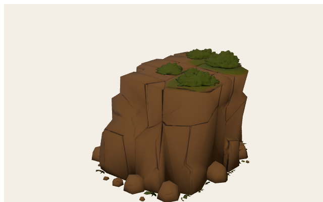

# Omegatal — track cheat sheet

Level id: `blitz_cup_04_buckelpiste` · theme: `canyon` · free/training reuse this layout. Ad-hoc maps theme `canyon` onto the same kit.

## Identity

| Field | Value |
| --- | --- |
| Cup id | `blitz_cup_04_buckelpiste` |
| Display | Omegatal |
| Theme | `canyon` |
| Asphalt width | 12 m |
| Grass width | 3.5 m |
| Walls | tires in corners, concrete on straights + fence on jersey |
| Centerline length (approx) | 1397.5 m |
| Heading 0 | start at origin, +X forward |

## World grid (XZ, meters)

Black polyline = centerline. Orange = ribbon hazards (on asphalt). Red = verge solids (grass). Origin = start/S-F.

<svg xmlns="http://www.w3.org/2000/svg" width="820" height="640" viewBox="0 0 820 640">
<rect x="0" y="0" width="820" height="640" fill="#f4efe6"/>
<rect x="56" y="36" width="746" height="564" fill="#efe8dc" stroke="#1a1a1a" stroke-width="2"/>
<line x1="56.0" y1="36" x2="56.0" y2="600" stroke="#c4b8a4" stroke-width="1"/>
<line x1="69.6" y1="36" x2="69.6" y2="600" stroke="#ddd4c6" stroke-width="0.6"/>
<line x1="83.1" y1="36" x2="83.1" y2="600" stroke="#ddd4c6" stroke-width="0.6"/>
<line x1="96.7" y1="36" x2="96.7" y2="600" stroke="#ddd4c6" stroke-width="0.6"/>
<line x1="110.3" y1="36" x2="110.3" y2="600" stroke="#ddd4c6" stroke-width="0.6"/>
<line x1="123.8" y1="36" x2="123.8" y2="600" stroke="#e03131" stroke-width="2"/>
<line x1="137.4" y1="36" x2="137.4" y2="600" stroke="#ddd4c6" stroke-width="0.6"/>
<line x1="150.9" y1="36" x2="150.9" y2="600" stroke="#ddd4c6" stroke-width="0.6"/>
<line x1="164.5" y1="36" x2="164.5" y2="600" stroke="#ddd4c6" stroke-width="0.6"/>
<line x1="178.1" y1="36" x2="178.1" y2="600" stroke="#ddd4c6" stroke-width="0.6"/>
<line x1="191.6" y1="36" x2="191.6" y2="600" stroke="#c4b8a4" stroke-width="1"/>
<line x1="205.2" y1="36" x2="205.2" y2="600" stroke="#ddd4c6" stroke-width="0.6"/>
<line x1="218.8" y1="36" x2="218.8" y2="600" stroke="#ddd4c6" stroke-width="0.6"/>
<line x1="232.3" y1="36" x2="232.3" y2="600" stroke="#ddd4c6" stroke-width="0.6"/>
<line x1="245.9" y1="36" x2="245.9" y2="600" stroke="#ddd4c6" stroke-width="0.6"/>
<line x1="259.5" y1="36" x2="259.5" y2="600" stroke="#c4b8a4" stroke-width="1"/>
<line x1="273.0" y1="36" x2="273.0" y2="600" stroke="#ddd4c6" stroke-width="0.6"/>
<line x1="286.6" y1="36" x2="286.6" y2="600" stroke="#ddd4c6" stroke-width="0.6"/>
<line x1="300.1" y1="36" x2="300.1" y2="600" stroke="#ddd4c6" stroke-width="0.6"/>
<line x1="313.7" y1="36" x2="313.7" y2="600" stroke="#ddd4c6" stroke-width="0.6"/>
<line x1="327.3" y1="36" x2="327.3" y2="600" stroke="#c4b8a4" stroke-width="1"/>
<line x1="340.8" y1="36" x2="340.8" y2="600" stroke="#ddd4c6" stroke-width="0.6"/>
<line x1="354.4" y1="36" x2="354.4" y2="600" stroke="#ddd4c6" stroke-width="0.6"/>
<line x1="368.0" y1="36" x2="368.0" y2="600" stroke="#ddd4c6" stroke-width="0.6"/>
<line x1="381.5" y1="36" x2="381.5" y2="600" stroke="#ddd4c6" stroke-width="0.6"/>
<line x1="395.1" y1="36" x2="395.1" y2="600" stroke="#c4b8a4" stroke-width="1"/>
<line x1="408.7" y1="36" x2="408.7" y2="600" stroke="#ddd4c6" stroke-width="0.6"/>
<line x1="422.2" y1="36" x2="422.2" y2="600" stroke="#ddd4c6" stroke-width="0.6"/>
<line x1="435.8" y1="36" x2="435.8" y2="600" stroke="#ddd4c6" stroke-width="0.6"/>
<line x1="449.3" y1="36" x2="449.3" y2="600" stroke="#ddd4c6" stroke-width="0.6"/>
<line x1="462.9" y1="36" x2="462.9" y2="600" stroke="#c4b8a4" stroke-width="1"/>
<line x1="476.5" y1="36" x2="476.5" y2="600" stroke="#ddd4c6" stroke-width="0.6"/>
<line x1="490.0" y1="36" x2="490.0" y2="600" stroke="#ddd4c6" stroke-width="0.6"/>
<line x1="503.6" y1="36" x2="503.6" y2="600" stroke="#ddd4c6" stroke-width="0.6"/>
<line x1="517.2" y1="36" x2="517.2" y2="600" stroke="#ddd4c6" stroke-width="0.6"/>
<line x1="530.7" y1="36" x2="530.7" y2="600" stroke="#c4b8a4" stroke-width="1"/>
<line x1="544.3" y1="36" x2="544.3" y2="600" stroke="#ddd4c6" stroke-width="0.6"/>
<line x1="557.9" y1="36" x2="557.9" y2="600" stroke="#ddd4c6" stroke-width="0.6"/>
<line x1="571.4" y1="36" x2="571.4" y2="600" stroke="#ddd4c6" stroke-width="0.6"/>
<line x1="585.0" y1="36" x2="585.0" y2="600" stroke="#ddd4c6" stroke-width="0.6"/>
<line x1="598.5" y1="36" x2="598.5" y2="600" stroke="#c4b8a4" stroke-width="1"/>
<line x1="612.1" y1="36" x2="612.1" y2="600" stroke="#ddd4c6" stroke-width="0.6"/>
<line x1="625.7" y1="36" x2="625.7" y2="600" stroke="#ddd4c6" stroke-width="0.6"/>
<line x1="639.2" y1="36" x2="639.2" y2="600" stroke="#ddd4c6" stroke-width="0.6"/>
<line x1="652.8" y1="36" x2="652.8" y2="600" stroke="#ddd4c6" stroke-width="0.6"/>
<line x1="666.4" y1="36" x2="666.4" y2="600" stroke="#c4b8a4" stroke-width="1"/>
<line x1="679.9" y1="36" x2="679.9" y2="600" stroke="#ddd4c6" stroke-width="0.6"/>
<line x1="693.5" y1="36" x2="693.5" y2="600" stroke="#ddd4c6" stroke-width="0.6"/>
<line x1="707.1" y1="36" x2="707.1" y2="600" stroke="#ddd4c6" stroke-width="0.6"/>
<line x1="720.6" y1="36" x2="720.6" y2="600" stroke="#ddd4c6" stroke-width="0.6"/>
<line x1="734.2" y1="36" x2="734.2" y2="600" stroke="#c4b8a4" stroke-width="1"/>
<line x1="747.7" y1="36" x2="747.7" y2="600" stroke="#ddd4c6" stroke-width="0.6"/>
<line x1="761.3" y1="36" x2="761.3" y2="600" stroke="#ddd4c6" stroke-width="0.6"/>
<line x1="774.9" y1="36" x2="774.9" y2="600" stroke="#ddd4c6" stroke-width="0.6"/>
<line x1="788.4" y1="36" x2="788.4" y2="600" stroke="#ddd4c6" stroke-width="0.6"/>
<line x1="802.0" y1="36" x2="802.0" y2="600" stroke="#c4b8a4" stroke-width="1"/>
<line x1="56" y1="600.0" x2="802" y2="600.0" stroke="#c4b8a4" stroke-width="1"/>
<line x1="56" y1="581.2" x2="802" y2="581.2" stroke="#ddd4c6" stroke-width="0.6"/>
<line x1="56" y1="562.4" x2="802" y2="562.4" stroke="#ddd4c6" stroke-width="0.6"/>
<line x1="56" y1="543.6" x2="802" y2="543.6" stroke="#ddd4c6" stroke-width="0.6"/>
<line x1="56" y1="524.8" x2="802" y2="524.8" stroke="#ddd4c6" stroke-width="0.6"/>
<line x1="56" y1="506.0" x2="802" y2="506.0" stroke="#339af0" stroke-width="2"/>
<line x1="56" y1="487.2" x2="802" y2="487.2" stroke="#ddd4c6" stroke-width="0.6"/>
<line x1="56" y1="468.4" x2="802" y2="468.4" stroke="#ddd4c6" stroke-width="0.6"/>
<line x1="56" y1="449.6" x2="802" y2="449.6" stroke="#ddd4c6" stroke-width="0.6"/>
<line x1="56" y1="430.8" x2="802" y2="430.8" stroke="#ddd4c6" stroke-width="0.6"/>
<line x1="56" y1="412.0" x2="802" y2="412.0" stroke="#c4b8a4" stroke-width="1"/>
<line x1="56" y1="393.2" x2="802" y2="393.2" stroke="#ddd4c6" stroke-width="0.6"/>
<line x1="56" y1="374.4" x2="802" y2="374.4" stroke="#ddd4c6" stroke-width="0.6"/>
<line x1="56" y1="355.6" x2="802" y2="355.6" stroke="#ddd4c6" stroke-width="0.6"/>
<line x1="56" y1="336.8" x2="802" y2="336.8" stroke="#ddd4c6" stroke-width="0.6"/>
<line x1="56" y1="318.0" x2="802" y2="318.0" stroke="#c4b8a4" stroke-width="1"/>
<line x1="56" y1="299.2" x2="802" y2="299.2" stroke="#ddd4c6" stroke-width="0.6"/>
<line x1="56" y1="280.4" x2="802" y2="280.4" stroke="#ddd4c6" stroke-width="0.6"/>
<line x1="56" y1="261.6" x2="802" y2="261.6" stroke="#ddd4c6" stroke-width="0.6"/>
<line x1="56" y1="242.8" x2="802" y2="242.8" stroke="#ddd4c6" stroke-width="0.6"/>
<line x1="56" y1="224.0" x2="802" y2="224.0" stroke="#c4b8a4" stroke-width="1"/>
<line x1="56" y1="205.2" x2="802" y2="205.2" stroke="#ddd4c6" stroke-width="0.6"/>
<line x1="56" y1="186.4" x2="802" y2="186.4" stroke="#ddd4c6" stroke-width="0.6"/>
<line x1="56" y1="167.6" x2="802" y2="167.6" stroke="#ddd4c6" stroke-width="0.6"/>
<line x1="56" y1="148.8" x2="802" y2="148.8" stroke="#ddd4c6" stroke-width="0.6"/>
<line x1="56" y1="130.0" x2="802" y2="130.0" stroke="#c4b8a4" stroke-width="1"/>
<line x1="56" y1="111.2" x2="802" y2="111.2" stroke="#ddd4c6" stroke-width="0.6"/>
<line x1="56" y1="92.4" x2="802" y2="92.4" stroke="#ddd4c6" stroke-width="0.6"/>
<line x1="56" y1="73.6" x2="802" y2="73.6" stroke="#ddd4c6" stroke-width="0.6"/>
<line x1="56" y1="54.8" x2="802" y2="54.8" stroke="#ddd4c6" stroke-width="0.6"/>
<line x1="56" y1="36.0" x2="802" y2="36.0" stroke="#c4b8a4" stroke-width="1"/>
<text x="56.0" y="616" text-anchor="middle" font-size="11" font-family="ui-monospace,monospace" fill="#1a1a1a">-50</text>
<text x="123.8" y="616" text-anchor="middle" font-size="11" font-family="ui-monospace,monospace" fill="#1a1a1a">0</text>
<text x="191.6" y="616" text-anchor="middle" font-size="11" font-family="ui-monospace,monospace" fill="#1a1a1a">50</text>
<text x="259.5" y="616" text-anchor="middle" font-size="11" font-family="ui-monospace,monospace" fill="#1a1a1a">100</text>
<text x="327.3" y="616" text-anchor="middle" font-size="11" font-family="ui-monospace,monospace" fill="#1a1a1a">150</text>
<text x="395.1" y="616" text-anchor="middle" font-size="11" font-family="ui-monospace,monospace" fill="#1a1a1a">200</text>
<text x="462.9" y="616" text-anchor="middle" font-size="11" font-family="ui-monospace,monospace" fill="#1a1a1a">250</text>
<text x="530.7" y="616" text-anchor="middle" font-size="11" font-family="ui-monospace,monospace" fill="#1a1a1a">300</text>
<text x="598.5" y="616" text-anchor="middle" font-size="11" font-family="ui-monospace,monospace" fill="#1a1a1a">350</text>
<text x="666.4" y="616" text-anchor="middle" font-size="11" font-family="ui-monospace,monospace" fill="#1a1a1a">400</text>
<text x="734.2" y="616" text-anchor="middle" font-size="11" font-family="ui-monospace,monospace" fill="#1a1a1a">450</text>
<text x="802.0" y="616" text-anchor="middle" font-size="11" font-family="ui-monospace,monospace" fill="#1a1a1a">500</text>
<text x="48" y="604.0" text-anchor="end" font-size="11" font-family="ui-monospace,monospace" fill="#1a1a1a">-50</text>
<text x="48" y="510.0" text-anchor="end" font-size="11" font-family="ui-monospace,monospace" fill="#1a1a1a">0</text>
<text x="48" y="416.0" text-anchor="end" font-size="11" font-family="ui-monospace,monospace" fill="#1a1a1a">50</text>
<text x="48" y="322.0" text-anchor="end" font-size="11" font-family="ui-monospace,monospace" fill="#1a1a1a">100</text>
<text x="48" y="228.0" text-anchor="end" font-size="11" font-family="ui-monospace,monospace" fill="#1a1a1a">150</text>
<text x="48" y="134.0" text-anchor="end" font-size="11" font-family="ui-monospace,monospace" fill="#1a1a1a">200</text>
<text x="48" y="40.0" text-anchor="end" font-size="11" font-family="ui-monospace,monospace" fill="#1a1a1a">250</text>
<path d="M123.8,506.0 L129.1,506.0 L134.4,506.0 L139.6,506.0 L144.9,506.0 L150.2,506.0 L155.5,506.0 L160.7,506.0 L166.0,506.0 L171.3,506.0 L176.6,506.0 L181.8,506.0 L187.1,506.0 L192.4,506.0 L197.7,506.0 L202.9,506.0 L208.2,506.0 L213.5,506.0 L218.8,506.0 L226.3,505.8 L233.9,505.3 L241.4,504.4 L249.0,503.1 L256.4,501.4 L263.9,499.4 L269.0,497.9 L274.1,496.4 L279.2,494.9 L284.3,493.4 L289.4,491.9 L294.5,490.4 L299.6,488.9 L304.7,487.4 L309.8,485.9 L314.9,484.4 L320.0,482.9 L325.1,481.4 L330.2,479.9 L336.7,477.3 L342.8,473.6 L348.5,468.7 L353.6,462.8 L358.2,456.0 L362.0,448.4 L365.0,440.1 L367.1,433.2 L369.3,426.3 L371.4,419.4 L373.5,412.4 L375.6,405.5 L377.7,398.6 L379.9,391.7 L382.0,384.7 L384.1,377.8 L386.2,370.9 L388.3,364.2 L390.3,357.6 L392.3,350.9 L394.4,344.3 L396.4,337.6 L398.4,331.0 L400.5,324.3 L402.5,317.7 L404.6,311.0 L406.6,304.3 L408.6,297.7 L410.7,291.0 L412.7,284.4 L417.7,271.1 L424.0,258.9 L431.5,248.1 L440.1,239.1 L449.5,231.8 L459.7,226.6 L470.2,223.5 L481.0,222.5 L491.8,223.8 L502.3,227.3 L512.3,232.9 L521.7,240.4 L530.1,249.8 L533.8,254.6 L537.5,259.4 L541.2,264.2 L545.0,269.0 L548.7,273.8 L552.4,278.6 L556.1,283.5 L559.8,288.3 L563.6,293.1 L567.3,297.9 L571.0,302.7 L574.7,307.5 L578.6,312.5 L582.4,317.5 L586.3,322.5 L590.2,327.4 L594.0,332.4 L597.9,337.4 L601.7,342.4 L605.6,347.4 L609.4,352.4 L613.3,357.4 L617.2,362.3 L621.0,367.3 L624.9,372.3 L628.7,377.3 L632.6,382.3 L636.4,387.3 L640.3,392.3 L644.2,397.2 L649.4,403.1 L655.1,407.9 L661.2,411.6 L667.7,414.1 L674.3,415.3 L681.0,415.3 L687.6,413.9 L692.9,412.4 L698.2,410.8 L703.5,409.3 L708.8,407.7 L714.2,406.1 L719.5,404.6 L724.8,403.0 L730.1,401.4 L735.4,399.9 L740.7,398.3 L747.6,395.5 L754.1,391.3 L760.0,385.8 L765.3,379.1 L769.9,371.4 L773.5,362.8 L776.1,353.6 L777.7,343.9 L778.3,334.0 L778.3,326.4 L778.3,318.9 L778.3,311.4 L778.3,303.9 L778.3,296.4 L778.3,288.8 L778.3,281.3 L778.3,273.8 L778.3,266.3 L778.3,258.8 L778.3,251.2 L778.3,243.7 L778.3,236.2 L778.3,228.7 L778.3,221.2 L778.3,213.6 L778.3,206.1 L778.3,198.6 L778.3,191.1 L778.3,183.6 L777.7,173.3 L776.0,163.2 L773.1,153.7 L769.2,144.9 L764.4,137.0 L758.7,130.3 L752.4,124.9 L745.5,121.0 L738.2,118.6 L730.8,117.8 L725.5,117.8 L720.1,117.8 L714.7,117.8 L709.4,117.8 L704.0,117.8 L698.6,117.8 L693.3,117.8 L687.9,117.8 L682.6,117.8 L677.2,117.8 L671.8,117.8 L666.5,117.8 L661.1,117.8 L655.7,117.8 L650.4,117.8 L645.0,117.8 L639.7,117.8 L634.3,117.8 L628.9,117.8 L623.6,117.8 L618.2,117.8 L612.8,117.8 L607.5,117.8 L602.1,117.8 L596.8,117.8 L591.4,117.8 L586.0,117.8 L580.7,117.8 L575.3,117.8 L569.9,117.8 L564.6,117.8 L559.2,117.8 L553.9,117.8 L548.5,117.8 L543.1,117.8 L537.8,117.8 L532.4,117.8 L527.0,117.8 L521.7,117.8 L516.3,117.8 L511.0,117.8 L505.6,117.8 L500.2,117.8 L493.6,117.9 L487.0,118.4 L480.4,119.2 L473.8,120.3 L467.3,121.7 L460.8,123.5 L455.5,125.1 L450.2,126.6 L445.0,128.2 L439.7,129.7 L434.4,131.3 L429.2,132.8 L423.9,134.4 L418.6,135.9 L413.4,137.5 L408.1,139.0 L402.8,140.6 L397.6,142.1 L392.3,143.7 L387.0,145.2 L381.8,146.8 L376.5,148.3 L371.2,149.9 L366.0,151.4 L360.7,153.0 L355.4,154.5 L350.2,156.1 L344.9,157.6 L339.6,159.2 L334.4,160.7 L329.1,162.3 L323.8,163.8 L318.6,165.4 L313.3,166.9 L308.0,168.5 L302.8,170.1 L297.5,171.6 L292.2,173.2 L287.0,174.7 L281.7,176.3 L276.4,177.8 L271.2,179.4 L265.9,180.9 L260.6,182.5 L255.4,184.0 L250.1,185.6 L244.8,187.1 L239.6,188.7 L234.3,190.2 L229.0,191.8 L223.8,193.3 L218.5,194.9 L213.2,196.4 L208.0,198.0 L202.7,199.5 L197.4,201.1 L192.2,202.6 L186.9,204.2 L181.6,205.7 L176.4,207.3 L171.1,208.8 L165.8,210.4 L160.6,211.9 L155.3,213.5 L150.0,215.1 L144.8,216.6 L139.5,218.2 L134.2,219.7 L129.0,221.3 L123.7,222.8 L118.4,224.4 L113.2,225.9 L106.3,228.7 L99.8,232.9 L93.8,238.4 L88.5,245.1 L84.0,252.8 L80.4,261.4 L77.7,270.7 L76.1,280.4 L75.6,290.3 L75.6,297.8 L75.6,305.3 L75.6,312.8 L75.6,320.4 L75.6,327.9 L75.6,335.4 L75.6,342.9 L75.6,350.4 L75.6,358.0 L75.6,365.5 L75.6,373.0 L75.6,380.5 L75.6,388.0 L75.6,395.6 L75.6,403.1 L75.6,410.6 L75.6,418.1 L75.6,425.6 L75.6,433.2 L75.6,440.7 L76.1,451.0 L77.9,461.0 L80.7,470.5 L84.6,479.4 L89.5,487.2 L95.1,493.9 L101.5,499.3 L108.4,503.3 L115.6,505.7 L123.0,506.5" fill="none" stroke="#1a1a1a" stroke-width="3" stroke-linejoin="round"/>
<circle cx="244.6" cy="489.8" r="4.5" fill="#e03131" stroke="#1a1a1a" stroke-width="1.2"/>
<text x="251.6" y="483.8" font-size="10" font-family="ui-sans-serif,sans-serif" font-weight="700" fill="#1a1a1a">tire_stack@90</text>
<circle cx="541.5" cy="283.5" r="4.5" fill="#e03131" stroke="#1a1a1a" stroke-width="1.2"/>
<text x="548.5" y="277.5" font-size="10" font-family="ui-sans-serif,sans-serif" font-weight="700" fill="#1a1a1a">tire_stack@400</text>
<circle cx="382.0" cy="384.8" r="4.5" fill="#f08c00" stroke="#1a1a1a" stroke-width="1.2"/>
<text x="389.0" y="378.8" font-size="10" font-family="ui-sans-serif,sans-serif" font-weight="700" fill="#1a1a1a">uneven@220</text>
<circle cx="528.4" cy="247.9" r="4.5" fill="#f08c00" stroke="#1a1a1a" stroke-width="1.2"/>
<text x="535.4" y="241.9" font-size="10" font-family="ui-sans-serif,sans-serif" font-weight="700" fill="#1a1a1a">uneven@380</text>
<circle cx="548.3" cy="273.4" r="4.5" fill="#f08c00" stroke="#1a1a1a" stroke-width="1.2"/>
<text x="555.3" y="267.4" font-size="10" font-family="ui-sans-serif,sans-serif" font-weight="700" fill="#1a1a1a">ramp@400</text>
<circle cx="568.2" cy="299.0" r="4.5" fill="#f08c00" stroke="#1a1a1a" stroke-width="1.2"/>
<text x="575.2" y="293.0" font-size="10" font-family="ui-sans-serif,sans-serif" font-weight="700" fill="#1a1a1a">uneven@420</text>
<text x="410" y="22" text-anchor="middle" font-size="14" font-family="ui-sans-serif,sans-serif" font-weight="800" fill="#1a1a1a">Omegatal — world XZ</text>
<text x="410" y="632" text-anchor="middle" font-size="11" font-family="ui-sans-serif,sans-serif" fill="#5c564c">+X → right · +Z → up · origin = red (+X) / blue (+Z) · meters</text>
</svg>

## Segments

| # | Type | Length / radius | Angle | Width |
| --- | --- | --- | --- | --- |
| 0 | `straight` | 70 m | — | 12 |
| 1 | `curve_r` | r 160 m | 12° | 12 |
| 2 | `straight` | 50 m | — | 12 |
| 3 | `curve_r` | r 36 m | 55° | 9 |
| 4 | `straight` | 40 m | — | 11 |
| 5 | `uneven_field` | 50 m | — | 11 |
| 6 | `curve_l` | r 54 m | 110° | 11 |
| 7 | `straight` | 45 m | — | 11 |
| 8 | `uneven_field` | 70 m | — | 11 |
| 9 | `curve_r` | r 36 m | 55° | 10 |
| 10 | `straight` | 40 m | — | 11 |
| 11 | `curve_r` | r 35 m | 78° | 10 |
| 12 | `straight` | 80 m | — | 11 |
| 13 | `curve_r` | r 35 m | 90° | 10 |
| 14 | `straight` | 170 m | — | 12 |
| 15 | `curve_r` | r 140 m | 12° | 12 |
| 16 | `straight` | 262 m | — | 12 |
| 17 | `curve_r` | r 35 m | 78° | 10 |
| 18 | `straight` | 80 m | — | 11 |
| 19 | `curve_r` | r 35 m | 90° | 10 |

## Obstacles (authored)

| Kind | Type | Along (m) | Side | Kit GLB |
| --- | --- | --- | --- | --- |
| verge | `tire_stack` | 90 | 1 | `public/models/track/tire-stack.glb` |
| verge | `tire_stack` | 400 | -1 | `public/models/track/tire-stack.glb` |
| ribbon | `uneven` | 220 | 0 | `public/models/track/rumble.glb` |
| ribbon | `uneven` | 380 | 0 | `public/models/track/rumble.glb` |
| ribbon | `ramp` | 400 | 0 | `public/models/track/ramp.glb` |
| ribbon | `uneven` | 420 | 0 | `public/models/track/rumble.glb` |

## Kit meshes used here

Shared walls on every cup: `tire-wall`, `concrete-wall`, `fence`. Theme scenery + obstacles below (local mesh space).

### `tire-wall` — `public/models/track/tire-wall.glb`

Root AABB (-0.748, 0, -0.748) → (0.748, 1.15, 0.748)

<svg xmlns="http://www.w3.org/2000/svg" width="760" height="520" viewBox="0 0 760 520">
<rect x="0" y="0" width="760" height="520" fill="#f4efe6"/>
<rect x="56" y="36" width="686" height="444" fill="#efe8dc" stroke="#1a1a1a" stroke-width="2"/>
<line x1="56.0" y1="36" x2="56.0" y2="480" stroke="#c4b8a4" stroke-width="1"/>
<line x1="98.9" y1="36" x2="98.9" y2="480" stroke="#ddd4c6" stroke-width="0.6"/>
<line x1="141.8" y1="36" x2="141.8" y2="480" stroke="#ddd4c6" stroke-width="0.6"/>
<line x1="184.6" y1="36" x2="184.6" y2="480" stroke="#ddd4c6" stroke-width="0.6"/>
<line x1="227.5" y1="36" x2="227.5" y2="480" stroke="#c4b8a4" stroke-width="1"/>
<line x1="270.4" y1="36" x2="270.4" y2="480" stroke="#ddd4c6" stroke-width="0.6"/>
<line x1="313.3" y1="36" x2="313.3" y2="480" stroke="#ddd4c6" stroke-width="0.6"/>
<line x1="356.1" y1="36" x2="356.1" y2="480" stroke="#ddd4c6" stroke-width="0.6"/>
<line x1="399.0" y1="36" x2="399.0" y2="480" stroke="#e03131" stroke-width="2"/>
<line x1="441.9" y1="36" x2="441.9" y2="480" stroke="#ddd4c6" stroke-width="0.6"/>
<line x1="484.8" y1="36" x2="484.8" y2="480" stroke="#ddd4c6" stroke-width="0.6"/>
<line x1="527.6" y1="36" x2="527.6" y2="480" stroke="#ddd4c6" stroke-width="0.6"/>
<line x1="570.5" y1="36" x2="570.5" y2="480" stroke="#c4b8a4" stroke-width="1"/>
<line x1="613.4" y1="36" x2="613.4" y2="480" stroke="#ddd4c6" stroke-width="0.6"/>
<line x1="656.3" y1="36" x2="656.3" y2="480" stroke="#ddd4c6" stroke-width="0.6"/>
<line x1="699.1" y1="36" x2="699.1" y2="480" stroke="#ddd4c6" stroke-width="0.6"/>
<line x1="742.0" y1="36" x2="742.0" y2="480" stroke="#c4b8a4" stroke-width="1"/>
<line x1="56" y1="480.0" x2="742" y2="480.0" stroke="#c4b8a4" stroke-width="1"/>
<line x1="56" y1="452.3" x2="742" y2="452.3" stroke="#ddd4c6" stroke-width="0.6"/>
<line x1="56" y1="424.5" x2="742" y2="424.5" stroke="#ddd4c6" stroke-width="0.6"/>
<line x1="56" y1="396.8" x2="742" y2="396.8" stroke="#ddd4c6" stroke-width="0.6"/>
<line x1="56" y1="369.0" x2="742" y2="369.0" stroke="#c4b8a4" stroke-width="1"/>
<line x1="56" y1="341.3" x2="742" y2="341.3" stroke="#ddd4c6" stroke-width="0.6"/>
<line x1="56" y1="313.5" x2="742" y2="313.5" stroke="#ddd4c6" stroke-width="0.6"/>
<line x1="56" y1="285.8" x2="742" y2="285.8" stroke="#ddd4c6" stroke-width="0.6"/>
<line x1="56" y1="258.0" x2="742" y2="258.0" stroke="#339af0" stroke-width="2"/>
<line x1="56" y1="230.3" x2="742" y2="230.3" stroke="#ddd4c6" stroke-width="0.6"/>
<line x1="56" y1="202.5" x2="742" y2="202.5" stroke="#ddd4c6" stroke-width="0.6"/>
<line x1="56" y1="174.8" x2="742" y2="174.8" stroke="#ddd4c6" stroke-width="0.6"/>
<line x1="56" y1="147.0" x2="742" y2="147.0" stroke="#c4b8a4" stroke-width="1"/>
<line x1="56" y1="119.3" x2="742" y2="119.3" stroke="#ddd4c6" stroke-width="0.6"/>
<line x1="56" y1="91.5" x2="742" y2="91.5" stroke="#ddd4c6" stroke-width="0.6"/>
<line x1="56" y1="63.8" x2="742" y2="63.8" stroke="#ddd4c6" stroke-width="0.6"/>
<line x1="56" y1="36.0" x2="742" y2="36.0" stroke="#c4b8a4" stroke-width="1"/>
<text x="56.0" y="496" text-anchor="middle" font-size="11" font-family="ui-monospace,monospace" fill="#1a1a1a">-2</text>
<text x="227.5" y="496" text-anchor="middle" font-size="11" font-family="ui-monospace,monospace" fill="#1a1a1a">-1</text>
<text x="399.0" y="496" text-anchor="middle" font-size="11" font-family="ui-monospace,monospace" fill="#1a1a1a">0</text>
<text x="570.5" y="496" text-anchor="middle" font-size="11" font-family="ui-monospace,monospace" fill="#1a1a1a">1</text>
<text x="742.0" y="496" text-anchor="middle" font-size="11" font-family="ui-monospace,monospace" fill="#1a1a1a">2</text>
<text x="48" y="484.0" text-anchor="end" font-size="11" font-family="ui-monospace,monospace" fill="#1a1a1a">-2</text>
<text x="48" y="373.0" text-anchor="end" font-size="11" font-family="ui-monospace,monospace" fill="#1a1a1a">-1</text>
<text x="48" y="262.0" text-anchor="end" font-size="11" font-family="ui-monospace,monospace" fill="#1a1a1a">0</text>
<text x="48" y="151.0" text-anchor="end" font-size="11" font-family="ui-monospace,monospace" fill="#1a1a1a">1</text>
<text x="48" y="40.0" text-anchor="end" font-size="11" font-family="ui-monospace,monospace" fill="#1a1a1a">2</text>
<rect x="270.8" y="175.0" width="256.4" height="166.0" fill="#f08c0033" stroke="#f08c00" stroke-width="1.6"/>
<text x="399.0" y="258.0" text-anchor="middle" font-size="10" font-family="ui-sans-serif,sans-serif" font-weight="700" fill="#1a1a1a">tripo_node_1690f1dc-740b-41df-9293-48c4d3fab1f2</text>
<text x="380" y="22" text-anchor="middle" font-size="14" font-family="ui-sans-serif,sans-serif" font-weight="800" fill="#1a1a1a">tire-wall — local XZ</text>
<text x="380" y="512" text-anchor="middle" font-size="11" font-family="ui-sans-serif,sans-serif" fill="#5c564c">+X → right · +Z → up · origin = red (+X) / blue (+Z) · meters</text>
</svg>

| Node | Mesh | Prims | Verts | Center xyz | AABB min → max | Materials |
| --- | --- | --- | --- | --- | --- | --- |
| `tripo_node_1690f1dc-740b-41df-9293-48c4d3fab1f2` | `tripo_mesh_1690f1dc-740b-41df-9293-48c4d3fab1f2` | 1 | 7888 | (0, 0.575, 0) | (-0.748, 0, -0.748) → (0.748, 1.15, 0.748) | tire-wall |

### `concrete-wall` — `public/models/track/concrete-wall.glb`

Root AABB (-1.674, 0, -0.567) → (1.674, 1.5, 0.567)

<svg xmlns="http://www.w3.org/2000/svg" width="760" height="520" viewBox="0 0 760 520">
<rect x="0" y="0" width="760" height="520" fill="#f4efe6"/>
<rect x="56" y="36" width="686" height="444" fill="#efe8dc" stroke="#1a1a1a" stroke-width="2"/>
<line x1="56.0" y1="36" x2="56.0" y2="480" stroke="#c4b8a4" stroke-width="1"/>
<line x1="84.6" y1="36" x2="84.6" y2="480" stroke="#ddd4c6" stroke-width="0.6"/>
<line x1="113.2" y1="36" x2="113.2" y2="480" stroke="#ddd4c6" stroke-width="0.6"/>
<line x1="141.8" y1="36" x2="141.8" y2="480" stroke="#ddd4c6" stroke-width="0.6"/>
<line x1="170.3" y1="36" x2="170.3" y2="480" stroke="#c4b8a4" stroke-width="1"/>
<line x1="198.9" y1="36" x2="198.9" y2="480" stroke="#ddd4c6" stroke-width="0.6"/>
<line x1="227.5" y1="36" x2="227.5" y2="480" stroke="#ddd4c6" stroke-width="0.6"/>
<line x1="256.1" y1="36" x2="256.1" y2="480" stroke="#ddd4c6" stroke-width="0.6"/>
<line x1="284.7" y1="36" x2="284.7" y2="480" stroke="#c4b8a4" stroke-width="1"/>
<line x1="313.3" y1="36" x2="313.3" y2="480" stroke="#ddd4c6" stroke-width="0.6"/>
<line x1="341.8" y1="36" x2="341.8" y2="480" stroke="#ddd4c6" stroke-width="0.6"/>
<line x1="370.4" y1="36" x2="370.4" y2="480" stroke="#ddd4c6" stroke-width="0.6"/>
<line x1="399.0" y1="36" x2="399.0" y2="480" stroke="#e03131" stroke-width="2"/>
<line x1="427.6" y1="36" x2="427.6" y2="480" stroke="#ddd4c6" stroke-width="0.6"/>
<line x1="456.2" y1="36" x2="456.2" y2="480" stroke="#ddd4c6" stroke-width="0.6"/>
<line x1="484.8" y1="36" x2="484.8" y2="480" stroke="#ddd4c6" stroke-width="0.6"/>
<line x1="513.3" y1="36" x2="513.3" y2="480" stroke="#c4b8a4" stroke-width="1"/>
<line x1="541.9" y1="36" x2="541.9" y2="480" stroke="#ddd4c6" stroke-width="0.6"/>
<line x1="570.5" y1="36" x2="570.5" y2="480" stroke="#ddd4c6" stroke-width="0.6"/>
<line x1="599.1" y1="36" x2="599.1" y2="480" stroke="#ddd4c6" stroke-width="0.6"/>
<line x1="627.7" y1="36" x2="627.7" y2="480" stroke="#c4b8a4" stroke-width="1"/>
<line x1="656.3" y1="36" x2="656.3" y2="480" stroke="#ddd4c6" stroke-width="0.6"/>
<line x1="684.8" y1="36" x2="684.8" y2="480" stroke="#ddd4c6" stroke-width="0.6"/>
<line x1="713.4" y1="36" x2="713.4" y2="480" stroke="#ddd4c6" stroke-width="0.6"/>
<line x1="742.0" y1="36" x2="742.0" y2="480" stroke="#c4b8a4" stroke-width="1"/>
<line x1="56" y1="480.0" x2="742" y2="480.0" stroke="#c4b8a4" stroke-width="1"/>
<line x1="56" y1="452.3" x2="742" y2="452.3" stroke="#ddd4c6" stroke-width="0.6"/>
<line x1="56" y1="424.5" x2="742" y2="424.5" stroke="#ddd4c6" stroke-width="0.6"/>
<line x1="56" y1="396.8" x2="742" y2="396.8" stroke="#ddd4c6" stroke-width="0.6"/>
<line x1="56" y1="369.0" x2="742" y2="369.0" stroke="#c4b8a4" stroke-width="1"/>
<line x1="56" y1="341.3" x2="742" y2="341.3" stroke="#ddd4c6" stroke-width="0.6"/>
<line x1="56" y1="313.5" x2="742" y2="313.5" stroke="#ddd4c6" stroke-width="0.6"/>
<line x1="56" y1="285.8" x2="742" y2="285.8" stroke="#ddd4c6" stroke-width="0.6"/>
<line x1="56" y1="258.0" x2="742" y2="258.0" stroke="#339af0" stroke-width="2"/>
<line x1="56" y1="230.3" x2="742" y2="230.3" stroke="#ddd4c6" stroke-width="0.6"/>
<line x1="56" y1="202.5" x2="742" y2="202.5" stroke="#ddd4c6" stroke-width="0.6"/>
<line x1="56" y1="174.8" x2="742" y2="174.8" stroke="#ddd4c6" stroke-width="0.6"/>
<line x1="56" y1="147.0" x2="742" y2="147.0" stroke="#c4b8a4" stroke-width="1"/>
<line x1="56" y1="119.3" x2="742" y2="119.3" stroke="#ddd4c6" stroke-width="0.6"/>
<line x1="56" y1="91.5" x2="742" y2="91.5" stroke="#ddd4c6" stroke-width="0.6"/>
<line x1="56" y1="63.8" x2="742" y2="63.8" stroke="#ddd4c6" stroke-width="0.6"/>
<line x1="56" y1="36.0" x2="742" y2="36.0" stroke="#c4b8a4" stroke-width="1"/>
<text x="56.0" y="496" text-anchor="middle" font-size="11" font-family="ui-monospace,monospace" fill="#1a1a1a">-3</text>
<text x="170.3" y="496" text-anchor="middle" font-size="11" font-family="ui-monospace,monospace" fill="#1a1a1a">-2</text>
<text x="284.7" y="496" text-anchor="middle" font-size="11" font-family="ui-monospace,monospace" fill="#1a1a1a">-1</text>
<text x="399.0" y="496" text-anchor="middle" font-size="11" font-family="ui-monospace,monospace" fill="#1a1a1a">0</text>
<text x="513.3" y="496" text-anchor="middle" font-size="11" font-family="ui-monospace,monospace" fill="#1a1a1a">1</text>
<text x="627.7" y="496" text-anchor="middle" font-size="11" font-family="ui-monospace,monospace" fill="#1a1a1a">2</text>
<text x="742.0" y="496" text-anchor="middle" font-size="11" font-family="ui-monospace,monospace" fill="#1a1a1a">3</text>
<text x="48" y="484.0" text-anchor="end" font-size="11" font-family="ui-monospace,monospace" fill="#1a1a1a">-2</text>
<text x="48" y="373.0" text-anchor="end" font-size="11" font-family="ui-monospace,monospace" fill="#1a1a1a">-1</text>
<text x="48" y="262.0" text-anchor="end" font-size="11" font-family="ui-monospace,monospace" fill="#1a1a1a">0</text>
<text x="48" y="151.0" text-anchor="end" font-size="11" font-family="ui-monospace,monospace" fill="#1a1a1a">1</text>
<text x="48" y="40.0" text-anchor="end" font-size="11" font-family="ui-monospace,monospace" fill="#1a1a1a">2</text>
<rect x="207.7" y="195.1" width="382.7" height="125.8" fill="#f08c0033" stroke="#f08c00" stroke-width="1.6"/>
<text x="399.0" y="258.0" text-anchor="middle" font-size="10" font-family="ui-sans-serif,sans-serif" font-weight="700" fill="#1a1a1a">tripo_node_84010e7e-9787-4553-87b7-5e8f1a925fc4</text>
<text x="380" y="22" text-anchor="middle" font-size="14" font-family="ui-sans-serif,sans-serif" font-weight="800" fill="#1a1a1a">concrete-wall — local XZ</text>
<text x="380" y="512" text-anchor="middle" font-size="11" font-family="ui-sans-serif,sans-serif" fill="#5c564c">+X → right · +Z → up · origin = red (+X) / blue (+Z) · meters</text>
</svg>

| Node | Mesh | Prims | Verts | Center xyz | AABB min → max | Materials |
| --- | --- | --- | --- | --- | --- | --- |
| `tripo_node_84010e7e-9787-4553-87b7-5e8f1a925fc4` | `tripo_mesh_84010e7e-9787-4553-87b7-5e8f1a925fc4` | 1 | 8163 | (0, 0.75, 0) | (-1.674, 0, -0.567) → (1.674, 1.5, 0.567) | concrete-wall |

### `fence` — `public/models/track/fence.glb`

Root AABB (-0.81, 0, -0.062) → (0.81, 1.1, 0.062)

<svg xmlns="http://www.w3.org/2000/svg" width="760" height="520" viewBox="0 0 760 520">
<rect x="0" y="0" width="760" height="520" fill="#f4efe6"/>
<rect x="56" y="36" width="686" height="444" fill="#efe8dc" stroke="#1a1a1a" stroke-width="2"/>
<line x1="56.0" y1="36" x2="56.0" y2="480" stroke="#c4b8a4" stroke-width="1"/>
<line x1="98.9" y1="36" x2="98.9" y2="480" stroke="#ddd4c6" stroke-width="0.6"/>
<line x1="141.8" y1="36" x2="141.8" y2="480" stroke="#ddd4c6" stroke-width="0.6"/>
<line x1="184.6" y1="36" x2="184.6" y2="480" stroke="#ddd4c6" stroke-width="0.6"/>
<line x1="227.5" y1="36" x2="227.5" y2="480" stroke="#c4b8a4" stroke-width="1"/>
<line x1="270.4" y1="36" x2="270.4" y2="480" stroke="#ddd4c6" stroke-width="0.6"/>
<line x1="313.3" y1="36" x2="313.3" y2="480" stroke="#ddd4c6" stroke-width="0.6"/>
<line x1="356.1" y1="36" x2="356.1" y2="480" stroke="#ddd4c6" stroke-width="0.6"/>
<line x1="399.0" y1="36" x2="399.0" y2="480" stroke="#e03131" stroke-width="2"/>
<line x1="441.9" y1="36" x2="441.9" y2="480" stroke="#ddd4c6" stroke-width="0.6"/>
<line x1="484.8" y1="36" x2="484.8" y2="480" stroke="#ddd4c6" stroke-width="0.6"/>
<line x1="527.6" y1="36" x2="527.6" y2="480" stroke="#ddd4c6" stroke-width="0.6"/>
<line x1="570.5" y1="36" x2="570.5" y2="480" stroke="#c4b8a4" stroke-width="1"/>
<line x1="613.4" y1="36" x2="613.4" y2="480" stroke="#ddd4c6" stroke-width="0.6"/>
<line x1="656.3" y1="36" x2="656.3" y2="480" stroke="#ddd4c6" stroke-width="0.6"/>
<line x1="699.1" y1="36" x2="699.1" y2="480" stroke="#ddd4c6" stroke-width="0.6"/>
<line x1="742.0" y1="36" x2="742.0" y2="480" stroke="#c4b8a4" stroke-width="1"/>
<line x1="56" y1="480.0" x2="742" y2="480.0" stroke="#c4b8a4" stroke-width="1"/>
<line x1="56" y1="424.5" x2="742" y2="424.5" stroke="#ddd4c6" stroke-width="0.6"/>
<line x1="56" y1="369.0" x2="742" y2="369.0" stroke="#ddd4c6" stroke-width="0.6"/>
<line x1="56" y1="313.5" x2="742" y2="313.5" stroke="#ddd4c6" stroke-width="0.6"/>
<line x1="56" y1="258.0" x2="742" y2="258.0" stroke="#339af0" stroke-width="2"/>
<line x1="56" y1="202.5" x2="742" y2="202.5" stroke="#ddd4c6" stroke-width="0.6"/>
<line x1="56" y1="147.0" x2="742" y2="147.0" stroke="#ddd4c6" stroke-width="0.6"/>
<line x1="56" y1="91.5" x2="742" y2="91.5" stroke="#ddd4c6" stroke-width="0.6"/>
<line x1="56" y1="36.0" x2="742" y2="36.0" stroke="#c4b8a4" stroke-width="1"/>
<text x="56.0" y="496" text-anchor="middle" font-size="11" font-family="ui-monospace,monospace" fill="#1a1a1a">-2</text>
<text x="227.5" y="496" text-anchor="middle" font-size="11" font-family="ui-monospace,monospace" fill="#1a1a1a">-1</text>
<text x="399.0" y="496" text-anchor="middle" font-size="11" font-family="ui-monospace,monospace" fill="#1a1a1a">0</text>
<text x="570.5" y="496" text-anchor="middle" font-size="11" font-family="ui-monospace,monospace" fill="#1a1a1a">1</text>
<text x="742.0" y="496" text-anchor="middle" font-size="11" font-family="ui-monospace,monospace" fill="#1a1a1a">2</text>
<text x="48" y="484.0" text-anchor="end" font-size="11" font-family="ui-monospace,monospace" fill="#1a1a1a">-1</text>
<text x="48" y="262.0" text-anchor="end" font-size="11" font-family="ui-monospace,monospace" fill="#1a1a1a">0</text>
<text x="48" y="40.0" text-anchor="end" font-size="11" font-family="ui-monospace,monospace" fill="#1a1a1a">1</text>
<rect x="260.1" y="244.3" width="277.8" height="27.4" fill="#f08c0033" stroke="#f08c00" stroke-width="1.6"/>
<text x="399.0" y="258.0" text-anchor="middle" font-size="10" font-family="ui-sans-serif,sans-serif" font-weight="700" fill="#1a1a1a">tripo_node_f5dd3b5a-f1a7-42d6-8be4-dd5d7122fadb</text>
<text x="380" y="22" text-anchor="middle" font-size="14" font-family="ui-sans-serif,sans-serif" font-weight="800" fill="#1a1a1a">fence — local XZ</text>
<text x="380" y="512" text-anchor="middle" font-size="11" font-family="ui-sans-serif,sans-serif" fill="#5c564c">+X → right · +Z → up · origin = red (+X) / blue (+Z) · meters</text>
</svg>

| Node | Mesh | Prims | Verts | Center xyz | AABB min → max | Materials |
| --- | --- | --- | --- | --- | --- | --- |
| `tripo_node_f5dd3b5a-f1a7-42d6-8be4-dd5d7122fadb` | `tripo_mesh_f5dd3b5a-f1a7-42d6-8be4-dd5d7122fadb` | 1 | 11353 | (0, 0.55, 0) | (-0.81, 0, -0.062) → (0.81, 1.1, 0.062) | fence |

### `cliff` — `public/models/track/cliff.glb`

Root AABB (-5, 0, -5) → (5, 6.556, 5)

<svg xmlns="http://www.w3.org/2000/svg" width="760" height="520" viewBox="0 0 760 520">
<rect x="0" y="0" width="760" height="520" fill="#f4efe6"/>
<rect x="56" y="36" width="686" height="444" fill="#efe8dc" stroke="#1a1a1a" stroke-width="2"/>
<line x1="56.0" y1="36" x2="56.0" y2="480" stroke="#c4b8a4" stroke-width="1"/>
<line x1="84.6" y1="36" x2="84.6" y2="480" stroke="#ddd4c6" stroke-width="0.6"/>
<line x1="113.2" y1="36" x2="113.2" y2="480" stroke="#ddd4c6" stroke-width="0.6"/>
<line x1="141.8" y1="36" x2="141.8" y2="480" stroke="#ddd4c6" stroke-width="0.6"/>
<line x1="170.3" y1="36" x2="170.3" y2="480" stroke="#c4b8a4" stroke-width="1"/>
<line x1="198.9" y1="36" x2="198.9" y2="480" stroke="#ddd4c6" stroke-width="0.6"/>
<line x1="227.5" y1="36" x2="227.5" y2="480" stroke="#ddd4c6" stroke-width="0.6"/>
<line x1="256.1" y1="36" x2="256.1" y2="480" stroke="#ddd4c6" stroke-width="0.6"/>
<line x1="284.7" y1="36" x2="284.7" y2="480" stroke="#c4b8a4" stroke-width="1"/>
<line x1="313.3" y1="36" x2="313.3" y2="480" stroke="#ddd4c6" stroke-width="0.6"/>
<line x1="341.8" y1="36" x2="341.8" y2="480" stroke="#ddd4c6" stroke-width="0.6"/>
<line x1="370.4" y1="36" x2="370.4" y2="480" stroke="#ddd4c6" stroke-width="0.6"/>
<line x1="399.0" y1="36" x2="399.0" y2="480" stroke="#e03131" stroke-width="2"/>
<line x1="427.6" y1="36" x2="427.6" y2="480" stroke="#ddd4c6" stroke-width="0.6"/>
<line x1="456.2" y1="36" x2="456.2" y2="480" stroke="#ddd4c6" stroke-width="0.6"/>
<line x1="484.8" y1="36" x2="484.8" y2="480" stroke="#ddd4c6" stroke-width="0.6"/>
<line x1="513.3" y1="36" x2="513.3" y2="480" stroke="#c4b8a4" stroke-width="1"/>
<line x1="541.9" y1="36" x2="541.9" y2="480" stroke="#ddd4c6" stroke-width="0.6"/>
<line x1="570.5" y1="36" x2="570.5" y2="480" stroke="#ddd4c6" stroke-width="0.6"/>
<line x1="599.1" y1="36" x2="599.1" y2="480" stroke="#ddd4c6" stroke-width="0.6"/>
<line x1="627.7" y1="36" x2="627.7" y2="480" stroke="#c4b8a4" stroke-width="1"/>
<line x1="656.3" y1="36" x2="656.3" y2="480" stroke="#ddd4c6" stroke-width="0.6"/>
<line x1="684.8" y1="36" x2="684.8" y2="480" stroke="#ddd4c6" stroke-width="0.6"/>
<line x1="713.4" y1="36" x2="713.4" y2="480" stroke="#ddd4c6" stroke-width="0.6"/>
<line x1="742.0" y1="36" x2="742.0" y2="480" stroke="#c4b8a4" stroke-width="1"/>
<line x1="56" y1="480.0" x2="742" y2="480.0" stroke="#c4b8a4" stroke-width="1"/>
<line x1="56" y1="461.5" x2="742" y2="461.5" stroke="#ddd4c6" stroke-width="0.6"/>
<line x1="56" y1="443.0" x2="742" y2="443.0" stroke="#ddd4c6" stroke-width="0.6"/>
<line x1="56" y1="424.5" x2="742" y2="424.5" stroke="#ddd4c6" stroke-width="0.6"/>
<line x1="56" y1="406.0" x2="742" y2="406.0" stroke="#c4b8a4" stroke-width="1"/>
<line x1="56" y1="387.5" x2="742" y2="387.5" stroke="#ddd4c6" stroke-width="0.6"/>
<line x1="56" y1="369.0" x2="742" y2="369.0" stroke="#ddd4c6" stroke-width="0.6"/>
<line x1="56" y1="350.5" x2="742" y2="350.5" stroke="#ddd4c6" stroke-width="0.6"/>
<line x1="56" y1="332.0" x2="742" y2="332.0" stroke="#c4b8a4" stroke-width="1"/>
<line x1="56" y1="313.5" x2="742" y2="313.5" stroke="#ddd4c6" stroke-width="0.6"/>
<line x1="56" y1="295.0" x2="742" y2="295.0" stroke="#ddd4c6" stroke-width="0.6"/>
<line x1="56" y1="276.5" x2="742" y2="276.5" stroke="#ddd4c6" stroke-width="0.6"/>
<line x1="56" y1="258.0" x2="742" y2="258.0" stroke="#339af0" stroke-width="2"/>
<line x1="56" y1="239.5" x2="742" y2="239.5" stroke="#ddd4c6" stroke-width="0.6"/>
<line x1="56" y1="221.0" x2="742" y2="221.0" stroke="#ddd4c6" stroke-width="0.6"/>
<line x1="56" y1="202.5" x2="742" y2="202.5" stroke="#ddd4c6" stroke-width="0.6"/>
<line x1="56" y1="184.0" x2="742" y2="184.0" stroke="#c4b8a4" stroke-width="1"/>
<line x1="56" y1="165.5" x2="742" y2="165.5" stroke="#ddd4c6" stroke-width="0.6"/>
<line x1="56" y1="147.0" x2="742" y2="147.0" stroke="#ddd4c6" stroke-width="0.6"/>
<line x1="56" y1="128.5" x2="742" y2="128.5" stroke="#ddd4c6" stroke-width="0.6"/>
<line x1="56" y1="110.0" x2="742" y2="110.0" stroke="#c4b8a4" stroke-width="1"/>
<line x1="56" y1="91.5" x2="742" y2="91.5" stroke="#ddd4c6" stroke-width="0.6"/>
<line x1="56" y1="73.0" x2="742" y2="73.0" stroke="#ddd4c6" stroke-width="0.6"/>
<line x1="56" y1="54.5" x2="742" y2="54.5" stroke="#ddd4c6" stroke-width="0.6"/>
<line x1="56" y1="36.0" x2="742" y2="36.0" stroke="#c4b8a4" stroke-width="1"/>
<text x="56.0" y="496" text-anchor="middle" font-size="11" font-family="ui-monospace,monospace" fill="#1a1a1a">-6</text>
<text x="170.3" y="496" text-anchor="middle" font-size="11" font-family="ui-monospace,monospace" fill="#1a1a1a">-4</text>
<text x="284.7" y="496" text-anchor="middle" font-size="11" font-family="ui-monospace,monospace" fill="#1a1a1a">-2</text>
<text x="399.0" y="496" text-anchor="middle" font-size="11" font-family="ui-monospace,monospace" fill="#1a1a1a">0</text>
<text x="513.3" y="496" text-anchor="middle" font-size="11" font-family="ui-monospace,monospace" fill="#1a1a1a">2</text>
<text x="627.7" y="496" text-anchor="middle" font-size="11" font-family="ui-monospace,monospace" fill="#1a1a1a">4</text>
<text x="742.0" y="496" text-anchor="middle" font-size="11" font-family="ui-monospace,monospace" fill="#1a1a1a">6</text>
<text x="48" y="484.0" text-anchor="end" font-size="11" font-family="ui-monospace,monospace" fill="#1a1a1a">-6</text>
<text x="48" y="410.0" text-anchor="end" font-size="11" font-family="ui-monospace,monospace" fill="#1a1a1a">-4</text>
<text x="48" y="336.0" text-anchor="end" font-size="11" font-family="ui-monospace,monospace" fill="#1a1a1a">-2</text>
<text x="48" y="262.0" text-anchor="end" font-size="11" font-family="ui-monospace,monospace" fill="#1a1a1a">0</text>
<text x="48" y="188.0" text-anchor="end" font-size="11" font-family="ui-monospace,monospace" fill="#1a1a1a">2</text>
<text x="48" y="114.0" text-anchor="end" font-size="11" font-family="ui-monospace,monospace" fill="#1a1a1a">4</text>
<text x="48" y="40.0" text-anchor="end" font-size="11" font-family="ui-monospace,monospace" fill="#1a1a1a">6</text>
<rect x="113.2" y="73.0" width="571.7" height="370.0" fill="#f08c0033" stroke="#f08c00" stroke-width="1.6"/>
<text x="399.0" y="258.0" text-anchor="middle" font-size="10" font-family="ui-sans-serif,sans-serif" font-weight="700" fill="#1a1a1a">tripo_node_7430b11c-8f5d-4474-ac4a-951af524aa5f</text>
<text x="380" y="22" text-anchor="middle" font-size="14" font-family="ui-sans-serif,sans-serif" font-weight="800" fill="#1a1a1a">cliff — local XZ</text>
<text x="380" y="512" text-anchor="middle" font-size="11" font-family="ui-sans-serif,sans-serif" fill="#5c564c">+X → right · +Z → up · origin = red (+X) / blue (+Z) · meters</text>
</svg>

| Node | Mesh | Prims | Verts | Center xyz | AABB min → max | Materials |
| --- | --- | --- | --- | --- | --- | --- |
| `tripo_node_7430b11c-8f5d-4474-ac4a-951af524aa5f` | `tripo_mesh_7430b11c-8f5d-4474-ac4a-951af524aa5f` | 1 | 7552 | (0, 3.278, 0) | (-5, 0, -5) → (5, 6.556, 5) | cliff |

### `spire` — `public/models/track/spire.glb`

Root AABB (-2.669, 0, -2.5) → (2.669, 8.661, 2.5)

<svg xmlns="http://www.w3.org/2000/svg" width="760" height="520" viewBox="0 0 760 520">
<rect x="0" y="0" width="760" height="520" fill="#f4efe6"/>
<rect x="56" y="36" width="686" height="444" fill="#efe8dc" stroke="#1a1a1a" stroke-width="2"/>
<line x1="56.0" y1="36" x2="56.0" y2="480" stroke="#c4b8a4" stroke-width="1"/>
<line x1="98.9" y1="36" x2="98.9" y2="480" stroke="#ddd4c6" stroke-width="0.6"/>
<line x1="141.8" y1="36" x2="141.8" y2="480" stroke="#ddd4c6" stroke-width="0.6"/>
<line x1="184.6" y1="36" x2="184.6" y2="480" stroke="#ddd4c6" stroke-width="0.6"/>
<line x1="227.5" y1="36" x2="227.5" y2="480" stroke="#c4b8a4" stroke-width="1"/>
<line x1="270.4" y1="36" x2="270.4" y2="480" stroke="#ddd4c6" stroke-width="0.6"/>
<line x1="313.3" y1="36" x2="313.3" y2="480" stroke="#ddd4c6" stroke-width="0.6"/>
<line x1="356.1" y1="36" x2="356.1" y2="480" stroke="#ddd4c6" stroke-width="0.6"/>
<line x1="399.0" y1="36" x2="399.0" y2="480" stroke="#e03131" stroke-width="2"/>
<line x1="441.9" y1="36" x2="441.9" y2="480" stroke="#ddd4c6" stroke-width="0.6"/>
<line x1="484.8" y1="36" x2="484.8" y2="480" stroke="#ddd4c6" stroke-width="0.6"/>
<line x1="527.6" y1="36" x2="527.6" y2="480" stroke="#ddd4c6" stroke-width="0.6"/>
<line x1="570.5" y1="36" x2="570.5" y2="480" stroke="#c4b8a4" stroke-width="1"/>
<line x1="613.4" y1="36" x2="613.4" y2="480" stroke="#ddd4c6" stroke-width="0.6"/>
<line x1="656.3" y1="36" x2="656.3" y2="480" stroke="#ddd4c6" stroke-width="0.6"/>
<line x1="699.1" y1="36" x2="699.1" y2="480" stroke="#ddd4c6" stroke-width="0.6"/>
<line x1="742.0" y1="36" x2="742.0" y2="480" stroke="#c4b8a4" stroke-width="1"/>
<line x1="56" y1="480.0" x2="742" y2="480.0" stroke="#c4b8a4" stroke-width="1"/>
<line x1="56" y1="452.3" x2="742" y2="452.3" stroke="#ddd4c6" stroke-width="0.6"/>
<line x1="56" y1="424.5" x2="742" y2="424.5" stroke="#ddd4c6" stroke-width="0.6"/>
<line x1="56" y1="396.8" x2="742" y2="396.8" stroke="#ddd4c6" stroke-width="0.6"/>
<line x1="56" y1="369.0" x2="742" y2="369.0" stroke="#c4b8a4" stroke-width="1"/>
<line x1="56" y1="341.3" x2="742" y2="341.3" stroke="#ddd4c6" stroke-width="0.6"/>
<line x1="56" y1="313.5" x2="742" y2="313.5" stroke="#ddd4c6" stroke-width="0.6"/>
<line x1="56" y1="285.8" x2="742" y2="285.8" stroke="#ddd4c6" stroke-width="0.6"/>
<line x1="56" y1="258.0" x2="742" y2="258.0" stroke="#339af0" stroke-width="2"/>
<line x1="56" y1="230.3" x2="742" y2="230.3" stroke="#ddd4c6" stroke-width="0.6"/>
<line x1="56" y1="202.5" x2="742" y2="202.5" stroke="#ddd4c6" stroke-width="0.6"/>
<line x1="56" y1="174.8" x2="742" y2="174.8" stroke="#ddd4c6" stroke-width="0.6"/>
<line x1="56" y1="147.0" x2="742" y2="147.0" stroke="#c4b8a4" stroke-width="1"/>
<line x1="56" y1="119.3" x2="742" y2="119.3" stroke="#ddd4c6" stroke-width="0.6"/>
<line x1="56" y1="91.5" x2="742" y2="91.5" stroke="#ddd4c6" stroke-width="0.6"/>
<line x1="56" y1="63.8" x2="742" y2="63.8" stroke="#ddd4c6" stroke-width="0.6"/>
<line x1="56" y1="36.0" x2="742" y2="36.0" stroke="#c4b8a4" stroke-width="1"/>
<text x="56.0" y="496" text-anchor="middle" font-size="11" font-family="ui-monospace,monospace" fill="#1a1a1a">-4</text>
<text x="227.5" y="496" text-anchor="middle" font-size="11" font-family="ui-monospace,monospace" fill="#1a1a1a">-2</text>
<text x="399.0" y="496" text-anchor="middle" font-size="11" font-family="ui-monospace,monospace" fill="#1a1a1a">0</text>
<text x="570.5" y="496" text-anchor="middle" font-size="11" font-family="ui-monospace,monospace" fill="#1a1a1a">2</text>
<text x="742.0" y="496" text-anchor="middle" font-size="11" font-family="ui-monospace,monospace" fill="#1a1a1a">4</text>
<text x="48" y="484.0" text-anchor="end" font-size="11" font-family="ui-monospace,monospace" fill="#1a1a1a">-4</text>
<text x="48" y="373.0" text-anchor="end" font-size="11" font-family="ui-monospace,monospace" fill="#1a1a1a">-2</text>
<text x="48" y="262.0" text-anchor="end" font-size="11" font-family="ui-monospace,monospace" fill="#1a1a1a">0</text>
<text x="48" y="151.0" text-anchor="end" font-size="11" font-family="ui-monospace,monospace" fill="#1a1a1a">2</text>
<text x="48" y="40.0" text-anchor="end" font-size="11" font-family="ui-monospace,monospace" fill="#1a1a1a">4</text>
<rect x="170.1" y="119.3" width="457.8" height="277.5" fill="#f08c0033" stroke="#f08c00" stroke-width="1.6"/>
<text x="399.0" y="258.0" text-anchor="middle" font-size="10" font-family="ui-sans-serif,sans-serif" font-weight="700" fill="#1a1a1a">tripo_node_f4717319-ea8e-4ac9-9e7a-158020d3e851</text>
<text x="380" y="22" text-anchor="middle" font-size="14" font-family="ui-sans-serif,sans-serif" font-weight="800" fill="#1a1a1a">spire — local XZ</text>
<text x="380" y="512" text-anchor="middle" font-size="11" font-family="ui-sans-serif,sans-serif" fill="#5c564c">+X → right · +Z → up · origin = red (+X) / blue (+Z) · meters</text>
</svg>

| Node | Mesh | Prims | Verts | Center xyz | AABB min → max | Materials |
| --- | --- | --- | --- | --- | --- | --- |
| `tripo_node_f4717319-ea8e-4ac9-9e7a-158020d3e851` | `tripo_mesh_f4717319-ea8e-4ac9-9e7a-158020d3e851` | 1 | 10673 | (0, 4.331, 0) | (-2.669, 0, -2.5) → (2.669, 8.661, 2.5) | spire |

### `scrub` — `public/models/track/scrub.glb`

Root AABB (-1.082, 0, -1.069) → (1.082, 1.8, 1.069)

<svg xmlns="http://www.w3.org/2000/svg" width="760" height="520" viewBox="0 0 760 520">
<rect x="0" y="0" width="760" height="520" fill="#f4efe6"/>
<rect x="56" y="36" width="686" height="444" fill="#efe8dc" stroke="#1a1a1a" stroke-width="2"/>
<line x1="56.0" y1="36" x2="56.0" y2="480" stroke="#c4b8a4" stroke-width="1"/>
<line x1="98.9" y1="36" x2="98.9" y2="480" stroke="#ddd4c6" stroke-width="0.6"/>
<line x1="141.8" y1="36" x2="141.8" y2="480" stroke="#ddd4c6" stroke-width="0.6"/>
<line x1="184.6" y1="36" x2="184.6" y2="480" stroke="#ddd4c6" stroke-width="0.6"/>
<line x1="227.5" y1="36" x2="227.5" y2="480" stroke="#c4b8a4" stroke-width="1"/>
<line x1="270.4" y1="36" x2="270.4" y2="480" stroke="#ddd4c6" stroke-width="0.6"/>
<line x1="313.3" y1="36" x2="313.3" y2="480" stroke="#ddd4c6" stroke-width="0.6"/>
<line x1="356.1" y1="36" x2="356.1" y2="480" stroke="#ddd4c6" stroke-width="0.6"/>
<line x1="399.0" y1="36" x2="399.0" y2="480" stroke="#e03131" stroke-width="2"/>
<line x1="441.9" y1="36" x2="441.9" y2="480" stroke="#ddd4c6" stroke-width="0.6"/>
<line x1="484.8" y1="36" x2="484.8" y2="480" stroke="#ddd4c6" stroke-width="0.6"/>
<line x1="527.6" y1="36" x2="527.6" y2="480" stroke="#ddd4c6" stroke-width="0.6"/>
<line x1="570.5" y1="36" x2="570.5" y2="480" stroke="#c4b8a4" stroke-width="1"/>
<line x1="613.4" y1="36" x2="613.4" y2="480" stroke="#ddd4c6" stroke-width="0.6"/>
<line x1="656.3" y1="36" x2="656.3" y2="480" stroke="#ddd4c6" stroke-width="0.6"/>
<line x1="699.1" y1="36" x2="699.1" y2="480" stroke="#ddd4c6" stroke-width="0.6"/>
<line x1="742.0" y1="36" x2="742.0" y2="480" stroke="#c4b8a4" stroke-width="1"/>
<line x1="56" y1="480.0" x2="742" y2="480.0" stroke="#c4b8a4" stroke-width="1"/>
<line x1="56" y1="452.3" x2="742" y2="452.3" stroke="#ddd4c6" stroke-width="0.6"/>
<line x1="56" y1="424.5" x2="742" y2="424.5" stroke="#ddd4c6" stroke-width="0.6"/>
<line x1="56" y1="396.8" x2="742" y2="396.8" stroke="#ddd4c6" stroke-width="0.6"/>
<line x1="56" y1="369.0" x2="742" y2="369.0" stroke="#c4b8a4" stroke-width="1"/>
<line x1="56" y1="341.3" x2="742" y2="341.3" stroke="#ddd4c6" stroke-width="0.6"/>
<line x1="56" y1="313.5" x2="742" y2="313.5" stroke="#ddd4c6" stroke-width="0.6"/>
<line x1="56" y1="285.8" x2="742" y2="285.8" stroke="#ddd4c6" stroke-width="0.6"/>
<line x1="56" y1="258.0" x2="742" y2="258.0" stroke="#339af0" stroke-width="2"/>
<line x1="56" y1="230.3" x2="742" y2="230.3" stroke="#ddd4c6" stroke-width="0.6"/>
<line x1="56" y1="202.5" x2="742" y2="202.5" stroke="#ddd4c6" stroke-width="0.6"/>
<line x1="56" y1="174.8" x2="742" y2="174.8" stroke="#ddd4c6" stroke-width="0.6"/>
<line x1="56" y1="147.0" x2="742" y2="147.0" stroke="#c4b8a4" stroke-width="1"/>
<line x1="56" y1="119.3" x2="742" y2="119.3" stroke="#ddd4c6" stroke-width="0.6"/>
<line x1="56" y1="91.5" x2="742" y2="91.5" stroke="#ddd4c6" stroke-width="0.6"/>
<line x1="56" y1="63.8" x2="742" y2="63.8" stroke="#ddd4c6" stroke-width="0.6"/>
<line x1="56" y1="36.0" x2="742" y2="36.0" stroke="#c4b8a4" stroke-width="1"/>
<text x="56.0" y="496" text-anchor="middle" font-size="11" font-family="ui-monospace,monospace" fill="#1a1a1a">-2</text>
<text x="227.5" y="496" text-anchor="middle" font-size="11" font-family="ui-monospace,monospace" fill="#1a1a1a">-1</text>
<text x="399.0" y="496" text-anchor="middle" font-size="11" font-family="ui-monospace,monospace" fill="#1a1a1a">0</text>
<text x="570.5" y="496" text-anchor="middle" font-size="11" font-family="ui-monospace,monospace" fill="#1a1a1a">1</text>
<text x="742.0" y="496" text-anchor="middle" font-size="11" font-family="ui-monospace,monospace" fill="#1a1a1a">2</text>
<text x="48" y="484.0" text-anchor="end" font-size="11" font-family="ui-monospace,monospace" fill="#1a1a1a">-2</text>
<text x="48" y="373.0" text-anchor="end" font-size="11" font-family="ui-monospace,monospace" fill="#1a1a1a">-1</text>
<text x="48" y="262.0" text-anchor="end" font-size="11" font-family="ui-monospace,monospace" fill="#1a1a1a">0</text>
<text x="48" y="151.0" text-anchor="end" font-size="11" font-family="ui-monospace,monospace" fill="#1a1a1a">1</text>
<text x="48" y="40.0" text-anchor="end" font-size="11" font-family="ui-monospace,monospace" fill="#1a1a1a">2</text>
<rect x="213.4" y="139.3" width="371.2" height="237.4" fill="#f08c0033" stroke="#f08c00" stroke-width="1.6"/>
<text x="399.0" y="258.0" text-anchor="middle" font-size="10" font-family="ui-sans-serif,sans-serif" font-weight="700" fill="#1a1a1a">tripo_node_12cc4774-48da-4e10-bb82-6fa20a85526c</text>
<text x="380" y="22" text-anchor="middle" font-size="14" font-family="ui-sans-serif,sans-serif" font-weight="800" fill="#1a1a1a">scrub — local XZ</text>
<text x="380" y="512" text-anchor="middle" font-size="11" font-family="ui-sans-serif,sans-serif" fill="#5c564c">+X → right · +Z → up · origin = red (+X) / blue (+Z) · meters</text>
</svg>

| Node | Mesh | Prims | Verts | Center xyz | AABB min → max | Materials |
| --- | --- | --- | --- | --- | --- | --- |
| `tripo_node_12cc4774-48da-4e10-bb82-6fa20a85526c` | `tripo_mesh_12cc4774-48da-4e10-bb82-6fa20a85526c` | 1 | 6820 | (0, 0.9, 0) | (-1.082, 0, -1.069) → (1.082, 1.8, 1.069) | scrub |

### `tire-stack` — `public/models/track/tire-stack.glb`

Root AABB (-0.532, 0, -0.516) → (0.532, 1.35, 0.516)

<svg xmlns="http://www.w3.org/2000/svg" width="760" height="520" viewBox="0 0 760 520">
<rect x="0" y="0" width="760" height="520" fill="#f4efe6"/>
<rect x="56" y="36" width="686" height="444" fill="#efe8dc" stroke="#1a1a1a" stroke-width="2"/>
<line x1="56.0" y1="36" x2="56.0" y2="480" stroke="#c4b8a4" stroke-width="1"/>
<line x1="98.9" y1="36" x2="98.9" y2="480" stroke="#ddd4c6" stroke-width="0.6"/>
<line x1="141.8" y1="36" x2="141.8" y2="480" stroke="#ddd4c6" stroke-width="0.6"/>
<line x1="184.6" y1="36" x2="184.6" y2="480" stroke="#ddd4c6" stroke-width="0.6"/>
<line x1="227.5" y1="36" x2="227.5" y2="480" stroke="#c4b8a4" stroke-width="1"/>
<line x1="270.4" y1="36" x2="270.4" y2="480" stroke="#ddd4c6" stroke-width="0.6"/>
<line x1="313.3" y1="36" x2="313.3" y2="480" stroke="#ddd4c6" stroke-width="0.6"/>
<line x1="356.1" y1="36" x2="356.1" y2="480" stroke="#ddd4c6" stroke-width="0.6"/>
<line x1="399.0" y1="36" x2="399.0" y2="480" stroke="#e03131" stroke-width="2"/>
<line x1="441.9" y1="36" x2="441.9" y2="480" stroke="#ddd4c6" stroke-width="0.6"/>
<line x1="484.8" y1="36" x2="484.8" y2="480" stroke="#ddd4c6" stroke-width="0.6"/>
<line x1="527.6" y1="36" x2="527.6" y2="480" stroke="#ddd4c6" stroke-width="0.6"/>
<line x1="570.5" y1="36" x2="570.5" y2="480" stroke="#c4b8a4" stroke-width="1"/>
<line x1="613.4" y1="36" x2="613.4" y2="480" stroke="#ddd4c6" stroke-width="0.6"/>
<line x1="656.3" y1="36" x2="656.3" y2="480" stroke="#ddd4c6" stroke-width="0.6"/>
<line x1="699.1" y1="36" x2="699.1" y2="480" stroke="#ddd4c6" stroke-width="0.6"/>
<line x1="742.0" y1="36" x2="742.0" y2="480" stroke="#c4b8a4" stroke-width="1"/>
<line x1="56" y1="480.0" x2="742" y2="480.0" stroke="#c4b8a4" stroke-width="1"/>
<line x1="56" y1="452.3" x2="742" y2="452.3" stroke="#ddd4c6" stroke-width="0.6"/>
<line x1="56" y1="424.5" x2="742" y2="424.5" stroke="#ddd4c6" stroke-width="0.6"/>
<line x1="56" y1="396.8" x2="742" y2="396.8" stroke="#ddd4c6" stroke-width="0.6"/>
<line x1="56" y1="369.0" x2="742" y2="369.0" stroke="#c4b8a4" stroke-width="1"/>
<line x1="56" y1="341.3" x2="742" y2="341.3" stroke="#ddd4c6" stroke-width="0.6"/>
<line x1="56" y1="313.5" x2="742" y2="313.5" stroke="#ddd4c6" stroke-width="0.6"/>
<line x1="56" y1="285.8" x2="742" y2="285.8" stroke="#ddd4c6" stroke-width="0.6"/>
<line x1="56" y1="258.0" x2="742" y2="258.0" stroke="#339af0" stroke-width="2"/>
<line x1="56" y1="230.3" x2="742" y2="230.3" stroke="#ddd4c6" stroke-width="0.6"/>
<line x1="56" y1="202.5" x2="742" y2="202.5" stroke="#ddd4c6" stroke-width="0.6"/>
<line x1="56" y1="174.8" x2="742" y2="174.8" stroke="#ddd4c6" stroke-width="0.6"/>
<line x1="56" y1="147.0" x2="742" y2="147.0" stroke="#c4b8a4" stroke-width="1"/>
<line x1="56" y1="119.3" x2="742" y2="119.3" stroke="#ddd4c6" stroke-width="0.6"/>
<line x1="56" y1="91.5" x2="742" y2="91.5" stroke="#ddd4c6" stroke-width="0.6"/>
<line x1="56" y1="63.8" x2="742" y2="63.8" stroke="#ddd4c6" stroke-width="0.6"/>
<line x1="56" y1="36.0" x2="742" y2="36.0" stroke="#c4b8a4" stroke-width="1"/>
<text x="56.0" y="496" text-anchor="middle" font-size="11" font-family="ui-monospace,monospace" fill="#1a1a1a">-2</text>
<text x="227.5" y="496" text-anchor="middle" font-size="11" font-family="ui-monospace,monospace" fill="#1a1a1a">-1</text>
<text x="399.0" y="496" text-anchor="middle" font-size="11" font-family="ui-monospace,monospace" fill="#1a1a1a">0</text>
<text x="570.5" y="496" text-anchor="middle" font-size="11" font-family="ui-monospace,monospace" fill="#1a1a1a">1</text>
<text x="742.0" y="496" text-anchor="middle" font-size="11" font-family="ui-monospace,monospace" fill="#1a1a1a">2</text>
<text x="48" y="484.0" text-anchor="end" font-size="11" font-family="ui-monospace,monospace" fill="#1a1a1a">-2</text>
<text x="48" y="373.0" text-anchor="end" font-size="11" font-family="ui-monospace,monospace" fill="#1a1a1a">-1</text>
<text x="48" y="262.0" text-anchor="end" font-size="11" font-family="ui-monospace,monospace" fill="#1a1a1a">0</text>
<text x="48" y="151.0" text-anchor="end" font-size="11" font-family="ui-monospace,monospace" fill="#1a1a1a">1</text>
<text x="48" y="40.0" text-anchor="end" font-size="11" font-family="ui-monospace,monospace" fill="#1a1a1a">2</text>
<rect x="307.7" y="200.7" width="182.6" height="114.7" fill="#f08c0033" stroke="#f08c00" stroke-width="1.6"/>
<text x="399.0" y="258.0" text-anchor="middle" font-size="10" font-family="ui-sans-serif,sans-serif" font-weight="700" fill="#1a1a1a">tripo_node_738da415-9c35-4e5a-bfee-7b2635d626af</text>
<text x="380" y="22" text-anchor="middle" font-size="14" font-family="ui-sans-serif,sans-serif" font-weight="800" fill="#1a1a1a">tire-stack — local XZ</text>
<text x="380" y="512" text-anchor="middle" font-size="11" font-family="ui-sans-serif,sans-serif" fill="#5c564c">+X → right · +Z → up · origin = red (+X) / blue (+Z) · meters</text>
</svg>

| Node | Mesh | Prims | Verts | Center xyz | AABB min → max | Materials |
| --- | --- | --- | --- | --- | --- | --- |
| `tripo_node_738da415-9c35-4e5a-bfee-7b2635d626af` | `tripo_mesh_738da415-9c35-4e5a-bfee-7b2635d626af` | 1 | 7056 | (0, 0.675, 0) | (-0.532, 0, -0.516) → (0.532, 1.35, 0.516) | tire-stack |

### `rumble` — `public/models/track/rumble.glb`

Root AABB (-1.619, 0, -0.542) → (1.619, 0.45, 0.542)

<svg xmlns="http://www.w3.org/2000/svg" width="760" height="520" viewBox="0 0 760 520">
<rect x="0" y="0" width="760" height="520" fill="#f4efe6"/>
<rect x="56" y="36" width="686" height="444" fill="#efe8dc" stroke="#1a1a1a" stroke-width="2"/>
<line x1="56.0" y1="36" x2="56.0" y2="480" stroke="#c4b8a4" stroke-width="1"/>
<line x1="84.6" y1="36" x2="84.6" y2="480" stroke="#ddd4c6" stroke-width="0.6"/>
<line x1="113.2" y1="36" x2="113.2" y2="480" stroke="#ddd4c6" stroke-width="0.6"/>
<line x1="141.8" y1="36" x2="141.8" y2="480" stroke="#ddd4c6" stroke-width="0.6"/>
<line x1="170.3" y1="36" x2="170.3" y2="480" stroke="#c4b8a4" stroke-width="1"/>
<line x1="198.9" y1="36" x2="198.9" y2="480" stroke="#ddd4c6" stroke-width="0.6"/>
<line x1="227.5" y1="36" x2="227.5" y2="480" stroke="#ddd4c6" stroke-width="0.6"/>
<line x1="256.1" y1="36" x2="256.1" y2="480" stroke="#ddd4c6" stroke-width="0.6"/>
<line x1="284.7" y1="36" x2="284.7" y2="480" stroke="#c4b8a4" stroke-width="1"/>
<line x1="313.3" y1="36" x2="313.3" y2="480" stroke="#ddd4c6" stroke-width="0.6"/>
<line x1="341.8" y1="36" x2="341.8" y2="480" stroke="#ddd4c6" stroke-width="0.6"/>
<line x1="370.4" y1="36" x2="370.4" y2="480" stroke="#ddd4c6" stroke-width="0.6"/>
<line x1="399.0" y1="36" x2="399.0" y2="480" stroke="#e03131" stroke-width="2"/>
<line x1="427.6" y1="36" x2="427.6" y2="480" stroke="#ddd4c6" stroke-width="0.6"/>
<line x1="456.2" y1="36" x2="456.2" y2="480" stroke="#ddd4c6" stroke-width="0.6"/>
<line x1="484.8" y1="36" x2="484.8" y2="480" stroke="#ddd4c6" stroke-width="0.6"/>
<line x1="513.3" y1="36" x2="513.3" y2="480" stroke="#c4b8a4" stroke-width="1"/>
<line x1="541.9" y1="36" x2="541.9" y2="480" stroke="#ddd4c6" stroke-width="0.6"/>
<line x1="570.5" y1="36" x2="570.5" y2="480" stroke="#ddd4c6" stroke-width="0.6"/>
<line x1="599.1" y1="36" x2="599.1" y2="480" stroke="#ddd4c6" stroke-width="0.6"/>
<line x1="627.7" y1="36" x2="627.7" y2="480" stroke="#c4b8a4" stroke-width="1"/>
<line x1="656.3" y1="36" x2="656.3" y2="480" stroke="#ddd4c6" stroke-width="0.6"/>
<line x1="684.8" y1="36" x2="684.8" y2="480" stroke="#ddd4c6" stroke-width="0.6"/>
<line x1="713.4" y1="36" x2="713.4" y2="480" stroke="#ddd4c6" stroke-width="0.6"/>
<line x1="742.0" y1="36" x2="742.0" y2="480" stroke="#c4b8a4" stroke-width="1"/>
<line x1="56" y1="480.0" x2="742" y2="480.0" stroke="#c4b8a4" stroke-width="1"/>
<line x1="56" y1="452.3" x2="742" y2="452.3" stroke="#ddd4c6" stroke-width="0.6"/>
<line x1="56" y1="424.5" x2="742" y2="424.5" stroke="#ddd4c6" stroke-width="0.6"/>
<line x1="56" y1="396.8" x2="742" y2="396.8" stroke="#ddd4c6" stroke-width="0.6"/>
<line x1="56" y1="369.0" x2="742" y2="369.0" stroke="#c4b8a4" stroke-width="1"/>
<line x1="56" y1="341.3" x2="742" y2="341.3" stroke="#ddd4c6" stroke-width="0.6"/>
<line x1="56" y1="313.5" x2="742" y2="313.5" stroke="#ddd4c6" stroke-width="0.6"/>
<line x1="56" y1="285.8" x2="742" y2="285.8" stroke="#ddd4c6" stroke-width="0.6"/>
<line x1="56" y1="258.0" x2="742" y2="258.0" stroke="#339af0" stroke-width="2"/>
<line x1="56" y1="230.3" x2="742" y2="230.3" stroke="#ddd4c6" stroke-width="0.6"/>
<line x1="56" y1="202.5" x2="742" y2="202.5" stroke="#ddd4c6" stroke-width="0.6"/>
<line x1="56" y1="174.8" x2="742" y2="174.8" stroke="#ddd4c6" stroke-width="0.6"/>
<line x1="56" y1="147.0" x2="742" y2="147.0" stroke="#c4b8a4" stroke-width="1"/>
<line x1="56" y1="119.3" x2="742" y2="119.3" stroke="#ddd4c6" stroke-width="0.6"/>
<line x1="56" y1="91.5" x2="742" y2="91.5" stroke="#ddd4c6" stroke-width="0.6"/>
<line x1="56" y1="63.8" x2="742" y2="63.8" stroke="#ddd4c6" stroke-width="0.6"/>
<line x1="56" y1="36.0" x2="742" y2="36.0" stroke="#c4b8a4" stroke-width="1"/>
<text x="56.0" y="496" text-anchor="middle" font-size="11" font-family="ui-monospace,monospace" fill="#1a1a1a">-3</text>
<text x="170.3" y="496" text-anchor="middle" font-size="11" font-family="ui-monospace,monospace" fill="#1a1a1a">-2</text>
<text x="284.7" y="496" text-anchor="middle" font-size="11" font-family="ui-monospace,monospace" fill="#1a1a1a">-1</text>
<text x="399.0" y="496" text-anchor="middle" font-size="11" font-family="ui-monospace,monospace" fill="#1a1a1a">0</text>
<text x="513.3" y="496" text-anchor="middle" font-size="11" font-family="ui-monospace,monospace" fill="#1a1a1a">1</text>
<text x="627.7" y="496" text-anchor="middle" font-size="11" font-family="ui-monospace,monospace" fill="#1a1a1a">2</text>
<text x="742.0" y="496" text-anchor="middle" font-size="11" font-family="ui-monospace,monospace" fill="#1a1a1a">3</text>
<text x="48" y="484.0" text-anchor="end" font-size="11" font-family="ui-monospace,monospace" fill="#1a1a1a">-2</text>
<text x="48" y="373.0" text-anchor="end" font-size="11" font-family="ui-monospace,monospace" fill="#1a1a1a">-1</text>
<text x="48" y="262.0" text-anchor="end" font-size="11" font-family="ui-monospace,monospace" fill="#1a1a1a">0</text>
<text x="48" y="151.0" text-anchor="end" font-size="11" font-family="ui-monospace,monospace" fill="#1a1a1a">1</text>
<text x="48" y="40.0" text-anchor="end" font-size="11" font-family="ui-monospace,monospace" fill="#1a1a1a">2</text>
<rect x="213.9" y="197.8" width="370.3" height="120.3" fill="#f08c0033" stroke="#f08c00" stroke-width="1.6"/>
<text x="399.0" y="258.0" text-anchor="middle" font-size="10" font-family="ui-sans-serif,sans-serif" font-weight="700" fill="#1a1a1a">tripo_node_e406f426-0139-4a2d-b4e8-c41ccfd93f2d</text>
<text x="380" y="22" text-anchor="middle" font-size="14" font-family="ui-sans-serif,sans-serif" font-weight="800" fill="#1a1a1a">rumble — local XZ</text>
<text x="380" y="512" text-anchor="middle" font-size="11" font-family="ui-sans-serif,sans-serif" fill="#5c564c">+X → right · +Z → up · origin = red (+X) / blue (+Z) · meters</text>
</svg>

| Node | Mesh | Prims | Verts | Center xyz | AABB min → max | Materials |
| --- | --- | --- | --- | --- | --- | --- |
| `tripo_node_e406f426-0139-4a2d-b4e8-c41ccfd93f2d` | `tripo_mesh_e406f426-0139-4a2d-b4e8-c41ccfd93f2d` | 1 | 4337 | (0, 0.225, 0) | (-1.619, 0, -0.542) → (1.619, 0.45, 0.542) | rumble |

### `ramp` — `public/models/track/ramp.glb`

Root AABB (-1.109, 0, -1.122) → (1.109, 1.05, 1.122)

<svg xmlns="http://www.w3.org/2000/svg" width="760" height="520" viewBox="0 0 760 520">
<rect x="0" y="0" width="760" height="520" fill="#f4efe6"/>
<rect x="56" y="36" width="686" height="444" fill="#efe8dc" stroke="#1a1a1a" stroke-width="2"/>
<line x1="56.0" y1="36" x2="56.0" y2="480" stroke="#c4b8a4" stroke-width="1"/>
<line x1="98.9" y1="36" x2="98.9" y2="480" stroke="#ddd4c6" stroke-width="0.6"/>
<line x1="141.8" y1="36" x2="141.8" y2="480" stroke="#ddd4c6" stroke-width="0.6"/>
<line x1="184.6" y1="36" x2="184.6" y2="480" stroke="#ddd4c6" stroke-width="0.6"/>
<line x1="227.5" y1="36" x2="227.5" y2="480" stroke="#c4b8a4" stroke-width="1"/>
<line x1="270.4" y1="36" x2="270.4" y2="480" stroke="#ddd4c6" stroke-width="0.6"/>
<line x1="313.3" y1="36" x2="313.3" y2="480" stroke="#ddd4c6" stroke-width="0.6"/>
<line x1="356.1" y1="36" x2="356.1" y2="480" stroke="#ddd4c6" stroke-width="0.6"/>
<line x1="399.0" y1="36" x2="399.0" y2="480" stroke="#e03131" stroke-width="2"/>
<line x1="441.9" y1="36" x2="441.9" y2="480" stroke="#ddd4c6" stroke-width="0.6"/>
<line x1="484.8" y1="36" x2="484.8" y2="480" stroke="#ddd4c6" stroke-width="0.6"/>
<line x1="527.6" y1="36" x2="527.6" y2="480" stroke="#ddd4c6" stroke-width="0.6"/>
<line x1="570.5" y1="36" x2="570.5" y2="480" stroke="#c4b8a4" stroke-width="1"/>
<line x1="613.4" y1="36" x2="613.4" y2="480" stroke="#ddd4c6" stroke-width="0.6"/>
<line x1="656.3" y1="36" x2="656.3" y2="480" stroke="#ddd4c6" stroke-width="0.6"/>
<line x1="699.1" y1="36" x2="699.1" y2="480" stroke="#ddd4c6" stroke-width="0.6"/>
<line x1="742.0" y1="36" x2="742.0" y2="480" stroke="#c4b8a4" stroke-width="1"/>
<line x1="56" y1="480.0" x2="742" y2="480.0" stroke="#c4b8a4" stroke-width="1"/>
<line x1="56" y1="452.3" x2="742" y2="452.3" stroke="#ddd4c6" stroke-width="0.6"/>
<line x1="56" y1="424.5" x2="742" y2="424.5" stroke="#ddd4c6" stroke-width="0.6"/>
<line x1="56" y1="396.8" x2="742" y2="396.8" stroke="#ddd4c6" stroke-width="0.6"/>
<line x1="56" y1="369.0" x2="742" y2="369.0" stroke="#c4b8a4" stroke-width="1"/>
<line x1="56" y1="341.3" x2="742" y2="341.3" stroke="#ddd4c6" stroke-width="0.6"/>
<line x1="56" y1="313.5" x2="742" y2="313.5" stroke="#ddd4c6" stroke-width="0.6"/>
<line x1="56" y1="285.8" x2="742" y2="285.8" stroke="#ddd4c6" stroke-width="0.6"/>
<line x1="56" y1="258.0" x2="742" y2="258.0" stroke="#339af0" stroke-width="2"/>
<line x1="56" y1="230.3" x2="742" y2="230.3" stroke="#ddd4c6" stroke-width="0.6"/>
<line x1="56" y1="202.5" x2="742" y2="202.5" stroke="#ddd4c6" stroke-width="0.6"/>
<line x1="56" y1="174.8" x2="742" y2="174.8" stroke="#ddd4c6" stroke-width="0.6"/>
<line x1="56" y1="147.0" x2="742" y2="147.0" stroke="#c4b8a4" stroke-width="1"/>
<line x1="56" y1="119.3" x2="742" y2="119.3" stroke="#ddd4c6" stroke-width="0.6"/>
<line x1="56" y1="91.5" x2="742" y2="91.5" stroke="#ddd4c6" stroke-width="0.6"/>
<line x1="56" y1="63.8" x2="742" y2="63.8" stroke="#ddd4c6" stroke-width="0.6"/>
<line x1="56" y1="36.0" x2="742" y2="36.0" stroke="#c4b8a4" stroke-width="1"/>
<text x="56.0" y="496" text-anchor="middle" font-size="11" font-family="ui-monospace,monospace" fill="#1a1a1a">-2</text>
<text x="227.5" y="496" text-anchor="middle" font-size="11" font-family="ui-monospace,monospace" fill="#1a1a1a">-1</text>
<text x="399.0" y="496" text-anchor="middle" font-size="11" font-family="ui-monospace,monospace" fill="#1a1a1a">0</text>
<text x="570.5" y="496" text-anchor="middle" font-size="11" font-family="ui-monospace,monospace" fill="#1a1a1a">1</text>
<text x="742.0" y="496" text-anchor="middle" font-size="11" font-family="ui-monospace,monospace" fill="#1a1a1a">2</text>
<text x="48" y="484.0" text-anchor="end" font-size="11" font-family="ui-monospace,monospace" fill="#1a1a1a">-2</text>
<text x="48" y="373.0" text-anchor="end" font-size="11" font-family="ui-monospace,monospace" fill="#1a1a1a">-1</text>
<text x="48" y="262.0" text-anchor="end" font-size="11" font-family="ui-monospace,monospace" fill="#1a1a1a">0</text>
<text x="48" y="151.0" text-anchor="end" font-size="11" font-family="ui-monospace,monospace" fill="#1a1a1a">1</text>
<text x="48" y="40.0" text-anchor="end" font-size="11" font-family="ui-monospace,monospace" fill="#1a1a1a">2</text>
<rect x="208.8" y="133.4" width="380.5" height="249.2" fill="#f08c0033" stroke="#f08c00" stroke-width="1.6"/>
<text x="399.0" y="258.0" text-anchor="middle" font-size="10" font-family="ui-sans-serif,sans-serif" font-weight="700" fill="#1a1a1a">tripo_node_506db2d4-23aa-4e96-ba9e-bd4dab79c29b</text>
<text x="380" y="22" text-anchor="middle" font-size="14" font-family="ui-sans-serif,sans-serif" font-weight="800" fill="#1a1a1a">ramp — local XZ</text>
<text x="380" y="512" text-anchor="middle" font-size="11" font-family="ui-sans-serif,sans-serif" fill="#5c564c">+X → right · +Z → up · origin = red (+X) / blue (+Z) · meters</text>
</svg>

| Node | Mesh | Prims | Verts | Center xyz | AABB min → max | Materials |
| --- | --- | --- | --- | --- | --- | --- |
| `tripo_node_506db2d4-23aa-4e96-ba9e-bd4dab79c29b` | `tripo_mesh_506db2d4-23aa-4e96-ba9e-bd4dab79c29b` | 1 | 5108 | (0, 0.525, 0) | (-1.109, 0, -1.122) → (1.109, 1.05, 1.122) | ramp |

