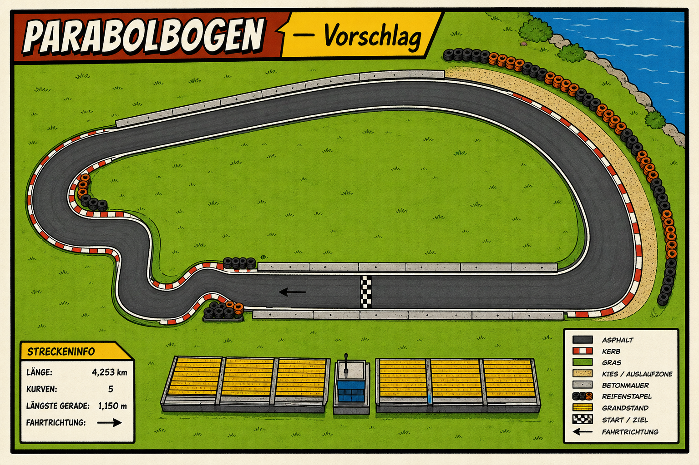
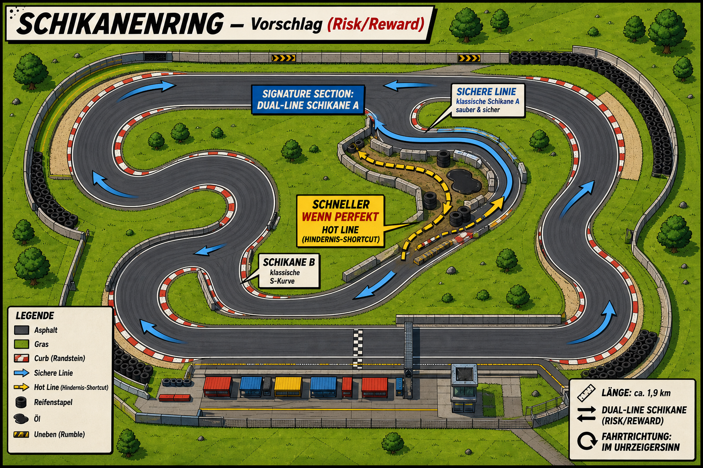
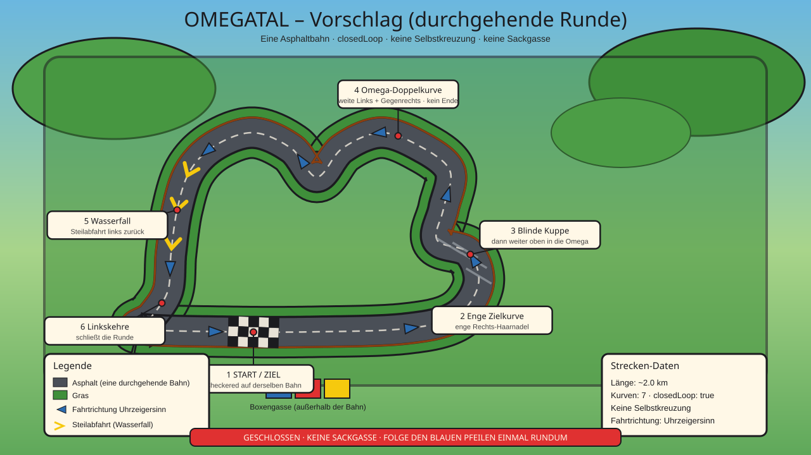
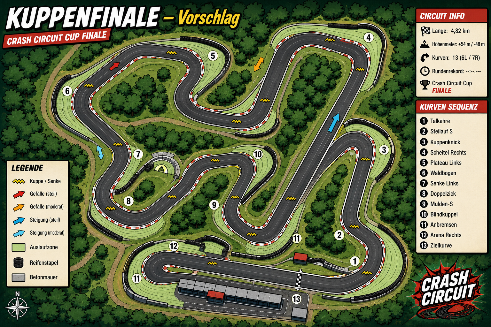

# Strecken-Vorschläge (ohne Hafenstart)

Inspiration: [racepool99.de/rennstrecken](https://www.racepool99.de/rennstrecken/) — echte deutsche Pisten-Archetypen, übersetzt in Crash-Circuit-Fantasy (Asphalt-Comic, keine Markennamen auf der Strecke).

**Bleibt unverändert:** Cup 1 **Hafenstart** (Hafen-Oval).

| Cup | Alt | Neu (Vorschlag) | Real-Inspiration | Fantasy-Feel |
|-----|-----|-----------------|------------------|--------------|
| 2 | Küstenlinie | **Parabolbogen** | Hockenheim Parabolika / Lausitzring | Lange Gerade, riesige Kehre, Tempo |
| 3 | Stadtring | **Schikanenring** | Oschersleben / Spreewaldring | Risk/Reward-Schikane, Präzision |
| 4 | Buckelpiste | **Omegatal** | Sachsenring | Omega-Doppelkurve, Kuppen, „Wasserfall“ |
| 5 | Cup-Finale | **Kuppenfinale** | Bilster Berg | Viele Buckel/Steigungen, Boss-Layout |

## 2 — Parabolbogen

- **Silhouette:** Eine sehr lange Start-Ziel-Gerade → riesiger Hochgeschwindigkeits-Bogen → enge Haarnadel zurück → kurze Schikane vor der Geraden.
- **Theme:** `beach` oder neues `stadium` (Tribünen gelb) — offen, Tempo, Gras am Außenradius riskant.
- **Hindernisse:** Wenig; optional eine milde Unebenheit vor der Kehre. Überholen auf der Geraden üben.
- **Gameplay:** Topspeed + später Bremspunkt; Gras außen am Parabolbogen bestraft Übereifer.

## 3 — Schikanenring (Risk/Reward)

- **Silhouette:** Kompakter technischer Ring mit **einer** Signatur-Schikane als Dual-Line — **kein** Selbstkreuz.
- **Sichere Linie:** Klassische enge Schikane A — sauber, langsamer, wenig Risiko.
- **Hot Line:** Kürzerer Innen-Korridor (ebenfalls Asphalt) mit **mehr Hindernissen** (gestaffelte Concrete/Reifenstapel, Öl, Uneben) — **schneller nur wenn perfekt** gefahren.
- Danach wieder eine Bahn; Schikane B bleibt normale S-Kurve.
- **Theme:** `city` (Baustelle) oder flaches `factory`-Feld.
- **Gameplay:** Wahl zwischen Sicherheit und Risiko — belohnt Präzision ohne Pflicht-Shortcut.

## 4 — Omegatal (durchgehende Runde)

- **Silhouette:** **Eine** geschlossene Asphaltbahn, `closedLoop: true`, **keine Sackgasse**, **keine Selbstkreuzung**.
- Lap (Uhrzeigersinn): Start/Ziel-Gerade → enge Zielkurve → Blinde Kuppe → **Omega-Doppelkurve** (weite Links + Gegenrechts als Mittelstück, beide Enden offen) → **Wasserfall**-Steilabfahrt → Linkskehre zurück auf die Startgerade.
- **Theme:** `canyon` / bergig — Hügel nur Kulisse außerhalb der Bahn.
- **Hindernisse:** Uneven + 1 Schanze an der Wasserfall-Kuppe; Reifenstapel nur als Kurven-Wall, nie als Korridor-Blocker.
- **Gameplay:** Federung zählt; blinde Kuppe verlangt Respekt (Sachsenring-Feeling). Route ist immer klar: blauen Pfeilen folgen.

## 5 — Kuppenfinale

- **Silhouette:** Komplexes, nicht-kreuzendes Loop mit vielen Kuppen-/Wannen-Markern, einer langen Steigungsgeraden, engen Technik-Ecken, breiten Auslaufzonen.
- **Theme:** `canyon` oder Wald-`factory` — „kleine Nordschleife“-Fantasy ohne Markenname.
- **Hindernisse:** Mehrere `uneven` + 1–2 `ramp`; Öl sparsam als Boss-Würze.
- **Gameplay:** Cup-Boss — längere Runde, gemischte Anforderungen (Bilster-Berg-Archetyp).

## Implementierungs-Status

- [x] Cups 2–5 Layouts + Displaynamen in `src/data/levels.ts` (Hafenstart unverändert)
- [x] Sky-Dome + Horizon-Panorama-Zylinder + Infield-Disc (`src/render/panoramaSurround.ts`)
- [x] Havenstadt-Props (Crane/Container/Silo) in beach/city/factory wiederverwendet
- [ ] Optional: Tripo-bake für theme-spezifische Fern-Meshes (aktuell Canvas-Panorama)

## Implementierungs-Notizen (Detail)

1. `src/data/levels.ts` — Segment-Funktionen + Displaynamen; IDs stabil (`blitz_cup_02_…`).
2. Themes/Tints in `trackPlan.ts` / `themeLook.ts` (bestehende Themes beach/city/canyon/factory).
3. Tests: `layoutFingerprint` / panorama-surround / track-plan Uniqueness.
4. CONCEPT §8.2 + Evolution-Log v3.36.
5. **Schikanenring:** Dual-Line via Verge-Blocker + innere Öl/Uneben-Hot-Line auf breiter Bahn.
6. **Omegatal:** Centerline `trackSelfIntersects === false`.

**Nicht** anfassen: Hafenstart-Layout und Hafen-Theme (Basin bleibt modelliert).
